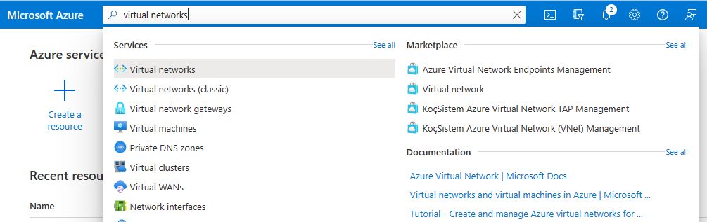
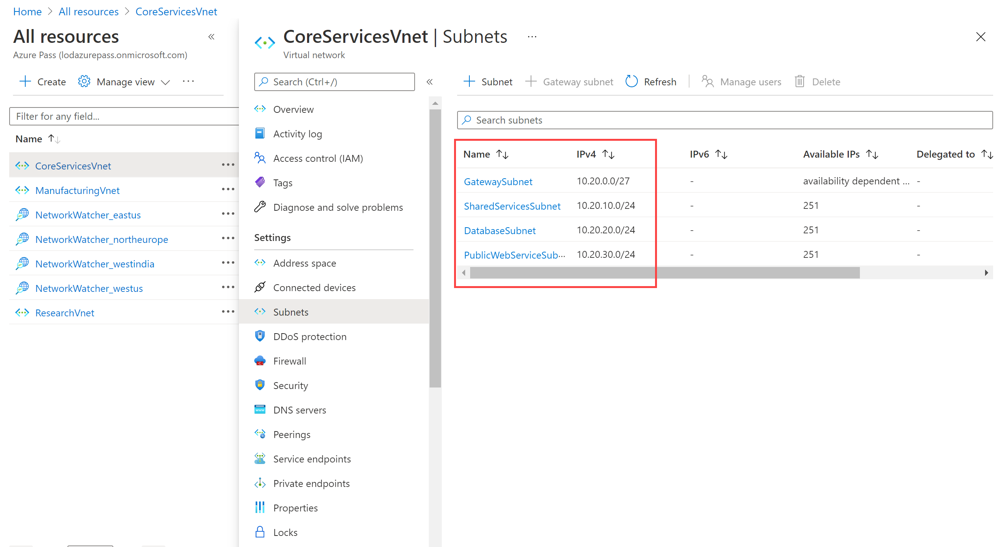

---
Exercise:
  title: M01 - 단원 4 Azure에서 가상 네트워크 설계 및 구현
  module: Module 01 - Introduction to Azure Virtual Networks
---

# M01 - 단원 4 Azure에서 가상 네트워크 설계 및 구현

## 연습 시나리오

이제 Azure Portal에서 가상 네트워크를 배포할 준비가 되었습니다.

가상의 조직 Contoso Ltd.에서 인프라 및 애플리케이션을 Azure로 마이그레이션하는 과정에 있다고 가정해봅니다. 본인이 네트워크 엔지니어의 역할을 맡고 있어서 이러한 가상 네트워크의 리소스를 지원하기 위해 세 개의 가상 네트워크와 서브넷을 계획하고 구현해야 합니다.

### 대화형 랩 시뮬레이션

>**참고**: 이전에 제공되었던 랩 시뮬레이션은 사용 중지되었습니다.

### 예상 소요 시간: 20분

**CoreServicesVnet** 가상 네트워크는 **미국 동부** 지역에 배포됩니다. 이 가상 네트워크에는 가장 많은 수의 리소스가 포함됩니다. 이 네트워크는 VPN 연결을 통해 온-프레미스 네트워크에 연결됩니다. 이 네트워크에는 웹 서비스, 데이터베이스 및 비즈니스 운영에 중요한 기타 시스템이 포함됩니다. 도메인 컨트롤러 및 DNS와 같은 공유 서비스도 여기에 있습니다. 많은 양의 증가가 예상되므로 이 가상 네트워크에는 대용량 주소 공간이 필요합니다.

**ManufacturingVnet** 가상 네트워크는 조직의 제조 시설 위치와 가까운 **서유럽** 지역에 배포됩니다. 이 가상 네트워크에는 제조 시설의 운영을 위한 시스템이 포함됩니다. 조직에서는 시스템의 많은 연결된 내부 디바이스에서 온도와 같은 데이터를 검색할 것으로 예상하므로 확장할 수 있는 IP 주소 공간이 필요합니다.

**ResearchVnet** 가상 네트워크는 조직의 연구/개발 팀 위치와 가까운 **동남아시아** 지역에 배포됩니다. 연구/개발 팀은 이 가상 네트워크를 사용합니다. 이 팀은 확장될 것으로 예상되지 않는 작고 안정적인 리소스 세트를 유지합니다. 또한 업무용 소수의 가상 머신을 위한 소수의 IP 주소가 필요합니다.

다음 리소스를 만듭니다.

| **Virtual Network** | **지역**     | **가상 네트워크 주소 공간** | **서브넷**                | **서브넷**    |
| ------------------- | -------------- | --------------------------------- | ------------------------- | ------------- |
| CoreServicesVnet    | 미국 동부        | 10.20.0.0/16                      |                           |               |
|                     |                |                                   | GatewaySubnet             | 10.20.0.0/27  |
|                     |                |                                   | SharedServicesSubnet      | 10.20.10.0/24 |
|                     |                |                                   | DatabaseSubnet            | 10.20.20.0/24 |
|                     |                |                                   | PublicWebServiceSubnet    | 10.20.30.0/24 |
| ManufacturingVnet   | 서유럽    | 10.30.0.0/16                      |                           |               |
|                     |                |                                   | ManufacturingSystemSubnet | 10.30.10.0/24 |
|                     |                |                                   | SensorSubnet1             | 10.30.20.0/24 |
|                     |                |                                   | SensorSubnet2             | 10.30.21.0/24 |
|                     |                |                                   | SensorSubnet3             | 10.30.22.0/24 |
| ResearchVnet        | 동남아시아 | 10.40.0.0/16                      |                           |               |
|                     |                |                                   | ResearchSystemSubnet      | 10.40.0.0/24  |

이러한 가상 네트워크와 서브넷은 기존 리소스를 수용하면서도 예상된 성장을 허용하는 방식으로 구성됩니다. 이러한 가상 네트워크 및 서브넷을 만들어 네트워킹 인프라의 기반을 구축해 보겠습니다.

### 작업 기술

이 연습에서 다음을 수행합니다.

+ 작업 1: Contoso 리소스 그룹 만들기
+ 작업 2: CoreServicesVnet 가상 네트워크 및 서브넷 만들기
+ 작업 3: ManufacturingVnet 가상 네트워크 및 서브넷 만들기
+ 작업 4: ResearchVnet 가상 네트워크 및 서브넷 만들기
+ 작업 5: VNet 및 서브넷 만들기 확인

## 작업 1: Contoso 리소스 그룹 만들기

1. [Azure Portal](https://portal.azure.com/)로 이동합니다.

1. 홈페이지의 **Azure 서비스**에서 **리소스 그룹**을 선택합니다.  

1. 리소스 그룹에서 **+ 만들기**를 선택합니다.

1. 다음 표의 정보를 사용하여 리소스 그룹을 만듭니다.

   | **Tab**         | **옵션**                                 | **값**            |
   | --------------- | ------------------------------------------ | -------------------- |
   | 기본 사항          | Resource group                             | ContosoResourceGroup |
   |                 | 지역                                     | (미국) 미국 동부         |
   | 태그            | 변경 필요 없음                        |                      |
   | 검토 + 만들기 | 설정을 검토하고 **만들기**를 선택합니다. |                      |

1. 리소스 그룹에서 **ContosoResourceGroup**이 목록에 표시되는지 확인합니다.

## 작업 2: CoreServicesVnet 가상 네트워크 및 서브넷 만들기

1. Azure Portal 홈페이지에서 전역 검색 표시줄로 이동하여 **가상 네트워크**를 검색하고 서비스 아래에서 가상 네트워크를 선택합니다.  

1. 가상 네트워크 페이지에서 **만들기**를 선택합니다.  
   
1. 다음 표의 정보를 사용하여 CoreServicesVnet 가상 네트워크를 만듭니다.  
   기본 IP 주소 공간 제거 또는 덮어쓰기 

   | **Tab**      | **옵션**         | **값**            |
   | ------------ | ------------------ | -------------------- |
   | 기본 사항       | 리소스 그룹     | ContosoResourceGroup |
   |              | 이름               | CoreServicesVnet     |
   |              | 지역             | (미국) 미국 동부         |
   | IP 주소 | IPv4 주소 공간 | 10.20.0.0/16         |

1. 다음 표의 정보를 사용하여 CoreServicesVnet 서브넷을 만듭니다.

1. 각 서브넷 만들기를 시작하려면 **+ 서브넷 추가**를 선택합니다. 각 서브넷 만들기를 마치려면 **추가**를 선택합니다.

   | **서브넷**             | **옵션**           | **값**               |
   | ---------------------- | -------------------- | ----------------------- |
   | GatewaySubnet          | 서브넷 목적       | 가상 네트워크 게이트웨이 |
   |                        | 서브넷 이름          | GatewaySubnet           |
   |                        | 서브넷 주소 범위 | 10.20.0.0/27            |
   | SharedServicesSubnet   | 서브넷 이름          | SharedServicesSubnet    |
   |                        | 서브넷 주소 범위 | 10.20.10.0/24           |
   | DatabaseSubnet         | 서브넷 이름          | DatabaseSubnet          |
   |                        | 서브넷 주소 범위 | 10.20.20.0/24           |
   | PublicWebServiceSubnet | 서브넷 이름          | PublicWebServiceSubnet  |
   |                        | 서브넷 주소 범위 | 10.20.30.0/24           |

1. CoreServicesVnet 및 연결된 서브넷 만들기를 마치려면 **검토 + 만들기**를 선택합니다.

1. 구성이 유효성 검사를 통과했는지 확인한 다음 **만들기**를 선택합니다.

1. 아래 표에 따라 각 VNet마다 1 -8 단계를 반복합니다.  

## 작업 3: ManufacturingVnet 가상 네트워크 및 서브넷 만들기

   | **Tab**      | **옵션**         | **값**            |
   | ------------ | ------------------ | -------------------- |
   | 기본 사항       | 리소스 그룹     | ContosoResourceGroup |
   |              | 이름               | ManufacturingVnet    |
   |              | 지역             | (유럽) 서유럽 |
   | IP 주소 | IPv4 주소 공간 | 10.30.0.0/16         |

   | **서브넷**                | **옵션**           | **값**                 |
   | ------------------------- | -------------------- | ------------------------- |
   | ManufacturingSystemSubnet | 서브넷 이름          | ManufacturingSystemSubnet |
   |                           | 서브넷 주소 범위 | 10.30.10.0/24             |
   | SensorSubnet1             | 서브넷 이름          | SensorSubnet1             |
   |                           | 서브넷 주소 범위 | 10.30.20.0/24             |
   | SensorSubnet2             | 서브넷 이름          | SensorSubnet2             |
   |                           | 서브넷 주소 범위 | 10.30.21.0/24             |
   | SensorSubnet3             | 서브넷 이름          | SensorSubnet3             |
   |                           | 서브넷 주소 범위 | 10.30.22.0/24             |

## 작업 4: ResearchVnet 가상 네트워크 및 서브넷 만들기

   | **Tab**      | **옵션**         | **값**            |
   | ------------ | ------------------ | -------------------- |
   | 기본 사항       | 리소스 그룹     | ContosoResourceGroup |
   |              | 이름               | ResearchVnet         |
   |              | 지역             | 동남아시아       |
   | IP 주소 | IPv4 주소 공간 | 10.40.0.0/16         |

   | **서브넷**           | **옵션**           | **값**            |
   | -------------------- | -------------------- | -------------------- |
   | ResearchSystemSubnet | 서브넷 이름          | ResearchSystemSubnet |
   |                      | 서브넷 주소 범위 | 10.40.0.0/24         |

## 작업 5: VNet 및 서브넷 만들기 확인

1. Azure Portal 홈페이지에서 **모든 리소스**를 선택합니다.

1. CoreServicesVnet, ManufacturingVnet 및 ResearchVnet이 표시되는지 확인합니다.

1. **CoreServicesVnet**을 선택합니다.

1. CoreServicesVnet의 **설정**에서 **서브넷**을 선택합니다.

1. CoreServicesVnet \| 서브넷에서, 만든 서브넷이 나열되고 IP 주소 범위가 맞는지 확인합니다.

   

1. 각 VNet마다 3~5단계를 반복합니다.
   
## Copilot을 사용하여 학습 확장

Copilot은 Azure 스크립팅 도구를 사용하는 방법을 익히는 데 도움을 줍니다. 또한 Copilot은 랩에서 다루지 않는 영역이나 추가 정보가 필요한 영역을 지원할 수 있습니다. Edge 브라우저를 열고 Copilot(오른쪽 위)을 선택하거나 *copilot.microsoft.com*으로 이동하세요. 몇 분 정도 시간을 내어 이러한 프롬프트를 사용해 보세요.
+ 실제 시나리오에서 10.30.0.0/16 IP 주소를 사용하는 방식에 대한 예시를 들 수 있나요?
+ 미국 동부 지역에 CoreServicesVnet이라는 가상 네트워크를 만드는 Azure PowerShell 명령은 무엇인가요? 이 가상 네트워크는 10.20.0.0/16 IP 주소 공간을 사용해야 합니다.
+ 서유럽 지역에서 ManufacturingVnet이라는 가상 네트워크를 만드는 Azure CLI 명령은 무엇인가요? 이 가상 네트워크는 10.30.0.0/16 IP 주소 공간을 사용해야 합니다.

## 자기 주도적 학습을 통해 자세히 알아보기

+ [Azure 배포에 대한 IP 주소 지정 스키마 디자인](https://learn.microsoft.com/training/modules/design-ip-addressing-for-azure/). 이 모듈에서는 Azure 가상 네트워크의 공개 및 비공개 IP 주소 지정 기능에 대해 알아봅니다.
+ [Azure Virtual Network 소개](https://learn.microsoft.com/training/modules/introduction-to-azure-virtual-networks/). 이 모듈에서는 Azure 네트워킹 서비스를 디자인하고 구현하는 방법을 알아봅니다. 가상 네트워크, 퍼블릭 및 프라이빗 IP, DNS, 가상 네트워크 피어링, 라우팅 및 Azure Virtual NAT에 대해 알아봅니다.

## 핵심 내용

+ Azure Virtual Network는 Azure의 프라이빗 네트워크에 대한 기본 구성 요소를 제공하는 서비스입니다. 서비스 인스턴스(가상 네트워크)를 사용하면 다양한 종류의 Azure 리소스에서 서로, 인터넷 및 온-프레미스 네트워크와 안전하게 통신할 수 있습니다. 겹치지 않는 주소 공간을 확보합니다. 가상 네트워크 주소 공간(CIDR 블록)이 조직의 다른 네트워크 범위와 겹치지 않는지 확인합니다.
+ 가상 네트워크의 모든 Azure 리소스는 가상 네트워크 내의 서브넷에 배포됩니다. 서브넷을 사용하면 가상 네트워크를 하나 이상의 서브네트워크로 분할하고 가상 네트워크 주소 공간의 일부를 각 서브넷에 할당할 수 있습니다. 서브넷은 가상 네트워크의 전체 주소 공간을 사용하지 않아야 합니다. 미래를 위해 미리 계획하고 일부 주소 공간을 예약합니다.

