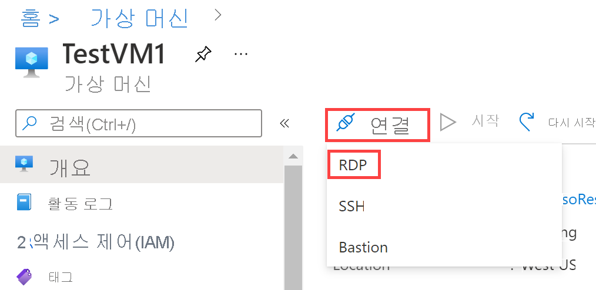

---
Exercise:
  title: M01 - 단원 6 Azure에서 DNS 설정 구성
  module: Module 01 - Introduction to Azure Virtual Networks
---

# M01 - 단원 6 Azure에서 DNS 설정 구성

## 연습 시나리오

이 단원에서는 Contoso Ltd.의 DNS 이름 확인을 구성합니다. contoso.com이라는 프라이빗 DNS 영역을 만들고, 등록 및 확인용 VNnet을 연결한 다음, 두 개의 가상 머신을 만들어 해당 구성을 테스트합니다.


이 연습에서 다음을 수행합니다.

+ 작업 1: 프라이빗 DNS 영역 만들기
+ 작업 2: 자동 등록을 위한 서브넷 연결
+ 작업 3: 구성을 테스트할 가상 머신 만들기
+ 작업 4: 레코드가 DNS 영역에 있는지 확인

**참고:** **[대화형 랩 시뮬레이션](https://mslabs.cloudguides.com/guides/AZ-700%20Lab%20Simulation%20-%20Configure%20DNS%20settings%20in%20Azure)** 을 사용하여 이 랩을 원하는 속도로 클릭할 수 있습니다. 대화형 시뮬레이션과 호스트된 랩 간에 약간의 차이가 있을 수 있지만 보여주는 핵심 개념과 아이디어는 동일합니다.

### 예상 소요 시간: 25분

## 작업 1: 프라이빗 DNS 영역 만들기

1. [Azure Portal](https://portal.azure.com/)로 이동합니다.

2. Azure 홈페이지의 검색 창에 dns를 입력한 다음 **프라이빗 DNS 영역**을 선택합니다.  
   ‎

3. 프라이빗 DNS 영역에서 **만들기**를 선택합니다.

4. 다음 표의 정보를 사용하여 프라이빗 DNS 영역을 만듭니다.

| **Tab**         | **옵션**                             | **값**            |
| --------------- | -------------------------------------- | -------------------- |
| 기본 사항          | Resource group                         | ContosoResourceGroup |
|                 | 이름                                   | Contoso.com          |
| 태그            | 변경 필요 없음                    |                      |
| 검토 + 만들기 | 설정 검토 및 만들기 선택 |                      |

5. 배포가 완료될 때까지 기다렸다가 **리소스로 이동**을 선택합니다.

6. 영역이 만들어졌는지 확인합니다.

## 작업 2: 자동 등록을 위한 서브넷 연결

1. Contoso.com의 **설정**에서 **가상 네트워크 링크**를 선택합니다.

2. Contoso.com | 가상 네트워크 링크에서 **+ 추가**를 선택합니다.


3. 다음 표의 정보를 사용하여 가상 네트워크 링크를 추가합니다.

| **옵션**                          | **값**                               |
| ----------------------------------- | --------------------------------------- |
| 링크 이름                           | CoreServicesVnetLink                    |
| Subscription                        | 변경 필요 없음                     |
| Virtual Network                     | CoreServicesVnet(ContosoResourceGroup) |
| 자동 등록 사용            | 선택한 상태                                |
| 설정을 검토하고 확인을 선택합니다. |                                         |

4. **새로 고침**을 선택합니다.

5. CoreServicesVnetLink가 생성되었는지와 자동 등록이 설정되는지 확인합니다.

6. 다음 표의 정보를 사용하여 ManufacturingVnet에 2~5단계를 반복합니다.

| **옵션**                          | **값**                                |
| ----------------------------------- | ---------------------------------------- |
| 링크 이름                           | ManufacturingVnetLink                    |
| Subscription                        | 변경 필요 없음                      |
| Virtual Network                     | ManufacturingVnet(ContosoResourceGroup) |
| 자동 등록 사용            | 선택한 상태                                 |
| 설정을 검토하고 확인을 선택합니다. |                                          |

7. **새로 고침**을 선택합니다.

8. ManufacturingVnetLink가 생성되었는지와 자동 등록이 설정되는지 확인합니다.

9. 다음 표의 정보를 사용하여 ResearchVnet에 2~5단계를 반복합니다.

| **옵션**                          | **값**                           |
| ----------------------------------- | ----------------------------------- |
| 링크 이름                           | ResearchVnetLink                    |
| Subscription                        | 변경 필요 없음                 |
| Virtual Network                     | ResearchVnet(ContosoResourceGroup) |
| 자동 등록 사용            | 선택한 상태                            |
| 설정을 검토하고 확인을 선택합니다. |                                     |

10. **새로 고침**을 선택합니다.

11. ResearchVnetLink가 생성되었는지와 자동 등록이 설정되는지 확인합니다.

## 작업 3: 구성을 테스트할 가상 머신 만들기

이 섹션에서는 프라이빗 DNS 영역 구성을 테스트할 두 개의 테스트 VM을 만듭니다.

1. Azure Portal의 **Cloud Shell** 창에서 **PowerShell** 세션을 엽니다.

    > **참고:** Cloud Shell을 처음 연 경우에는 스토리지 계정을 만들라는 메시지가 표시될 수 있습니다. **스토리지 만들기**를 선택합니다.

2. Cloud Shell 창의 도구 모음에서 **파일 업로드/다운로드 아이콘**을 선택하고 드롭다운 메뉴에서 **업로드**를 선택한 다음 **azuredeploy.json** 및 **azuredeploy.parameters.json** 파일을 소스 폴더 **F:\Allfiles\Exercises\M01**의 Cloud Shell 홈 디렉터리에 차례대로 업로드합니다.

3. 다음 ARM 템플릿을 배포하여 이 연습에 필요한 VM을 만듭니다.

    >**참고**: 관리 암호를 입력하라는 메시지가 표시됩니다.

   ```powershell
   $RGName = "ContosoResourceGroup"
   
   New-AzResourceGroupDeployment -ResourceGroupName $RGName -TemplateFile azuredeploy.json -TemplateParameterFile azuredeploy.parameters.json
   ```
  
4. 배포가 완료되면 Azure Portal 홈페이지로 이동한 다음 **가상 머신**을 선택합니다.

5. 두 가상 머신이 모두 만들어졌는지 확인합니다.

## 작업 4: 레코드가 DNS 영역에 있는지 확인

1. Azure Portal 홈 페이지에서 **프라이빗 DNS 영역**을 선택합니다.

2. 프라이빗 DNS 영역에서 **contoso.com**을 선택합니다.

3. 다음과 같이 두 VM 모두 호스트 (A) 레코드가 표시되는지 확인합니다.


4. VM의 이름 및 IP 주소를 기록해 둡니다.

### RDP를 사용하여 테스트 VM에 연결

1. Azure Portal 홈 페이지에서 **Virtual Machines**를 선택합니다.

1. **TestVM1**을 선택합니다.

1. TestVM1에서 **연결 &gt; RDP**을 선택하고 RDP 파일을 다운로드합니다.

    

1. RDP 파일을 데스크톱에 저장합니다.

1. **TestVM2**에도 동일한 단계 수행

1. RDP 파일, 사용자 이름 **TestUser** 및 배포 중에 제공한 암호를 사용하여 TestVM1에 연결합니다.

1. RDP 파일, 사용자 이름 **TestUser** 및 배포 중에 제공한 암호를 사용하여 TestVM2에 연결합니다.

1. 두 VM의 **디바이스에 대한 개인 정보 설정 선택**에서 **동의**를 선택합니다.

1. 메시지가 표시되면 두 VM의 **네트워크**에서 **예**를 선택합니다.

1. TestVM1에서 명령 프롬프트를 열고 ipconfig /all 명령을 입력합니다.

1. IP 주소가 DNS 영역에서 적어둔 것과 동일한지 확인합니다.

1. TestVM2.contoso.com 명령 ping을 입력합니다.

1. FQDN이 프라이빗 DNS 영역에 기록된 IP 주소로 확인되는지 확인합니다. ping 자체는 VM에서 사용하도록 설정된 Windows 방화벽으로 인해 시간 초과됩니다.

1. 또는 nslookup TestVM2.contoso.com 명령을 입력하고 VM2의 이름 확인 레코드를 수신했는지 확인할 수 있습니다.

축하합니다! 프라이빗 DNS 영역을 만들고, 이름 확인 및 자동 등록 링크를 추가하고, 구성에서 이름 확인을 테스트했습니다.
