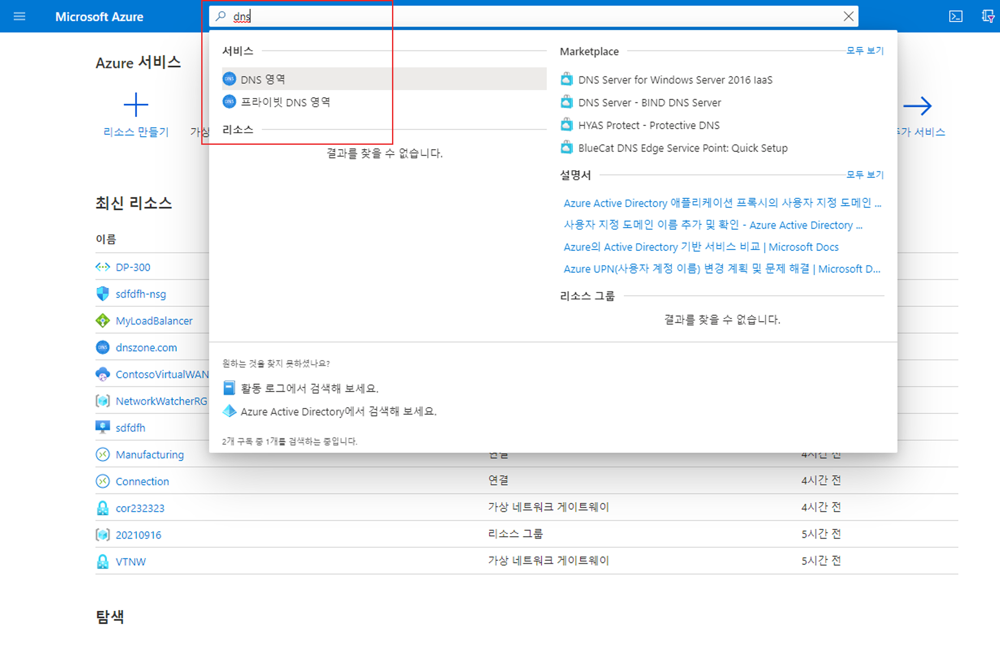
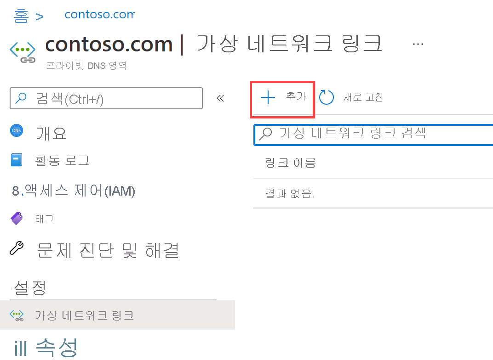

---
Exercise:
  title: M01 - 단원 6 Azure에서 DNS 설정 구성
  module: Module 01 - Introduction to Azure Virtual Networks
---

# M01 - 단원 6 Azure에서 DNS 설정 구성

## 연습 시나리오

이 단원에서는 Contoso Ltd.의 DNS 이름 확인을 구성합니다. contoso.com이라는 프라이빗 DNS 영역을 만들고, 등록 및 확인용 VNnet을 연결한 다음, 두 개의 가상 머신을 만들어 해당 구성을 테스트합니다.


이 연습에서 다음을 수행합니다.

+ 작업 1: 프라이빗 DNS 영역 만들기
+ 작업 2: 자동 등록을 위한 서브넷 연결
+ 작업 3: 구성을 테스트할 가상 머신 만들기
+ 작업 4: 레코드가 DNS 영역에 있는지 확인

   >**참고:** **[대화형 랩 시뮬레이션](https://mslabs.cloudguides.com/guides/AZ-700%20Lab%20Simulation%20-%20Configure%20DNS%20settings%20in%20Azure)** 을 사용하여 이 랩을 원하는 속도로 클릭할 수 있습니다. 대화형 시뮬레이션과 호스트된 랩 간에 약간의 차이가 있을 수 있지만 보여주는 핵심 개념과 아이디어는 동일합니다.

### 예상 소요 시간: 25분

**중요:** 이 연습에서는 이전 랩의 가상 네트워크가 필요합니다. [템플릿](https://github.com/MicrosoftLearning/AZ-700-Designing-and-Implementing-Microsoft-Azure-Networking-Solutions/tree/master/Allfiles/Exercises/M01/template.json) 파일을 사용하여 설치할 수 있습니다. 모든 가상 네트워크가 설치되지만 CoreServicesVNet만 필요합니다. 

## 작업 1: 프라이빗 DNS 영역 만들기

1. [Azure Portal](https://portal.azure.com/)로 이동합니다.

1. Azure 홈페이지의 검색 창에 dns를 입력한 다음 **프라이빗 DNS 영역**을 선택합니다.  
   

1. 프라이빗 DNS 영역에서 **만들기**를 선택합니다.

1. 다음 표의 정보를 사용하여 프라이빗 DNS 영역을 만듭니다.

    | **Tab**         | **옵션**                             | **값**            |
    | --------------- | -------------------------------------- | -------------------- |
    | 기본 사항          | 리소스 그룹(필요한 경우 만듭니다) | `ContosoResourceGroup` |
    |                 | 속성                                   | `Contoso.com`          |
    | 검토 + 만들기 | 설정 검토 및 만들기 선택 |                      |

1. 배포가 완료될 때까지 기다렸다가 **리소스로 이동**을 선택합니다.

1. 영역이 만들어졌는지 확인합니다.

## 작업 2: 자동 등록을 위한 서브넷 연결

1. Contoso.com의 **DNS 관리**에서 **가상 네트워크 링크**를 선택합니다.

1. Contoso.com \| 가상 네트워크 링크에서 **+ 추가**를 선택합니다.

    

1. 다음 표의 정보를 사용하여 가상 네트워크 링크를 추가합니다.

    | **옵션**                          | **값**                               |
    | ----------------------------------- | --------------------------------------- |
    | 링크 이름                           | `CoreServicesVnetLink`                   |
    | 구독                        | 변경 필요 없음                     |
    | Virtual Network                     | CoreServicesVnet(ContosoResourceGroup) |
    | 자동 등록 사용            | 선택한 상태                                |
    | 설정을 검토하고 확인을 선택합니다. |                                         |

1. **새로 고침**을 선택합니다.

1. CoreServicesVnetLink가 생성되었는지와 자동 등록이 설정되는지 확인합니다.

## 작업 3: 구성을 테스트할 가상 머신 만들기

이 섹션에서는 프라이빗 DNS 영역 구성을 테스트할 두 개의 테스트 VM을 만듭니다.

1. Azure Portal 오른쪽 상단에 있는 Cloud Shell 아이콘을 선택합니다. 필요한 경우 셸을 구성합니다.  
    + **PowerShell**을 선택합니다.
    + **스토리지 계정이 필요하지 않음**과 **구독**을 선택한 다음 **적용**을 선택합니다.
    + 터미널이 생성되고 프롬프트가 표시될 때까지 기다립니다. 

1. Cloud Shell 창의 도구 모음에서 **파일 관리** 아이콘을 선택하고 드롭다운 메뉴에서 **업로드**를 선택한 후 **azuredeploy.json** 및 **azuredeploy.parameters.json** 템플릿 파일을 업로드합니다.

   >**참고:** 사용자 고유의 구독에서 작업하는 경우 [템플릿 파일](https://github.com/MicrosoftLearning/AZ-700-Designing-and-Implementing-Microsoft-Azure-Networking-Solutions/tree/master/Allfiles/Exercises)은 GitHub 랩 리포지토리에서 사용할 수 있습니다.
   
1. 다음 ARM 템플릿을 배포하여 이 연습에 필요한 VM을 만듭니다.

   >**참고**: 관리 암호를 입력하라는 메시지가 표시됩니다. 이 암호는 이후 단계에서 필요합니다. 

   ```powershell
   $RGName = "ContosoResourceGroup"
   
   New-AzResourceGroupDeployment -ResourceGroupName $RGName -TemplateFile azuredeploy.json -TemplateParameterFile azuredeploy.parameters.json
   ```
  
1. 배포가 완료되면 Azure Portal 홈페이지로 이동한 다음 **가상 머신**을 선택합니다.

1. 두 가상 머신이 모두 만들어졌는지 확인합니다.

## 작업 4: 레코드가 DNS 영역에 있는지 확인

1. Azure Portal 홈 페이지에서 **프라이빗 DNS 영역**을 선택합니다.

1. 프라이빗 DNS 영역에서 **contoso.com**을 선택합니다.

1. 다음과 같이 두 VM 모두 호스트 (A) 레코드가 표시되는지 확인합니다.

    

1. VM의 이름 및 IP 주소를 기록해 둡니다.

### VM에 연결하여 이름 확인 테스트

1. Azure Portal 홈 페이지에서 **Virtual Machines**를 선택합니다.

1. **TestVM1**을 선택합니다.

1. TestVM1에서 **연결&gt;연결**을 선택하고 RDP 파일을 다운로드합니다. 파일이 성공적으로 다운로드되었는지 확인합니다.

1. RDP 파일을 찾고 두 번 클릭하여 파일을 실행합니다.

1. **연결**을 선택하고 템플릿 배포 중에 제공한 **TestUser** 암호를 입력합니다.

1. 경고 페이지에서 **확인**을 선택한 다음 **예**를 선택합니다.

1. TestVM1에서 명령 프롬프트를 열고 `ipconfig /all` 명령을 입력합니다.

1. IP 주소가 DNS 영역의 주소와 동일한지 확인합니다.

1. `ping TestVM2.contoso.com` 명령을 입력합니다. 이 명령은 VM에서 사용하도록 설정된 Windows 방화벽으로 인해 시간 초과됩니다.

1. 대신 `nslookup TestVM2.contoso.com` 명령을 사용하여 VM2에 대한 이름 확인 레코드가 성공적으로 수신되었는지 확인합니다. 이는 프라이빗 영역 이름 확인을 보여 줍니다. 

## Copilot을 사용하여 학습 확장

Copilot은 Azure 스크립팅 도구를 사용하는 방법을 익히는 데 도움을 줍니다. 또한 Copilot은 랩에서 다루지 않는 영역이나 추가 정보가 필요한 영역을 지원할 수 있습니다. Edge 브라우저를 열고 Copilot(오른쪽 위)을 선택하거나 *copilot.microsoft.com*으로 이동하세요. 몇 분 정도 시간을 내어 이러한 프롬프트를 사용해 보세요.
+ Azure DNS와 Azure 프라이빗 DNS 차이점은 무엇인가요? Azure 프라이빗 DNS를 사용하는 경우의 예를 제공합니다.
+ Azure DNS 영역을 만들 때 자동 등록의 목적은 무엇인가요?

## 자기 주도적 학습을 통해 자세히 알아보기

+ [Azure DNS 소개](https://learn.microsoft.com/training/modules/intro-to-azure-dns/). 이 모듈에서는 Azure DNS가 수행하는 작업, 작동 방식, 조직의 요구 사항에 맞게 Azure DNS를 솔루션으로 사용하도록 선택해야 하는 경우를 설명합니다.
+ [Azure DNS에서 도메인을 호스팅합니다](https://learn.microsoft.com/training/modules/host-domain-azure-dns/). 이 모듈에서는 DNS 영역 및 DNS 레코드를 만들어 도메인을 IP 주소에 매핑합니다. 도메인 이름이 웹 서버로 확인되는지 테스트합니다.

## 핵심 내용

축하합니다. 랩을 완료했습니다. 이 랩의 주요 내용은 다음과 같습니다. 

+ Azure DNS는 DNS 영역이라고도 하는 DNS(Domain Name System) 도메인을 호스트하고 관리할 수 있는 클라우드 서비스입니다. 
+ Azure DNS 퍼블릭 영역은 인터넷의 호스트에서 확인하려는 레코드에 대한 도메인 이름 영역 데이터를 호스트합니다.
+ Azure 프라이빗 DNS 영역을 사용하면 프라이빗 Azure 리소스에 대한 프라이빗 DNS 영역 네임스페이스를 구성할 수 있습니다.
+ DNS 영역은 DNS 레코드의 컬렉션입니다. DNS 레코드는 도메인에 대한 정보를 제공합니다.
