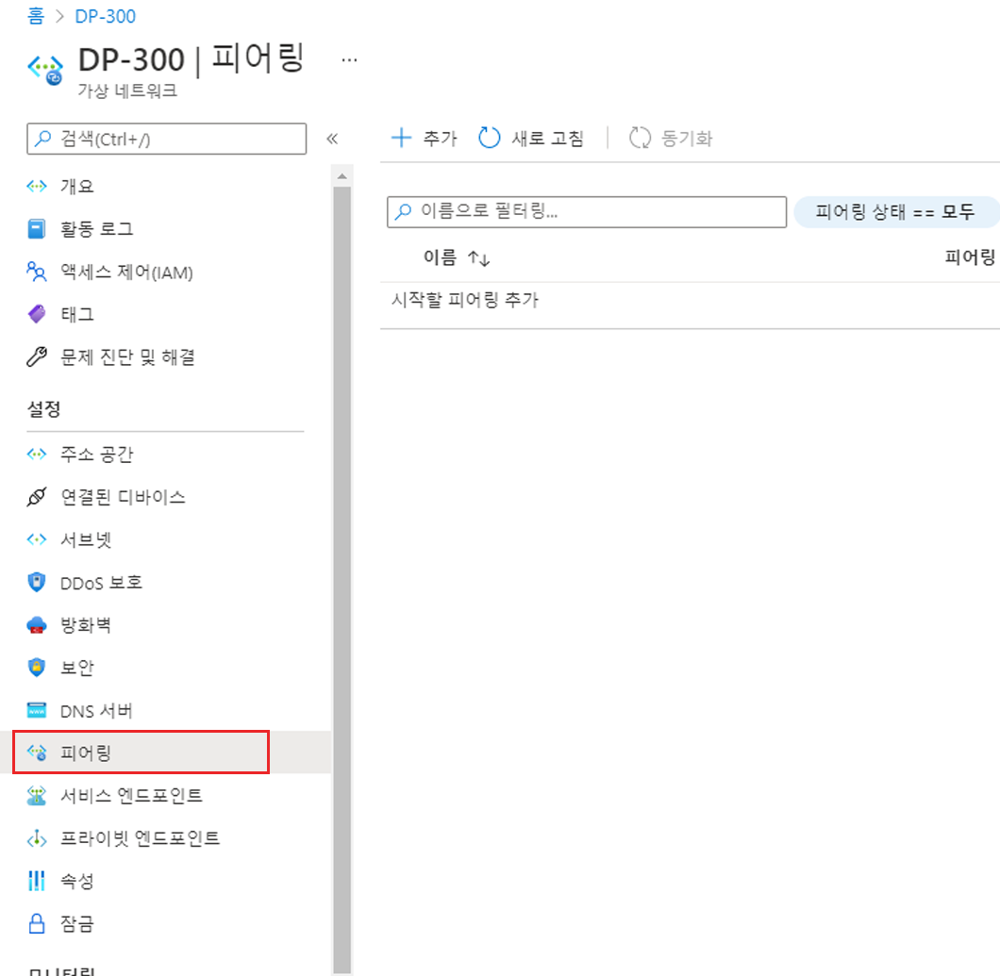

---
Exercise:
  title: M01 - 단원 8 전역 가상 네트워크 피어링을 사용해 Azure Virtual Network 2개 연결
  module: Module 01 - Introduction to Azure Virtual Networks
---

# M01 - 단원 8 전역 가상 네트워크 피어링을 사용해 Azure Virtual Network 2개 연결

## 연습 시나리오

이 단원에서는 트래픽 흐름을 허용하는 피어링을 추가하여 CoreServicesVnet과 ManufacturingVnet 간의 연결을 구성합니다.


이 단원에서 학습할 내용은 다음과 같습니다.

+ 작업 1: 구성을 테스트할 가상 머신 만들기
+ 작업 2: RDP를 사용하여 테스트 VM에 연결
+ 작업 3: VM 간 연결 테스트
+ 작업 4: CoreServicesVnet과 ManufacturingVnet 사이에 VNet 피어링 만들기
+ 작업 5: VM 간 연결 테스트

   >**참고:** **[대화형 랩 시뮬레이션](https://mslabs.cloudguides.com/guides/AZ-700%20Lab%20Simulation%20-%20Connect%20two%20Azure%20virtual%20networks%20using%20global%20virtual%20network%20peering)** 을 사용하여 이 랩을 원하는 속도로 클릭할 수 있습니다. 대화형 시뮬레이션과 호스트된 랩 간에 약간의 차이가 있을 수 있지만 보여주는 핵심 개념과 아이디어는 동일합니다.

### 예상 소요 시간: 20분

## 작업 1: 구성을 테스트할 가상 머신 만들기

이 섹션에서는 ManufacturingVnet에서 다른 Azure 가상 네트워크 내의 리소스에 액세스할 수 있는지 테스트할 테스트 VM을 Manufacturing VNet에 만듭니다.

### ManufacturingVM 만들기

1. Azure Portal 오른쪽 상단에 있는 Cloud Shell 아이콘을 선택합니다. 필요한 경우 셸을 구성합니다.  
    + **PowerShell**을 선택합니다.
    + **스토리지 계정이 필요하지 않음**과 **구독**을 선택한 다음 **적용**을 선택합니다.
    + 터미널이 생성되고 프롬프트가 표시될 때까지 기다립니다. 

1. Cloud Shell 창의 도구 모음에서 **파일 관리** 아이콘을 선택하고 드롭다운 메뉴에서 **업로드**를 선택한 다음, **ManufacturingVMazuredeploy.json** 및 **ManufacturingVMazuredeploy.parameters.json** 파일을 소스 폴더 **F:\Allfiles\Exercises\M01**로부터 Cloud Shell 홈 디렉토리에 업로드합니다.

1. 다음 ARM 템플릿을 배포하여 이 연습에 필요한 VM을 만듭니다.

   >**참고**: 관리 암호를 입력하라는 메시지가 표시됩니다.

   ```powershell
   $RGName = "ContosoResourceGroup"
   
   New-AzResourceGroupDeployment -ResourceGroupName $RGName -TemplateFile ManufacturingVMazuredeploy.json -TemplateParameterFile ManufacturingVMazuredeploy.parameters.json
   ```
  
1. 배포가 완료되면 Azure Portal 홈페이지로 이동한 다음 **가상 머신**을 선택합니다.

1. 가상 머신이 만들어졌는지 확인합니다.

## 작업 2: RDP를 사용하여 테스트 VM에 연결

1. Azure Portal 홈 페이지에서 **Virtual Machines**를 선택합니다.

1. **ManufacturingVM**을 선택합니다.

1. ManufacturingVM에서 **연결 &gt; RDP**를 선택합니다.

1. ManufacturingVM \| 연결에서 **RDP 파일 다운로드**를 선택합니다.

1. RDP 파일을 데스크톱에 저장합니다.

1. RDP 파일, 사용자 이름 **TestUser** 및 배포 중에 제공한 암호를 사용하여 ManufacturingVM에 연결합니다.

1. Azure Portal 홈 페이지에서 **Virtual Machines**를 선택합니다.

1. **TestVM1**을 선택합니다.

1. TestVM1에서 **연결 &gt; RDP**를 선택합니다.

1. TestVM1 \| 연결에서 **RDP 파일 다운로드**를 선택합니다.

1. RDP 파일을 데스크톱에 저장합니다.

1. RDP 파일, 사용자 이름 **TestUser** 및 배포 중에 제공한 암호를 사용하여 TestVM1에 연결합니다.

1. 두 VM의 **디바이스에 대한 개인 정보 설정 선택**에서 **동의**를 선택합니다.

1. 두 VM의 **네트워크**에서 **예**를 선택합니다.

1. TestVM1에서 PowerShell 프롬프트를 열고 다음 명령, ipconfig를 실행합니다.

1. IPv4 주소를 기록해 두세요.

## 작업 3: VM 사이의 연결 테스트

1. ManufacturingVM에서 PowerShell 프롬프트를 엽니다.

1. 다음 명령을 사용하여 CoreServicesVnet에 TestVM1에 대한 연결이 없는지 확인합니다. TestVM1용 IPv4 주소를 사용해야 합니다.

   ```powershell
    Test-NetConnection 10.20.20.4 -port 3389
    ```

1. 테스트 연결에 실패하면, 다음과 유사한 결과가 표시됩니다.  

## 작업 4: CoreServicesVnet과 ManufacturingVnet 사이에 VNet 피어링 만들기

1. Azure 홈페이지에서 **가상 네트워크**를 선택한 다음 **CoreServicesVnet**을 선택합니다.

1. CoreServicesVnet의 **설정**에서 **피어링**을 선택합니다.
   

1. CoreServicesVnet \| 피어링에서 **+ 추가**를 선택합니다.

1. 이 정보를 사용하여 피어링을 만듭니다. 작업을 마쳤으면 **추가**를 선택합니다. 

   **원격 가상 네트워크 요약**

   | **옵션**                                    | **값**                             |
   | ------------------------------------ | --------------------------------------------- | 
   | 피어링 링크 이름    | `CoreServicesVnet-to-ManufacturingVnet` |
   | 가상 네트워크 | ManufacturingVnet |

    **원격 가상 네트워크 피어링 설정**
   
   | **옵션**                                    | **값**                             |
   | ------------------------------------ | --------------------------------------------- | 
   | 'ManufacturingVnet'이 'CoreServicesVnet'에 액세스하도록 허용 | 사용 |
   |'ManufacturingVnet'이 'CoreServicesVnet'에서 전달된 트래픽을 수신하도록 허용 | 사용 |
 
    **로컬 가상 네트워크 요약**

    | **옵션**                                    | **값**                             |
    | ------------------------------------ | --------------------------------------------- | 
    | 피어링 링크 이름 | `CoreServicesVnet-to-ManufacturingVnet` |
 
    **원격 가상 네트워크 피어링 설정**
   
    | **옵션**                                    | **값**                             |
    | ------------------------------------ | --------------------------------------------- | 
    | 'CoreServicesVnet'이 'ManufacturingVnet'에 액세스하도록 허용 | 사용
    | 'CoreServicesVnet'이 'ManufacturingVnet'에서 전달된 트래픽을 수신하도록 허용 | 사용 |
 
1. CoreServicesVnet \| 피어링에서 **CoreServicesVnet-to-ManufacturingVnet** 피어링이 **연결되었는지** 확인하십시오.

1. 가상 네트워크에서 **ManufacturingVnet**을 선택하고, **ManufacturingVnet-to-CoreServicesVnet** 피어링이 **연결되었는지** 표시합니다.

## 작업 5: VM 간 연결 테스트

1. ManufacturingVM에서 PowerShell 프롬프트를 엽니다.

1. 다음 명령을 사용하여 이제 CoreServicesVnet에 TestVM1에 대한 연결이 있는지 확인합니다.

   ```powershell
    Test-NetConnection 10.20.20.4 -port 3389
    ```

1. 테스트 연결에 성공하면 다음과 유사한 결과가 표시됩니다. 


## 리소스 정리

   >**참고**: 더 이상 사용하지 않는 새로 만든 Azure 리소스는 모두 제거하세요. 사용되지 않는 리소스를 제거하면 예기치 않은 요금이 발생하지 않습니다.

1. Azure Portal의 **Cloud Shell** 창에서 **PowerShell** 세션을 엽니다. 필요한 경우 기본 설정을 사용하여 Cloud Shell 스토리지를 만듭니다.

1. 다음 명령을 실행하여 이 모듈의 랩 전체에서 만든 모든 리소스 그룹을 삭제합니다.

   ```powershell
   Remove-AzResourceGroup -Name 'ContosoResourceGroup' -Force -AsJob
   ```
   >**참고**: 이 명령은 -AsJob 매개 변수에 의해 결정되어 비동기로 실행되므로, 동일한 PowerShell 세션 내에서 이 명령을 실행한 직후 다른 PowerShell 명령을 실행할 수 있지만 리소스 그룹이 실제로 제거되기까지는 몇 분 정도 걸립니다.
   
## Copilot을 사용하여 학습 확장

Copilot은 Azure 스크립팅 도구를 사용하는 방법을 익히는 데 도움을 줍니다. 또한 Copilot은 랩에서 다루지 않는 영역이나 추가 정보가 필요한 영역을 지원할 수 있습니다. Edge 브라우저를 열고 Copilot(오른쪽 위)을 선택하거나 *copilot.microsoft.com*으로 이동하세요. 몇 분 정도 시간을 내어 이러한 프롬프트를 사용해 보세요.
+ Azure 가상 네트워크 피어링을 구성할 때 가장 일반적인 오류는 무엇인가요?
+ Azure에서 Vnet1을 Vnet2와 피어로 연결한 다음 Vnet2를 Vnet3과 피어하는 경우 Vnet1이 Vnet3과 피어로 연결되나요?
+ 방화벽 및 게이트웨이가 Azure 가상 네트워크 피어링에 영향을 줄 수 있나요?


## 자기 주도적 학습을 통해 자세히 알아보기

+ [Azure Virtual Network 소개](https://learn.microsoft.com/training/modules/introduction-to-azure-virtual-networks/). 이 모듈에서는 Azure 네트워킹 서비스를 디자인하고 구현하는 방법을 알아봅니다. 가상 네트워크, 퍼블릭 및 프라이빗 IP, DNS, 가상 네트워크 피어링, 라우팅 및 Azure Virtual NAT에 대해 알아봅니다.
+ [Azure Virtual Network에 서비스 배포하여 가상 네트워크 피어링을 사용하여 통합합니다](https://learn.microsoft.com/training/modules/integrate-vnets-with-vnet-peering/). 이 모듈에서는 가상 네트워크 피어링을 구성하는 방법을 알아봅니다.

## 핵심 내용

축하합니다. 랩을 완료했습니다. 이 랩의 주요 내용은 다음과 같습니다. 

+ 가상 네트워크 피어링을 사용하면 두 개의 Azure 가상 네트워크를 원활하게 연결할 수 있습니다. 가상 네트워크는 연결하기 위해 하나로 표시됩니다.
+ Azure는 동일한 Azure 지역 및 Azure 지역(전역)에 걸쳐 가상 네트워크 연결을 지원합니다.
+ 피어링된 가상 네트워크에 있는 가상 머신 간의 트래픽은 게이트웨이나 공용 인터넷을 통해서가 아니라 Microsoft 백본 인프라를 통해 직접 라우팅됩니다.
+ 현재 피어링된 주소 공간에서 가동 중지 시간을 발생시키지 않고 피어링된 Azure 가상 네트워크의 주소 공간 크기를 조정할 수 있습니다.
