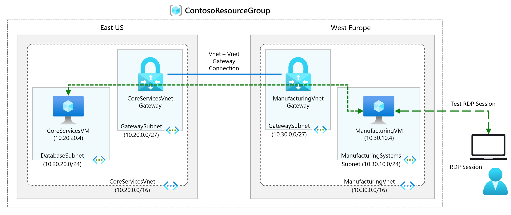
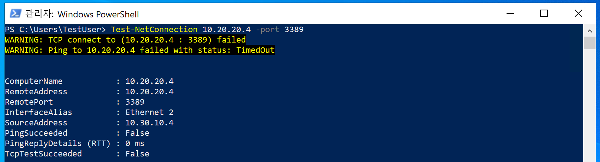
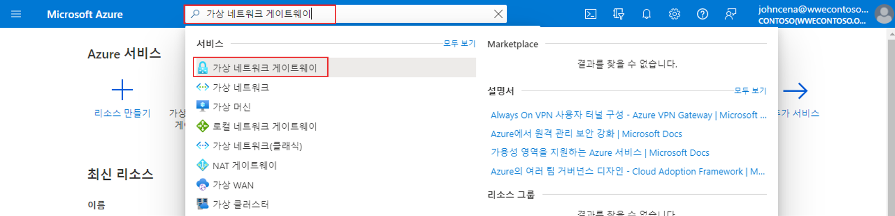
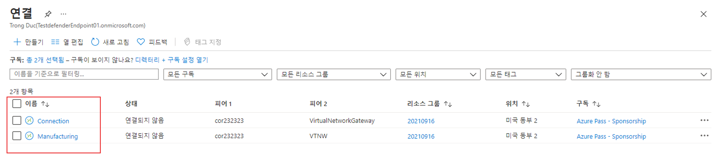

---
Exercise:
  title: M02 - 단원 3 가상 네트워크 게이트웨이 만들기 및 구성
  module: Module 02 - Design and implement hybrid networking
---


# M02-단원 3 가상 네트워크 게이트웨이 만들기 및 구성

## 연습 시나리오

이 연습에서는 Contoso Core Services VNet 및 Manufacturing VNet을 연결하도록 가상 네트워크 게이트웨이를 구성합니다.



이 연습에서 다음을 수행합니다.

+ 작업 1: CoreServicesVnet 및 ManufacturingVnet 만들기
+ 작업 2: CoreServicesVM 만들기
+ 작업 3: ManufacturingVM 만들기
+ 작업 4: RDP를 사용하여 VM에 연결
+ 작업 5: VM 간 연결 테스트
+ 작업 6: CoreServicesVnet 게이트웨이 만들기
+ 작업 7: ManufacturingVnet 게이트웨이 만들기
+ 작업 8: CoreServicesVnet을 ManufacturingVnet에 연결
+ 작업 9: CoreServicesVnet에 ManufacturingVnet 연결
+ 작업 10: 연결 확인
+ 작업 11: VM 간 연결 테스트

>**참고:** **[대화형 랩 시뮬레이션](https://mslabs.cloudguides.com/guides/AZ-700%20Lab%20Simulation%20-%20Create%20and%20configure%20a%20virtual%20network%20gateway)** 을 사용하여 이 랩을 원하는 속도로 클릭할 수 있습니다. 대화형 시뮬레이션과 호스트된 랩 간에 약간의 차이가 있을 수 있지만 보여주는 핵심 개념과 아이디어는 동일합니다.

### 예상 시간: 70분(배포 대기 시간 ~45분 포함)

## 작업 1: CoreServicesVnet 및 ManufacturingVnet 만들기

1. Azure Portal 오른쪽 상단에 있는 Cloud Shell 아이콘을 선택합니다. 필요한 경우 셸을 구성합니다.  
    + **PowerShell**을 선택합니다.
    + **스토리지 계정이 필요하지 않음**과 **구독**을 선택한 다음 **적용**을 선택합니다.
    + 터미널이 생성되고 프롬프트가 표시될 때까지 기다립니다. 

1. Cloud Shell 창 도구 모음에서 **파일 관리** 아이콘을 선택하고 드롭다운 메뉴에서 **업로드**를 선택한 다음, **azuredeploy.json** 및 **azuredeploy.parameters.json** 파일을 소스 폴더 **F:\Allfiles\Exercises\M02**로부터 Cloud Shell 홈 디렉토리에 차례대로 업로드합니다.

1. 다음 ARM 템플릿을 배포하여 이 연습에 필요한 가상 네트워크 및 서브넷을 만듭니다.

   ```powershell
   $RGName = "ContosoResourceGroup"
   #create resource group if it doesnt exist
   New-AzResourceGroup -Name $RGName -Location "eastus"
   New-AzResourceGroupDeployment -ResourceGroupName $RGName -TemplateFile azuredeploy.json -TemplateParameterFile azuredeploy.parameters.json
   ```
   
## 작업 2: CoreServicesVM 만들기

1. Azure Portal의 **Cloud Shell** 창에서 **PowerShell** 세션을 엽니다.

1. Cloud Shell 창 도구 모음에서 **파일 관리** 아이콘을 선택하고, 드롭다운 메뉴에서 **업로드**를 클릭한 다음, **CoreServicesVMazuredeploy.json** 및 **CoreServicesVMazuredeploy.parameters.json** 파일을 소스 폴더 **F:\Allfiles\Exercises\M02**로부터 Cloud Shell 홈 디렉토리에 차례대로 업로드합니다.

1. 다음 ARM 템플릿을 배포하여 이 연습에 필요한 VM을 만듭니다.

   >**참고**: 관리 암호를 입력하라는 메시지가 표시됩니다.

   ```powershell
   $RGName = "ContosoResourceGroup"
   
   New-AzResourceGroupDeployment -ResourceGroupName $RGName -TemplateFile CoreServicesVMazuredeploy.json -TemplateParameterFile CoreServicesVMazuredeploy.parameters.json
   ```
  
1. 배포가 완료되면 Azure Portal 홈페이지로 이동한 다음 **가상 머신**을 선택합니다.

1. 가상 머신이 만들어졌는지 확인합니다.

## 작업 3: ManufacturingVM 만들기

1. Azure Portal의 **Cloud Shell** 창에서 **PowerShell** 세션을 엽니다.

1. Cloud Shell 창 도구 모음에서 **파일 관리** 아이콘을 선택하고 드롭다운 메뉴에서 **업로드**를 선택한 다음, **ManufacturingVMazuredeploy.json** 및 **ManufacturingVMazuredeploy.parameters.json** 파일을 소스 폴더 **F:\Allfiles\Exercises\M02**로부터 Cloud Shell 홈 디렉토리에 차례대로 업로드합니다.

1. 다음 ARM 템플릿을 배포하여 이 연습에 필요한 VM을 만듭니다.

   >**참고**: 관리 암호를 입력하라는 메시지가 표시됩니다.

   ```powershell
   $RGName = "ContosoResourceGroup"
   
   New-AzResourceGroupDeployment -ResourceGroupName $RGName -TemplateFile ManufacturingVMazuredeploy.json -TemplateParameterFile ManufacturingVMazuredeploy.parameters.json
   ```
  
1. 배포가 완료되면 Azure Portal 홈페이지로 이동한 다음 **가상 머신**을 선택합니다.

1. 가상 머신이 만들어졌는지 확인합니다.

## 작업 4: RDP를 사용하여 VM에 연결

1. Azure Portal 홈 페이지에서 **Virtual Machines**를 선택합니다.

1. **ManufacturingVM**을 선택합니다.

1. **ManufacturingVM**에서 **연결**, **RDP**를 차례로 선택합니다.

1. **RDP 파일 다운로드**를 선택합니다.

1. RDP 파일을 데스크톱에 저장합니다.

1. RDP 파일, 사용자 이름 **TestUser** 및 배포 중에 제공한 암호를 사용하여 **ManufacturingVM**에 연결합니다. 연결한 후 RDP 세션을 최소화합니다.

1. Azure Portal 홈 페이지에서 **Virtual Machines**를 선택합니다.

1. **CoreServicesVM**을 선택합니다.

1. **CoreServicesVM**에서 **연결**을 선택한 다음 **RDP**를 선택합니다.

1. **RDP 파일 다운로드**를 선택합니다.

1. RDP 파일을 데스크톱에 저장합니다.

1. RDP 파일, 사용자 이름 **TestUser** 및 배포 중에 제공한 암호를 사용하여 **CoreServicesVM**에 연결합니다.

1. 두 VM의 **디바이스에 대한 개인 정보 설정 선택**에서 **동의**를 선택합니다.

1. 두 VM의 **네트워크**에서 **예**를 선택합니다.

1. **CoreServicesVM**에서 PowerShell을 열고 ipconfig 명령을 실행합니다.

1. IPv4 주소를 기록해 두세요.

## 작업 5: VM 간 연결 테스트

1. **ManufacturingVM**에서 PowerShell을 엽니다.

1. 다음 명령을 사용하여 CoreServicesVnet의 CoreServicesVM에 대한 연결이 없는지 확인합니다. CoreServicesVM에 대한 IPv4 주소를 사용해야 합니다.

   ```Powershell
   Test-NetConnection 10.20.20.4 -port 3389
   ```

1. 테스트 연결이 실패하면 다음과 유사한 결과가 표시됩니다.

   

## 작업 6: CoreServicesVnet 게이트웨이 만들기

1. **리소스, 서비스, 문서 검색(G+/)** 에서 **가상 네트워크 게이트웨이**를 입력한 다음, 결과에서 **가상 네트워크 게이트웨이**를 선택합니다.
   

1. 가상 네트워크 게이트웨이에서 **+ 만들기**를 선택합니다.

1. 다음 표의 정보를 사용하여 가상 네트워크 게이트웨이를 만듭니다.

   | **Tab**         | **섹션**       | **옵션**                                  | **값**                    |
   | --------------- | ----------------- | ------------------------------------------- | ---------------------------- |
   | 기본 사항          | 프로젝트 세부 정보   | Subscription                                | 변경 필요 없음          |
   |                 |                   | ResourceGroup                               | ContosoResourceGroup         |
   |                 | 인스턴스 정보  | 속성                                        | CoreServicesVnetGateway      |
   |                 |                   | 지역                                      | 미국 동부                      |
   |                 |                   | 게이트웨이 유형                                | VPN                          |
   |                 |                   | SKU                                         | VpnGw1                       |
   |                 |                   | Generation                                  | 생성 1                  |
   |                 |                   | 가상 네트워크                             | CoreServicesVnet             |
   |                 |                   | 서브넷                                      | GatewaySubnet(10.20.0.0/27) |
   |                 |                   | 공용 IP 주소 형식                      | Standard                     |
   |                 | 공용 IP 주소 | 공용 IP 주소                           | 새로 만들기                   |
   |                 |                   | 공용 IP 주소 이름                      | CoreServicesVnetGateway-ip   |
   |                 |                   | 활성-활성 모드 사용                   | 사용 안 함                     |
   |                 |                   | BGP 구성                               | 사용 안 함                     |
   | 검토 + 만들기 |                   | 설정을 검토하고 **만들기**를 선택합니다. |                              |

   >**참고**: 가상 네트워크 게이트웨이를 만드는 데 최대 15~30분이 소요될 수 있습니다. 배포가 완료될 때까지 기다릴 필요는 없습니다. 다음 게이트웨이 만들기를 계속합니다. 

## 작업 7: ManufacturingVnet 게이트웨이 만들기

### GatewaySubnet 만들기

   >**참고:** 템플릿이 CoreServicesVnet에 대한 GatewaySubnet을 만들었습니다. 여기서는 서브넷을 수동으로 만듭니다. 

1. **ManufacturingVnet**을 검색하여 선택합니다.

1. **설정** 블레이드에서 **서브넷**을 선택한 다음, **+ 서브넷**을 선택합니다. 

    | 매개 변수 | 값 |
    | --------------- | ----------------- | 
    | 서브넷 목적 | **가상 네트워크 게이트웨이** |
    | 크기 | **/27(32개 주소)** |

1. **추가**를 선택합니다. 

### 가상 네트워크 게이트웨이 만들기

1. **리소스, 서비스, 문서 검색(G+/)** 에서 **가상 네트워크 게이트웨이**를 입력한 다음, 결과에서 **가상 네트워크 게이트웨이**를 선택합니다.

1. 가상 네트워크 게이트웨이에서 **+ 만들기**를 선택합니다.

1. 이 정보 및 **설정** 탭을 사용하여 가상 네트워크 게이트웨이를 만듭니다. 

   | **Tab**         | **섹션**       | **옵션**                                  | **값**                    |
   | --------------- | ----------------- | ------------------------------------------- | ---------------------------- |
   | 기본 사항          | 프로젝트 세부 정보   | Subscription                                | 변경 필요 없음          |
   |                 |                   | ResourceGroup                               | ContosoResourceGroup         |
   |                 | 인스턴스 정보  | 속성                                        | ManufacturingVnetGateway     |
   |                 |                   | 지역                                      | 북유럽                 |
   |                 |                   | 게이트웨이 유형                                | VPN                          |
   |                 |                   | SKU                                         | VpnGw1                       |
   |                 |                   | Generation                                  | 생성 1                  |
   |                 |                   | 가상 네트워크                             | ManufacturingVnet            |
   |                 |                   | 서브넷                                      | GatewaySubnet(10.30.0.0/27) |
   |                 |                   | 공용 IP 주소 형식                      | Standard                     |
   |                 | 공용 IP 주소 | 공용 IP 주소                           | 새로 만들기                   |
   |                 |                   | 공용 IP 주소 이름                      | ManufacturingVnetGateway-ip  |
   |                 |                   | 활성-활성 모드 사용                   | 사용 안 함                     |
   |                 |                   | BGP 구성                               | 사용 안 함                     |
   | 검토 + 만들기 |                   | 설정을 검토하고 **만들기**를 선택합니다. |                              |

   >**참고**: 가상 네트워크 게이트웨이를 만드는 데 최대 15~30분이 소요될 수 있습니다.

## 작업 8: ManufacturingVnet에 CoreServicesVnet 연결

1. **리소스, 서비스, 문서 검색(G+/)** 에서 **가상 네트워크 게이트웨이**를 입력한 다음, 결과에서 **가상 네트워크 게이트웨이**를 선택합니다.

1. 가상 네트워크 게이트웨이에서 **CoreServicesVnetGateway**를 선택합니다.

1. CoreServicesGateway에서 **연결**을 선택한 다음 **+ 추가**를 선택합니다.

   >**참고**: 가상 네트워크 게이트웨이가 완전히 배포될 때까지는 이 구성을 완료할 수 없습니다.

1. 이 정보 및 **설정** 탭을 사용하여 가상 네트워크 게이트웨이를 만듭니다. 


   | **옵션**                     | **값**                         |
   | ------------------------------ | --------------------------------- |
   | 속성                           | CoreServicesGW-to-ManufacturingGW |
   | 연결 형식                | VNet 간                      |
   | 지역                         | 미국 동부                           |
   | 첫 번째 가상 네트워크 게이트웨이  | CoreServicesVnetGateway           |
   | 두 번째 가상 네트워크 게이트웨이 | ManufacturingVnetGateway          |
   | 공유 키(PSK)               | abc123                            |
   | Azure 개인 IP 주소 사용   | 선택되지 않음                      |
   | BGP 사용                     | 선택되지 않음                      |
   | IKE 프로토콜                   | IKEv2                             |
   | Subscription                   | 변경 필요 없음               |
   | Resource group                 | 변경 필요 없음               |


1. **검토 + 만들기**를 선택한 다음, **만들기**를 선택하여 연결을 만듭니다.

## 작업 9: CoreServicesVnet에 ManufacturingVnet 연결

1. **리소스, 서비스, 문서 검색(G+/)** 에서 **가상 네트워크 게이트웨이**를 입력한 다음, 결과에서 **가상 네트워크 게이트웨이**를 선택합니다.

1. 가상 네트워크 게이트웨이에서 **ManufacturingVnetGateway**를 선택합니다.

1. CoreServicesGateway에서 **연결**을 선택한 다음 **+ 추가**를 선택합니다.

1. 다음 표의 정보를 사용하여 연결을 만듭니다.

   | **옵션**                     | **값**                         |
   | ------------------------------ | --------------------------------- |
   | 속성                           | ManufacturingGW-to-CoreServicesGW |
   | 연결 형식                | VNet 간                      |
   | 위치                       | 북유럽                      |
   | 첫 번째 가상 네트워크 게이트웨이  | ManufacturingVnetGateway          |
   | 두 번째 가상 네트워크 게이트웨이 | CoreServicesVnetGateway           |
   | 공유 키(PSK)               | abc123                            |
   | Azure 개인 IP 주소 사용   | 선택되지 않음                      |
   | BGP 사용                     | 선택되지 않음                      |
   | IKE 프로토콜                   | IKEv2                             |
   | Subscription                   | 변경 필요 없음               |
   | Resource group                 | 변경 필요 없음               |


1. **검토 + 만들기**를 선택한 다음, **만들기**를 선택하여 연결을 만듭니다.

## 작업 10: 연결 확인

1. **리소스, 서비스, 문서 검색(G+/)** 에서 **VPN**을 입력한 다음 결과에서 **연결**을 선택합니다.

1. 두 연결의 상태가 **연결됨**이 될 때까지 기다립니다. 화면을 새로 고쳐야 할 수도 있습니다.

   

## 작업 11: VM 간 연결 테스트

1. **ManufacturingVM**에서 PowerShell을 엽니다.

1. 다음 명령을 사용하여 CoreServicesVnet에서 CoreServicesVM에 대한 연결이 있는지 확인합니다. CoreServicesVM에 대한 IPv4 주소를 사용해야 합니다.

   ```Powershell
   Test-NetConnection 10.20.20.4 -port 3389
   ```

1. 테스트 연결이 성공하면 다음과 유사한 결과가 표시됩니다.

   

1. 원격 데스크톱 연결 창을 닫습니다.

## Copilot을 사용하여 학습 확장

Copilot은 Azure 스크립팅 도구를 사용하는 방법을 익히는 데 도움을 줍니다. 또한 Copilot은 랩에서 다루지 않는 영역이나 추가 정보가 필요한 영역을 지원할 수 있습니다. Edge 브라우저를 열고 Copilot(오른쪽 위)을 선택하거나 *copilot.microsoft.com*으로 이동하세요. 몇 분 정도 시간을 내어 이러한 프롬프트를 사용해 보세요.
+ Azure VPN Gateway의 주요 유형은 무엇이며 각 유형의 사용 이유는 무엇인가요?
+ Azure VPN Gateway sku를 선택할 때 고려해야 하는 요소는 무엇인가요? 예제 제공
+ Azure VPN Gateway와 관련된 비용이 있나요?


## 자기 주도적 학습을 통해 자세히 알아보기

+ [VPN Gateway를 사용하여 온-프레미스 네트워크를 Azure에 연결](https://learn.microsoft.com/training/modules/connect-on-premises-network-with-vpn-gateway/). 이 모듈에서는 CLI를 사용하여 VPN Gateway를 프로비전합니다.
+ [Microsoft Azure의 VPN Gateway 문제 해결](https://learn.microsoft.com/training/modules/troubleshoot-vpn-gateways/). 이 모듈에서는 사이트 간 VPN, 지점 및 사이트 간 VPN을 모니터링하고 문제를 해결하는 방법을 살펴봅니다.

## 핵심 내용

축하합니다. 랩을 완료했습니다. 이 랩의 주요 내용은 다음과 같습니다. 

+ Azure VPN Gateway는 온-프레미스 네트워크와 Azure 가상 네트워크 간에 보안 연결을 제공합니다.
+ S2S(사이트 간) 연결은 IPsec/IKE VPN 터널을 통해 온-프레미스 네트워크를 Azure 가상 네트워크에 연결합니다. 하이브리드 클라우드 시나리오에 적합합니다.
+ P2S(지점 및 사이트 간) 연결은 원격 위치에서 Azure 가상 네트워크에 개별 클라이언트를 연결합니다. VPN 프로토콜은 OpenVPN, IKEv2 또는 SSTP를 포함합니다. 원격 작업자에게 유용합니다.
+ VNet 간 연결은 IPsec/IKE VPN 터널을 사용하여 둘 이상의 Azure 가상 네트워크를 연결합니다. 다중 지역 또는 다중 VNet 배포에 적합합니다.
+ 다른 VPN Gateway SKU는 다양한 수준의 성능, 처리량 및 기능을 제공합니다. 

