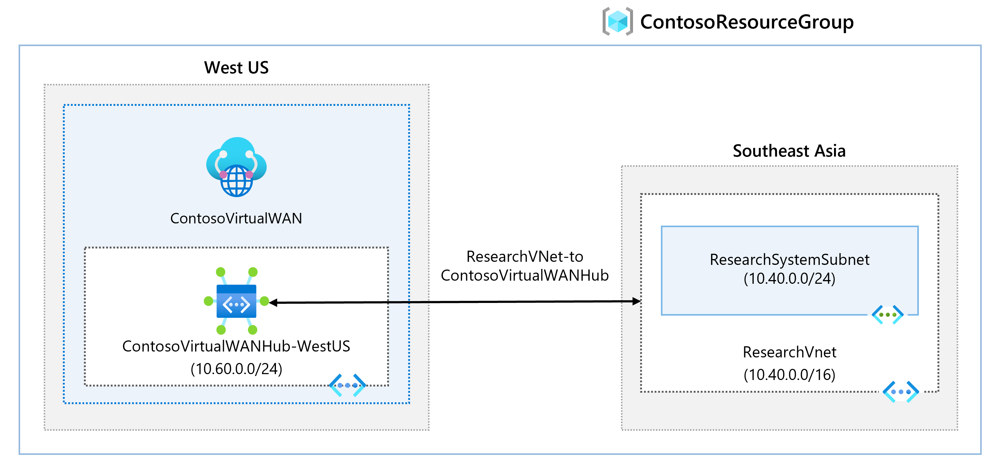
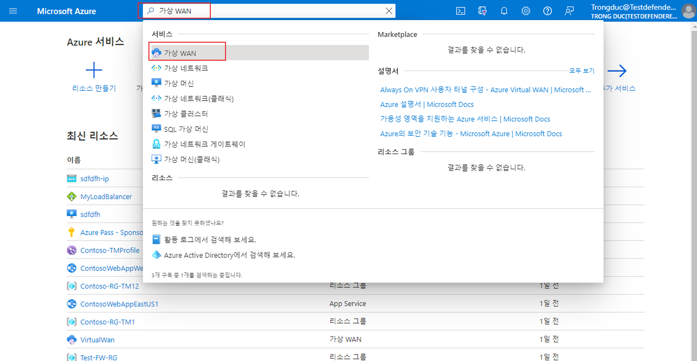
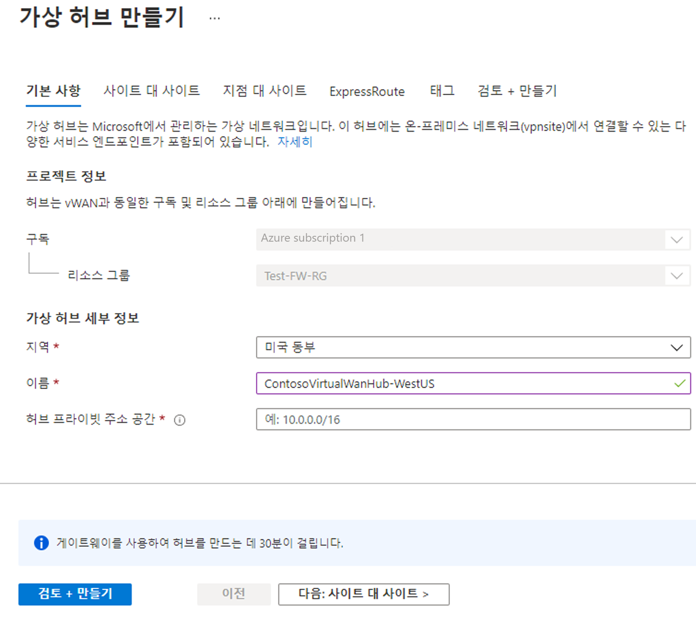
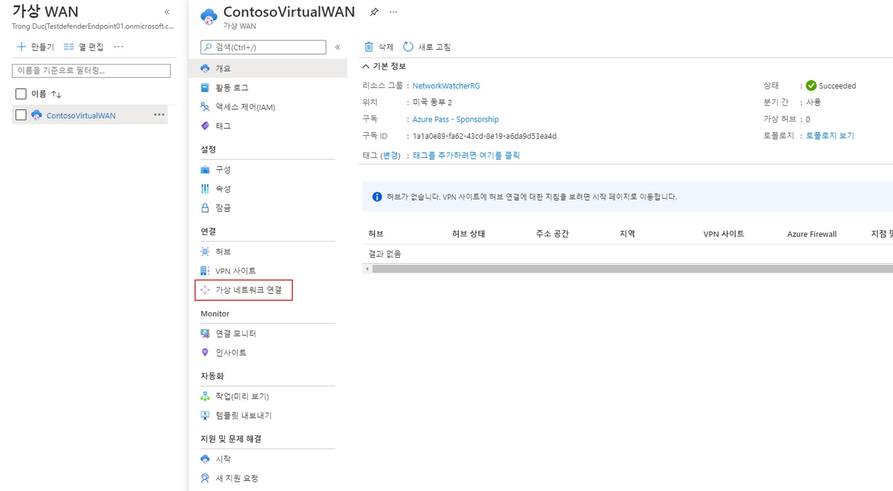

---
Exercise:
  title: M02 - 단원 7 Azure Portal을 사용하여 Virtual WAN 만들기
  module: Module 02 - Design and implement hybrid networking
---

# M02-단원 7 Azure Portal을 사용하여 Virtual WAN 만들기

이 연습에서는 Contoso용 Virtual WAN을 만듭니다.




이 연습에서 다음을 수행합니다.

+ 작업 1: Virtual WAN 만들기
+ 작업 2: Azure Portal을 사용하여 허브 만들기
+ 작업 3: 가상 허브에 VNet 연결
+ 작업 4: 리소스 정리

**참고:** **[대화형 랩 시뮬레이션](https://mslabs.cloudguides.com/guides/AZ-700%20Lab%20Simulation%20-%20Create%20a%20virtual%20WAN%20using%20the%20Azure%20portal)** 을 사용하여 이 랩을 원하는 속도로 클릭할 수 있습니다. 대화형 시뮬레이션과 호스트된 랩 간에 약간의 차이가 있을 수 있지만 보여주는 핵심 개념과 아이디어는 동일합니다.

#### 예상 시간: 65분(배포 대기 시간 ~45분 포함)

## 작업 1: Virtual WAN 만들기

1. 브라우저에서 Azure Portal로 이동하고 Azure 계정으로 로그인합니다.

1. 포털의 검색 상자에 Virtual WAN을 입력하고 결과 목록에서 **Virtual WAN**을 선택합니다.

   

 

1. Virtual WAN 페이지에서 + **만들기**를 선택합니다. 

1. WAN 만들기 페이지의 **기본 사항** 탭에서 다음 필드를 입력합니다.

   - **구독:** 기존 구독 사용

   - **리소스 그룹:** ContosoResourceGroup

   - **리소스 그룹 위치:** 드롭다운에서 리소스 위치를 선택합니다. WAN은 전역 리소스이며 특정 지역에 상주하지 않습니다. 하지만 관리할 지역을 선택하고 생성된 WAN 리소스를 찾아야 합니다.

   - **이름:** ContosoVirtualWAN

   - **유형:** 표준 

1. 필드를 채운 후 **검토 + 만들기**를 선택합니다.

1. 유효성 검사를 통과하면 **만들기**를 선택하여 Virtual WAN을 만듭니다.

## 작업 2: Azure Portal을 사용하여 허브 만들기

허브는 사이트 간, ExpressRoute 또는 지점 및 사이트 간 기능을 위한 게이트웨이를 포함합니다. 가상 허브에서 사이트 간 VPN 게이트웨이를 만드는 데 30분이 소요됩니다. 허브를 만들려면 먼저 Virtual WAN을 만들어야 합니다.

1. 생성한 Virtual WAN을 찾습니다. 
1. Virtual WAN 페이지의 **연결**에서 **허브**를 선택합니다.
1. 허브 페이지에서 **+새 허브**를 선택하여 가상 허브 만들기 페이지를 엽니다.
   
1. 가상 허브 만들기 페이지의 **기본 사항** 탭에서 다음 필드를 완료합니다.
   - **지역:** 미국 서부
   - **이름:** ContosoVirtualWANHub-WestUS
   - **허브 프라이빗 주소 공간:** 10.60.0.0/24
   - **가상 허브 용량:** 2 라우팅 인프라 단위
   - **허브 라우팅 기본 설정:** 기본값을 그대로 사용합니다.
1. 완료되면 **다음: 사이트 대 사이트**
1. **사이트 대 사이트** 탭에서 다음 필드를 완료합니다.
   - **사이트 간 (VPN Gateway)를 만드시겠습니까?** 예
   - **AS 번호** 필드는 편집할 수 없습니다.
   - **게이트웨이 배율 단위** 1 배율 단위 = 500Mbps x 2
   - **라우팅 기본 설정:** 기본값을 그대로 사용합니다. 
1. **검토 + 만들기**를 선택하여 유효한지 확인합니다.
1. **만들기**를 선택하여 허브를 만듭니다. 
1. 30분 후에 **새로 고침**을 선택하여 허브 페이지에서 허브를 봅니다. 

## 작업 3: 가상 허브에 VNet 연결

1. 생성한 Virtual WAN을 찾습니다. 

1. ContosoVirtualWAN의 **연결**에서 **가상 네트워크 연결**을 선택합니다.

   

1. ContosoVirtualWAN | 가상 네트워크 연결에서 **+ 연결 추가**를 선택합니다.

1. 연결 추가에서 다음 정보를 사용하여 연결을 만듭니다.

   - **연결 이름:** ContosoVirtualWAN-ResearchVNet

   - **허브:** ContosoVirtualWANHub-WestUS

   - **구독:** 변경 내용 없음

   - **리소스 그룹:** ContosoResourceGroup

   - **가상 네트워크:** ResearchVNet

   - **전파 안 함:** 예

   - **경로 테이블 연결:** 기본

1. **만들기**를 선택합니다.

 

축하합니다! Virtual WAN 및 Virtual WAN 허브를 만들고 ResearchVNet을 허브에 연결했습니다.

## 작업 4: 리소스 정리

   >**참고**: 더 이상 사용하지 않는 새로 만든 Azure 리소스는 모두 제거하세요. 사용되지 않는 리소스를 제거하면 예기치 않은 요금이 발생하지 않습니다.

1. Azure Portal의 **Cloud Shell** 창에서 **PowerShell** 세션을 엽니다.

1. 다음 명령을 실행하여 이 모듈의 랩 전체에서 만든 모든 리소스 그룹을 삭제합니다.

   ```powershell
   Remove-AzResourceGroup -Name 'ContosoResourceGroup' -Force -AsJob
   ```

    >**참고**: 이 명령은 -AsJob 매개 변수에 의해 결정되어 비동기로 실행되므로, 동일한 PowerShell 세션 내에서 이 명령을 실행한 직후 다른 PowerShell 명령을 실행할 수 있지만 리소스 그룹이 실제로 제거되기까지는 몇 분 정도 걸립니다.
