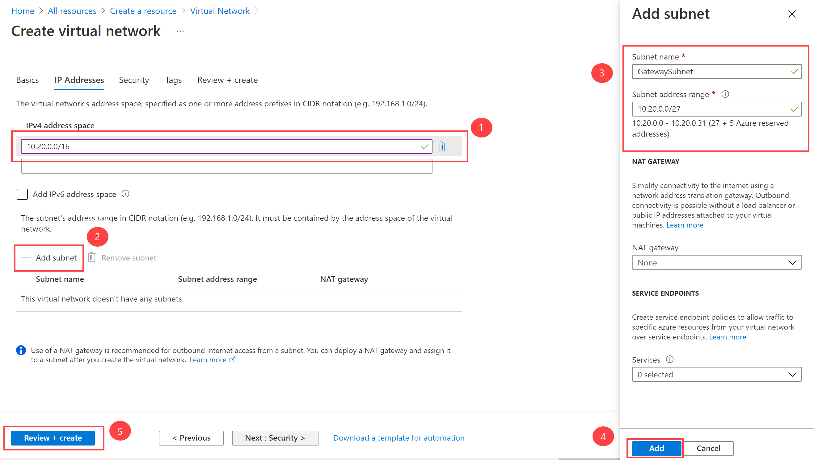

---
Exercise:
  title: M03-단원 4 ExpressRoute 게이트웨이 구성
  module: Module - Design and implement Azure ExpressRoute
ms.openlocfilehash: af79e4be86e2b89c20338b9cb66ddaa5a94b1f5e
ms.sourcegitcommit: e98d709ed0f96f3c8e8c4e74c3aea821dff153ca
ms.translationtype: HT
ms.contentlocale: ko-KR
ms.lasthandoff: 09/13/2022
ms.locfileid: "147922337"
---
# M03-단원 4 ExpressRoute 게이트웨이 구성

## ExpressRoute 게이트웨이 배포

ExpressRoute를 통해 Azure 가상 네트워크와 온-프레미스 네트워크를 연결하려면 먼저 가상 네트워크 게이트웨이를 만들어야 합니다. 가상 네트워크 게이트웨이는 네트워크 간에 IP 경로를 교환하고 네트워크 트래픽을 라우팅하는 두 가지 용도로 사용됩니다. 

#### 예상 시간: 60분(배포 대기 시간 ~45분 포함)

**게이트웨이 유형**

가상 네트워크 게이트웨이를 만들 때 몇 가지 설정을 지정해야 합니다. 필수 설정 중 하나인 '-GatewayType'은 게이트웨이를 ExpressRoute에 사용할 것인지 아니면 VPN 트래픽에 사용할 것인지 지정합니다. 두 가지 게이트웨이 유형은 다음과 같습니다.

- **Vpn** - 퍼블릭 인터넷을 통해 암호화된 트래픽을 전송하려면 ‘VPN’ 유형의 게이트웨이를 사용합니다. 이를 VPN 게이트웨이라고도 합니다. 사이트 간, 지점 및 사이트 간, VNet 간 연결은 모두 VPN Gateway를 사용합니다.
- **ExpressRoute** - 프라이빗 연결을 통해 네트워크 트래픽을 전송하려면 'ExpressRoute' 유형의 게이트웨이를 사용합니다. 이를 ExpressRoute 게이트웨이라고도 하며 ExpressRoute를 구성할 때 사용되는 게이트웨이 유형입니다.

각각의 가상 네트워크에는 게이트웨이 유형당 하나의 가상 네트워크 게이트웨이가 있을 수 있습니다. 예를 들어 -GatewayType VPN을 사용하는 하나의 가상 네트워크 게이트웨이와 -GatewayType ExpressRoute를 사용하는 하나의 가상 네트워크 게이트웨이가 있을 수 있습니다.

이 연습에서 다음을 수행합니다.

+ 작업 1: VNet 및 게이트웨이 서브넷 만들기
+ 작업 2: 가상 네트워크 게이트웨이 만들기

## 작업 1: VNet 및 게이트웨이 서브넷 만들기

1. 아무 Azure Portal 페이지에서나 **리소스, 서비스 및 문서 검색** 에 가상 네트워크를 입력하고 결과에서 **가상 네트워크** 를 선택합니다.

2. 가상 네트워크 페이지에서 **+만들기** 를 선택합니다.

3. 가상 네트워크 만들기 창의 **기본 사항** 탭에서 다음 표의 정보를 사용하여 VNet을 만듭니다.

   | **설정**          | **값**                        |
   | -------------------- | -------------------------------- |
   | Virtual Network 이름 | CoreServicesVNet                 |
   | 리소스 그룹       | ContosoResourceGroup             |
   | 위치             | 미국 동부                          |

4. **다음: IP 주소** 를 선택합니다.

5. **IP 주소** 탭의 **IPv4 주소 공간** 에 10.20.0.0/16을 입력한 다음 **+ 서브넷 추가** 를 선택합니다. 

6. 서브넷 추가 창에서 다음 표의 정보를 사용하여 서브넷을 만듭니다.

   | **설정**                  | **값**     |
   | ---------------------------- | ------------- |
   | 게이트웨이 서브넷 이름          | GatewaySubnet |
   | 게이트웨이 서브넷 주소 공간 | 10.20.0.0/27  |

7. 그런 후 **추가** 를 선택합니다. 

8. 가상 네트워크 만들기 페이지에서 **검토 + 만들기** 를 선택합니다.

   

9. VNet이 유효성 검사를 통과하는지 확인한 다음 **만들기** 를 선택합니다.

> [!Note]  
>
> 이중 스택 가상 네트워크를 사용하고 ExpressRoute를 통해 IPv6 기반 프라이빗 피어링을 사용하려는 경우 IP6 주소 공간 추가를 클릭하고 IPv6 주소 범위 값을 입력합니다.

## 작업 2: 가상 네트워크 게이트웨이 만들기

1. 아무 Azure Portal 페이지에서나 **리소스, 서비스 및 문서 검색(G+/)** 에 가상 네트워크 게이트웨이를 입력하고 결과에서 **가상 네트워크 게이트웨이** 를 선택합니다.

2. 가상 네트워크 게이트웨이 페이지에서 **+만들기** 를 선택합니다.

3. **가상 네트워크 게이트웨이 만들기** 페이지에서 다음 표의 정보를 사용하여 게이트웨이를 만듭니다.

   | **설정**               | **값**                  |
   | ------------------------- | -------------------------- |
   | **프로젝트 세부 정보**       |                            |
   | 리소스 그룹            | ContosoResourceGroup       |
   | **인스턴스 세부 정보**      |                            |
   | 이름                      | CoreServicesVnetGateway    |
   | 지역                    | 미국 동부                    |
   | 게이트웨이 유형              | ExpressRoute               |
   | SKU                       | 표준                   |
   | 가상 네트워크           | CoreServicesVNet           |
   | **공용 IP 주소**     |                            |
   | 공용 IP 주소         | 새로 만들기                 |
   | 공용 IP 주소 이름    | CoreServicesVnetGateway-IP |
   | 공용 IP 주소 SKU     | Basic                      |
   | 할당                | 구성할 수 없음           |
   
4. **검토 + 생성** 를 선택합니다.

5. 게이트웨이 구성이 유효성 검사를 통과하는지 확인한 다음, **만들기** 를 선택합니다.

6. 배포가 완료되면 **리소스로 이동** 을 선택합니다.

> [!Note] 
>
> 게이트웨이를 배포하려면 최대 45분이 걸릴 수 있습니다.

축하합니다! 가상 네트워크, 게이트웨이 서브넷, ExpressRoute 게이트웨이를 만들었습니다.

