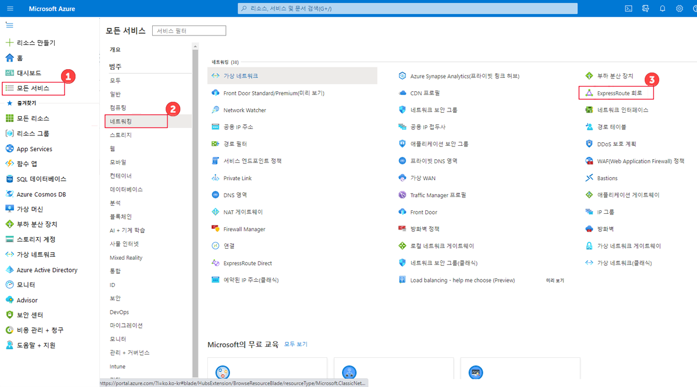
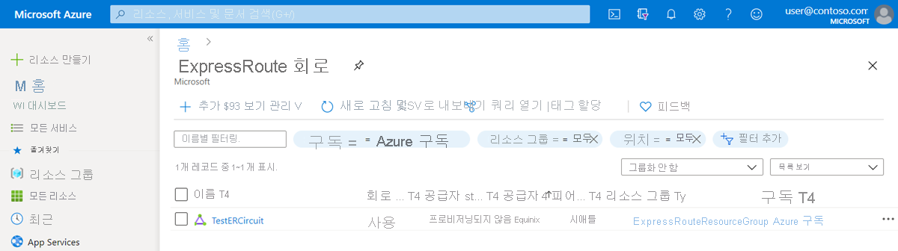
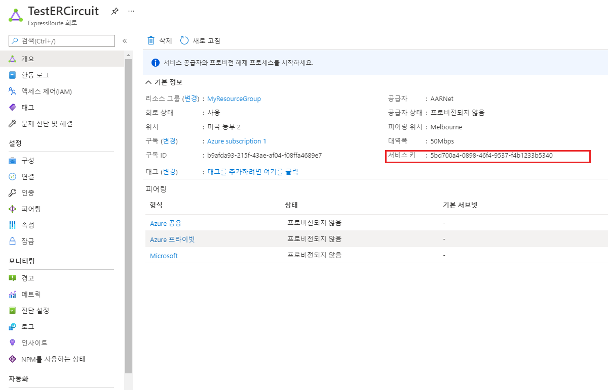
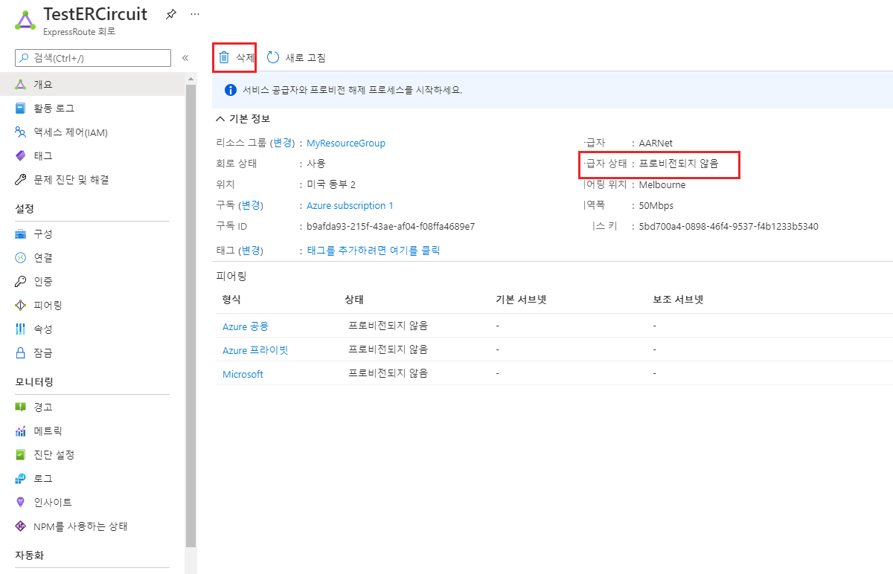

---
Exercise:
  title: M03 - 단원 5 ExpressRoute 회로 프로비전
  module: Module 03 - Design and implement Azure ExpressRoute
---
# M03-단원 5 ExpressRoute 회로 프로비전

## 연습 시나리오

이 연습에서는 Azure Portal 및 Azure Resource Manager 배포 모델을 사용하여 ExpressRoute 회로를 만듭니다.

### 대화형 랩 시뮬레이션

>**참고**: 이전에 제공되었던 랩 시뮬레이션은 사용 중지되었습니다.

### 예상 소요 시간: 15분


### 작업 기술

이 연습에서 다음을 수행합니다.

+ 작업 1: ExpressRoute 회로 만들기 및 프로비저닝
+ 작업 2: 서비스 키 검색
+ 작업 3: ExpressRoute 회로 프로비전 해제


## 작업 1: ExpressRoute 회로 만들기 및 프로비저닝

1. 브라우저에서 [Azure 포털](https://portal.azure.com/) 로 이동하고 Azure 계정으로 로그인합니다.

   >**중요**: ExpressRoute 회로는 서비스 키가 발급되는 순간부터 비용이 청구됩니다. 연결 공급자가 회로를 프로비전할 준비가 된 후에 이 작업을 수행하도록 하십시오.

1. Azure Portal 메뉴에서 **ExpressRoute 회로**를 검색하고 선택합니다.

1. **Create ExpressRoute** 페이지에서 **리소스 그룹**을 `ExpressRouteResourceGroup`(으)로 지정합니다. 그런 다음 **복원력**에서 **표준 복원력**을 선택합니다.

1. **회로 세부 정보**의 경우, 올바른 지역(**미국 동부 2**), 회로 이름(**TestERCircuit**), 피어링 위치(**Seattle**), 공급자(**Equinix**), 대역폭(**50Mbps**), SKU 계층(**Standard**) 및 데이터 계량 청구 모델(**데이터 요금**)을 지정했는지 확인합니다.

1. **검토 + 생성**를 선택합니다.

1. ExpressRoute 구성이 유효성 검사를 통과하는지 확인한 다음, **만들기**를 선택합니다.


+ 포트 유형은 피어링 위치에서 서비스 공급자에 연결하거나 Microsoft의 글로벌 네트워크에 직접 연결하는지 결정합니다.
+ 새로 만들기 또는 클래식에서 가져오기는 새 회로를 만들지 또는 클래식 회로를 Azure Resource Manager로 마이그레이션할지를 결정합니다.
+ 공급자는 서비스를 요청하는 인터넷 서비스 공급자입니다.
+ 피어링 위치는 Microsoft와 피어링하는 물리적 위치입니다.

> [!Important]
>
> 피어링 위치는 Microsoft와 피어링하는 [물리적 위치](https://docs.microsoft.com/en-us/azure/expressroute/expressroute-locations)를 나타냅니다. 이 위치는 Azure Network Resource Provider가 있는 지리적 위치를 참조하는 "Location" 속성에 연결되지 않습니다 . 이 속성에 연결되지 않는 대신 회로의 피어링 위치와 지리적으로 가까운 네트워크 리소스 공급자를 선택 하는 것이 좋습니다.

+ **SKU**는 ExpressRoute 로컬, ExpressRoute 표준 또는 ExpressRoute 프리미엄 추가 기능이 사용되는지 여부를 결정합니다. **로컬**을 지정하여 로컬 SKU를 가져오거나, **표준**을 지정하여 표준 SKU를 가져오거나, 프리미엄 추가 기능을 위해 **프리미엄**을 지정할 수 있습니다. SKU를 변경하여 프리미엄 추가 기능을 사용하도록 설정할 수 있습니다.

   >**중요**: SKU를 표준/프리미엄에서 로컬로 변경할 수 없습니다.

+ **청구 모델**은 청구서 유형을 결정합니다. 데이터 요금제의 경우 **Metered**를 선택하고 무제한 데이터 요금제의 경우 **Unlimited**를 선택할 수 있습니다. 청구 유형을 **Metered**에서 **Unlimited**로 변경할 수 있습니다.

> [!Important]
>
> 청구 유형을 무제한에서 데이터 요금제로 변경할 수는 없습니다.

+ **클래식 작업 허용**을 사용하여 클래식 가상 네트워크를 회로에 연결할 수 있습니다.

## 작업 2: 서비스 키 검색

1. **모든 서비스 &gt; 네트워킹 &gt; ExpressRoute 회로**를 선택하여 만든 모든 회로를 볼 수 있습니다.

   

1. 구독에서 만든 모든 ExpressRoute 회로가 여기에 표시됩니다.

   

1. 회로 페이지에는 회로의 속성이 표시됩니다. 서비스 키는 서비스 키 필드에 표시됩니다. 서비스 공급자가 프로비저닝 프로세스를 완료하려면 서비스 키가 필요합니다. 서비스 키는 회로에 지정됩니다. **프로비저닝을 위해 연결 공급자에 서비스 키를 보내야 합니다.**

   

1. 이 페이지에서 **공급자 상태**는 서비스 공급자 측의 현재 프로비저닝 상태를 제공합니다. **회로 상태**는 Microsoft 측의 상태를 제공합니다.

1. 새 ExpressRoute 회로를 만들면 회로는 다음 상태가 됩니다.

   + 공급자 상태: 프로비전되지 않음
   + 회로 상태: 활성화됨

   + 연결 공급자가 사용자에 대해 현재 활성화하고 있을 때 회로가 다음 상태로 변경됩니다.
     + 공급자 상태: 프로비전 중
     + 회로 상태: 활성화됨
   + ExpressRoute 회로를 사용하려면 다음 상태여야 합니다.
     + 공급자 상태: 프로비전됨
     + 회로 상태: 활성화됨
   + 주기적으로 프로비저닝 상태와 회로 상태를 확인해야 합니다.


축하합니다! ExpressRoute 회로를 만들었고 회로 프로비저닝을 완료하는 데 필요한 서비스 키를 찾았습니다.

## 작업 3: ExpressRoute 회로 프로비저닝 해제

ExpressRoute 회로 서비스 공급자 프로비저닝 상태가 **프로비저닝 중** 또는 **프로비저닝됨**인 경우에는 서비스 공급자에게 회로 프로비저닝 해제를 요청해야 합니다. Microsoft는 서비스 공급자가 회로 프로비저닝 해제를 완료하고 알릴 때까지 계속해서 리소스를 예약하고 요금을 청구합니다.

   >**참고**: 프로비저닝을 해제하기 전에 ExpressRoute 회로에서 모든 가상 네트워크의 연결을 해제해야 합니다. 이 작업에 실패한 경우 회로에 연결된 가상 네트워크가 있는지 확인하세요. 서비스 공급자가 회로 프로비전을 해제하여 서비스 공급자 프로비전 상태가 프로비전되지 않음이 되면 회로를 삭제할 수 있습니다. 그러면 회로에 대한 요금 청구가 중지됩니다.

## 리소스 정리

**삭제** 아이콘을 선택하여 ExpressRoute 회로를 삭제할 수 있습니다. 계속하기 전에 공급자 상태가 프로비전 안 됨인지 확인합니다.



   >**참고**: 더 이상 사용하지 않는 새로 만든 Azure 리소스는 모두 제거하세요. 사용되지 않는 리소스를 제거하면 예기치 않은 요금이 발생하지 않습니다.

1. Azure Portal의 **Cloud Shell** 창에서 **PowerShell** 세션을 엽니다.

1. 다음 명령을 실행하여 이 모듈의 랩 전체에서 만든 모든 리소스 그룹을 삭제합니다.

   ```powershell
   Remove-AzResourceGroup -Name 'ContosoResourceGroup' -Force -AsJob
   Remove-AzResourceGroup -Name 'ExpressRouteResourceGroup' -Force -AsJob
   ```

   >**참고**: 이 명령은 -AsJob 매개 변수에 의해 결정되어 비동기로 실행되므로, 동일한 PowerShell 세션 내에서 이 명령을 실행한 직후 다른 PowerShell 명령을 실행할 수 있지만 리소스 그룹이 실제로 제거되기까지는 몇 분 정도 걸립니다.

## Copilot을 사용하여 학습 확장

Copilot은 Azure 스크립팅 도구를 사용하는 방법을 익히는 데 도움을 줍니다. 또한 Copilot은 랩에서 다루지 않는 영역이나 추가 정보가 필요한 영역을 지원할 수 있습니다. Edge 브라우저를 열고 Copilot(오른쪽 위)을 선택하거나 *copilot.microsoft.com*으로 이동하세요. 몇 분 정도 시간을 내어 이러한 프롬프트를 사용해 보세요.
+ Azure ExpressRoute에 사용할 수 있는 서비스 제공업체는 어디인가요?
+ Azure ExpressRoute의 가장 일반적인 구성 문제는 무엇인가요? 해당 문제가 있는 경우 어떻게 해야 하나요?

## 자기 주도적 학습을 통해 자세히 알아보기

+ [Azure ExpressRoute 소개](https://learn.microsoft.com/training/modules/intro-to-azure-expressroute/) 이 모듈에서는 Azure ExpressRoute의 정의와 제공 기능을 알아봅니다.
+ [ExpressRoute 설계 및 구현](https://learn.microsoft.com/training/modules/design-implement-azure-expressroute/) 이 모듈에서는 Azure ExpressRoute, ExpressRoute Global Reach, ExpressRoute FastPath를 설계하고 구현하는 방법을 알아봅니다.

## 핵심 내용

축하합니다. 랩을 완료했습니다. 이 랩의 주요 내용은 다음과 같습니다. 
+ Azure ExpressRoute를 사용하면 조직이 온-프레미스 네트워크를 Microsoft Azure 및 Microsoft 365 클라우드에 직접 연결할 수 있습니다. Azure ExpressRoute는 Microsoft 파트너가 제공하는 전용 고대역폭 연결을 사용합니다.
+ Microsoft는 최소 99.95%의 ExpressRoute 전용 연결 가용성을 보장합니다. 연결은 비공개이며 전용 선을 통해 이동하며, 제3자가 트래픽을 가로챌 수 없습니다.
+ 온-프레미스 네트워크와 Microsoft 클라우드 간 연결은 CloudExchange 공동 배치, 지점 간 이더넷 연결, Any-to-Any(IPVPN) 연결, ExpressRoute Direct라는 네 가지 방법으로 만들 수 있습니다.
+ ExpressRoute 기능은 SKU(로컬, 표준, 프리미엄)에 의해 결정됩니다. 

