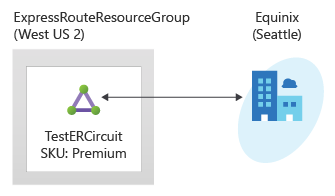

---
Exercise:
    title: 'M03-단원 5 ExpressRoute 회로 프로비전'
    module: '모듈 - Azure ExpressRoute 설계 및 구현'
---
# M03-단원 5 ExpressRoute 회로 프로비전

이 연습에서는 Azure Portal 및 Azure Resource Manager 배포 모델을 사용하여 ExpressRoute 회로를 만듭니다. 



ExpressRoute 회로를 만드는 방법의 데모를 시청하려면 [Azure ExpressRoute - ExpressRoute 회로를 만드는 방법 | Azure | Channel 9(msdn.com)](https://channel9.msdn.com/Blogs/Azure/Azure-ExpressRoute-How-to-create-an-ExpressRoute-circuit?term=ExpressRoute&lang-en=true&pageSize=15&skip=15)을 참조하세요.


이 연습에서는 다음을 수행합니다.

+ 작업 1: ExpressRoute 회로 만들기 및 프로비전
+ 작업 2: 서비스 키 검색
+ 작업 3: ExpressRoute 회로 프로비전 해제
+ 작업 4: 리소스 정리


## 작업 1: ExpressRoute 회로 만들기 및 프로비전

 

1. 브라우저에서 [Azure Portal](https://portal.azure.com/)로 이동하고 Azure 계정으로 로그인합니다.

   > [!중요] 
   >
   > ExpressRoute 회로는 서비스 키가 발급된 순간부터 비용이 청구됩니다. 연결 공급자가 회로를 프로비전할 준비가 된 후에 이 작업을 수행하도록 하세요.

2. Azure Portal 메뉴에서 **+ 리소스 만들기**를 선택합니다. 다음 그림과 같이 **네트워킹**을 선택한 후 **ExpressRoute**를 선택합니다. 목록에 ExpressRoute가 표시되지 않으면 **마켓플레이스 검색**을 사용하여 ExpressRoute를 검색합니다.

   

3. **ExpressRoute 만들기** 페이지에서 회로의 **리소스 그룹**, **지역** 및 **이름**을 다음과 같이 입력합니다. ExpressRouteResourceGroup, East US 2, TestERCircuit. 그런 후에 **다음: 구성 &gt;** 을 선택합니다.

4. 이 페이지의 값에 데이터를 입력할 때 올바른 SKU 계층(로컬, 표준 또는 프리미엄) 및 데이터 계량 청구 모델(제한 없음 또는 요금제)을 지정해야 합니다.


 

- 포트 유형은 피어링 위치에서 서비스 공급자에 연결하거나 Microsoft의 글로벌 네트워크에 직접 연결하는지를 결정합니다.
- 새로 만들기 또는 클래식에서 가져오기는 새 회로가 만들어지고 있는지 또는 클래식 회로를 Azure Resource Manager로 마이그레이션하는지를 결정합니다.
- 공급자는 서비스를 요청하는 인터넷 서비스 공급자입니다.
- 피어링 위치는 Microsoft와 피어링하는 실제 위치입니다.

> [!중요]
>
> 피어링 위치는 Microsoft와 피어링하는 [실제 위치](https://docs.microsoft.com/ko-kr/azure/expressroute/expressroute-locations)를 나타냅니다. 이 위치는 Azure 네트워크 리소스 공급자가 있는 지리적 위치를 참조하는 "Location" 속성에 연결되지 않습니다. 이 속성에 연결되지 않는 대신 회로의 피어링 위치와 지리적으로 가까운 네트워크 리소스 공급자를 선택하는 것이 좋습니다.

- **SKU**는 ExpressRoute 로컬, ExpressRoute 표준 또는 ExpressRoute 프리미엄 추가 기능이 사용되는지 여부를 결정합니다. **로컬**을 지정하여 로컬 SKU를 가져오거나, **표준**을 지정하여 표준 SKU를 가져오거나, 프리미엄 추가 기능을 위해 **프리미엄**을 지정할 수 있습니다. SKU를 변경하여 프리미엄 추가 기능을 사용하도록 설정할 수 있습니다.

> [!중요]
>
> SKU를 표준/프리미엄에서 로컬로 변경할 수는 없습니다.

- **청구 모델**은 청구 유형을 결정합니다. 데이터 요금제의 경우 **Metered**를 지정하고 무제한 데이터 요금제의 경우 **Unlimited**를 지정할 수 있습니다. 청구 유형을 **Metered**에서 **Unlimited**로 변경할 수 있습니다.

> [!중요]
>
> 청구 유형을 Unlimited에서 Metered로 변경할 수는 없습니다.

- **클래식 작업 허용**을 사용하여 클래식 가상 네트워크를 회로에 연결할 수 있습니다.

## 작업 2: 서비스 키 검색
 

1. **모든 리소스 &gt; 네트워킹 &gt; ExpressRoute 회로**를 선택하면 만들어 놓은 모든 회로를 볼 수 있습니다.

   

2. 구독에서 만든 모든 ExpressRoute 회로가 여기에 표시됩니다. 

   

3. 회로 페이지에 회로의 속성이 표시됩니다. 서비스 키는 서비스 키 필드에 표시됩니다. 서비스 공급자가 프로비전 프로세스를 완료하려면 서비스 키가 필요합니다. 서비스 키는 자신의 회로에만 국한됩니다. **프로비전을 위해 연결 공급자에게 서비스 키를 보내야 합니다.**

   

4. 이 페이지의 **공급자 상태**에서는 서비스 공급자 측의 현재 프로비전 상태를 확인할 수 있습니다. **회로 상태**에서는 Microsoft 측의 상태를 확인할 수 있습니다. 

5. 새 ExpressRoute 회로를 만들면 회로는 다음 상태가 됩니다.

   - 공급자 상태: 프로비전 안 됨
   - 회로 상태: 사용


   - 연결 공급자가 현재 이를 사용하도록 설정하는 경우 회로가 다음 상태로 변경됩니다.
     - 공급자 상태: 프로비전 중
     - 회로 상태: 사용
   - ExpressRoute 회로를 사용하려면 다음 상태여야 합니다.
     - 공급자 상태: 프로비전됨
     - 회로 상태: 사용
   - 회로 상태와 프로비전 상태를 주기적으로 확인해야 합니다.


 
ExpressRoute 회로를 만들고 프로비전하는 방법을 보여 주는 다음 데모를 시청해 보세요. [Azure ExpressRoute - ExpressRoute 회로를 만드는 방법 | Azure | Channel 9(msdn.com)](https://channel9.msdn.com/Blogs/Azure/Azure-ExpressRoute-How-to-create-an-ExpressRoute-circuit?term=ExpressRoute&lang-en=true&pageSize=15&skip=15)을 참조하세요. 

축하합니다! ExpressRoute 회로를 만들고 서비스 키를 찾았습니다. 회로 프로비전을 완료하려면 이 키가 필요합니다.

## 작업 3: ExpressRoute 회로 프로비전 해제

ExpressRoute 회로 서비스 공급자 프로비전 상태가 **프로비전 중** 또는 **프로비전됨**인 경우 서비스 공급자에게 회로 프로비전 해제를 요청해야 합니다. 서비스 공급자가 회로의 프로비전을 해제한 다음 통지를 보낼 때까지는 Microsoft에서 리소스를 계속 예약하고 대금을 청구할 수 있습니다.

> [!참고]
>
> 프로비전을 해제하기 전에 모든 가상 네트워크를 ExpressRoute 회로에서 연결 해제해야 합니다. 이 작업에 실패하는 경우 회로에 연결된 가상 네트워크가 있는지 확인하세요.
>
> 서비스 공급자가 회로 프로비전을 해제하여 서비스 공급자 프로비전 상태가 프로비전 안 됨으로 설정되면 회로를 삭제할 수 있습니다. 그러면 회로에 대한 요금 청구가 중지됩니다.

## 작업 4: 리소스 정리

**삭제**아이콘을 선택하여 ExpressRoute 회로를 삭제할 수 있습니다. 계속하기 전에 공급자 상태가 프로비전 안 됨인지 확인합니다.


   >**참고**: 더 이상 사용하지 않는 새로 만든 Azure 리소스를 제거해야 합니다. 사용하지 않는 리소스를 제거하면 예기치 않은 비용이 발생하지 않습니다.

1. Azure Portal에서 **Cloud Shell** 창 내의 **PowerShell** 세션을 엽니다.

1. 다음 명령을 실행하여 이 모듈의 전체 랩에서 만든 모든 리소스 그룹을 삭제합니다.

   ```powershell
   Remove-AzResourceGroup -Name 'ContosoResourceGroup' -Force -AsJob
   Remove-AzResourceGroup -Name 'ExpressRouteResourceGroup' -Force -AsJob
   ```
   >**참고**: 명령은 비동기적으로 실행되므로(-AsJob 매개 변수에 의해 결정됨) 동일한 PowerShell 세션 내에서 즉시 다른 PowerShell 명령을 실행할 수 있지만 리소스 그룹이 실제로 제거되기까지 몇 분 정도 걸릴 것입니다.


