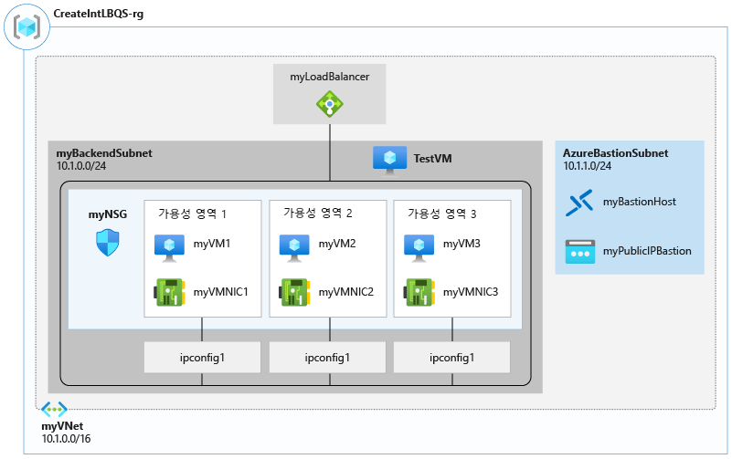
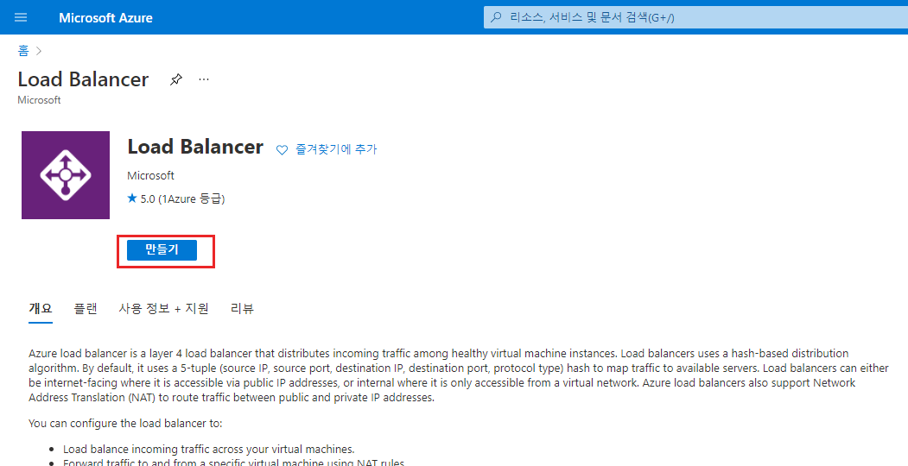

---
Exercise:
    title: 'M04-단원 4 Azure Load Balancer 만들기 및 구성'
    module: '모듈 - Azure에서 HTTP(S)를 사용하지 않는 트래픽 부하 분산'
---


# M04-단원 4 Azure Load Balancer 만들기 및 구성

이 연습에서는 가상의 조직인 Contoso Ltd.용 내부 부하 분산 장치를 만듭니다. 

내부 부하 분산 장치를 만드는 단계는 이 모듈에서 이미 확인한 공용 부하 분산 장치를 만드는 단계와 매우 비슷합니다. 그러나 이 두 단계에는 중요한 차이점이 있습니다. 공용 부하 분산 장치를 만들 때는 공용 IP 주소를 통해 프런트 엔드에 액세스하며 가상 네트워크 외부에 있는 호스트에서 연결을 테스트합니다. 반면 내부 부하 분산 장치를 만들 때는 가상 네트워크 내의 개인 IP 주소가 프런트 엔드로 사용되며 동일 네트워크 내의 호스트에서 연결을 테스트합니다.

이 연습에서 배포할 환경이 아래 다이어그램에 나와 있습니다.



 
이 연습에서는 다음을 수행합니다.

+ 작업 1: 가상 네트워크 만들기
+ 작업 2: 백 엔드 서버 만들기
+ 작업 3: 부하 분산 장치 만들기
+ 작업 4: 부하 분산 장치 리소스 만들기
+ 작업 5: 부하 분산 장치 테스트

## 작업 1: 가상 네트워크 만들기

이 섹션에서는 가상 네트워크와 서브넷을 만듭니다.
   
1. Azure Portal에 로그인합니다.

2. Azure Portal 홈 페이지에서 전역 검색 창으로 이동하여 **가상 네트워크**를 검색하고 서비스에서 가상 네트워크를 선택합니다.  

3. 가상 네트워크 페이지에서 **만들기**를 선택합니다.  

4. **기본 사항** 탭에서 다음 표의 정보를 사용하여 가상 네트워크를 만듭니다.

   | **설정**    | **값**                                  |
   | -------------- | ------------------------------------------ |
   | 구독   | 보유한 구독 선택                   |
   | 리소스 그룹 | **새로 만들기**를 선택합니다.  이름: **IntLB-RG** |
   | 이름           | **IntLB-VNet**                             |
   | 지역         | **(미국) 미국 동부**                           |


5. **다음: IP 주소**를 클릭합니다.

6. **IP 주소** 탭의 **IPv4 주소 공간** 상자에서 기본값을 제거하고 **10.1.0.0/16**을 입력합니다.

7. **IP 주소** 탭에서 **+서브넷 추가**를 선택합니다.

8. **서브넷 추가** 창에서 서브넷 이름으로는 **myBackendSubnet**을, 서브넷 주소 범위로는 **10.1.0.0/24**를 입력합니다.

9. **추가**를 클릭합니다.

10. **서브넷 추가**를 클릭하고 서브넷 이름으로는 **myFrontEndSubnet**을, 서브넷 주소 범위로는 **10.1.2.0/24**를 입력합니다. **추가**를 클릭합니다.

11. **다음: 보안**을 클릭합니다.

12. **BastionHost** 아래에서 **사용**을 선택하고 다음 표의 정보를 입력합니다.

    | **설정**                       | **값**                                     |
    | --------------------------------- | --------------------------------------------- |
    | Bastion 이름                      | **myBastionHost**                             |
    | AzureBastionSubnet 주소 공간 | **10.1.1.0/24**                               |
    | 공용 IP 주소                 | **새로 만들기** 선택  이름: **myBastionIP** |


13. **검토 + 만들기**를 클릭합니다.

14. **만들기**를 클릭합니다.

## 작업 2: 백 엔드 서버 만들기

이 섹션에서는 부하 분산 장치의 백 엔드 풀용으로 VM 3개를 만들어 같은 가용성 집합에 추가합니다. 그리고 백 엔드 풀에 VM을 추가한 다음 3개 VM에 IIS를 설치하여 부하 분산 장치를 테스트합니다.

1. Azure Portal에서 **Cloud Shell** 창 내의 **PowerShell** 세션을 엽니다.

2. Cloud Shell 창 도구 모음에서 파일 업로드/다운로드 아이콘을 선택하고 드롭다운 메뉴에서 업로드를 클릭합니다. 그런 다음 Cloud Shell 홈 디렉터리에 azuredeploy.json, azuredeploy.parameters.vm1.json, azuredeploy.parameters.vm2.json 및 azuredeploy.parameters.vm3.json 파일을 업로드합니다.

3. 다음 ARM 템플릿을 배포하여 이 연습에 필요한 가상 네트워크, 서브넷 및 VM을 만듭니다.

   ```powershell
   $RGName = "IntLB-RG"
   
   New-AzResourceGroupDeployment -ResourceGroupName $RGName -TemplateFile azuredeploy.json -TemplateParameterFile azuredeploy.parameters.vm1.json
   New-AzResourceGroupDeployment -ResourceGroupName $RGName -TemplateFile azuredeploy.json -TemplateParameterFile azuredeploy.parameters.vm2.json
   New-AzResourceGroupDeployment -ResourceGroupName $RGName -TemplateFile azuredeploy.json -TemplateParameterFile azuredeploy.parameters.vm3.json
   ```

## 작업 3: 부하 분산 장치 만들기

이 섹션에서는 내부 표준 SKU 부하 분산 장치를 만듭니다. 이 연습에서 기본 SKU 부하 분산 장치가 아닌 표준 SKU 부하 분산 장치를 만드는 이유는, 부하 분산 장치의 표준 SKU 버전이 필요한 이후 연습에서 사용하기 위해서입니다.

1. Azure Portal 홈 페이지에서 **리소스 만들기**를 클릭합니다.

2. 페이지 위쪽의 검색 상자에 **부하 분산 장치**를 입력하고 **Enter** 키를 누릅니다(**참고:** 목록에서 항목을 선택하지 마세요).

3. 결과 페이지에서 **부하 분산 장치**(이름 아래에 'Microsoft' 및 'Azure 서비스'가 표시된 항목)를 찾아서 선택합니다.

4. **만들기**를 클릭합니다.
   

5. **기본 사항** 탭에서 다음 표의 정보를 사용하여 부하 분산 장치를 만듭니다.

   | **설정**           | **값**                |
   | --------------------- | ------------------------ |
   | 구독          | 보유한 구독 선택 |
   | 리소스 그룹        | **IntLB-RG**             |
   | 이름                  | **myIntLoadBalancer**    |
   | 지역                | **(미국) 미국 동부**         |
   | 유형                  | **내부**             |
   | SKU                   | **표준**             |


6. **다음: 프런트 엔드 IP 구성**을 클릭합니다.
7. 프런트 엔드 IP 추가를 클릭합니다.
8. **프런트 엔드 IP 주소 추가** 블레이드에서 아래 표의 정보를 입력합니다.
 
   | **설정**     | **값**                |
   | --------------- | ------------------------ |
   | 이름            | **LoadBalancerFrontEnd** |
   | 가상 네트워크 | **IntLB-VNet**           |
   | 서브넷          | **myFrontEndSubnet**     |
   | 할당      | **동적**              |

9. **검토 + 만들기**를 클릭합니다.

10. **만들기**를 클릭합니다.

## 작업 4: 부하 분산 장치 리소스 만들기

이 섹션에서는 백 엔드 주소 풀용 부하 분산 장치 설정을 구성한 다음 상태 프로브와 부하 분산 장치 규칙을 만듭니다.

### 백 엔드 풀을 만들고, 백 엔드 풀에 VM을 추가합니다.

백 엔드 주소 풀에는 부하 분산 장치에 연결된 가상 NIC의 IP 주소가 포함됩니다.

1. Azure Portal 홈 페이지에서 **모든 리소스**를 클릭한 다음 리소스 목록에서 **myIntLoadBalancer**를 클릭합니다.

2. **설정** 아래에서 **백 엔드 풀**을 선택하고 **추가**를 클릭합니다.

3. **백 엔드 풀 추가** 페이지에서 다음 표의 정보를 입력합니다.

   | **설정**     | **값**            |
   | --------------- | -------------------- |
   | 이름            | **myBackendPool**    |
   | 가상 네트워크 | **IntLB-VNet**       |


4. **가상 머신** 아래에서 **추가**를 클릭합니다.

5. 3개 VM(**myVM1**, **myVM2**, **myVM3**)의 체크박스를 모두 선택하고 **추가**를 클릭합니다.

6. **추가**를 클릭합니다.
   
   

### 상태 프로브 만들기

부하 분산 장치는 상태 프로브를 사용하여 앱의 상태를 모니터링합니다. 상태 프로브는 상태 검사의 응답에 따라 부하 분산 장치에서 VM을 추가하거나 제거합니다. 여기서는 VM 상태를 모니터링하는 상태 프로브를 만듭니다.

1. **설정**에서 **상태 프로브**를 클릭한 다음, **추가**를 클릭합니다.

2. **상태 프로브 추가** 페이지에서 다음 표의 정보를 입력합니다.

   | **설정**         | **값**         |
   | ------------------- | ------------------ |
   | 이름                | **myHealthProbe** |
   | 프로토콜            | **HTTP**          |
   | 포트                | **80**            |
   | 경로                | **/**             |
   | 간격            | **15**            |
   | 비정상 임계값 | **2**             |


3. **추가**를 클릭합니다.
   

 

### 부하 분산 장치 규칙 만들기

부하 분산 장치 규칙은 트래픽이 VM에 분산되는 방식을 정의하는 데 사용됩니다. 들어오는 트래픽에 대한 프런트 엔드 IP 구성 및 트래픽을 받는 백 엔드 IP 풀을 정의합니다. 원본 및 대상 포트는 규칙에 정의됩니다. 여기서는 부하 분산 장치 규칙을 만듭니다.

1. 부하 분산 장치의 **백 엔드 풀** 페이지 **설정**아래에서 **부하 분산 장치 규칙**, **추가**를 차례로 클릭합니다.

2. **부하 분산 규칙 추가** 페이지에서 다음 표의 정보를 입력합니다.

   | **설정**            | **값**                |
   | ---------------------- | ------------------------ |
   | 이름                   | **myHTTPRule**           |
   | IP 버전             | **IPv4**                 |
   | 프런트 엔드 IP 주소    | **LoadBalancerFrontEnd** |
   | 프로토콜               | **TCP**                  |
   | 포트                   | **80**                   |
   | 백 엔드 포트           | **80**                   |
   | 백 엔드 풀           | **myBackendPool**        |
   | 상태 프로브           | **myHealthProbe**        |
   | 세션 지속성    | **없음**                 |
   | 유휴 시간 초과(분) | **15**                   |
   | 부동 IP            | **사용 안 함**             |


3. **추가**를 클릭합니다.
   

 


 

 

## 작업 5: 부하 분산 장치 테스트

이 섹션에서는 테스트 VM을 만든 다음 부하 분산 장치를 테스트합니다.

### 테스트 VM 만들기

1. Azure Portal 홈 페이지에서 **리소스 만들기**, **컴퓨팅**을 차례로 클릭하고 **가상 머신**을 선택합니다(페이지에 이 리소스 종류가 표시되지 않으면 페이지 위쪽의 검색 상자를 사용하여 웹앱을 검색한 다음 선택합니다).

2. **가상 머신 만들기** 페이지의 **기본 사항** 탭에서 다음 표의 정보를 사용하여 첫 번째 VM을 만듭니다.

   | **설정**          | **값**                                    |
   | -------------------- | -------------------------------------------- |
   | 구독         | 보유한 구독 선택                     |
   | 리소스 그룹       | **IntLB-RG**                                 |
   | 가상 머신 이름 | **myTestVM**                                 |
   | 지역               | **(미국) 미국 동부**                             |
   | 가용성 옵션 | **인프라 중복이 필요하지 않습니다.**    |
   | 이미지                | **Windows Server 2019 Datacenter - Gen 1**   |
   | 크기                 | **Standard_DS1_v2 - vCPU 1개, 3.5GiB 메모리** |
   | 사용자 이름             | **TestUser**                                 |
   | 암호             | **TestPa$$w0rd!**                            |
   | 암호 확인     | **TestPa$$w0rd!**                            |


3. **다음: 디스크**를 클릭하고 **다음: 네트워킹**을 클릭합니다. 

4. **네트워킹** 탭에서 다음 표의 정보를 사용하여 네트워킹 설정을 구성합니다.

   | **설정**                                                  | **값**                     |
   | ------------------------------------------------------------ | ----------------------------- |
   | 가상 네트워크                                              | **IntLB-VNet**                |
   | 서브넷                                                       | **myBackendSubnet**           |
   | 공용 IP                                                    | **없음**으로 변경            |
   | NIC 네트워크 보안 그룹                                   | **고급**                  |
   | 네트워크 보안 그룹 구성                             | 기존 **myNSG**를 선택합니다. |
   | 기존 부하 분산 솔루션 뒤에 이 가상 머신을 배치합니까? | **끄기**(선택 해제)로 설정합니다.           |


5. **검토 + 만들기**를 클릭합니다.

6. **만들기**를 클릭합니다.

7. 이 마지막 VM이 배포될 때까지 기다렸다가 다음 작업을 진행합니다.

### 테스트 VM에 연결하여 부하 분산 장치 테스트

1. Azure Portal 홈 페이지에서 **모든 리소스**를 클릭한 다음 리소스 목록에서 **myIntLoadBalancer**를 클릭합니다.

2. **개요** 페이지에서 **개인 IP 주소**를 적어 두거나 클립보드에 복사합니다. 참고: **개인 IP 주소** 필드를 표시하기 위해서는 **자세히 보기**를 선택해야 할 수도 있습니다.

3. **홈을** 클릭하고 Azure Portal 홈 페이지에서 **모든 리소스**를 클릭한 후에 방금 만든 **myTestVM** 가상 머신을 클릭합니다.

4. **개요** 페이지에서 **연결**을 선택한 다음 **Bastion**을 선택합니다.

5. **Bastion 사용**을 클릭합니다.

6. **사용자 이름** 상자에는 **TestUser**를, **암호** 상자에는 **TestPa$$w0rd!** 를 입력한 후에 **연결**을 클릭합니다.

7. 그러면 다른 브라우저 탭에서 **myTestVM** 창이 열립니다.

8. **네트워크** 창이 나타나면 **예**를 클릭합니다.

9. 작업 표시줄에서 **Internet Explorer** 아이콘을 클릭하여 웹 브라우저를 엽니다.

10. **Internet Explorer 11 설정** 대화 상자에서 **확인**을 클릭합니다.

11. 이전 단계에서 확인한 **개인 IP 주소**(예: 10.1.0.4)를 브라우저 주소 표시줄에 입력하고(또는 붙여넣고) Enter 키를 누릅니다.

12. IIS 웹 서버의 기본 웹 홈 페이지가 브라우저 창에 표시됩니다. 그리고 백 엔드 풀에 있는 가상 머신 3개 중 하나가 응답합니다.
    

13. 브라우저의 새로 고침 단추를 몇 번 클릭해 보면 내부 부하 분산 장치의 백 엔드 풀에 있는 여러 VM이 응답을 무작위로 전송함을 확인할 수 있습니다.
    

## 리소스 정리

   >**참고**: 더 이상 사용하지 않는 새로 만든 Azure 리소스를 제거해야 합니다. 사용하지 않는 리소스를 제거하면 예기치 않은 비용이 발생하지 않습니다.

1. Azure Portal에서 **Cloud Shell** 창 내의 **PowerShell** 세션을 엽니다.

1. 다음 명령을 실행하여 이 모듈의 전체 랩에서 만든 모든 리소스 그룹을 삭제합니다.

   ```powershell
   Remove-AzResourceGroup -Name 'IntLB-RG' -Force -AsJob
   ```

    >**참고**: 명령은 비동기적으로 실행되므로(-AsJob 매개 변수에 의해 결정됨) 이후부터는 동일한 PowerShell 세션 내에서 즉시 다른 PowerShell 명령을 실행할 수 있지만 리소스 그룹이 실제로 제거되기까지는 몇 분 정도 걸릴 것입니다.
