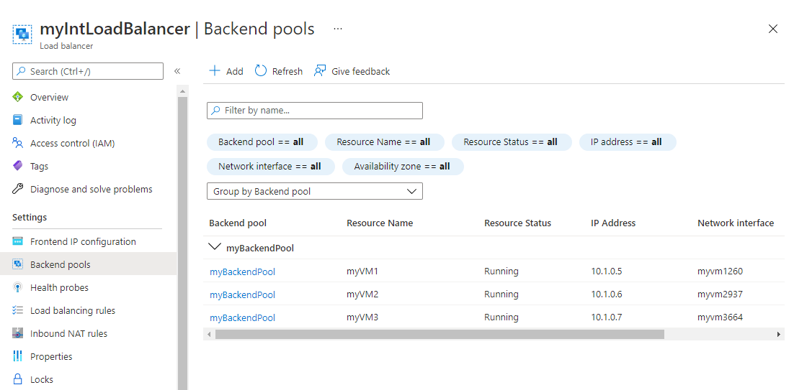

---
Exercise:
  title: M04 - 단원 4 Azure Load Balancer 만들기 및 구성
  module: Module 04 - Load balancing non-HTTP(S) traffic in Azure
---


# M04-단원 4 Azure Load Balancer 만들기 및 구성

이 연습에서는 가상의 Contoso Ltd 조직에 대한 내부 부하 분산 장치를 만듭니다.

**참고:** **[대화형 랩 시뮬레이션](https://mslabs.cloudguides.com/guides/AZ-700%20Lab%20Simulation%20-%20Create%20and%20configure%20an%20Azure%20load%20balancer)** 을 사용하여 이 랩을 원하는 속도로 클릭할 수 있습니다. 대화형 시뮬레이션과 호스트된 랩 간에 약간의 차이가 있을 수 있지만 보여주는 핵심 개념과 아이디어는 동일합니다.

### 예상 시간: 60분(배포 대기 시간 ~45분 포함)

내부 부하 분산 장치를 만드는 단계는 이 모듈에서 이미 배운 공용 부하 분산 장치를 만드는 과정과 매우 유사합니다. 주요 차이점은 공용 부하 분산 장치를 사용하면 공용 IP 주소를 통해 프런트 엔드에 액세스하고, 가상 네트워크 외부에 있는 호스트에서 연결을 테스트한다는 것입니다. 반면, 내부 부하 분산 장치를 사용하면 프런트 엔드가 가상 네트워크 내부에 있는 개인 IP 주소이며, 동일한 네트워크 내부에 있는 호스트에서 연결을 테스트합니다.


이 연습에서 다음을 수행합니다.

+ 작업 1: 가상 네트워크 만들기
+ 작업 2: 백 엔드 서버 만들기
+ 작업 3: 부하 분산 장치 만들기
+ 작업 4: 부하 분산 장치 리소스 만들기
+ 작업 5: 부하 분산 장치 테스트

## 작업 1: 가상 네트워크 만들기

이 섹션에서는 가상 네트워크와 서브넷을 만듭니다.

1. Azure 포털에 로그인합니다.

2. Azure Portal 홈페이지에서 전역 검색 표시줄로 이동하여 **가상 네트워크**를 검색하고 서비스 아래에서 가상 네트워크를 선택합니다.  

3. 가상 네트워크 페이지에서 **만들기**를 선택합니다.  

4. **기본** 탭에서 아래 표의 정보를 사용하여 가상 네트워크를 만듭니다.

   | **설정**    | **값**                                  |
   | -------------- | ------------------------------------------ |
   | Subscription   | 구독 선택                   |
   | Resource group | **새로 만들기** 선택  이름: **IntLB-RG** |
   | 속성           | **IntLB-VNet**                             |
   | 지역         | **(미국) 미국 동부**                           |

5. **다음 : IP 주소**를 선택합니다.

6. **IP 주소** 탭의 **IPv4 주소 공간** 상자에서 기본값을 제거하고 **10.1.0.0/16**을 입력합니다.

7. **IP 주소** 탭에서, select **+ 서브넷 추가**를 선택합니다.

8. **서브넷 추가** 창에 **myBackendSubnet**의 서브넷 이름과 **10.1.0.0/24** 서브넷 주소 범위를 입력합니다.

9. **추가**를 선택합니다.

10. **서브넷 추가**를 선택하고 서브넷 이름으로는 **myFrontEndSubnet**을, 서브넷 주소 범위로는 **10.1.2.0/24**를 입력합니다. **추가** 선택

11. **다음: 보안**을 선택합니다.

12. **BastionHost**에서 **사용**을 선택한 후 아래 표의 정보를 입력합니다.

    | **설정**                       | **값**                                     |
    | --------------------------------- | --------------------------------------------- |
    | Bastion 이름                      | **myBastionHost**                             |
    | AzureBastionSubnet 주소 공간 | **10.1.1.0/26**                               |
    | 공용 IP 주소                 | **새로 만들기** 선택  이름: **myBastionIP** |

13. **검토 + 만들기**를 선택합니다.

14. **만들기**를 선택합니다.

## 작업 2: 백 엔드 서버 만들기

이 섹션에서는 동일한 가용성 집합에 있는 VM을 세 개 만들고 부하 분산 장치의 백 엔드 풀에 VM을 백 엔드 풀에 추가한 다음, 세 VM에 IIS를 설치하여 부하 분산 장치를 테스트합니다.

1. Azure Portal의 **Cloud Shell** 창에서 **PowerShell** 세션을 엽니다.

 > **참고:** Cloud Shell을 처음 연 경우에는 스토리지 계정을 만들라는 메시지가 표시될 수 있습니다. **스토리지 만들기**를 선택합니다.

2. Cloud Shell 창의 도구 모음에서 파일 업로드/다운로드 아이콘을 선택하고 드롭다운 메뉴에서 업로드를 선택한 다음 **azuredeploy.json** 및 **azuredeploy.parameters.json** 파일을 Cloud Shell 홈 디렉터리에 차례대로 업로드합니다.

3. 다음 ARM 템플릿을 배포하여 이 연습에 필요한 VM을 만듭니다.

>**참고**: 관리 암호를 입력하라는 메시지가 표시됩니다.

   ```powershell
   $RGName = "IntLB-RG"
   
   New-AzResourceGroupDeployment -ResourceGroupName $RGName -TemplateFile azuredeploy.json -TemplateParameterFile azuredeploy.parameters.json
   ```

이러한 세 개의 VM을 만드는 데 5~10분이 걸릴 수 있습니다. 이 작업이 완료될 때까지 기다릴 필요가 없으며 이미 다음 작업을 계속할 수 있습니다.

## 작업 3: 부하 분산 장치 만들기

이 섹션에서는 내부 표준 SKU 부하 분산 장치를 만듭니다. 이 연습에서 기본 SKU 부하 분산 장치 대신 표준 SKU 부하 분산 장치를 만드는 이유는, 표준 SKU 버전의 부하 분산 장치가 필요한 이후 연습을 위한 것입니다.

1. Azure Portal 홈페이지에서 **리소스 만들기**를 선택합니다.

1. 페이지 맨 위에 있는 검색 상자에 **Load Balancer**를 입력한 다음 **Enter** 키를 누릅니다(**참고:** 목록에서 선택하지 않음).

1. 결과 페이지에서 **Load Balancer**(이름 아래에 ‘Microsoft’ 및 ‘Azure 서비스’라고 표시된 항목)를 찾아 선택합니다.

1. **만들기**를 실행합니다.

1. **기본** 탭에서 아래 표의 정보를 사용하여 부하 분산 장치를 만듭니다.

   | **설정**           | **값**                |
   | --------------------- | ------------------------ |
   | Subscription          | 구독 선택 |
   | Resource group        | **IntLB-RG**             |
   | 속성                  | **myIntLoadBalancer**    |
   | 지역                | **(미국) 미국 동부**         |
   | SKU                   | **표준**             |
   | 형식                  | **내부**             |
   | 서비스 계층                  | **Regional**             |

1. **다음: 프런트 엔드 IP 구성**.
1. 프런트 엔드 IP 추가 선택
1. **프런트 엔드 IP 주소 추가** 블레이드에서 아래 표의 정보를 입력하고 **추가**를 선택합니다.

   | **설정**     | **값**                |
   | --------------- | ------------------------ |
   | Name            | **LoadBalancerFrontEnd** |
   | 가상 네트워크 | **IntLB-VNet**           |
   | 서브넷          | **myFrontEndSubnet**     |
   | 할당      | **동적**              |

1. **검토 + 만들기**를 선택합니다.

1. **만들기**를 선택합니다.

## 작업 4: 부하 분산 장치 리소스 만들기

이 섹션에서는 백 엔드 주소에 대한 부하 분산 장치 설정을 구성하고, 상태 프로브와 부하 분산 장치 규칙을 지정합니다.

### 백 엔드 풀 만들기 및 백 엔드 풀에 VM 추가

백 엔드 주소 풀에는 부하 분산 장치에 연결된 가상 NIC의 IP 주소가 포함됩니다.

1. Azure Portal 홈페이지에서 **모든 리소스**를 선택한 다음 리소스 목록에서 **myIntLoadBalancer**를 선택합니다.

1. **설정**에서 **백 엔드 풀**을 선택한 다음, **추가**를 선택합니다.

1. **백 엔드 풀 추가** 페이지에 아래 표의 정보를 입력합니다.

   | **설정**     | **값**            |
   | --------------- | -------------------- |
   | 속성            | **myBackendPool**    |
   | 가상 네트워크 | **IntLB-VNet**       |

1. **Virtual Machines**에서 **추가**를 선택합니다.

1. VM 3개(**myVM1**, **myVM2**, **myVM3**) 모두에 확인란을 선택한 다음 **추가**를 선택합니다.

1. **저장**을 선택합니다.
   

### 상태 프로브 만들기

부하 분산 장치는 상태 프로브를 사용하여 앱의 상태를 모니터링합니다. 상태 프로브는 상태 검사의 응답에 따라 부하 분산 장치에서 VM을 추가하거나 제거합니다. 여기서는 VM 상태를 모니터링하는 상태 프로브를 만듭니다.

1. **설정**에서 **상태 프로브**를 선택한 다음, **추가**를 선택합니다.

1. **상태 프로브 추가** 페이지에서 아래 표의 정보를 입력합니다.

   | **설정**         | **값**         |
   | ------------------- | ----------------- |
   | 속성                | **myHealthProbe** |
   | 프로토콜            | **HTTP**          |
   | 포트                | **80**            |
   | 경로                | **/**             |
   | 간격            | **15**            |

1. **추가**를 선택합니다.
   

### 부하 분산 장치 규칙 만들기

부하 분산 장치 규칙은 VM으로 트래픽이 분산되는 방법을 정의하는 데 사용됩니다. 들어오는 트래픽에 대한 프런트 엔드 IP 구성 및 트래픽을 받는 백 엔드 IP 풀을 정의합니다. 원본 및 대상 포트는 규칙에 정의됩니다. 여기서는 부하 분산 장치 규칙을 만듭니다.

1. 
          **설정** 아래에서 **부하 분산 규칙**을 선택한 다음, **추가**를 선택합니다.

1. **부하 분산 규칙 추가** 페이지에 아래 표의 정보를 입력합니다.

   | **설정**            | **값**                |
   | ---------------------- | ------------------------ |
   | 속성                   | **myHTTPRule**           |
   | IP 버전             | **IPv4**                 |
   | 프런트 엔드 IP 주소    | **LoadBalancerFrontEnd** |
   | 백 엔드 풀           | **myBackendPool**        |
   | 프로토콜               | **TCP**                  |
   | 포트                   | **80**                   |
   | 백 엔드 포트           | **80**                   |
   | 상태 프로브           | **myHealthProbe**        |
   | 세션 지속성    | **없음**                 |
   | 유휴 제한 시간(분) | **15**                   |
   | 부동 IP            | **사용 안 함**             |

1. **저장**을 선택합니다.
   

## 작업 5: 부하 분산 장치 테스트

이 섹션에서는 테스트 VM을 만들어서 부하 분산 장치를 테스트합니다.

### 테스트 VM 만들기

1. Azure Portal 홈페이지에서 **리소스 만들기**, **가상**을 차례로 선택한 다음, **가상 머신**을 선택합니다. 이 리소스 종류가 페이지에 나열되지 않으면 페이지 맨 위에 있는 검색 상자를 사용하여 검색하고 선택합니다.

1. **가상 머신 만들기** 페이지의 **기본** 탭에서 아래 표의 정보를 사용하여 첫 번째 VM을 만듭니다.

   | **설정**          | **값**                                    |
   | -------------------- | -------------------------------------------- |
   | Subscription         | 구독 선택                     |
   | Resource group       | **IntLB-RG**                                 |
   | 가상 머신 이름 | **myTestVM**                                 |
   | 지역               | **(미국) 미국 동부**                             |
   | 가용성 옵션 | **인프라 중복 필요 없음**    |
   | 이미지                | **Windows Server 2019 Datacenter - Gen 2**   |
   | 크기                 | **Standard_DS2_v3 - 2 vcpu, 메모리 8GiB**   |
   | 사용자 이름             | **TestUser**                                 |
   | 암호             | **보안 암호 제공**                |
   | 암호 확인     | **보안 암호 제공**                |

1. **다음: 디스크**를 선택하고 **다음: 네트워킹**을 선택합니다.

1. **네트워킹** 탭에서 아래 표의 정보를 사용하여 네트워킹 설정을 구성합니다.

   | **설정**                                                  | **값**                     |
   | ------------------------------------------------------------ | ----------------------------- |
   | 가상 네트워크                                              | **IntLB-VNet**                |
   | 서브넷                                                       | **myBackendSubnet**           |
   | 공용 IP                                                    | **없음**으로 변경            |
   | NIC 네트워크 보안 그룹 추가                                   | **고급**                  |
   | 네트워크 보안 그룹 구성                             | 기존 **myNSG**를 선택합니다. |
   | 부하 분산 옵션                                       | **없음**                      |

1. **검토 + 만들기**를 선택합니다.

1. **만들기**를 선택합니다.

1. 다음 작업을 진행하기 전에 이 마지막 VM이 배포될 때까지 기다립니다.

### 테스트 VM에 연결하여 부하 분산 장치 테스트

1. Azure Portal 홈페이지에서 **모든 리소스**를 선택한 다음 리소스 목록에서 **myIntLoadBalancer**를 선택합니다.

1. **개요** 페이지에 있는 **개인 IP 주소**를 기록하거나 클립보드에 복사합니다. 참고: **개인 IP 주소** 필드를 보려면 **자세히 보기**를 선택해야 할 수 있습니다.

1. **홈**을 선택한 다음 Azure Portal 홈페이지에서 **모든 리소스**를 선택하고 방금 만든 **myTestVM** 가상 머신을 선택합니다.

1. **개요** 페이지에서 **연결**을 선택한 다음, **Bastion**을 선택합니다.

1. **Bastion 사용**을 선택합니다.

1. **사용자 이름** 상자에 **TestUser**를 입력하고, 만들었던 암호를 **암호** 상자에 입력한 다음 **연결**을 선택합니다. 팝업 차단기가 새 창을 차단하는 경우 팝업 차단기를 허용하고 다시 **연결**합니다.

1. **myTestVM** 창이 다른 브라우저 탭에서 열립니다.

1. **네트워크** 창이 나타나면 **예**를 선택합니다.

1. 작업 표시줄에서 **Internet Explorer** 아이콘을 선택하여 웹 브라우저를 엽니다.

1. **Internet Explorer 11 설정** 대화 상자에서 **확인**을 선택합니다.

1. 이전 단계에서 **개인 IP 주소**(예: 10.1.0.4)를 브라우저의 주소 표시줄에 입력하거나 붙여넣고 Enter 키를 누릅니다.

1. IIS 웹 서버의 기본 웹 홈페이지가 브라우저 창에 표시됩니다. 백 엔드 풀에 있는 세 가상 머신 중 하나가 응답합니다.
    

1. 브라우저에서 새로 고침 단추를 몇 번 선택하면 응답이 내부 부하 분산 장치의 백 엔드 풀에 있는 다른 VM에서 무작위로 표시됩니다.
    

## 리소스 정리

   >**참고**: 더 이상 사용하지 않는 새로 만든 Azure 리소스는 모두 제거하세요. 사용되지 않는 리소스를 제거하면 예기치 않은 요금이 발생하지 않습니다.

1. Azure Portal의 **Cloud Shell** 창에서 **PowerShell** 세션을 엽니다.

1. 다음 명령을 실행하여 이 모듈의 랩 전체에서 만든 모든 리소스 그룹을 삭제합니다.

   ```powershell
   Remove-AzResourceGroup -Name 'IntLB-RG' -Force -AsJob
   ```

    >**참고**: 이 명령은 -AsJob 매개 변수에 의해 결정되어 비동기로 실행되므로, 동일한 PowerShell 세션 내에서 이 명령을 실행한 직후 다른 PowerShell 명령을 실행할 수 있지만 리소스 그룹이 실제로 제거되기까지는 몇 분 정도 걸립니다.
