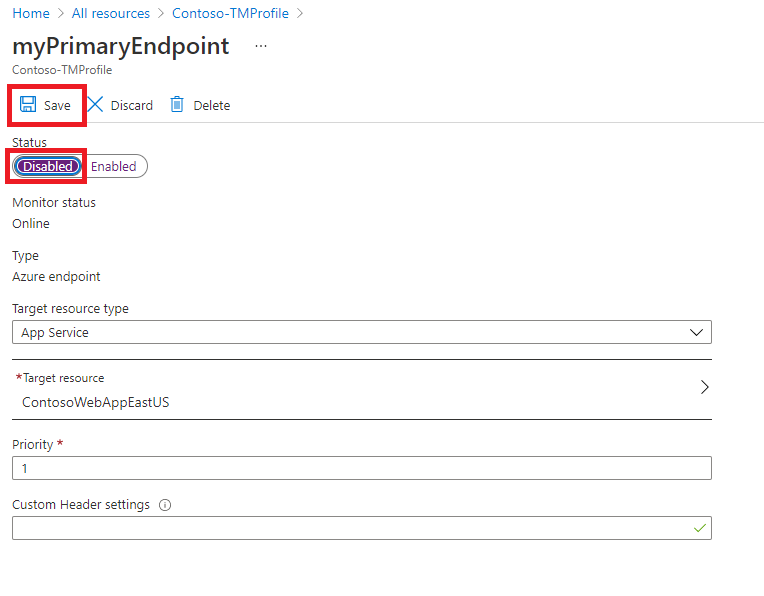

---
Exercise:
    title: 'M04-단원 6 Azure Portal을 사용하여 Traffic Manager 프로필 만들기'
    module: '모듈 - Azure에서 HTTP(S)를 사용하지 않는 트래픽 부하 분산'
---

# M04-단원 6 Azure Portal을 사용하여 Traffic Manager 프로필 만들기

이 연습에서는 가상 조직인 Contoso Ltd.의 웹 애플리케이션에 고가용성을 제공하는 데 사용할 Traffic Manager 프로필을 만듭니다. 

구체적으로는 서로 다른 두 지역(미국 동부 및 서유럽)에 배포된 웹 애플리케이션의 인스턴스 2개를 만듭니다. 미국 동부 지역은 Traffic Manager의 기본 엔드포인트로, 서유럽 지역은 장애 조치(failover) 엔드포인트로 사용됩니다.

그런 후에 엔드포인트 우선 순위에 따라 Traffic Manager 프로필을 만듭니다. 이 프로필은 웹 애플리케이션을 실행하는 기본 사이트로 사용자 트래픽을 보냅니다. Traffic Manager는 웹 애플리케이션을 지속적으로 모니터링하며 미국 동부의 기본 사이트를 사용할 수 없게 되면 서유럽의 백업 사이트로 자동 장애 조치(failover)하는 기능을 제공합니다.

이 연습에서 배포할 환경이 아래 다이어그램에 대략적으로 나와 있습니다.


 이 연습에서는 다음을 수행합니다.

+ 작업 1: 웹앱 만들기
+ 작업 2: Traffic Manager 프로필 만들기
+ 작업 3: Traffic Manager 엔드포인트 추가
+ 작업 4: Traffic Manager 프로필 테스트
+ 작업 5: 리소스 정리


## 작업 1: 웹앱 만들기

이 섹션에서는 서로 다른 Azure 지역에 배포된 웹 애플리케이션의 인스턴스 2개를 만듭니다.

1. Azure Portal 홈 페이지에서 **리소스 만들기**를 클릭하고 **웹앱**을 선택합니다(페이지에 이 리소스 종류가 표시되지 않으면 페이지 위쪽의 검색 상자를 사용하여 웹앱을 검색한 다음 선택합니다).

2. **웹앱 만들기** 페이지의 **기본 사항** 탭에서 다음 표의 정보를 사용하여 첫 번째 웹 애플리케이션을 만듭니다.

   | **설정**      | **값**                                                    |
   | ---------------- | ------------------------------------------------------------ |
   | 구독     | 보유한 구독 선택                                     |
   | 리소스 그룹   | **새로 만들기**를 선택합니다.  이름: **Contoso-RG-TM1**             |
   | 이름             | **ContosoWebAppEastUSxx**(여기서 xx는 이름을 고유하게 만드는 귀하의 이니셜) |
   | 게시          | **코드**                                                     |
   | 런타임 스택    | **ASP.NET V4.8**                                             |
   | 운영 체제 | **Windows**                                                  |
   | 지역           | **미국 동부**                                                  |
   | Windows 플랜     | **새로 만들기**를 선택합니다.  이름: **ContosoAppServicePlanEastUS** |
   | SKU 및 크기     | **Standard S1 총 ACU 100개, 1.75GB 메모리**               |


3. **다음: 배포(미리 보기)** 를 클릭하고 **다음: 모니터링**을 클릭합니다.

4. **모니터링** 탭의 **Application Insights 사용**에서 **아니요** 옵션을 선택합니다.

5. **검토 + 만들기**를 클릭합니다.

   

6. **만들기**를 클릭합니다. 웹앱이 성공적으로 배포되면, 그것은 기본 웹 사이트를 만듭니다.

7. 위의 1-6단계를 반복하여 두 번째 웹앱을 만듭니다. 아래 표의 정보를 제외하고는 첫 번째 웹앱과 같은 설정을 사용하면 됩니다. 

   | **설정**    | **값**                                                    |
   | -------------- | ------------------------------------------------------------ |
   | 리소스 그룹 | **새로 만들기**를 선택합니다.  이름: **Contoso-RG-TM2**             |
   | 이름           | **ContosoWebAppWestEuropexx**(여기서 xx는 이름을 고유하게 만드는 귀하의 이니셜)  |
   | 지역         | **서유럽**                                              |
   | Windows 플랜   | **새로 만들기**를 선택합니다.  이름: **ContosoAppServicePlanWestEurope** |


8. Azure 홈 페이지에서 **모든 서비스**를 클릭하고 왼쪽 탐색 메뉴에서 **웹**을 선택한 다음 **App Services**를 클릭합니다.

9. 그러면 새 웹앱 2개가 표시됩니다.

   

 

## 작업 2: Traffic Manager 프로필 만들기

이제 엔드포인트 우선 순위에 따라 사용자 트래픽을 보내는 Traffic Manager 프로필을 만듭니다.

1. Azure Portal 홈 페이지에서 **리소스 만들기**를 클릭합니다.

2. 페이지 위쪽의 검색 상자에 **Traffic Manager 프로필**을 입력하고 팝업 목록에서 Traffic Manager 프로필을 선택합니다.

   

3. **만들기**를 클릭합니다.

4. **Traffic Manager 프로필 만들기** 페이지에서 다음 표의 정보를 사용하여 Traffic Manager 프로필을 만듭니다.

   | **설정**             | **값**                |
   | ----------------------- | ------------------------ |
   | 이름                    | **Contoso-TMProfilexx**(여기서 xx는 이름을 고유하게 만드는 귀하의 이니셜) |
   | 라우팅 방법          | **우선 순위**             |
   | 구독            | 보유한 구독 선택 |
   | 리소스 그룹          | **Contoso-RG-TM1**       |
   | 리소스 그룹 위치 | **미국 동부**              |


5. **만들기**를 클릭합니다.

 

## 작업 3: Traffic Manager 엔드포인트 추가

이 섹션에서는 미국 동부에서 모든 사용자 트래픽을 라우팅할 기본 엔드포인트로 웹 사이트를 추가합니다. 그런 다음 서유럽에 웹 사이트를 장애 조치(failover) 엔드포인트로 추가합니다. 기본 엔드포인트를 사용할 수 없게 되면 트래픽이 장애 조치(failover) 엔드포인트로 자동 라우팅됩니다.

1. Azure Portal 홈 페이지에서 **모든 리소스**를 클릭한 다음 리소스 목록에서 **Contoso-TMProfile**을 클릭합니다.

2. **설정** 아래에서 **엔드포인트**를 선택하고 **추가**를 클릭합니다.

   

3. **엔드포인트 추가** 페이지에서 다음 표의 정보를 입력합니다.

   | **설정**          | **값**                         |
   | -------------------- | --------------------------------- |
   | 유형                 | **Azure 엔드포인트**                |
   | 이름                 | **myPrimaryEndpoint**             |
   | 대상 리소스 종류 | **App Service**                   |
   | 대상 리소스      | **ContosoWebAppEastUS(미국 동부)** |
   | 우선 순위             | **1**                             |


4. **추가**를 클릭합니다.

5. 위의 2-4단계를 반복하여 장애 조치(failover) 엔드포인트를 만듭니다. 아래 표의 정보를 제외하고는 첫 번째 웹앱과 같은 설정을 사용하면 됩니다. 

   | **설정**     | **값**                                 |
   | --------------- | ----------------------------------------- |
   | 이름            | **myFailoverEndpoint**                    |
   | 대상 리소스 | **ContosoWebAppWestEurope(서유럽)** |
   | 우선 순위        | **2**                                     |


6. 우선 순위를 2로 설정하면 구성된 기본 엔드포인트가 비정상 상태가 되는 경우 이 장애 조치(failover) 엔드포인트로 트래픽이 라우팅됩니다.

7. 새 엔드포인트 2개가 Traffic Manager 프로필에 표시됩니다. 몇 분 정도 지나면 **모니터링 상태**가 **온라인**으로 변경됩니다.

   

 

## 작업 4: Traffic Manager 프로필 테스트

이 섹션에서는 Traffic Manager 프로필의 DNS 이름을 확인한 다음 프라이빗 엔드포인트를 사용 불가 상태로 구성합니다. 그런 후에 웹앱을 계속 사용할 수 있는지를 확인하여 Traffic Manager 프로필이 장애 조치(failover) 엔드포인트로 트래픽을 정상 전송하고 있는지 테스트합니다.

1. **Contoso-TMProfile** 페이지에서 **개요**를 클릭합니다.

2. **개요** 화면에서 **DNS 이름** 항목을 클립보드에 복사합니다(DNS 이름을 적어 두어도 됨).

   

3. 웹 브라우저 탭을 열고 주소 표시줄에 **DNS 이름** 항목(contoso-tmprofile.trafficmanager.net)을 붙여넣은(또는 입력한) 다음 Enter 키를 누릅니다.

4. 웹앱의 기본 웹 사이트가 표시되어야 합니다.

   

5. 현재는 **우선 순위**가 **1**로 설정된 기본 엔드포인트로 모든 트래픽이 전송되고 있습니다.

6. 장애 조치(failover) 엔드포인트가 올바르게 작동하는지 테스트하려면 기본 사이트를 사용하지 않도록 설정해야 합니다.

7. **Contoso-TMProfile** 페이지의 개요 화면에서 **myPrimaryEndpoint**를 선택합니다.

8. **myPrimaryEndpoint** 페이지의 **상태** 아래에서 **사용 안 함**을 클릭하고 **저장**을 클릭합니다.

   

9. **myPrimaryEndpoint** 페이지를 닫습니다(페이지 오른쪽 위에서 **X** 클릭).

10. 이제 **Contoso-TMProfile** 페이지에서 **myPrimaryEndpoint**의 **상태 모니터**가 **사용 안 함**으로 표시됩니다.

11. 새 웹 브라우저 세션을 열고 주소 표시줄에 **DNS 이름** 항목(contoso-tmprofile.trafficmanager.net)을 붙여넣은(또는 입력한) 다음 Enter 키를 누릅니다.

12. 웹앱이 계속 응답하는지 확인합니다. 기본 엔드포인트가 사용할 수 없는 상태가 되었으므로 웹 사이트가 계속 작동하도록 트래픽이 장애 조치(failover) 엔드포인트로 라우팅되었습니다.

 
 ## 작업 5: 리소스 정리

   >**참고**: 더 이상 사용하지 않는 새로 만든 Azure 리소스를 제거해야 합니다. 사용하지 않는 리소스를 제거하면 예기치 않은 비용이 발생하지 않습니다.

1. Azure Portal에서 **Cloud Shell** 창 내의 **PowerShell** 세션을 엽니다.

1. 다음 명령을 실행하여 이 모듈의 전체 랩에서 만든 모든 리소스 그룹을 삭제합니다.

   ```powershell

   Remove-AzResourceGroup -Name 'Contoso-RG-TM1' -Force -AsJob

   ```

    >**참고**: 명령은 비동기적으로 실행되므로(-AsJob 매개 변수에 의해 결정됨) 동일한 PowerShell 세션 내에서 즉시 다른 PowerShell 명령을 실행할 수 있지만 리소스 그룹이 실제로 제거되기까지 몇 분 정도 걸릴 것입니다.
 

