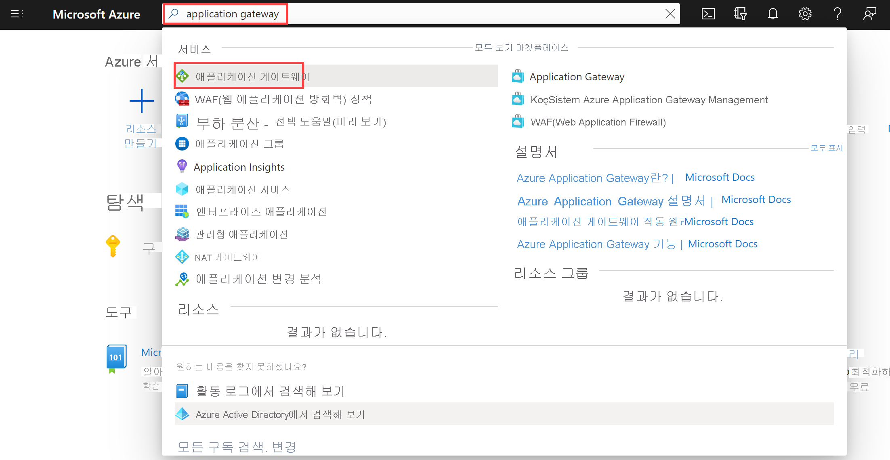
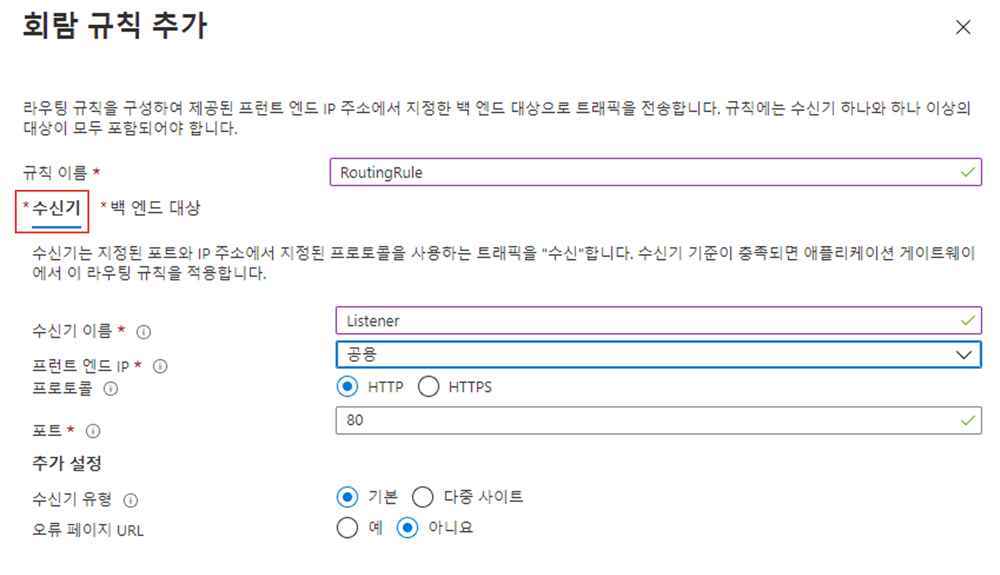
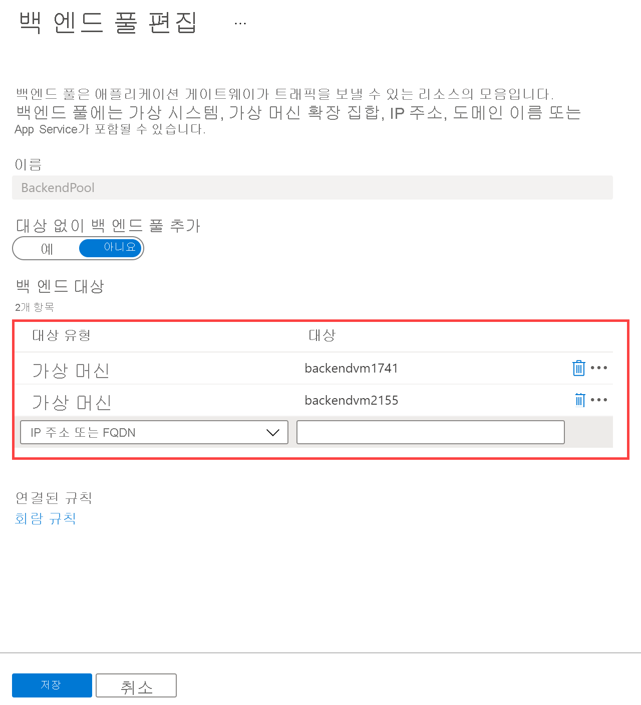
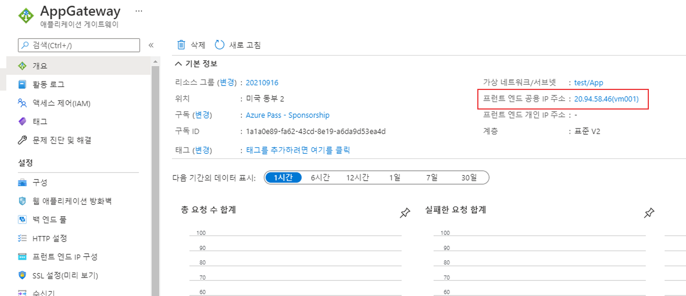

---
Exercise:
  title: M05 - 단원 4 Azure Application Gateway 배포
  module: Module 05 - Load balancing HTTP(S) traffic in Azure
---

# M05-단원 4 Azure Application Gateway 배포
 

이 연습에서는 Azure Portal을 사용하여 애플리케이션 게이트웨이를 만듭니다. 그런 다음, 테스트하여 제대로 작동하는지 확인합니다.


>**참고:** **[대화형 랩 시뮬레이션](https://mslabs.cloudguides.com/guides/AZ-700%20Lab%20Simulation%20-%20Deploy%20Azure%20Application%20Gateway)** 을 사용하여 이 랩을 원하는 속도로 클릭할 수 있습니다. 대화형 시뮬레이션과 호스트된 랩 간에 약간의 차이가 있을 수 있지만 보여주는 핵심 개념과 아이디어는 동일합니다.

#### 예상 소요 시간: 25분

애플리케이션 게이트웨이는 애플리케이션 웹 트래픽을 백 엔드 풀의 특정 리소스로 보냅니다. 수신기를 포트에 할당하고, 규칙을 만들고, 백 엔드 풀에 리소스를 추가합니다. 간단히 나타내기 위해 이 문서에서는 퍼블릭 프런트 엔드 IP 1개, 애플리케이션 게이트웨이에 단일 사이트를 호스트하는 기본 수신기 1개, 기본 요청 라우팅 규칙 1개 및 백 엔드 풀의 가상 머신 2개를 이용한 간단한 설정을 사용합니다.

Azure가 사용자가 만든 리소스 간에 통신하려면 가상 네트워크가 필요합니다. 새 가상 네트워크를 만들거나 기존 가상 네트워크를 선택할 수 있습니다. 이 예제에서는 애플리케이션 게이트웨이를 만들면서 새 가상 네트워크를 만듭니다. 별도의 서브넷으로 Application Gateway 인스턴스가 만들어집니다. 이 예제에서는 두 개의 서브넷을 만듭니다. 하나는 애플리케이션 게이트웨이용이고, 다른 하나는 백 엔드 서버용입니다.

이 연습에서 다음을 수행합니다.

+ 작업 1: 애플리케이션 게이트웨이 만들기
+ 작업 2: 가상 머신 만들기
+ 작업 3: 백 엔드 풀에 백 엔드 서버 추가
+ 작업 4: 애플리케이션 게이트웨이 테스트


## 작업 1: 애플리케이션 게이트웨이 만들기

1. Azure 계정을 사용하여 [Azure Portal](https://portal.azure.com/) 에 로그인합니다.

1. 아무 Azure Portal 페이지에서나 **리소스, 서비스 및 문서 검색(G+/)** 에 애플리케이션 게이트웨이를 입력하고 결과에서 **애플리케이션 게이트웨이**를 선택합니다.
        

1. 애플리케이션 게이트웨이 페이지에서 **+ 만들기**를 선택합니다.

1. 애플리케이션 게이트웨이 만들기 **기본 사항** 탭에서 다음 정보를 입력하거나 선택합니다.

   | **설정**         | **값**                                    |
   | ------------------- | -------------------------------------------- |
   | Subscription        | 구독을 선택합니다.                    |
   | Resource group      | 새 ContosoResourceGroup 만들기 선택       |
   | Application Gateway | ContosoAppGateway                            |
   | 지역              | **미국 동부**를 선택합니다.                           |
   | Virtual Network     | **새로 만들기**를 선택합니다.                        |

1. 가상 네트워크 만들기에서 다음 정보를 입력하거나 선택합니다.

   | **설정**       | **값**                          |
   | ----------------- | ---------------------------------- |
   | Name              | ContosoVNet                        |
   | **주소 공간** |                                    |
   | 주소 범위     | 10.0.0.0/16                        |
   | **서브넷**       |                                    |
   | 서브넷 이름       | **기본값**을 **AGSubnet**으로 변경합니다. |
   | 주소 범위     | 10.0.0.0/24                        |
   | 서브넷 이름       | BackendSubnet                      |
   | 주소 범위     | 10.0.1.0/24                        |


>**참고**: UI에 추가 서브넷을 추가하는 옵션이 없는 경우 단계를 완료하고 게이트웨이를 만든 후 백 엔드 서브넷을 추가합니다. 

1. **확인**을 선택하여 애플리케이션 게이트웨이 만들기의 기본 사항 탭으로 돌아갑니다.

1. 다른 설정은 기본값을 적용한 다음, **다음: 프런트 엔드**를 선택합니다.

1. **프런트 엔드** 탭에서 **프런트 엔드 IP 주소 형식**이 **퍼블릭**으로 설정되어 있는지 확인합니다.

1. **공용 IP 주소**에 대해 **새로 추가**를 선택하고 공용 IP 주소 이름으로 AGPublicIPAddress를 입력한 다음, **확인**을 선택합니다.

1. 완료되면 **다음: 백 엔드**를 선택합니다.

1. **백 엔드** 탭에서 **백 엔드 풀 추가**를 선택합니다.

1. **백 엔드 풀 추가** 창이 열리면 다음 값을 입력하여 빈 백 엔드 풀을 만듭니다.

    | **설정**                      | **값**   |
    | -------------------------------- | ----------- |
    | Name                             | BackendPool |
    | 대상 없이 백 엔드 풀 추가 | 예         |

1. **백 엔드 풀 추가** 창에서 **추가**를 선택하여 백 엔드 풀 구성을 저장하고 **백 엔드** 탭으로 돌아옵니다.

1. **백 엔드** 탭에서 **다음: 구성**을 선택합니다.

1. **구성** 탭에서 라우팅 규칙을 사용하여 만든 프런트 엔드 및 백 엔드 풀을 연결합니다.

1. **라우팅 규칙** 열에서 **라우팅 규칙 추가**를 선택합니다.

1. **규칙 이름** 상자에 **RoutingRule**을 입력합니다.

1. **수신기** 탭에서 다음 정보를 입력하거나 선택합니다.

    | **설정**   | **값**         |
    | ------------- | ----------------- |
    | 수신기 이름 | listener          |
    | 우선 순위      | **100**           |
    | 프런트 엔드 IP   | **공용 **을 선택합니다. |

1. **수신기** 탭의 다른 설정에 대해서는 기본값을 적용합니다.

    

1. **백 엔드 대상** 탭을 선택하여 나머지 라우팅 규칙을 구성합니다.

1. **백 엔드 대상** 탭에서 다음 정보를 입력하거나 선택합니다.

    | **설정**      | **값**      |
    | -------------    | -------------- |
    | 대상 형식      | 백 엔드 풀   |
    | 백 엔드 설정 | **새로 추가** |

1. **백 엔드 설정 추가**에서 다음 정보를 입력하거나 선택합니다.

    | **설정**          | **값**   |
    | ------------------   | ----------- |
    | 백 엔드 설정 이름 | HTTPSetting |
    | 백 엔드 포트         | 80          |

1. **백 엔드 설정 추가** 창에서 다른 설정에 대한 기본값을 적용한 다음, **추가**를 선택하여 **라우팅 규칙 추가**로 돌아갑니다.

1. **추가**를 선택하여 라우팅 규칙을 저장하고 **구성** 탭으로 돌아갑니다.

1. 완료되면 **다음: 태그**를 선택하고 **다음: 리뷰 + 만들기**를 클릭합니다.

1. **검토 + 만들기** 탭에서 설정을 검토합니다.

1. **만들기**를 선택하여 가상 네트워크, 공용 IP 주소 및 애플리케이션 게이트웨이를 만듭니다. 

Azure가 애플리케이션 게이트웨이를 만들 때까지 몇 분 정도 걸릴 수 있습니다. 배포가 성공적으로 완료될 때까지 기다렸다가 다음 섹션으로 이동합니다.

## 작업 2: 가상 머신 만들기

1. Azure Portal의 **Cloud Shell** 창에서 **PowerShell** 세션을 엽니다.
 > **참고:** Cloud Shell을 처음 연 경우에는 스토리지 계정을 만들라는 메시지가 표시될 수 있습니다. **스토리지 만들기**를 선택합니다.
1. Cloud Shell 창의 도구 모음에서 **파일 업로드/다운로드** 아이콘을 선택하고, 드롭다운 메뉴에서 **업로드**를 선택하고 **backend.json** 및 **backend.parameters.json** 파일을 소스 폴더 **F:\Allfiles\Exercises\M05**의 Cloud Shell 홈 디렉터리에 차례대로 업로드합니다.

1. 다음 ARM 템플릿을 배포하여 이 연습에 필요한 VM을 만듭니다.

>**참고**: 관리 암호를 입력하라는 메시지가 표시됩니다.

   ```powershell
   $RGName = "ContosoResourceGroup"
   
   New-AzResourceGroupDeployment -ResourceGroupName $RGName -TemplateFile backend.json -TemplateParameterFile backend.parameters.json
   ```
  
1. 배포가 완료되면 Azure Portal 홈페이지로 이동한 다음 **가상 머신**을 선택합니다.

1. 두 가상 머신이 모두 만들어졌는지 확인합니다.

## 작업 3: 백 엔드 풀에 백 엔드 서버 추가

1. Azure Portal 메뉴에서 **모든 리소스**를 선택하거나 모든 서비스를 검색하여 선택합니다. 그런 다음, **ContosoAppGateway**를 선택합니다.

1. **설정**에서 **백 엔드 풀**을 선택합니다.

1. **BackendPool**을 선택합니다.

1. 백 엔드 풀 편집 페이지의 **백 엔드 대상** 아래에 있는 **대상 유형**에서 **가상 머신**을 선택합니다.

1. **대상** 아래에서 **BackendVM1**을 선택합니다. 

1. **대상 유형**에서 **가상 머신**을 선택합니다.

1. **대상** 아래에서 **BackendVM2**를 선택합니다. 

   

1. **저장**을 선택합니다.

배포가 완료될 때까지 기다렸다가 다음 단계로 진행합니다.

## 작업 4: 애플리케이션 게이트웨이 테스트

애플리케이션 게이트웨이를 만들려면 반드시 IIS가 필요한 것은 아니지만, 이 연습에서는 Azure가 애플리케이션 게이트웨이를 성공적으로 만들었는지 확인하기 위해 설치했습니다.

### IIS를 사용하여 애플리케이션 게이트웨이 테스트:

1. **개요** 페이지에서 애플리케이션 게이트웨이에 대한 공용 IP 주소를 찾습니다. 

   

1. 공용 IP 주소를 복사한 다음, 브라우저의 주소 표시줄에 붙여 넣어 해당 IP 주소를 찾습니다.

1. 응답을 확인합니다. 응답이 유효하면 애플리케이션 게이트웨이가 성공적으로 만들어졌으며 백 엔드에 성공적으로 연결할 수 있다는 의미입니다.

   

1. 브라우저를 여러 번 새로 고치면 BackendVM1 및 BackendVM2에 대한 연결이 표시됩니다.

축하합니다! Azure Application Gateway를 구성하고 테스트했습니다.
