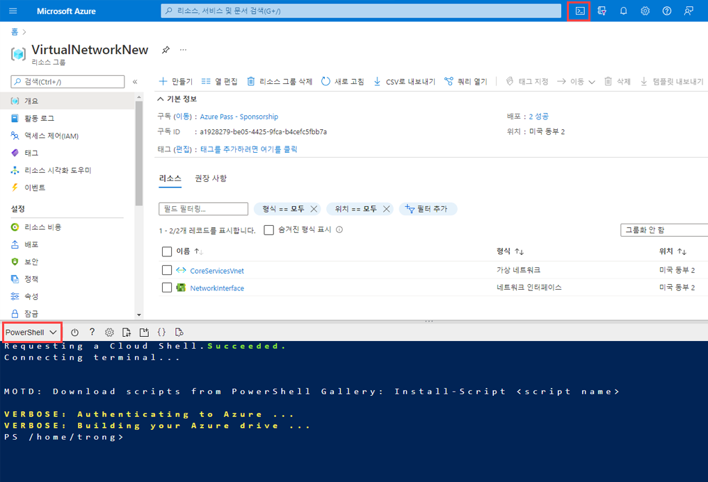

---
Exercise:
    title: 'M05-단원 4 Azure Application Gateway 배포'
    module: '모듈 - Azure에서 HTTP(S) 트래픽 부하 분산'
---

# M05-단원 4 Azure Application Gateway 배포
 

이 연습에서는 Azure Portal을 사용하여 애플리케이션 게이트웨이를 만듭니다. 그런 다음, 테스트하여 제대로 작동하는지 확인합니다.

애플리케이션 게이트웨이는 애플리케이션 웹 트래픽을 백 엔드 풀의 특정 리소스로 보냅니다. 수신기를 포트에 할당하고, 규칙을 만들고, 백 엔드 풀에 리소스를 추가합니다. 간단히 나타내기 위해 이 문서에서는 퍼블릭 프런트 엔드 IP 1개, 애플리케이션 게이트웨이에 단일 사이트를 호스트하는 기본 수신기 1개, 기본 요청 라우팅 규칙 1개 및 백 엔드 풀의 가상 머신 2개를 이용한 간단한 설정을 사용합니다.

Azure의 경우, 만든 리소스 사이에서 통신하기 위해서는 가상 네트워크가 필요합니다. 새 가상 네트워크를 만들거나 기존 그룹을 사용할 수 있습니다. 이 예제에서는 애플리케이션 게이트웨이를 만들면서 새 가상 네트워크를 만듭니다. Application Gateway 인스턴스는 별도의 서브넷에 만들어집니다. 이 예제에서는 서브넷 2개(애플리케이션 게이트웨이용 및 백 엔드 서버용)를 만듭니다.

이 연습에서는 다음을 수행합니다.

+ 작업 1: 애플리케이션 게이트웨이 만들기
+ 작업 2: 백 엔드 대상 추가
+ 작업 3: 백 엔드 풀에 백 엔드 서버 추가
+ 작업 4: 애플리케이션 게이트웨이 테스트


## 작업 1: 애플리케이션 게이트웨이 만들기

1. Azure 계정으로 [Azure Portal](https://portal.azure.com/)에 로그인합니다.

2. 아무 Azure Portal 페이지에서나 **리소스, 서비스 및 문서 검색(G+/)** 에 애플리케이션 게이트웨이를 입력하고 결과에서 **애플리케이션 게이트웨이**를 선택합니다.
        

3. 애플리케이션 게이트웨이 페이지에서 **+ 만들기**를 선택합니다.

4. 애플리케이션 게이트웨이 만들기 **기본 사항** 탭에서 다음 정보를 입력하거나 선택합니다.

   | **설정**         | **값**                                    |
   | ------------------- | -------------------------------------------- |
   | 구독        | 구독을 선택합니다.                    |
   | 리소스 그룹      | 새 ContosoResourceGroup 만들기를 선택합니다.       |
   | Application Gateway | ContosoAppGateway                            |
   | 지역              | **미국 동부**를 선택합니다.                           |
   | 가상 네트워크     | **새로 만들기**를 선택합니다.                        |

5. 가상 네트워크 만들기에서 다음 정보를 입력하거나 선택합니다.

   | **설정**       | **값**                          |
   | ------------------ | ---------------------------------- |
   | 이름              | ContosoVNet                        |
   | **주소 공간** |                                    |
   | 주소 범위     | 10.0.0.0/16                        |
   | **서브넷**       |                                    |
   | 서브넷 이름       | **기본값**을 **AGSubnet**으로 변경합니다. |
   | 주소 범위     | 10.0.0.0/24                        |
   | 서브넷 이름       | BackendSubnet                      |
   | 주소 범위     | 10.0.1.0/24                        |

6. **확인**을 선택하여 애플리케이션 게이트웨이 만들기 기본 사항 탭으로 돌아옵니다.

7. 다른 설정은 기본값을 적용하고 **다음: 프런트 엔드**를 선택합니다.

8. **프런트 엔드** 탭에서 **프런트 엔드 IP 주소 유형**이 **공용**으로 설정되어 있는지 확인합니다.

9. **공용 IP 주소**에서 **새로 추가**를 선택하고 공용 IP 주소 이름으로 AGPublicIPAddress를 입력한 후에 **확인**을 선택합니다.

10. **다음: 백 엔드**.를 선택합니다.

11. **백 엔드** 탭에서 **백 엔드 풀 추가**를 선택합니다.

12. **백 엔드 풀 추가** 창이 열리면 다음 값을 입력하여 빈 백 엔드 풀을 만듭니다.

    | **설정**                      | **값**   |
    | -------------------------------- | ----------- |
    | 이름                             | BackendPool |
    | 대상 없이 백 엔드 풀 추가 | 예         |

13. **백 엔드 풀 추가** 창에서 **추가**를 선택하여 백 엔드 풀 구성을 저장하고 **백 엔드** 탭으로 돌아옵니다.

14. **백 엔드** 탭에서 **다음: 구성**을 선택합니다.

15. **구성** 탭에서 라우팅 규칙을 사용하여 생성한 프런트 엔드 및 백 엔드 풀을 연결합니다.

16. **라우팅 규칙** 열에서 **라우팅 규칙 추가**를 선택합니다.

17. **규칙 이름** 상자에 **RoutingRule**을 입력합니다.

18. **수신기** 탭에서 다음 정보를 입력하거나 선택합니다.

    | **설정**   | **값**         |
    | ------------- | ------------------ |
    | 수신기 이름 | 수신기          |
    | 프런트 엔드 IP   | **공용**을 선택합니다. |

19. **수신기** 탭의 기타 설정에는 기본값을 적용합니다.

    

20. **백 엔드 대상** 탭을 선택하여 나머지 라우팅 규칙을 구성합니다.

21. **백 엔드 대상** 탭에서 다음 정보를 입력하거나 선택합니다.

    | **설정**   | **값**      |
    | ------------- | -------------- |
    | 대상 유형   | 백 엔드 풀   |
    | HTTP 설정 | **새로 만들기** |

22. **HTTP 설정 추가**에서 다음 정보를 입력하거나 선택합니다.

    | **설정**        | **값**   |
    | ------------------ | ----------- |
    | HTTP 설정 이름 | HTTPSetting |
    | 백 엔드 포트       | 80          |

23. **HTTP 설정 추가** 창에서 다른 설정에는 기본값을 적용하고 **추가**를 선택하여 **라우팅 규칙 추가**로 돌아옵니다.

24. **추가**를 선택하여 라우팅 규칙을 저장하고 **구성** 탭으로 돌아옵니다.

25. **다음: 태그**를 선택한 후 **다음: 검토 + 만들기**를 선택합니다.

26. **검토 + 만들기** 탭에서 설정을 검토합니다.

27. **만들기**를 선택하여 가상 네트워크, 공용 IP 주소 및 애플리케이션 게이트웨이를 만듭니다. 

Azure에서 애플리케이션 게이트웨이를 만드는 데 몇 분 정도 걸릴 수 있습니다. 배포가 성공적으로 완료될 때까지 기다렸다가 다음 섹션으로 이동합니다.

## 작업 2: 백 엔드 대상 추가

이 예제에서는 가상 머신을 대상 백 엔드로 사용합니다. 애플리케이션 게이트웨이에 대한 백 엔드 서버로 2개의 가상 머신을 만듭니다.

이 작업을 수행하려면 다음이 필요합니다.

- 백 엔드 서버로 사용할 새 VM 2개, BackendVM1과 BackendVM2를 만듭니다.

- 애플리케이션 게이트웨이가 성공적으로 만들어졌는지 확인하기 위해 가상 머신에 IIS를 설치합니다.

- 백 엔드 서버를 백 엔드 풀에 추가합니다.

### 가상 머신 만들기

1. 아무 Azure Portal 페이지에서나 **리소스, 서비스 및 문서 검색(G+/)** 에 가상 머신을 입력하고 결과에서 **가상 머신**을 선택합니다. 

2. 가상 머신 페이지에서 **+ 만들기** > **+ 가상 머신**을 선택합니다.

3. **가상 머신 만들기**에서 다음 정보를 입력하거나 선택합니다(아래에 나와 있지 않은 설정의 경우 기본값 사용).

   | **설정**          | **값**                                        |
   | -------------------- | ------------------------------------------------ |
   | **기본 사항** 탭       |                                                  |
   | 구독         | 구독을 선택합니다.                        |
   | 리소스 그룹       | ContosoResourceGroup을 선택합니다.                      |
   | 가상 머신 이름 | BackendVM1                                       |
   | 이미지                | **Windows Server 2022 Datacenter - Gen1**을 선택합니다.  |
   | 사용자 이름             | TestUser                                         |
   | 암호             | TestPa$$w0rd                                     |
   | 공용 인바운드 포트 | 없음                                             |
   | **네트워킹**       |                                                  |
   | 가상 네트워크      | ContosoVnet                                      |
   | 서브넷               | BackendSubnet(10.0.1.0/24)                      |
   | **관리**       |                                                  |
   | 부팅 진단     | 사용 안 함                                          |

4. 나머지는 기본값으로 두고 **검토 + 만들기**를 선택합니다.

5. **검토 + 만들기** 탭에서 설정을 검토하고 유효성 검사 오류가 있으면 해당 설정을 수정한 후에 **만들기**를 선택합니다.

가상 머신 만들기가 완료되기를 기다렸다가 계속합니다.

### 테스트를 위해 IIS 설치

이 예제에서는 가상 머신에 IIS를 설치하여 Azure에서 애플리케이션 게이트웨이가 정상적으로 작성되었는지 확인합니다.

1. Azure PowerShell을 엽니다.

2. Azure Portal의 위쪽 탐색 모음에서 **Cloud Shell**을 선택한 다음, 드롭다운 목록에서 **PowerShell**을 선택합니다.

   

3. 다음 명령을 실행하여 가상 머신에 IIS를 설치합니다. 필요한 경우 Location 매개 변수를 변경합니다.

```Azure PowerShell
Set-AzVMExtension `

 -ResourceGroupName ContosoResourceGroup `

 -ExtensionName IIS `

 -VMName BackendVM1 `

 -Publisher Microsoft.Compute `

 -ExtensionType CustomScriptExtension `

 -TypeHandlerVersion 1.4 `

 -SettingString '{"commandToExecute":"powershell Add-WindowsFeature Web-Server; powershell Add-Content -Path \"C:\\inetpub\\wwwroot\\Default.htm\" -Value $($env:computername)"}' `

 -Location EastUS
```

4. 앞에서 완료한 가상 머신 만들기 및 테스트용으로 IIS 설치 단계를 사용하여 두 번째 가상 머신을 만들고 IIS를 설치합니다. **Set-AzVMExtension** cmdlet의 **VMName** 설정과 가상 머신 이름으로는 BackendVM2를 사용합니다.

## 작업 3: 백 엔드 풀에 백 엔드 서버 추가

1. Azure Portal 메뉴에서 **모든 리소스**를 선택하거나 모든 서비스를 검색하여 선택합니다. 그런 다음 **ContosoAppGateway**를 선택합니다.

2. **설정** 아래에서 **백 엔드 풀**을 선택합니다.

3. **BackendPool**을 선택합니다.

4. 백 엔드 풀 편집 페이지의 **백 엔드 대상** 아래 **대상 유형**에서 **가상 머신**을 선택합니다.

5. **대상** 아래에서 **BackendVM1**을 선택합니다. 

6. **대상 유형**에서 **가상 머신**을 선택합니다.

7. **대상** 아래에서 **BackendVM2**을 선택합니다. 

   

8. **저장**을 선택합니다.

배포가 완료될 때까지 기다렸다가 다음 단계를 진행합니다.

## 작업 4: 애플리케이션 게이트웨이 테스트

애플리케이션 게이트웨이를 만들려면 반드시 IIS가 필요한 것은 아니지만, 이 연습에서는 Azure가 애플리케이션 게이트웨이를 성공적으로 만들었는지 확인하기 위해 설치했습니다.

### IIS를 사용하여 애플리케이션 게이트웨이 테스트:

1. **개요** 페이지에서 애플리케이션 게이트웨이의 공용 IP 주소를 찾습니다. 

   

2. 공용 IP 주소를 복사한 다음, 브라우저의 주소 표시줄에 붙여 넣어 해당 IP 주소를 찾습니다.

3. 응답을 확인합니다. 응답이 유효하면 애플리케이션 게이트웨이가 성공적으로 만들어졌으며 백 엔드에 성공적으로 연결할 수 있다는 의미입니다.

   

4. 브라우저를 여러 번 새로 고치면 BackendVM1 및 BackendVM2에 대한 연결이 표시됩니다.

축하합니다! Azure Application Gateway를 구성하고 테스트했습니다.
