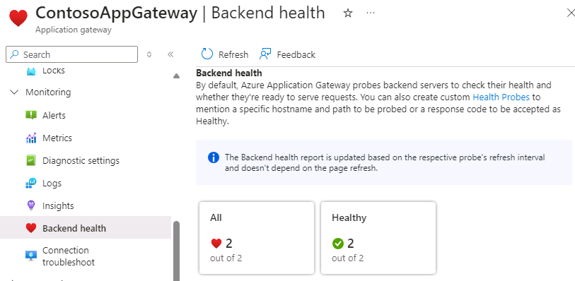

---
Exercise:
  title: M05 - 단원 4 Azure Application Gateway 배포
  module: Module 05 - Load balancing HTTP(S) traffic in Azure
---

# M05-단원 4 Azure Application Gateway 배포

## 연습 시나리오

이 연습에서는 Azure Portal을 사용하여 애플리케이션 게이트웨이를 만듭니다. 그런 다음, 테스트하여 제대로 작동하는지 확인합니다.


### 대화형 랩 시뮬레이션

>**참고**: 이전에 제공되었던 랩 시뮬레이션은 사용 중지되었습니다.

### 예상 소요 시간: 25분

애플리케이션 게이트웨이는 애플리케이션 웹 트래픽을 백 엔드 풀의 특정 리소스로 보냅니다. 수신기를 포트에 할당하고, 규칙을 만들고, 백 엔드 풀에 리소스를 추가합니다. 간단히 나타내기 위해 이 문서에서는 퍼블릭 프런트 엔드 IP 1개, 애플리케이션 게이트웨이에 단일 사이트를 호스트하는 기본 수신기 1개, 기본 요청 라우팅 규칙 1개 및 백 엔드 풀의 가상 머신 2개를 이용한 간단한 설정을 사용합니다.

Azure가 사용자가 만든 리소스 간에 통신하려면 가상 네트워크가 필요합니다. 새 가상 네트워크를 만들거나 기존 가상 네트워크를 선택할 수 있습니다. 이 예제에서는 애플리케이션 게이트웨이를 만들면서 새 가상 네트워크를 만듭니다. 별도의 서브넷으로 Application Gateway 인스턴스가 만들어집니다. 이 예제에서는 두 개의 서브넷을 만듭니다. 하나는 애플리케이션 게이트웨이용이고, 다른 하나는 백 엔드 서버용입니다.

### 작업 기술

이 연습에서 다음을 수행합니다.

+ 작업 1: 애플리케이션 게이트웨이 만들기
+ 작업 2: 가상 머신 만들기
+ 작업 3: 백 엔드 풀에 백 엔드 서버 추가
+ 작업 4: 애플리케이션 게이트웨이 테스트

## 작업 1: 애플리케이션 게이트웨이 만들기

1. Azure 계정을 사용하여 [Azure Portal](https://portal.azure.com/) 에 로그인합니다.

1. 아무 Azure Portal 페이지에서나 **리소스, 서비스 및 문서 검색(G+/)** 에 애플리케이션 게이트웨이를 입력하고 결과에서 **애플리케이션 게이트웨이**를 선택합니다.
    

1. 애플리케이션 게이트웨이 페이지에서 **+ 만들기**를 선택합니다.

1. 애플리케이션 게이트웨이 만들기 **기본 사항** 탭에서 다음 정보를 입력하거나 선택합니다.

   | **설정**         | **값**                                    |
   | ------------------- | -------------------------------------------- |
   | 구독        | 구독을 선택합니다.                    |
   | Resource group      | 새 ContosoResourceGroup 만들기 선택       |
   | Application Gateway | ContosoAppGateway                            |
   | 지역              | **미국 동부**를 선택합니다.                           |
   | Virtual Network     | **새로 만들기**를 선택합니다.                        |

1. 가상 네트워크 만들기에서 다음 정보를 입력하거나 선택합니다.

   | **설정**       | **값**                          |
   | ----------------- | ---------------------------------- |
   | Name              | ContosoVNet                        |
   | **주소 공간** |                                    |
   | 주소 범위     | 10.0.0.0/16                        |
   | **서브넷**       |                                    |
   | 서브넷 이름       | **기본값**을 **AGSubnet**으로 변경합니다. |
   | 주소 범위     | 10.0.0.0/24                        |


1. **확인**을 선택하여 애플리케이션 게이트웨이 만들기의 기본 사항 탭으로 돌아갑니다.

1. 다른 설정은 기본값을 적용한 다음, **다음: 프런트 엔드**를 선택합니다.

1. **프런트 엔드** 탭에서 **프런트 엔드 IP 주소 형식**이 **퍼블릭**으로 설정되어 있는지 확인합니다.

1. **공용 IP 주소**에 대해 **새로 추가**를 선택하고 공용 IP 주소 이름으로 AGPublicIPAddress를 입력한 다음, **확인**을 선택합니다.

1. 완료되면 **다음: 백 엔드**를 선택합니다.

1. **백 엔드** 탭에서 **백 엔드 풀 추가**를 선택합니다.

1. **백 엔드 풀 추가** 창이 열리면 다음 값을 입력하여 빈 백 엔드 풀을 만듭니다.

    | **설정**                      | **값**   |
    | -------------------------------- | ----------- |
    | Name                             | BackendPool |
    | 대상 없이 백 엔드 풀 추가 | 예         |

1. **백 엔드 풀 추가** 창에서 **추가**를 선택하여 백 엔드 풀 구성을 저장하고 **백 엔드** 탭으로 돌아옵니다.

1. **백 엔드** 탭에서 **다음: 구성**을 선택합니다.

1. **구성** 탭에서 라우팅 규칙을 사용하여 만든 프런트 엔드 및 백 엔드 풀을 연결합니다.

1. **라우팅 규칙** 열에서 **라우팅 규칙 추가**를 선택합니다.

1. **규칙 이름** 상자에 **RoutingRule**을 입력합니다.

1. **우선 순위**에 대해 **100**을 입력합니다. 

1. **수신기** 탭에서 다음 정보를 입력하거나 선택합니다.

    | **설정**   | **값**         |
    | ------------- | ----------------- |
    | 수신기 이름 | 수신기          |
    | 프런트 엔드 IP   | **공용 IPv4**를 선택합니다. |

1. **수신기** 탭의 다른 설정에 대해서는 기본값을 적용합니다.

    

1. **백 엔드 대상** 탭을 선택하여 나머지 라우팅 규칙을 구성합니다.

1. **백 엔드 대상** 탭에서 다음 정보를 입력하거나 선택합니다.

    | **설정**      | **값**      |
    | -------------    | -------------- |
    | 대상 형식      | 백 엔드 풀   |
    | 백 엔드 설정 | **새로 추가** |

1. **백 엔드 설정 추가**에서 다음 정보를 입력하거나 선택합니다.

    | **설정**          | **값**   |
    | ------------------   | ----------- |
    | 백 엔드 설정 이름 | HTTPSetting |
    | 백 엔드 포트         | 80          |

1. **백 엔드 설정 추가** 창에서 다른 설정에 대한 기본값을 적용한 다음, **추가**를 선택하여 **라우팅 규칙 추가**로 돌아갑니다.

1. **추가**를 선택하여 라우팅 규칙을 저장하고 **구성** 탭으로 돌아갑니다.

1. 완료되면 **다음: 태그**를 선택하고 **다음: 리뷰 + 만들기**를 클릭합니다.

1. **검토 + 만들기** 탭에서 설정을 검토합니다.

1. **만들기**를 선택하여 가상 네트워크, 공용 IP 주소 및 애플리케이션 게이트웨이를 만듭니다.

1. Azure가 애플리케이션 게이트웨이를 만들 때까지 몇 분 정도 걸릴 수 있습니다. 배포가 성공적으로 완료될 때까지 기다립니다.

### 백 엔드 서버용 서브넷

1. **ContosoVNet**을 검색하고 선택합니다. **AGSubnet **이 만들어졌는지 확인합니다. 

1. **BackendSubnet**을 생성하려면 **설정**을 선택한 다음 **서브넷**을 선택합니다. 완료되면 서브넷을 **추가**해야 합니다.
   
   | **설정**       | **값**                          |
   | ----------------- | ---------------------------------- |
   | 서브넷 이름       | BackendSubnet                      |
   | 주소 범위     | 10.0.1.0/24                        |

## 작업 2: 가상 머신 만들기

1. Azure Portal 오른쪽 상단에 있는 Cloud Shell 아이콘을 선택합니다. 필요한 경우 셸을 구성합니다.  
    + **PowerShell**을 선택합니다.
    + **스토리지 계정이 필요하지 않음**과 **구독**을 선택한 다음 **적용**을 선택합니다.
    + 터미널이 생성되고 프롬프트가 표시될 때까지 기다립니다.
      
1. Cloud Shell 창의 도구 모음에서 **파일 관리**를 선택한 다음 **업로드**를 선택합니다. 다음 **backend.json**, **backend.parameters.json**, **install-iis.ps1** 파일을 업로드합니다.

    >**참고:** 사용자 구독으로 작업하는 경우 [템플릿 파일](https://github.com/MicrosoftLearning/AZ-700-Designing-and-Implementing-Microsoft-Azure-Networking-Solutions/tree/master/Allfiles/Exercises)은 GitHub 랩 리포지토리에서 사용할 수 있습니다.

1. 다음 ARM 템플릿을 배포하여 이 연습에 필요한 VM을 만듭니다.

   >**참고**: 관리 암호를 입력하라는 메시지가 표시됩니다. 

   ```powershell
   $RGName = "ContosoResourceGroup"
   
   New-AzResourceGroupDeployment -ResourceGroupName $RGName -TemplateFile backend.json -TemplateParameterFile backend.parameters.json
   ```
   >**참고**: 시간을 내어 **backend.json** 파일을 검토합니다. 두 개의 가상 머신이 배포되고 있습니다. 이 작업은 몇 분 정도 걸립니다. 

1. 명령이 성공적으로 완료되고 **BackendVM1** 및 **BackendVM2**가 나열되어야 합니다.

### 각 가상 머신에 IIS 설치

1. 각 백엔드 서버에는 IIS가 설치되어 있어야 합니다.

1. PowerShell 프롬프트에서 계속 진행하여 제공된 스크립트를 사용하여 **BackendVM1**에 IIS를 설치합니다.

   ```powershell
   Invoke-AzVMRunCommand -ResourceGroupName 'ContosoResourceGroup' -Name 'BackendVM1' -CommandId 'RunPowerShellScript' -ScriptPath 'install-iis.ps1'
   ```

   >**참고**: 기다리는 동안 PowerShell 스크립트를 검토합니다. 가상 머신 이름을 제공하도록 IIS 홈 페이지가 사용자 지정되고 있음을 알 수 있습니다.

1. 이번에는 **BackendVM2**에 대해 명령을 다시 실행합니다.

   ```powershell
   Invoke-AzVMRunCommand -ResourceGroupName 'ContosoResourceGroup' -Name 'BackendVM2' -CommandId 'RunPowerShellScript' -ScriptPath 'install-iis.ps1'
   ```
   >**참고:** 각 명령을 완료하는 데 몇 분 정도 걸립니다.

## 작업 3: 백 엔드 풀에 백 엔드 서버 추가

1. Azure Portal 메뉴에서 **모든 리소스**를 선택하거나 모든 서비스를 검색하여 선택합니다. 그런 다음, **ContosoAppGateway**를 선택합니다.

1. **설정**에서 **백 엔드 풀**을 선택합니다.

1. **BackendPool**을 선택합니다.

1. 백 엔드 풀 편집 페이지의 **백 엔드 대상** 아래에 있는 **대상 유형**에서 **가상 머신**을 선택합니다.

1. **대상**에서 **BackendVM1-nic**을 선택합니다.

1. **대상 유형**에서 **가상 머신**을 선택합니다.

1. **대상**에서 **BackendVM2-nic**을 선택합니다.

   

1. **저장**을 선택하고 대상이 추가될 때까지 기다립니다. 

1. 백 엔드 서버가 정상 상태인지 확인합니다. **모니터링**을 선택한 다음 **백 엔드 상태**를 선택합니다. 두 대상 모두 정상이어야 합니다. 

   

## 작업 4: 애플리케이션 게이트웨이 테스트

애플리케이션 게이트웨이를 만들려면 반드시 IIS가 필요한 것은 아니지만, 이 연습에서는 Azure가 애플리케이션 게이트웨이를 성공적으로 만들었는지 확인하기 위해 설치했습니다.

### IIS를 사용하여 애플리케이션 게이트웨이 테스트

1. **개요** 페이지에서 애플리케이션 게이트웨이에 대한 공용 IP 주소를 찾습니다.

   

1. 공용 IP 주소를 복사한 다음, 브라우저의 주소 표시줄에 붙여 넣어 해당 IP 주소를 찾습니다.

1. 응답을 확인합니다. 응답이 유효하면 애플리케이션 게이트웨이가 성공적으로 만들어졌으며 백 엔드에 성공적으로 연결할 수 있다는 의미입니다.

   

1. 브라우저를 여러 번 새로 고치면 BackendVM1 및 BackendVM2에 대한 연결이 표시됩니다.

## 리소스 정리

   >**참고**: 더 이상 사용하지 않는 새로 만든 Azure 리소스는 모두 제거하세요. 사용되지 않는 리소스를 제거하면 예기치 않은 요금이 발생하지 않습니다.

1. Azure Portal의 **Cloud Shell** 창에서 **PowerShell** 세션을 엽니다.

1. 다음 명령을 실행하여 이 모듈의 랩 전체에서 만든 모든 리소스 그룹을 삭제합니다.

   ```powershell
   Remove-AzResourceGroup -Name 'IntLB-RG' -Force -AsJob
   ```

>**참고**: 이 명령은 -AsJob 매개 변수에 의해 결정되어 비동기로 실행되므로, 동일한 PowerShell 세션 내에서 이 명령을 실행한 직후 다른 PowerShell 명령을 실행할 수 있지만 리소스 그룹이 실제로 제거되기까지는 몇 분 정도 걸립니다.

## Copilot을 사용하여 학습 확장

Copilot은 Azure 스크립팅 도구를 사용하는 방법을 익히는 데 도움을 줍니다. 또한 Copilot은 랩에서 다루지 않는 영역이나 추가 정보가 필요한 영역을 지원할 수 있습니다. Edge 브라우저를 열고 Copilot(오른쪽 위)을 선택하거나 *copilot.microsoft.com*으로 이동하세요. 몇 분 정도 시간을 내어 이러한 프롬프트를 사용해 보세요.
+ Azure Application Gateway는 요청을 어떻게 라우팅하나요?
+ Azure Application Gateway에는 어떤 보안 기능이 포함되어 있나요?
+ Azure Application Gateway와 Azure Load Balancer를 비교합니다. 각 제품의 사용 시기를 예로 들어 설명합니다.


## 자기 주도적 학습을 통해 자세히 알아보기

+ [Azure Application Gateway 소개](https://learn.microsoft.com/training/modules/intro-to-azure-application-gateway/) 이 모듈에서는 Azure Application Gateway가 수행하는 작업, 작동 방식, 조직의 요구 사항을 충족하기 위해 Application Gateway를 솔루션으로 사용해야 하는 경우를 설명합니다.
+ [Application Gateway를 사용하여 웹 서비스 트래픽 부하를 분산합니다](https://learn.microsoft.com/training/modules/load-balancing-https-traffic-azure/). 이 모듈에서는 URL 경로 기반 라우팅이 있는 애플리케이션 게이트웨이를 만들고 구성하는 방법에 대해 알아봅니다.
+ [Azure에서 HTTP(S) 트래픽의 부하를 분산합니다](https://learn.microsoft.com/training/modules/load-balancing-https-traffic-azure/). 이 모듈에서는 Azure Application Gateway를 설계하고 구현하는 방법을 알아봅니다.

## 핵심 내용

축하합니다. 랩을 완료했습니다. 이 랩의 주요 내용은 다음과 같습니다. 
+ Azure Application Gateway는 웹 애플리케이션에 대한 트래픽을 관리할 수 있는 웹 트래픽(OSI 계층 7) 부하 분산 장치입니다.
+ Application Gateway는 URI 경로 또는 호스트 헤더와 같은 HTTP 요청의 추가 특성을 기반으로 라우팅 결정을 내릴 수 있습니다.
+ 단일 지역에서 호스팅되는 애플리케이션과 URL 기반 라우팅이 필요한 경우 애플리케이션 게이트웨이를 사용합니다. 
