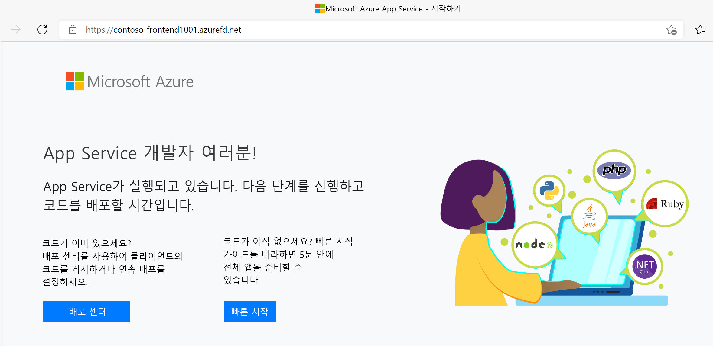
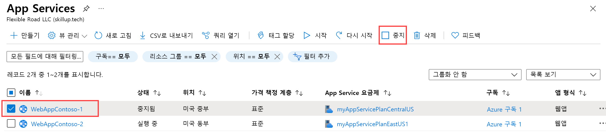
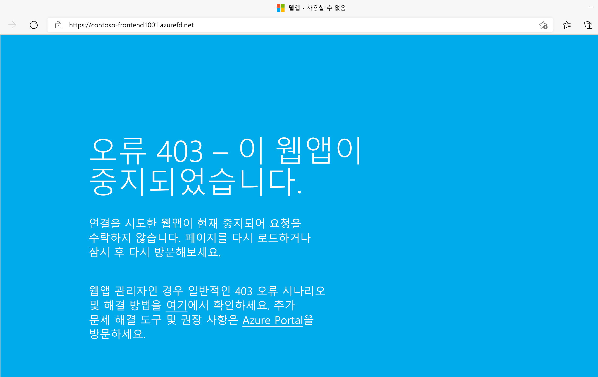

---
Exercise:
  title: M05 - 단원 6 Azure Portal을 사용하여 고가용성 웹 애플리케이션용 Front Door 만들기
  module: Module 05 - Load balancing HTTP(S) traffic in Azure
---


# M05-단원 6 Azure Portal을 사용하여 고가용성 웹 애플리케이션용 Front Door 만들기

## 연습 시나리오  

이 연습에서는 여러 다른 Azure 지역에서 실행되는 웹 애플리케이션의 두 인스턴스를 풀링하는 Azure Front Door 구성을 설정합니다. 이 구성은 애플리케이션을 실행하는 가장 가까운 사이트로 트래픽을 보냅니다. Azure Front Door는 웹 애플리케이션을 지속적으로 모니터링합니다. 가장 가까운 사이트를 사용할 수 없는 경우 사용 가능한 다음 사이트에 대한 자동 장애 조치(failover)를 진행합니다. 네트워크 구성은 다음 다이어그램에 표시됩니다.


이 연습에서 다음을 수행합니다.

+ 작업 1: 웹앱의 두 인스턴스 만들기
+ 작업 2: 애플리케이션에 대한 Front Door 만들기
+ 작업 3: 작동 중인 Azure Front Door 보기
+ 작업 4: 리소스 정리

**참고:** **[대화형 랩 시뮬레이션](https://mslabs.cloudguides.com/guides/AZ-700%20Lab%20Simulation%20-%20Create%20a%20Front%20Door%20profile%20for%20a%20highly%20available%20web%20application)** 을 사용하여 이 랩을 원하는 속도로 클릭할 수 있습니다. 대화형 시뮬레이션과 호스트된 랩 간에 약간의 차이가 있을 수 있지만 보여주는 핵심 개념과 아이디어는 동일합니다.

### 예상 소요 시간: 30분

## 작업 1: 웹앱의 두 인스턴스 만들기

이 연습에서는 서로 다른 Azure 지역에서 실행되는 웹 애플리케이션의 두 인스턴스가 필요합니다. 두 웹 애플리케이션 인스턴스는 모두 활성/활성 모드로 실행되므로 두 인스턴스 중 하나에서 트래픽을 수행할 수 있습니다. 이 구성은 장애 조치(failover)로 작동하는 활성/대기 구성과 다릅니다.

1. [https://portal.azure.com](https://portal.azure.com/) 에서 Azure Portal에 로그인합니다.

1. Azure 홈페이지에서 전역 검색을 사용하여 **WebApp**을 입력하고, 서비스에서 **App Services**를 선택합니다.

1. **+ 만들기**를 선택해 웹앱을 만듭니다.

1. 웹앱 만들기 페이지의 **기본 사항** 탭에서 다음 정보를 입력하거나 선택합니다.

   | **설정**      | **값**                                                    |
   | ---------------- | ------------------------------------------------------------ |
   | Subscription     | 구독을 선택합니다.                                    |
   | Resource group   | 리소스 그룹 ContosoResourceGroup을 선택합니다.               |
   | 이름             | 웹앱에 대한 고유한 이름을 입력합니다. 이 예에서는 WebAppContoso-1을 사용합니다. |
   | 게시          | **코드**를 선택합니다.                                             |
   | 런타임 스택    | **.NET 6(LTS)** 를 선택합니다.                                     |
   | 운영 체제 | **Windows**를 선택합니다.                                          |
   | 지역           | **미국 중부**를 선택합니다.                                       |
   | Windows 플랜     | **새로 만들기**를 선택하고 텍스트 상자에 myAppServicePlanCentralUS를 입력합니다. |
   | 가격 계획    | **Standard S1 100 총 ACU, 1.75GB 메모리**를 선택합니다.        |

1. **검토 + 만들기**를 선택하고, 요약을 검토한 다음, **만들기**를 선택합니다.
   배포가 완료되는 데 몇 분 정도 걸릴 수 있습니다.

1. 두 번째 웹앱을 만듭니다. Azure Portal 홈페이지에서 **WebApp**을 검색합니다.

1. **+ 만들기**를 선택해 웹앱을 만듭니다.

1. 웹앱 만들기 페이지의 **기본 사항** 탭에서 다음 정보를 입력하거나 선택합니다.

   | **설정**      | **값**                                                    |
   | ---------------- | ------------------------------------------------------------ |
   | Subscription     | 구독을 선택합니다.                                    |
   | Resource group   | 리소스 그룹 ContosoResourceGroup을 선택합니다.               |
   | 이름             | 웹앱에 대한 고유한 이름을 입력합니다. 이 예제에서는 WebAppContoso-2를 사용합니다. |
   | 게시          | **코드**를 선택합니다.                                             |
   | 런타임 스택    | **.NET 6(LTS)** 를 선택합니다.                                     |
   | 운영 체제 | **Windows**를 선택합니다.                                          |
   | 지역           | **미국 동부**를 선택합니다.                                          |
   | Windows 플랜     | **새로 만들기**를 선택하고, 텍스트 상자에서 myAppServicePlanEastUS를 입력합니다. |
   | 요금제     | **Standard S1 100 총 ACU, 1.75GB 메모리**를 선택합니다.        |

1. **검토 + 만들기**를 선택하고, 요약을 검토한 다음, **만들기**를 선택합니다.
   배포가 완료되는 데 몇 분 정도 걸릴 수 있습니다.

## 작업 2: 애플리케이션에 대한 Front Door 만들기

두 웹앱 서버 간의 가장 짧은 대기 시간을 기준으로 사용자 트래픽을 보내도록 Azure Front Door를 구성합니다. 시작하려면 Azure Front Door에 대한 프런트 엔드 호스트를 추가합니다.

1. Azure Portal 페이지의 **검색 리소스, 서비스 및 문서(G+/)** 에서 Front Door 및 CDN 프로필을 검색한 다음, **Front Door 및 CDN 프로필**을 선택합니다.

1. **Front Door 및 CDN 프로필 만들기**를 선택합니다. 제품 비교 페이지에서 **빠른 만들기**를 선택합니다. 그런 다음, **계속 Front Door 만들기**를 선택합니다.

1. 기본 사항 탭에서 다음 정보를 입력하거나 선택합니다.

   | **설정**             | **값**                                    |
   | ----------------------- | -------------------------------------------- |
   | Subscription            | 구독을 선택합니다.                    |
   | Resource group          | ContosoResourceGroup 선택                  |
   | 리소스 그룹 위치 | 기본 설정 적용                       |
   | 이름                    | FrontDoor(yourinitials)와 같은 고유한 이름을 이 구독에 입력합니다.   |
   | 서비스 계층                    | Standard   |
   | 엔드포인트 이름           | FDendpoint   |
   | 원본 형식             | App Service|
   | 원본 호스트 이름        | 이전에 배포한 웹앱의 이름 |

1. **검토 및 만들기**를 선택한 후 **만들기**를 선택합니다.

1. 리소스가 배포될 때까지 기다린 다음, **리소스로 이동**을 선택합니다.
1. 개요 블레이드의 Front Door 리소스에서 **원본 그룹**을 찾은 후 만든 원본 그룹을 선택합니다.
1. 원본 그룹을 업데이트하려면 목록에서 **default-origin-group** 이름을 선택합니다. **원본 추가**를 선택하고 두 번째 웹앱을 추가합니다. 추가를 선택한 다음, 업데이트를 선택합니다.

## 작업 3: 작동 중인 Azure Front Door 보기

Front Door를 만들면 구성이 전역적으로 배포되는 데 몇 분 정도 걸립니다. 완료되면 생성한 프런트 엔드 호스트에 액세스합니다.

1. 개요 블레이드의 Front Door 리소스에서 엔드포인트에 대해 만들어진 엔드포인트 호스트 이름을 찾습니다. fdendpoint 뒤에 하이픈과 임의 문자열이 와야 합니다. 예: **fdendpoint-fxa8c8hddhhgcrb9.z01.azurefd.net**. 이 FQDN을 **복사**합니다.

1. 새 브라우저 탭에서 Front Door 엔드포인트 FQDN으로 이동합니다. 기본 App Service 페이지가 표시됩니다.
   

1. 즉각적인 글로벌 장애 조치가 작동 중인지 테스트하려면 다음 단계를 수행합니다.

1. Azure Portal로 전환하고 **App Service**를 검색하여 선택합니다.

1. 웹앱 중 하나를 선택한 다음, **중지**를 선택한 다음, **예**를 선택하여 확인합니다.

   

1. 브라우저로 다시 전환하고 새로 고침을 선택합니다. 동일한 정보 페이지가 표시됩니다.

**웹앱이 중지되는 동안 지연이 발생할 수 있습니다. 브라우저에서 오류 페이지가 표시되면 페이지를 새로 고칩니다.**

1. Azure Portal로 다시 전환한 후 다른 웹앱을 찾아서 중지합니다.

1. 브라우저로 다시 전환하고 새로 고침을 선택합니다. 이번에는 오류 메시지가 표시됩니다.

   

   축하합니다! Azure Front Door를 구성하고 테스트했습니다.

## 작업 4: 리소스 정리

   >**참고**: 더 이상 사용하지 않는 새로 만든 Azure 리소스는 모두 제거하세요. 사용되지 않는 리소스를 제거하면 예기치 않은 요금이 발생하지 않습니다.

1. Azure Portal의 **Cloud Shell** 창에서 **PowerShell** 세션을 엽니다.

1. 다음 명령을 실행하여 이 모듈의 랩 전체에서 만든 모든 리소스 그룹을 삭제합니다.

   ```powershell

   Remove-AzResourceGroup -Name 'ContosoResourceGroup' -Force -AsJob

   ```

    >**참고**: 이 명령은 -AsJob 매개 변수에 의해 결정되어 비동기로 실행되므로, 동일한 PowerShell 세션 내에서 이 명령을 실행한 직후 다른 PowerShell 명령을 실행할 수 있지만 리소스 그룹이 실제로 제거되기까지는 몇 분 정도 걸립니다.
