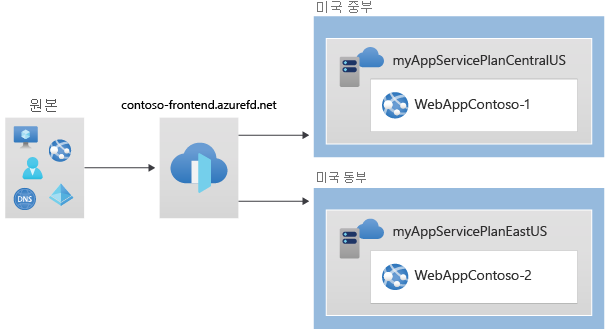
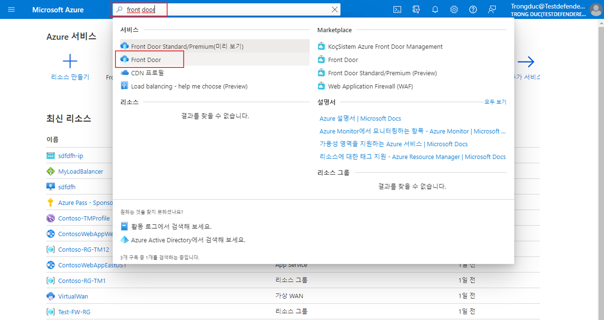
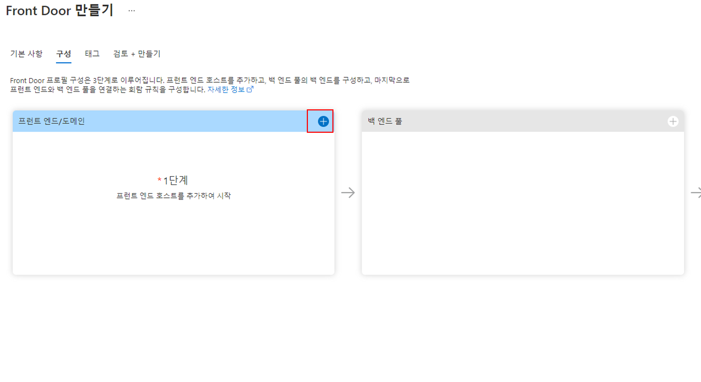
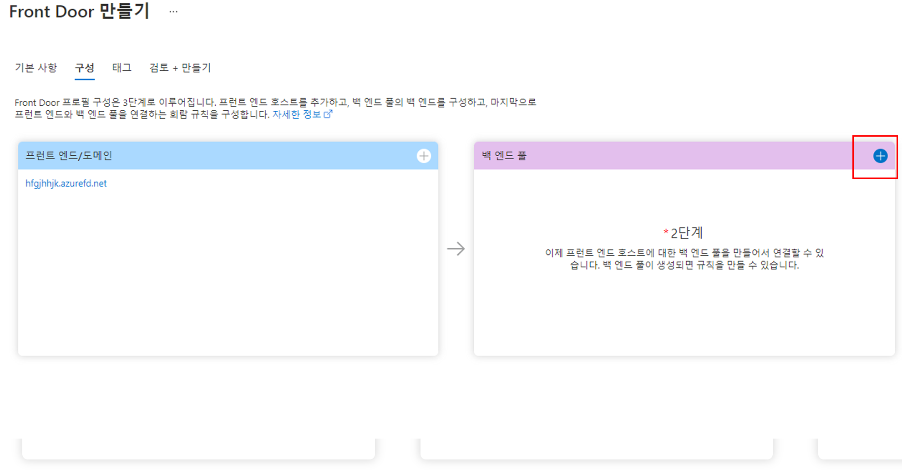
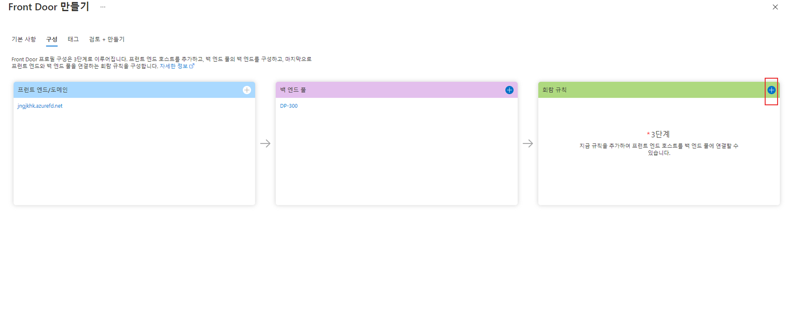
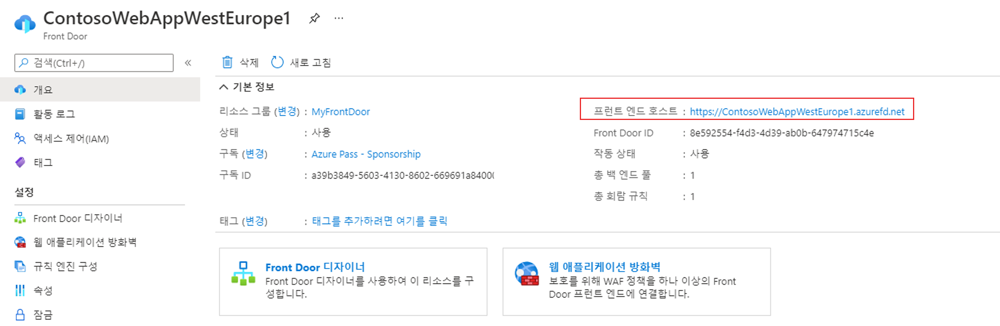

---
Exercise:
  title: M05-단원 6 Azure Portal을 사용하여 고가용성 웹 애플리케이션용 Front Door 만들기
  module: Module - Load balancing HTTP(S) traffic in Azure
ms.openlocfilehash: 78a6ba6417aa6c43e2e613af8c20c5d76c4749c0
ms.sourcegitcommit: 3aeb76a0ac28b33b6edc61365b303f5b0252a3c2
ms.translationtype: HT
ms.contentlocale: ko-KR
ms.lasthandoff: 01/30/2022
ms.locfileid: "137860537"
---
# <a name="m05-unit-6-create-a-front-door-for-a-highly-available-web-application-using-the-azure-portal"></a>M05-단원 6 Azure Portal을 사용하여 고가용성 웹 애플리케이션용 Front Door 만들기

 

이 연습에서는 여러 다른 Azure 지역에서 실행되는 웹 애플리케이션의 두 인스턴스를 풀링하는 Azure Front Door 구성을 설정합니다. 이 구성은 애플리케이션을 실행하는 가장 가까운 사이트로 트래픽을 보냅니다. Azure Front Door는 웹 애플리케이션을 지속적으로 모니터링합니다. 가장 가까운 사이트를 사용할 수 없는 경우 사용 가능한 다음 사이트에 대한 자동 장애 조치(failover)를 진행합니다. 네트워크 구성은 다음 다이어그램에 표시됩니다.



이 연습에서 다음을 수행합니다.

+ 작업 1: 웹앱의 두 인스턴스 만들기
+ 작업 2: 애플리케이션에 대한 Front Door 만들기
+ 작업 3: 작동 중인 Azure Front Door 보기
+ 작업 4: 리소스 정리


## <a name="task-1-create-two-instances-of-a-web-app"></a>작업 1: 웹앱의 두 인스턴스 만들기

이 연습에서는 서로 다른 Azure 지역에서 실행되는 웹 애플리케이션의 두 인스턴스가 필요합니다. 두 웹 애플리케이션 인스턴스는 모두 활성/활성 모드로 실행되므로 두 인스턴스 중 하나에서 트래픽을 수행할 수 있습니다. 이 구성은 장애 조치(failover)로 작동하는 활성/대기 구성과 다릅니다.

1. [https://portal.azure.com](https://portal.azure.com/)에서 Azure Portal에 로그인합니다.

2. Azure 홈페이지에서 전역 검색 유형 **WebApp** 을 사용하고, 서비스에서 **App Services** 를 선택합니다.

3. **+ 만들기** 를 클릭해 웹앱을 만듭니다.

4. 웹앱 만들기 페이지의 **기본 사항** 탭에서 다음 정보를 입력하거나 선택합니다.

   | **설정**      | **값**                                                    |
   | ---------------- | ------------------------------------------------------------ |
   | Subscription     | 구독을 선택합니다.                                    |
   | Resource group   | 리소스 그룹 ContosoResourceGroup을 선택합니다.               |
   | 속성             | 웹앱에 대한 고유한 이름을 입력합니다. 이 예에서는 WebAppContoso-1을 사용합니다. |
   | 게시          | **코드** 를 선택합니다.                                             |
   | 런타임 스택    | **.NET Core 3.1(LTS)** 을 선택합니다.                              |
   | 운영 체제 | **Windows** 를 선택합니다.                                          |
   | 지역           | **미국 중부** 를 선택합니다.                                       |
   | Windows 플랜     | **새로 만들기** 를 선택하고 텍스트 상자에 myAppServicePlanCentralUS를 입력합니다. |
   | SKU 및 크기     | **Standard S1 100 총 ACU, 1.75GB 메모리** 를 선택합니다.        |

5. **검토 + 만들기** 를 선택하고, 요약을 검토한 다음, **만들기** 를 선택합니다.   
   배포가 완료되는 데 몇 분 정도 걸릴 수 있습니다.

6. 두 번째 웹앱을 만듭니다. Azure Portal 홈페이지에서 **WebApp** 을 검색합니다.

7. **+ 만들기** 를 클릭해 웹앱을 만듭니다.

8. 웹앱 만들기 페이지의 **기본 사항** 탭에서 다음 정보를 입력하거나 선택합니다.

   | **설정**      | **값**                                                    |
   | ---------------- | ------------------------------------------------------------ |
   | Subscription     | 구독을 선택합니다.                                    |
   | Resource group   | 리소스 그룹 ContosoResourceGroup을 선택합니다.               |
   | Name             | 웹앱에 대한 고유한 이름을 입력합니다. 이 예제에서는 WebAppContoso-2를 사용합니다. |
   | 게시          | **코드** 를 선택합니다.                                             |
   | 런타임 스택    | **.NET Core 3.1(LTS)** 을 선택합니다.                              |
   | 운영 체제 | **Windows** 를 선택합니다.                                          |
   | 지역           | **미국 동부** 를 선택합니다.                                          |
   | Windows 플랜     | **새로 만들기** 를 선택하고, 텍스트 상자에서 myAppServicePlanEastUS를 입력합니다. |
   | SKU 및 크기     | **Standard S1 100 총 ACU, 1.75GB 메모리** 를 선택합니다.        |

9. **검토 + 만들기** 를 선택하고, 요약을 검토한 다음, **만들기** 를 선택합니다.   
   배포가 완료되는 데 몇 분 정도 걸릴 수 있습니다.

## <a name="task-2-create-a-front-door-for-your-application"></a>작업 2: 애플리케이션에 대한 Front Door 만들기

두 웹앱 서버 간의 가장 짧은 대기 시간을 기준으로 사용자 트래픽을 보내도록 Azure Front Door를 구성합니다. 시작하려면 Azure Front Door에 대한 프런트 엔드 호스트를 추가합니다.

1. 아무 Azure Portal 페이지에서나 **리소스, 서비스 및 문서 검색(G+/)** 에 front door를 입력하고 결과에서 **Front Door** 를 선택합니다.

   

2. Front Door 페이지에서 **+ 만들기** 를 선택합니다.

3. Front Door 만들기에서 다음 정보를 입력하거나 선택합니다.

   | **설정**             | **값**                                    |
   | ----------------------- | -------------------------------------------- |
   | Subscription            | 구독을 선택합니다.                    |
   | Resource group          | ContosoResourceGroup 선택                  |
   | 리소스 그룹 위치 | 기본 설정 적용                       |

4. 완료되면 **다음: 구성** 을 선택합니다.

5. 구성 탭의 **프런트 엔드/도메인** 에서 **+** 를 선택하여 프런트 엔드 호스트를 추가합니다.

   

6. contoso-frontend와 같은 전역적으로 고유한 **호스트 이름** 을 입력한 다음, **추가** 를 선택합니다.

7. 다음으로, 두 개의 웹앱이 포함된 백 엔드 풀을 만듭니다.  
   ‎Front Door 만들기의 **백 엔드** 풀에서 +를 선택하여 백 엔드 풀을 추가합니다.

   

8. 호스트 이름을 입력합니다(예: **BackendPool**).

9. **백 엔드** 에서 **+ 백 엔드 추가** 를 선택합니다.

10. 백 엔드 추가에서 다음 정보를 입력하거나 선택합니다.

    | **설정**       | **값**                                                    |
    | ----------------- | ------------------------------------------------------------ |
    | 백 엔드 호스트 유형 | **앱 서비스** 를 선택합니다.                                      |
    | Subscription      | 구독을 선택합니다.                                    |
    | 백 엔드 호스트 이름 | 만든 첫 번째 웹앱을 선택합니다. 이 예에서는 웹앱이 **WebAppContoso-1** 이었습니다. |

11. 다른 모든 필드는 기본값으로 두고 **추가** 를 선택합니다.

12. **+ 백 엔드 추가** 를 다시 선택하고 다음을 입력하거나 선택합니다.

    | **설정**       | **값**                                                    |
    | ----------------- | ------------------------------------------------------------ |
    | 백 엔드 호스트 유형 | App Service를 선택합니다.                                          |
    | Subscription      | 구독을 선택합니다.                                    |
    | 백 엔드 호스트 이름 | 만든 두 번째 웹앱을 선택합니다. 이 예제에서는 웹앱이 **WebAppContoso-2** 이었습니다. |

13. 다른 모든 필드는 기본값으로 두고 **추가** 를 선택합니다.

14. **백 엔드 추가** **풀** 블레이드에서 **추가** 를 선택하여 백 엔드 풀의 구성을 완료합니다.

15. 마지막으로, 회람 규칙을 추가합니다. 회람 규칙은 프런트 엔드 호스트를 백 엔드 풀에 매핑합니다. 이 규칙은 contoso-frontend.azurefd.net에 대한 요청을 myBackendPool에 전달합니다.

16. Front Door 만들기의 **라우팅 규칙** 에서 **+** 를 선택하여 라우팅 규칙을 구성합니다.

    

17. 규칙 추가에서 **이름** 에 대해 LocationRule을 입력합니다. 

18. 모든 기본값을 적용한 다음, **추가** 를 선택하여 회람 규칙을 추가합니다.

19. **검토 + 만들기** 를 선택한 다음, **만들기** 를 선택합니다.

**Front Door의 각 프런트 엔드 호스트에 기본 경로(\*)가 연결된 라우팅 규칙이 있는지 확인해야 합니다. 즉, 모든 라우팅 규칙에서 기본 경로(\*)에 정의된 각 프런트 엔드 호스트에 대해 하나 이상의 라우팅 규칙이 있어야 합니다. 이렇게 하지 않으면 최종 사용자 트래픽이 올바르게 라우팅되지 않을 수 있습니다**.

 

## <a name="task-3-view-azure-front-door-in-action"></a>작업 3: 작동 중인 Azure Front Door 보기

Front Door를 만들면 구성이 전역적으로 배포되는 데 몇 분 정도 걸립니다. 완료되면 생성한 프런트 엔드 호스트에 액세스합니다. 

1. Azure Portal에서 Front Door 프런트 엔드로 이동합니다. **리소스로 이동** 을 선택합니다. 또는 리소스, 서비스 및 문서 검색(G+/)에서 **Front Door** 를 입력하고 결과에서 **Front Door** 를 선택한 다음, Front Door를 선택합니다.

2. Front Door 페이지에서 **프런트 엔드 호스트** URL을 기록해 둡니다. 이 연습에서는 contoso-frontend.azurefd.net을 사용하지만 이름이 고유하도록 변경했을 수 있습니다.

   

3. 브라우저에서 프런트 엔드 호스트 URL(contoso-frontend.azurefd.net)로 이동합니다. 요청이 자동으로 백 엔드 풀에 지정된 서버에서 가장 가까운 서버로 라우팅됩니다.

4. 그러면 다음 정보 페이지가 표시됩니다.

   

5. 즉각적인 글로벌 장애 조치가 작동 중인지 테스트하려면 다음 단계를 수행합니다.

6. Azure Portal로 전환하고 **App Service** 를 검색하여 선택합니다. 

7. 웹앱 중 하나를 선택한 다음, **중지** 를 선택한 다음, **예** 를 선택하여 확인합니다.

   

8. 브라우저로 다시 전환하고 새로 고침을 선택합니다. 동일한 정보 페이지가 표시됩니다.

**웹앱이 중지되는 동안 지연이 발생할 수 있습니다. 브라우저에서 오류 페이지가 표시되면 페이지를 새로 고칩니다.**

1. Azure Portal로 다시 전환한 후 다른 웹앱을 찾아서 중지합니다.

2. 브라우저로 다시 전환하고 새로 고침을 선택합니다. 이번에는 오류 메시지가 표시됩니다.

   

   축하합니다! Azure Front Door를 구성하고 테스트했습니다.
   
  
   
   ## <a name="task-4-clean-up-resources"></a>작업 4: 리소스 정리
   
   >**참고**: 더 이상 사용하지 않는 새로 만든 Azure 리소스는 모두 제거하세요. 사용되지 않는 리소스를 제거하면 예기치 않은 요금이 발생하지 않습니다.

1. Azure Portal의 **Cloud Shell** 창에서 **PowerShell** 세션을 엽니다.

1. 다음 명령을 실행하여 이 모듈의 랩 전체에서 만든 모든 리소스 그룹을 삭제합니다.

   ```powershell

   Remove-AzResourceGroup -Name 'ContosoResourceGroup' -Force -AsJob

   ```

    >**참고**: 이 명령은 -AsJob 매개 변수에 의해 결정되어 비동기로 실행되므로, 동일한 PowerShell 세션 내에서 이 명령을 실행한 직후 다른 PowerShell 명령을 실행할 수 있지만 리소스 그룹이 실제로 제거되기까지는 몇 분 정도 걸립니다.
