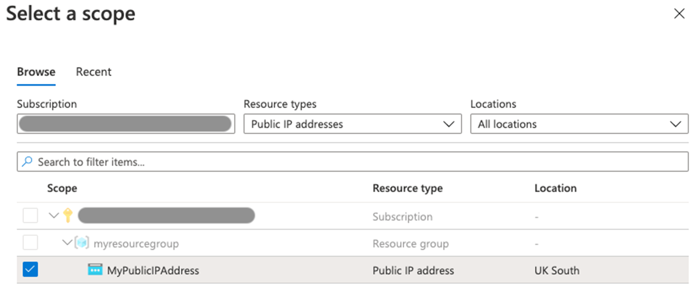

---
Exercise:
  title: M06 - 단원 4 Azure Portal을 사용하여 가상 네트워크에서 DDoS 보호 구성
  module: Module 06 - Design and implement network security
---

# M06-단원 4 Azure Portal을 사용하여 가상 네트워크에서 DDoS 보호 구성

## 연습 시나리오

Contoso의 네트워크 보안 팀 책임자로서 가상 네트워크에서 모의 DDoS 공격을 실행하려고 합니다. 다음 단계는 가상 네트워크를 만들고, DDoS Protection을 구성하고, 원격 분석 및 메트릭의 도움을 통해 관찰하고 모니터링할 수 있는 공격을 만드는 과정을 안내합니다.


이 연습에서 다음을 수행합니다.

+ 작업 1: 리소스 그룹 만들기
+ 작업 2: DDoS 보호 계획 만들기
+ 작업 3: 새 가상 네트워크에서 DDoS Protection을 사용하도록 설정
+ 작업 4: DDoS 원격 분석 구성
+ 작업 5: DDoS 진단 로그 구성
+ 작업 6: DDoS 경고 구성
+ 작업 7: 시뮬레이션 파트너와 함께 테스트


   >**참고:** **[대화형 랩 시뮬레이션](https://mslabs.cloudguides.com/guides/AZ-700%20Lab%20Simulation%20-%20Configure%20Azure%20DDoS%20Protection%20on%20a%20virtual%20network)** 을 사용하여 이 랩을 원하는 속도로 클릭할 수 있습니다. 대화형 시뮬레이션과 호스트된 랩 간에 약간의 차이가 있을 수 있지만 보여주는 핵심 개념과 아이디어는 동일합니다.

### 예상 시간: 40분

## 작업 1: 리소스 그룹 만들기

1. Azure 계정에 로그인

1. Azure Portal 홈페이지에서 **리소스 그룹**을 선택합니다.

1. **만들기**를 선택합니다.

1. **기본 사항** 탭의 **리소스 그룹**에 **MyResourceGroup**을 입력합니다.

1. **지역**에서 미국 동부를 선택합니다.

1. **검토 + 만들기**를 선택합니다.

1. **만들기**를 선택합니다.

## 작업 2: DDoS 보호 계획 만들기

1. Azure Portal 홈페이지에서 검색 상자에 **DDoS**를 입력한 다음, **DDoS 보호 계획**이 표시되면 선택합니다.

1. **+ 만들기**를 선택합니다.

1. **기본 사항** 탭의 **리소스 그룹** 목록에서 방금 만든 리소스 그룹을 선택합니다.

1. **인스턴스 이름** 상자에 **MyDdoSProtectionPlan**을 입력한 다음, **검토 + 만들기**를 선택합니다.

1. **만들기**를 선택합니다.

## 작업 3: 새 가상 네트워크에서 DDoS Protection을 사용하도록 설정

여기서는 기존 가상 네트워크가 아니라 새 가상 네트워크에서 DDoS를 사용하도록 설정하므로, 먼저 새 가상 네트워크를 만든 다음 이전에 만든 계획을 사용하여 DDoS 보호를 사용하도록 설정해야 합니다.

1. Azure Portal 홈페이지에서 **리소스 만들기**를 선택하고, 검색 상자에 **Virtual Network**를 입력한 다음, **Virtual Network**가 표시되면 선택합니다.

1. **Virtual Network** 페이지에서 **생성**를 선택합니다.

1. **기본 사항** 탭에서 이전에 만든 리소스 그룹을 선택합니다.

1. **이름** 상자에 **MyVirtualNetwork**를 입력한 다음, **보안** 탭을 선택합니다.

1. **보안** 탭의 **DDoS 네트워크 보호** 옆에서 **사용**을 선택합니다.

1. **DDoS 보호 계획** 드롭다운 목록에서 **MyDdosProtectionPlan**을 선택합니다.

   

1. **검토 + 만들기**를 선택합니다.

1. **만들기**를 선택합니다.

## 작업 4: DDoS 원격 분석 구성

공용 IP 주소를 만들고, 다음 단계에서 원격 분석을 설정합니다.

1. Azure Portal 홈페이지에서 **리소스 만들기**를 선택하고, 검색 상자에 **공용 IP**를 입력한 다음, **공용 IP 주소**가 표시되면 선택합니다.

1. **공용 IP 주소** 페이지에서 **만들기**를 선택합니다.

1. **공용 IP 주소 만들기** 페이지의 **SKU** 아래에서 **표준**을 선택합니다.

1. **이름** 상자에 **MyPublicIPAddress**를 입력합니다.

1. **IP 주소 할당** 아래에서 **정적**을 선택합니다.

1. **DNS 이름 레이블**에 **mypublicdnsxx**를 입력합니다(xx에는 고유한 사용자 이니셜 입력).

1. **만들기**를 실행합니다.

1. 원격 분석을 설정하려면 Azure 홈페이지로 이동하여 **모든 리소스**를 선택합니다.

1. 리소스 목록에서 **MyDdosProtectionPlan**을 선택합니다.

1. **모니터링** 아래에서 **메트릭**을 선택합니다.

1. **범위** 상자를 선택하고 **MyPublicIPAddress** 옆에 있는 확인란을 선택합니다.

    

1. **적용**을 선택합니다.

1. **메트릭** 상자에서 **Inbound packets dropped DDoS**를 선택합니다.

1. **집계** 상자에서 **최댓값**을 선택합니다.

    

## 작업 5: DDoS 진단 로그 구성

1. Azure 홈페이지에서 **모든 리소스**를 선택합니다.

1. 리소스 목록에서 **MyPublicIPAddress**를 선택합니다.

1. **모니터링** 아래에서 **진단 설정**을 선택합니다.

1. **진단 설정 추가**를 선택합니다.

1. **진단 설정** 페이지의 **진단 설정 이름** 상자에 **MyDiagnosticSetting**을 입력합니다.

1. **범주 세부 정보**에서 3개의 **로그** 확인란 모두와 **AllMetrics** 확인란을 선택합니다.

1. **대상 세부 정보**에서 **Log Analytics 작업 영역에 보내기** 확인란을 선택합니다. 여기에서 기존 Log Analytics 작업 영역을 선택할 수 있지만 진단 로그에 대한 대상을 아직 설정하지 않았으므로, 설정을 입력하고 이 연습의 다음 단계에서 삭제하겠습니다.

   

1. 일반적으로 이제 **저장**을 선택하여 진단 설정을 저장할 수 있습니다. 그러나 아직 설정 구성을 완료할 수 없기 때문에 이 옵션은 회색으로 표시됩니다.

1. **취소**를 선택하고 **예**를 선택합니다.

## 작업 6: DDoS 경고 구성

이 단계에서는 가상 머신을 만들고, 공용 IP 주소를 할당하고, DDoS 경고를 구성합니다.

### VM 만들기

1. Azure Portal 홈페이지에서 **리소스 만들기**를 선택하고, 검색 상자에 **가상 머신**을 입력한 다음, **가상 머신**이 표시되면 선택합니다.

1. **가상 머신**페이지에서 **만들기**를 선택합니다.

1. **기본 사항** 탭에서 아래 표의 정보를 사용하여 새 VM을 만듭니다.

   | **설정**           | **값**                                                    |
   | --------------------- | ------------------------------------------------------------ |
   | Subscription          | 구독 선택                                     |
   | Resource group        | **MyResourceGroup**                                          |
   | 가상 머신 이름  | **MyVirtualMachine**                                         |
   | 지역                | 미국 동부                                                  |
   | 가용성 옵션  | **인프라 중복은 필요하지 않음**                   |
   | 이미지                 | **Ubuntu Server 20.04 LTS -  Gen 2**(필요한 경우 VM 세대 구성 링크 선택) |
   | 크기                  | **모든 크기 보기**를 선택한 다음, 목록에서 **B1ls**를 선택하고 **선택** **(Standard_B1ls - vcpu 1개, 메모리 0.5GiB**)을 선택합니다. |
   | 인증 유형   | **SSH 퍼블릭 키**                                           |
   | 사용자 이름              | **azureuser**                                                |
   | SSH 공개 키 원본 | **새 키 쌍 생성**                                    |
   | 키 쌍 이름         | **myvirtualmachine-ssh-key**                                 |
   | 공용 인바운드 포트  | 없음을 선택합니다.                                                  |

1. **검토 + 만들기**를 선택합니다.

1. **만들기**를 선택합니다.

1. **새 키 쌍 생성** 대화 상자에서 **프라이빗 키 다운로드 및 리소스 만들기**를 선택합니다.

1. 프라이빗 키를 저장합니다.

1. 배포가 완료되면 **리소스로 이동**을 선택합니다.

### 공용 IP 주소 할당

1. 새 가상 머신의 **개요** 페이지에 있는 **설정** 아래에서 **네트워킹**을 선택합니다.

1. **네트워크 인터페이스** 옆에서 **myvirtualmachine-nic**를 선택합니다. nic의 이름이 다를 수 있습니다.

1. **설정**에서 **IP 구성**을 선택합니다.

1. **ipconfig1**을 선택합니다.

1. **공용 IP 주소** 목록에서 **MyPublicIPAddress**를 선택합니다.

1. **저장**을 선택합니다.

   

### DDoS 경고 구성

1. Azure 홈페이지에서 **모든 리소스**를 선택합니다.

1. 리소스 목록에서 **MyPublicIPAddress**를 선택합니다.

1. **모니터링**에서 **경고**를 선택합니다.

1. **경고 규칙 만들기**를 선택합니다.

1. **경고 규칙 만들기** 페이지의 **범위** 아래에서 **리소스 편집**을 선택합니다.

1. 신호 이름으로 **DDoS 공격을 받고 있는지 여부**를 선택합니다.

1. 경고 논리에서 **연산자** 설정을 찾아 **크거나 같음**을 선택합니다.

1. **임계값**에 **1**을 입력합니다(공격을 받고 있음을 의미).

1. 세부 정보 탭으로 이동하여 **경고 규칙 이름**을 선택하고 **MyDdosAlert**를 입력합니다.

    

1. **경고 규칙 만들기**를 선택합니다.

## 작업 7: 시뮬레이션 파트너와 함께 테스트

1. [Azure DDoS 시뮬레이션 테스트 정책](https://learn.microsoft.com/en-us/azure/ddos-protection/test-through-simulations#configure-a-ddos-attack-simulation) 페이지를 검토합니다. 

1. 여러 테스트 파트너가 있습니다. 시간 여유가 있으면 DDoS 공격 시뮬레이션을 구성합니다. BreakingPoint Cloud를 사용하려면 먼저 BreakingPoint Cloud 계정을 만들어야 합니다.

## 리소스 정리

   >**참고**: 더 이상 사용하지 않는 새로 만든 Azure 리소스는 모두 제거하세요. 사용되지 않는 리소스를 제거하면 예기치 않은 요금이 발생하지 않습니다.

1. Azure Portal의 **Cloud Shell** 창에서 **PowerShell** 세션을 엽니다.

1. 다음 명령을 실행하여 이 모듈의 랩 전체에서 만든 모든 리소스 그룹을 삭제합니다.

   ```powershell
   Remove-AzResourceGroup -Name 'MyResourceGroup' -Force -AsJob
   ```

   >**참고**: 이 명령은 -AsJob 매개 변수에 의해 결정되어 비동기로 실행되므로, 동일한 PowerShell 세션 내에서 이 명령을 실행한 직후 다른 PowerShell 명령을 실행할 수 있지만 리소스 그룹이 실제로 제거되기까지는 몇 분 정도 걸립니다.

## Copilot을 사용하여 학습 확장

Copilot은 Azure 스크립팅 도구를 사용하는 방법을 익히는 데 도움을 줍니다. 또한 Copilot은 랩에서 다루지 않는 영역이나 추가 정보가 필요한 영역을 지원할 수 있습니다. Edge 브라우저를 열고 Copilot(오른쪽 위)을 선택하거나 *copilot.microsoft.com*으로 이동하세요. 몇 분 정도 시간을 내어 이러한 프롬프트를 사용해 보세요.
+ DDoS 공격이란? DDoS 공격은 어떻게 분류되며 완화 전략이 있나요?
+ 두 가지 다른 Azure DDoS Protection 계층을 요약한 표를 제공하세요.
+ DDoS Protection을 통해 보호할 수 있는 Azure 리소스는 무엇인가요?


## 자기 주도적 학습을 통해 자세히 알아보기

+ [Azure DDoS Protection 소개](https://learn.microsoft.com/training/modules/introduction-azure-ddos-protection/). 이 모듈에서는 Azure DDoS Protection, 해당 기능 및 아키텍처 옵션을 평가합니다.
+ [네트워크 보안 설계 및 구현](https://learn.microsoft.com/training/modules/design-implement-network-security-monitoring/). 이 모듈에서는 Azure DDoS Protection을 학습하고 배포합니다.

  
## 핵심 내용

축하합니다. 랩을 완료했습니다. 이 랩의 주요 내용은 다음과 같습니다. 
+ DDoS 공격은 애플리케이션의 리소스를 과부하시켜 정상적인 사용자가 애플리케이션을 사용할 수 없게 만드는 악의적인 시도입니다. 
+ Azure DDoS Protection은 DDoS 공격을 방어합니다. 가상 네트워크에서 특정 Azure 리소스를 보호하도록 자동으로 조정됩니다. 
+ Azure DDoS Proectection 기능에는 Always On 트래픽 모니터링, 적응형 실시간 튜닝, 원격 분석 및 경고가 포함됩니다.  
+ Azure DDoS Protection은 DDoS IP Protection 및 DDoS Network Protection이라는 두 가지 계층 유형을 지원합니다.
