---
Exercise:
  title: M06-단원 7 Azure Portal을 사용하여 Azure Firewall 배포 및 구성
  module: 'Module - Design and implement network security '
ms.openlocfilehash: ed65009faa624ee3c7f50caefa33aa9abed2af21
ms.sourcegitcommit: cc6b12857d97b72310f349592f5d4adbd371cc50
ms.translationtype: HT
ms.contentlocale: ko-KR
ms.lasthandoff: 02/10/2022
ms.locfileid: "138422798"
---
# <a name="m06-unit-7-deploy-and-configure-azure-firewall-using-the-azure-portal"></a>M06-단원 7 Azure Portal을 사용하여 Azure Firewall 배포 및 구성

Contoso의 네트워크 보안 팀에서 수행할 다음 작업은 특정 웹 사이트에 대한 액세스를 허용/거부하는 방화벽 규칙을 만드는 것입니다. 다음 단계에서는 환경 준비 작업으로서 리소스 그룹, 가상 네트워크와 서브넷, 가상 머신을 만든 다음, 방화벽 및 방화벽 정책을 배포하고, 기본 경로와 애플리케이션, 네트워크, DNAT 규칙을 구성하고, 마지막으로 방화벽을 테스트하는 과정을 안내합니다.

이 연습에서 다음을 수행합니다.

+ 작업 1: 리소스 그룹 만들기
+ 작업 2: 가상 네트워크 및 서브넷 만들기
+ 작업 3: 가상 머신 만들기
+ 작업 4: 방화벽 및 방화벽 정책 배포
+ 작업 5: 기본 경로 만들기
+ 작업 6: 애플리케이션 규칙 구성
+ 작업 7: 네트워크 규칙 구성
+ 작업 8: DNAT(대상 NAT) 규칙 구성
+ 작업 9: 서버 네트워크 인터페이스에 대한 기본 및 보조 DNS 주소 변경
+ 작업 10: 방화벽 테스트
+ 작업 11: 리소스 정리


## <a name="task-1-create-a-resource-group"></a>작업 1: 리소스 그룹 만들기

이 작업에서는 새 리소스 그룹을 만듭니다.

1. Azure 계정에 로그인

2. Azure Portal 홈페이지에서 **리소스 그룹** 을 선택합니다.

3. **만들기** 를 클릭합니다. 

4. **기본 사항** 탭의 **리소스 그룹** 에 **Test-FW-RG** 를 입력합니다.

5. **지역** 의 목록에서 지역을 선택합니다.

   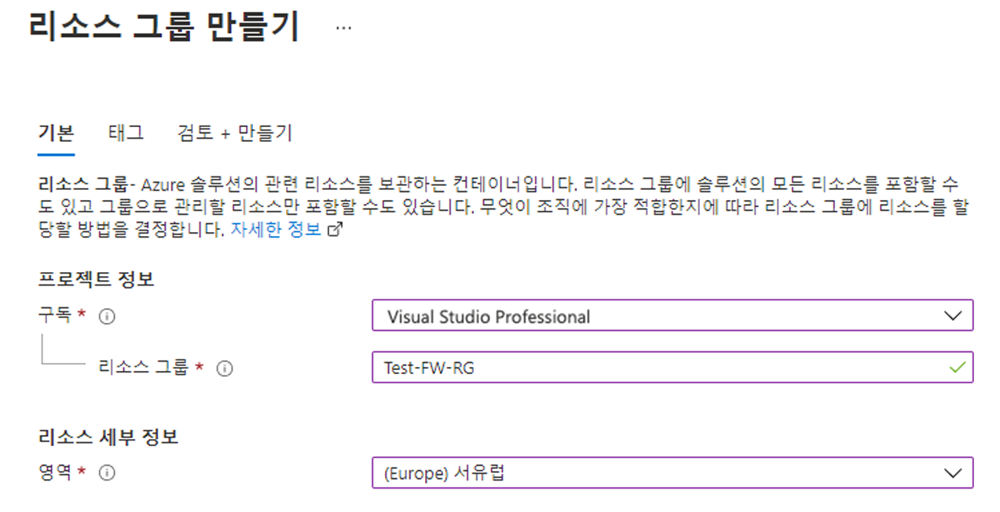

6. **검토 + 만들기** 를 클릭합니다.

7. **만들기** 를 클릭합니다.

 

## <a name="task-2-create-a-virtual-network-and-subnets"></a>작업 2: 가상 네트워크 및 서브넷 만들기

이 작업에서는 두 개의 서브넷이 있는 단일 가상 네트워크를 만듭니다.

1. Azure Portal 홈페이지에서 검색 상자에 **가상 네트워크** 를 입력한 다음, **가상 네트워크** 가 표시되면 선택합니다.

2. **만들기** 를 클릭합니다.

3. 이전에 만든 **Test-FW-RG** 리소스 그룹을 선택합니다.

4. **이름** 상자에 **Test-FW-VN** 을 입력합니다.

   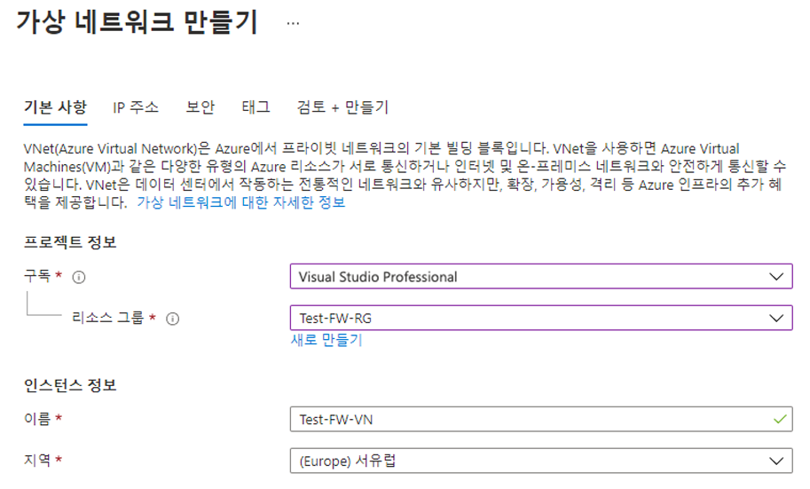

5. **다음: IP 주소** 를 클릭합니다. 아직 기본적으로 채워져 있지 않으면 IPv4 주소 공간 10.0.0.0/16을 입력합니다. 

6. **서브넷 이름** 아래에서 **기본값** 이라는 단어를 클릭합니다.

7. **서브넷 편집** 대화 상자에서 이름을 **AzureFirewallSubnet** 으로 변경합니다.

8. **서브넷 주소 범위** 를 **10.0.1.0/26** 으로 변경합니다.

9. **저장** 을 클릭합니다.

10. **서브넷 추가** 를 클릭하여, 곧 만들 워크로드 서버를 호스트할 또 다른 서브넷을 만듭니다.


    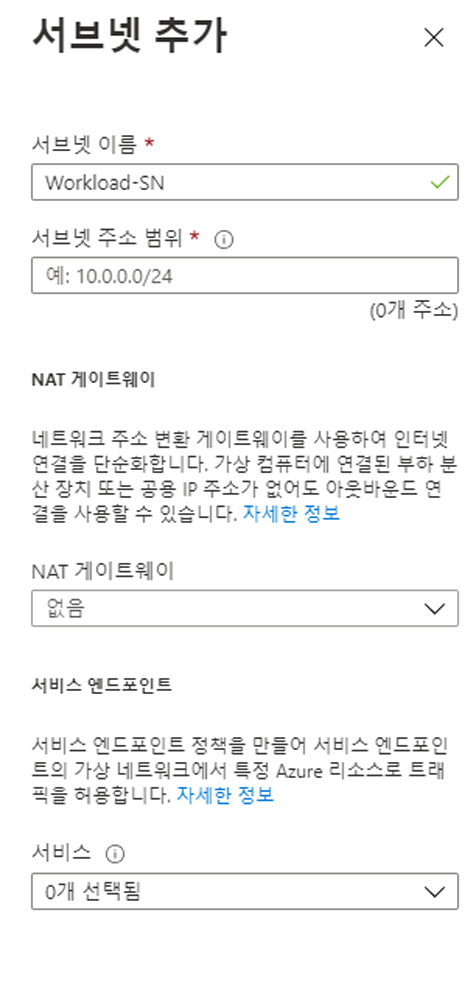
    
11. **서브넷 편집** 대화 상자에서 이름을 **Workload-SN** 으로 변경합니다.

12. **서브넷 주소 범위** 를 **10.0.2.0/24** 로 변경합니다.

13. **추가** 를 클릭합니다.

14. **검토 + 만들기** 를 클릭합니다.

15. **만들기** 를 클릭합니다.

 

## <a name="task-3-create-a-virtual-machine"></a>작업 3: 가상 머신 만들기

이 작업에서는 워크로드 가상 머신을 만들고 앞에서 만든 Workload-SN 서브넷에 배치합니다.

1. Azure Portal의 **Cloud Shell** 창에서 **PowerShell** 세션을 엽니다.

2. Cloud Shell 창의 도구 모음에서 파일 업로드/다운로드 아이콘을 선택하고 드롭다운 메뉴에서 업로드를 선택한 다음 **firewall.json** 및 **firewall.parameters.json** 파일을 소스 폴더 **F:\Allfiles\Exercises\M06** 의 Cloud Shell 홈 디렉터리에 업로드합니다.

3. 다음 ARM 템플릿을 배포하여 이 연습에 필요한 VM을 만듭니다.

   ```powershell
   $RGName = "Test-FW-RG"
   
   New-AzResourceGroupDeployment -ResourceGroupName $RGName -TemplateFile firewall.json -TemplateParameterFile firewall.parameters.json
   ```
  
4. 배포가 완료되면 Azure Portal 홈페이지로 이동한 다음 **가상 머신** 을 선택합니다.

5. 가상 머신이 만들어졌는지 확인합니다.

6. VM 배포가 완료되면 **리소스로 이동** 을 선택합니다.

7. **Srv-Work** 의 **개요** 페이지에서 오른쪽의 **네트워킹** 아래에 있는 이 VM의 **개인 IP 주소**(예: **10.0.2.4**)를 기록해 둡니다.
 

## <a name="task-4-deploy-the-firewall-and-firewall-policy"></a>작업 4: 방화벽 및 방화벽 정책 배포

이 작업에서는 방화벽 정책이 구성된 가상 네트워크에 방화벽을 배포합니다.

1. Azure Portal 홈페이지에서 **리소스 만들기** 를 선택하고, 검색 상자에 **방화벽** 을 입력한 다음, **방화벽** 이 표시되면 선택합니다.

2. **방화벽** 페이지에서 **만들기** 를 클릭합니다.

3. **기본 사항** 탭에서 아래 표의 정보를 사용하여 방화벽을 만듭니다.

   | **설정**          | **값**                                                    |
   | -------------------- | ------------------------------------------------------------ |
   | Subscription         | 구독 선택                                     |
   | Resource group       | **Test-FW-RG**                                               |
   | 방화벽 이름        | **Test-FW01**                                                |
   | 지역               | 지역                                                  |
   | 방화벽 계층        | **Standard**                                                 |
   | 방화벽 관리  | **방화벽 정책을 사용하여 이 방화벽 관리**            |
   | 방화벽 정책      | **새로 추가** 선택<br />이름: **fw-test-pol**<br />지역: **해당 지역** |

   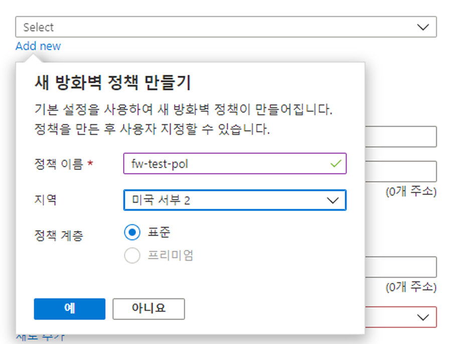

   | 가상 네트워크 선택 | **기존 항목 사용**                         |
   | ------------------------ | ---------------------------------------- |
   | 가상 네트워크          | **Test-FW-VN**                           |
   | 공용 IP 주소        | **새로 추가** 선택<br />이름: **fw-pip** |


   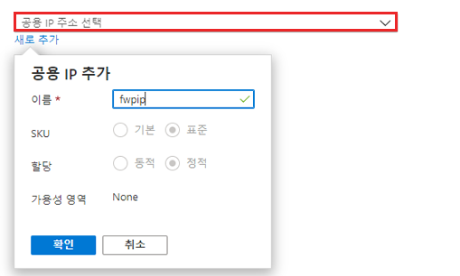

4. 모든 설정을 검토하여 아래 스크린샷과 일치하는지 확인합니다.

   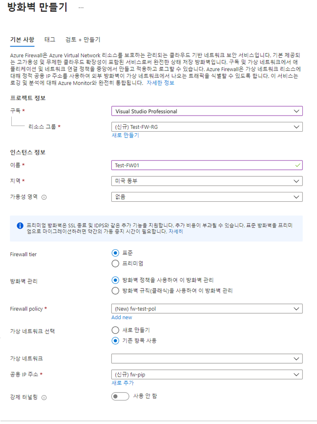

5. **검토 + 만들기** 를 클릭합니다.

6. **만들기** 를 클릭하고 방화벽 배포가 완료되기를 기다립니다.

7. 방화벽 배포가 완료되면 **리소스로 이동** 을 클릭합니다.

8. **Test-FW01** 의 **개요** 페이지 오른쪽에서 이 방화벽에 대한 **방화벽 개인 IP**(예: **10.0.1.4**)를 기록해 둡니다.

9. 왼쪽 메뉴의 **설정** 아래에서 **공용 IP 구성** 을 클릭합니다.

10. **fw-pip** 공용 IP 구성에 대한 **IP 주소** 아래의 주소(예: **20.90.136.51**)를 기록해 둡니다.

 

## <a name="task-5-create-a-default-route"></a>작업 5: 기본 경로 만들기

이 작업에서는 Workload-SN 서브넷에서 방화벽을 통과하도록 아웃바운드 기본 경로를 구성합니다.

1. Azure Portal 홈페이지에서 **리소스 만들기** 를 선택하고, 검색 상자에 **경로** 를 입력한 다음, **경로 테이블** 이 표시되면 선택합니다.

2. **경로 테이블** 페이지에서 **만들기** 를 클릭합니다.

3. **기본 사항** 탭에서 아래 표의 정보를 사용하여 새 경로 테이블을 만듭니다.

   | **설정**              | **값**                |
   | ------------------------ | ------------------------ |
   | Subscription             | 구독 선택 |
   | Resource group           | **Test-FW-RG**           |
   | 지역                   | 지역              |
   | 속성                     | **Firewall-route**       |
   | 게이트웨이 경로 전파 | **예**                  |


4. **검토 + 만들기** 를 클릭합니다.

5. **만들기** 를 클릭합니다.

   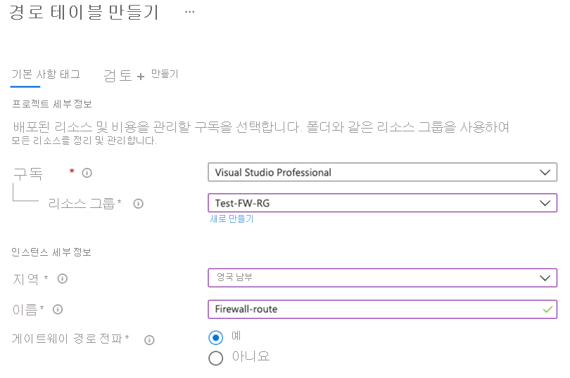

6. 배포가 완료되면 **리소스로 이동** 을 선택합니다.

7. **Firewall-route** 페이지의 **설정** 에서 **서브넷** 을 클릭한 다음 **연결** 을 클릭합니다.

8. **가상 네트워크** 에서 **Test-FW-VN** 을 선택합니다.

9. **서브넷** 에서 **Workload-SN** 을 선택합니다. 이 경로에 대해 Workload-SN 서브넷만 선택해야 합니다. 그렇지 않으면 방화벽이 제대로 작동하지 않습니다.

10. **확인** 을 클릭합니다.

11. **설정** 에서 **경로** 를 선택하고 **추가** 를 클릭합니다.

12. **경로 이름** 에 **fw-dg** 를 입력합니다.

13. **주소 접두사** 에 **0.0.0.0/0** 을 입력합니다.

14. **다음 홉 유형** 에서 **가상 어플라이언스** 를 선택합니다.

15. **다음 홉 주소** 에 앞에서 적어 둔 방화벽의 개인 IP 주소(예: **10.0.1.4**)를 입력합니다.

16. **확인** 을 클릭합니다.

    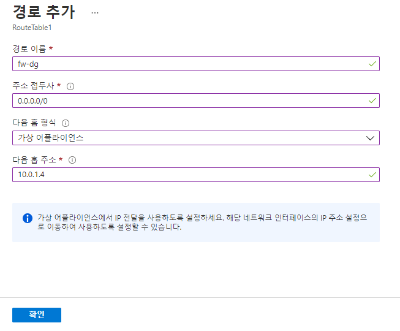

 

## <a name="task-6-configure-an-application-rule"></a>작업 6: 애플리케이션 규칙 구성

이 작업에서는 www.google.com에 대한 아웃바운드 액세스를 허용하는 애플리케이션 규칙을 추가합니다.

1. Azure Portal 홈페이지에서 **모든 리소스** 를 선택합니다.

2. 리소스 목록에서 방화벽 정책 **fw-test-pol** 을 클릭합니다.

3. **설정** 에서 **애플리케이션 규칙** 을 클릭합니다.

4. **규칙 컬렉션 추가** 를 클릭합니다.

5. **규칙 컬렉션 추가** 페이지에서 아래 표의 정보를 사용하여 새 애플리케이션 규칙을 만듭니다.

   | **설정**            | **값**                                 |
   | ---------------------- | ----------------------------------------- |
   | 속성                   | **App-Coll01**                            |
   | 규칙 컬렉션 유형   | **애플리케이션**                           |
   | 우선 순위               | **200**                                   |
   | 규칙 컬렉션 작업 | **허용**                                 |
   | 규칙 컬렉션 그룹  | **DefaultApplicationRuleCollectionGroup** |
   | **규칙 섹션**      |                                           |
   | 속성                   | **Allow-Google**                          |
   | 소스 형식            | **IP 주소**                            |
   | 원본                 | **10.0.2.0/24**                           |
   | 프로토콜               | **http,https**                            |
   | 대상 형식       | **FQDN**                                  |
   | 대상            | **www.google.com**                        |


   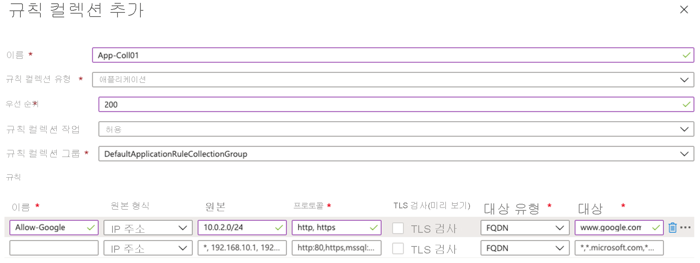

6. **추가** 를 클릭합니다.

 

## <a name="task-7-configure-a-network-rule"></a>작업 7: 네트워크 규칙 구성

이 작업에서는 포트 53(DNS)에서 두 개의 IP 주소에 대한 아웃바운드 액세스를 허용하는 네트워크 규칙을 추가합니다.

1. **fw-test-pol** 페이지의 **설정** 에서 **네트워크 규칙** 을 클릭합니다.

2. **규칙 컬렉션 추가** 를 클릭합니다.

3. **규칙 컬렉션 추가** 페이지에서 아래 표의 정보를 사용하여 새 네트워크 규칙을 만듭니다.

   | **설정**            | **값**                                                    |
   | ---------------------- | ------------------------------------------------------------ |
   | 속성                   | **Net-Coll01**                                               |
   | 규칙 컬렉션 유형   | **Network**                                                  |
   | 우선 순위               | **200**                                                      |
   | 규칙 컬렉션 작업 | **허용**                                                    |
   | 규칙 컬렉션 그룹  | **DefaultNetworkRuleCollectionGroup**                        |
   | **규칙 섹션**      |                                                              |
   | 속성                   | **Allow-DNS**                                                |
   | 소스 형식            | **IP 주소**                                               |
   | 원본                 | **10.0.2.0/24**                                              |
   | 프로토콜               | **UDP**                                                      |
   | 대상 포트      | **53**                                                       |
   | 대상 유형       | **IP 주소**                                               |
   | 대상            | **209.244.0.3, 209.244.0.4**<br />이들은 Century Link에서 작동하는 퍼블릭 DNS 서버입니다. |


    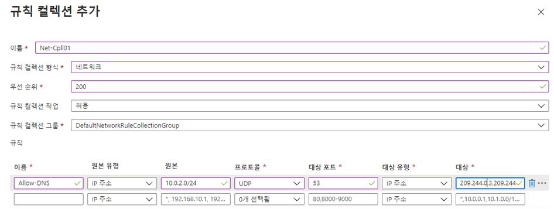

4. **추가** 를 클릭합니다.

 

## <a name="task-8-configure-a-destination-nat-dnat-rule"></a>작업 8: DNAT(대상 NAT) 규칙 구성

이 작업에서는 방화벽을 통해 원격 데스크톱을 Srv-Work 가상 머신에 연결할 수 있도록 하는 DNAT 규칙을 추가합니다.

1. **fw-test-pol** 페이지의 **설정** 에서 **DNAT 규칙** 을 클릭합니다.

2. **규칙 컬렉션 추가** 를 클릭합니다.

3. **규칙 컬렉션 추가** 페이지에서 아래 표의 정보를 사용하여 새 DNAT 규칙을 만듭니다.

   | **설정**           | **값**                                                    |
   | --------------------- | ------------------------------------------------------------ |
   | 속성                  | **rdp**                                                      |
   | 규칙 컬렉션 유형  | **DNAT**                                                     |
   | 우선 순위              | **200**                                                      |
   | 규칙 컬렉션 그룹 | **DefaultDnatRuleCollectionGroup**                           |
   | **규칙 섹션**     |                                                              |
   | 속성                  | **rdp-nat**                                                  |
   | 소스 형식           | **IP 주소**                                               |
   | 원본                | *                                                            |
   | 프로토콜              | **TCP**                                                      |
   | 대상 포트     | **3389**                                                     |
   | 대상 유형      | **IP 주소**                                               |
   | 대상           | 앞에서 적어 둔 **fw-pip** 의 방화벽 공용 IP 주소를 입력합니다.<br />**예 - 20.90.136.51** |
   | 번역된 주소    | 앞에서 적어 둔 **Srv-Work** 의 개인 IP 주소를 입력합니다.<br />**예 - 10.0.2.4** |
   | 번역된 포트       | **3389**                                                     |


        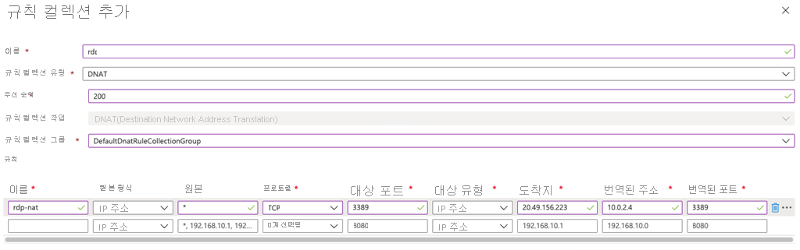

4. **추가** 를 클릭합니다.

 

## <a name="task-9-change-the-primary-and-secondary-dns-address-for-the-servers-network-interface"></a>작업 9: 서버 네트워크 인터페이스에 대한 기본 및 보조 DNS 주소 변경

이 연습의 테스트를 위해 이 작업에서는 Srv-Work 서버의 기본 및 보조 DNS 주소를 구성합니다. 그러나 이는 일반적인 Azure Firewall 요구 사항이 아닙니다.

1. Azure Portal 홈페이지에서 **리소스 그룹** 을 선택합니다.

2. 리소스 그룹 목록에서 리소스 그룹 **Test-FW-RG** 를 클릭합니다.

3. 이 리소스 그룹의 리소스 목록에서 **Srv-Work** 가상 머신(예: **srv-work350**)에 대한 네트워크 인터페이스를 선택합니다.

   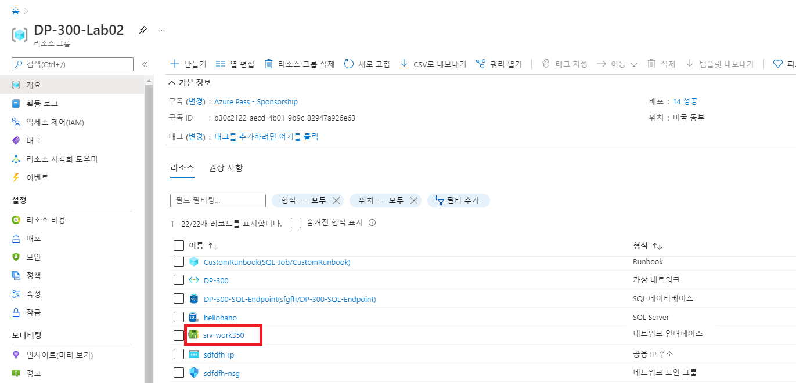

4. **설정** 아래에서 **DNS 서버** 를 선택합니다.

5. **DNS 서버** 아래에서 **사용자 지정** 을 선택합니다.

6. **DNS 서버 추가** 텍스트 상자에 **209.244.0.3** 을 입력하고 다음 텍스트 상자에 **209.244.0.4** 를 입력합니다.

7. **저장** 을 선택합니다.

   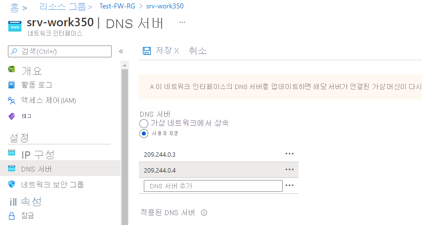

8. **Srv-Work** 가상 머신을 다시 시작합니다.

 

## <a name="task-10-test-the-firewall"></a>작업 10: 방화벽 테스트

이 마지막 작업에서는 방화벽을 테스트하여 규칙이 올바르게 구성되었고 예상대로 작동하는지 확인합니다. 이 구성을 사용하면 방화벽의 공용 IP 주소를 사용하여 방화벽을 통해 Srv-Work 가상 머신에 대한 원격 데스크톱 연결을 설정할 수 있습니다.

1. PC에서 **원격 데스크톱 연결** 을 엽니다.

2. **컴퓨터** 상자에 방화벽의 공용 IP 주소(예: **20.90.136.51**)와 **:3389** 를 차례로 입력합니다(예: **20.90.136.51:3389**).

3. **사용자 이름** 상자에 **TestUser** 를 입력합니다.

4. **연결** 을 클릭합니다.

   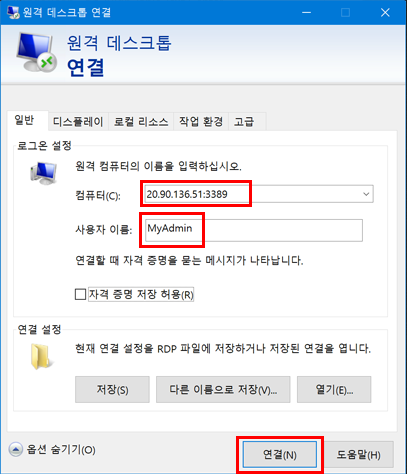

5. **자격 증명 입력** 대화 상자에서 **TestPa$$w0rd!** 암호를 사용하여 **Srv-Work** 서버 가상 머신에 로그인합니다.

6. **확인** 을 클릭합니다.

7. 인증서 메시지에서 **예** 를 클릭합니다.

8. Internet Explorer를 열고 **https://www.google.com** 으로 이동합니다.

9. **보안 경고** 대화 상자에서 **확인** 을 클릭합니다.

10. Internet Explorer 보안 경고가 나타나면 **닫기** 를 클릭합니다.

11. Google 홈 페이지가 나타납니다.

    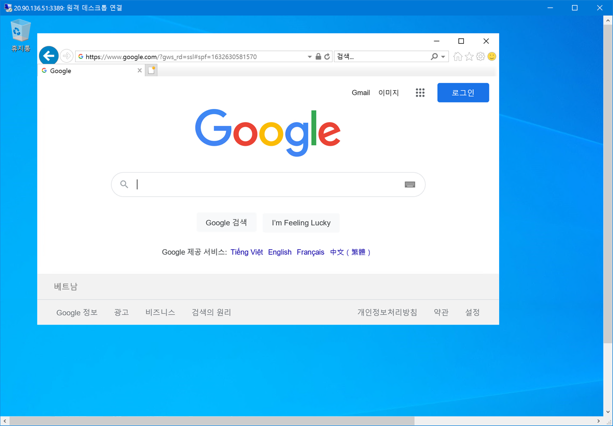

12. **https://www.microsoft.com** 으로 이동합니다.

13. 방화벽에서 차단해야 합니다.

    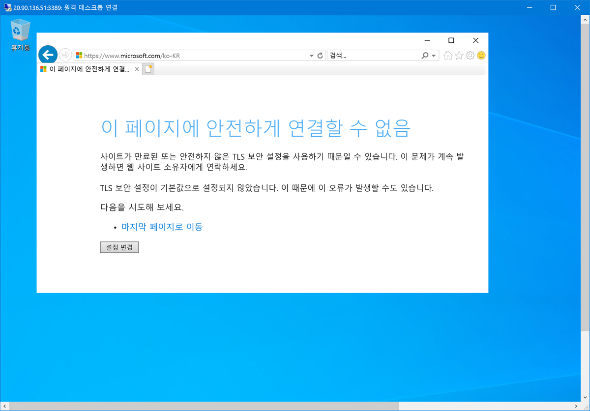

 
## <a name="task-11-clean-up-resources"></a>작업 11: 리소스 정리 

>**참고**: 더 이상 사용하지 않는 새로 만든 Azure 리소스는 모두 제거하세요. 사용되지 않는 리소스를 제거하면 예기치 않은 요금이 발생하지 않습니다.

1. Azure Portal의 **Cloud Shell** 창에서 **PowerShell** 세션을 엽니다.

1. 다음 명령을 실행하여 이 모듈의 랩 전체에서 만든 모든 리소스 그룹을 삭제합니다.

   ```powershell
   Remove-AzResourceGroup -Name 'Test-FW-RG' -Force -AsJob
   ```

    >**참고**: 이 명령은 -AsJob 매개 변수에 의해 결정되어 비동기로 실행되므로, 동일한 PowerShell 세션 내에서 이 명령을 실행한 직후 다른 PowerShell 명령을 실행할 수 있지만 리소스 그룹이 실제로 제거되기까지는 몇 분 정도 걸립니다.
