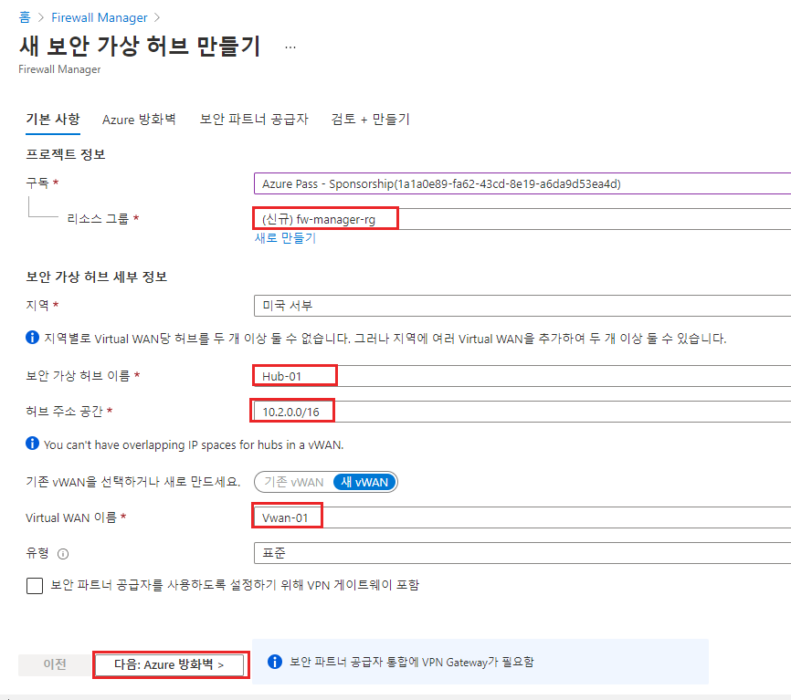
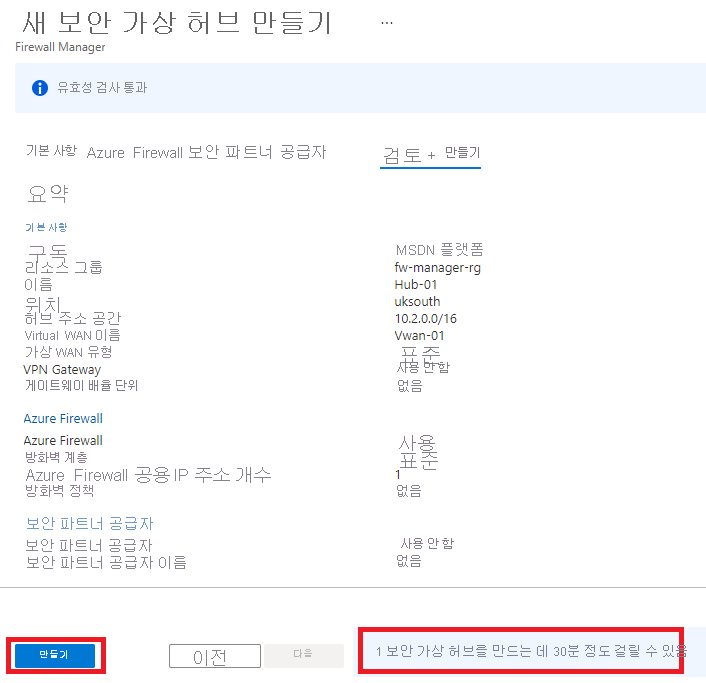
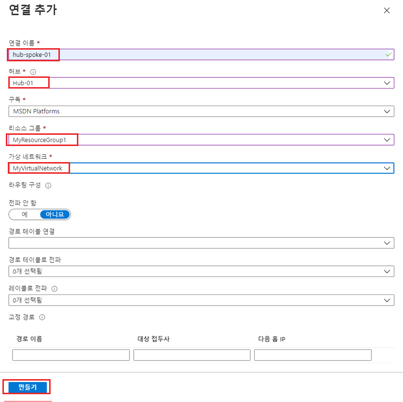
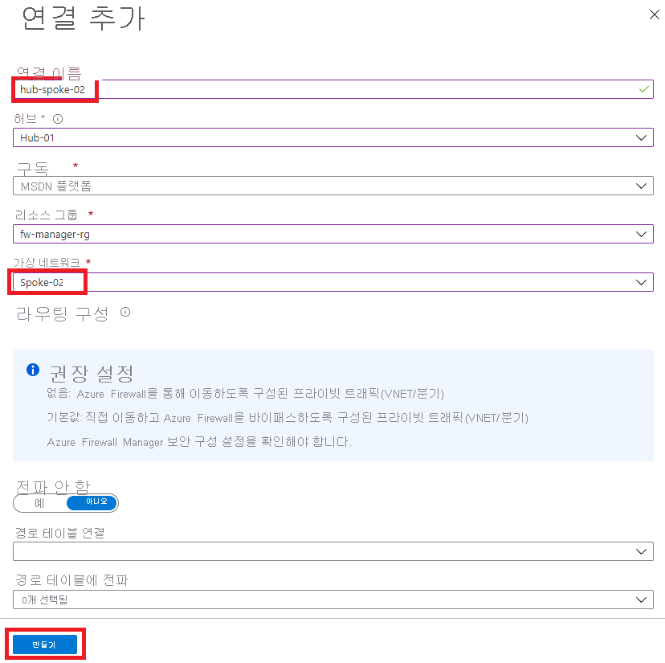
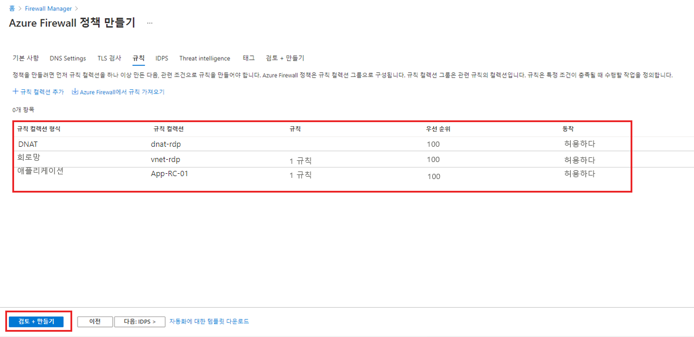
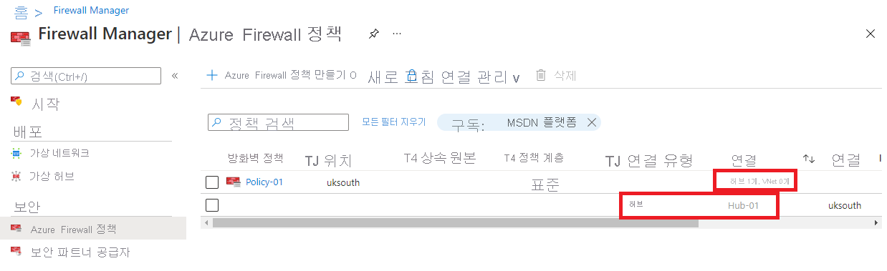
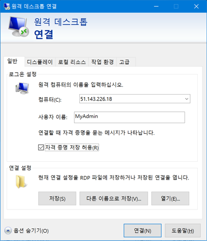
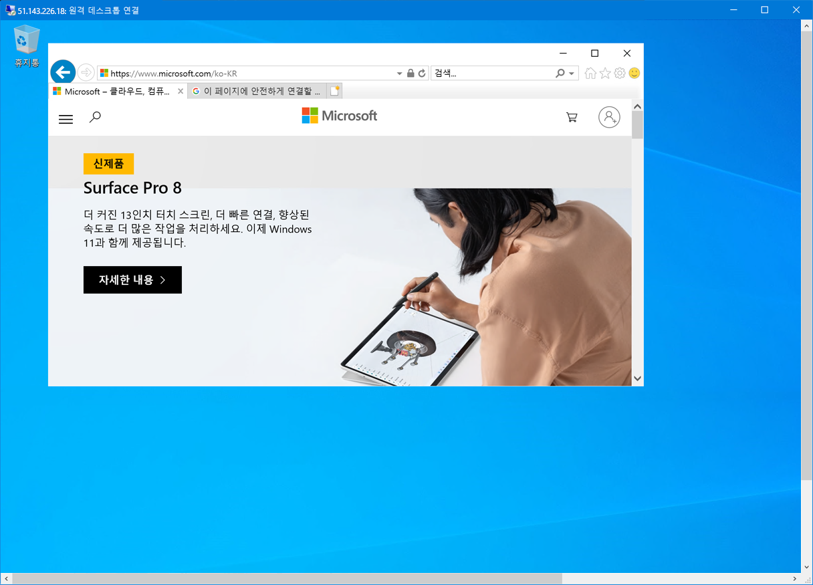
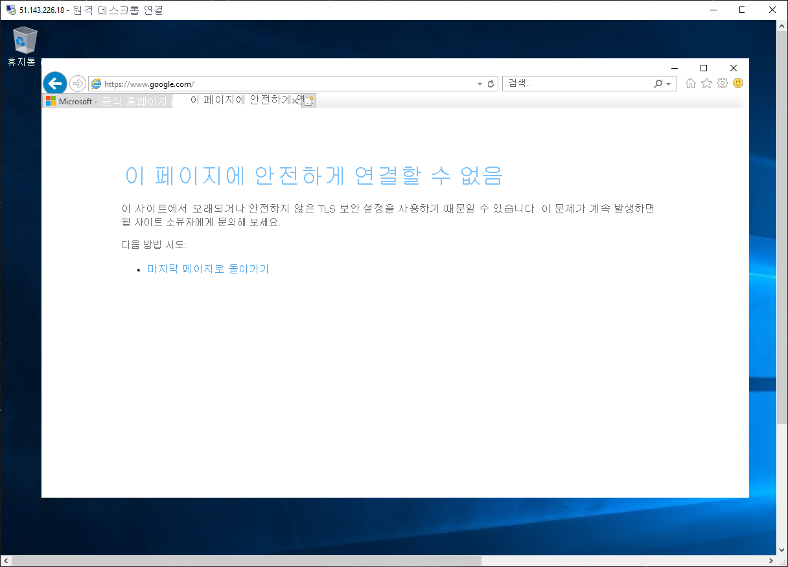
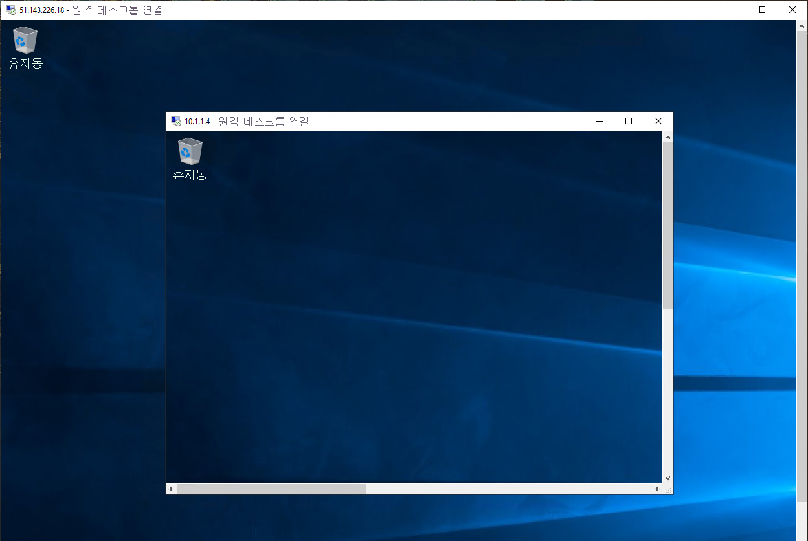

---
Exercise:
  title: M06-단원 9 Azure Firewall Manager를 사용하여 가상 허브 보호
  module: Module - Design and implement network security
ms.openlocfilehash: bcab244740a8a49f7923a9a8aa782a10c93d13b1
ms.sourcegitcommit: cc6b12857d97b72310f349592f5d4adbd371cc50
ms.translationtype: HT
ms.contentlocale: ko-KR
ms.lasthandoff: 02/10/2022
ms.locfileid: "138422789"
---
# <a name="m06-unit-9-secure-your-virtual-hub-using-azure-firewall-manager"></a>M06-단원 9 Azure Firewall Manager를 사용하여 가상 허브 보호

이 연습에서는 스포크 가상 네트워크를 만들고 보안 가상 허브를 만든 다음, 허브 및 스포크 가상 네트워크를 연결하고 트래픽을 허브로 라우팅합니다. 그런 다음 워크로드 서버를 배포하고, 방화벽 정책을 만들고, 허브를 보호하고, 마지막으로 방화벽을 테스트합니다.

## <a name="create-a-hub-and-spoke-architecture"></a>허브 및 스포크 아키텍처 만들기

이 연습 부분에서는 워크로드 서버를 저장할 스포크 가상 네트워크 및 서브넷을 만듭니다. 그런 다음 보안 가상 허브를 만들고 허브 및 스포크 가상 네트워크를 연결합니다.

이 연습에서 다음을 수행합니다.

+ 작업 1: 2개의 스포크 가상 네트워크 및 서브넷 만들기
+ 작업 2: 보안 가상 허브 만들기
+ 작업 3: 허브 및 스포크 가상 네트워크 연결
+ 작업 4: 서버 배포
+ 작업 5: 방화벽 정책 만들기 및 허브 보안
+ 작업 6: 방화벽 정책 연결
+ 작업 7: 허브로 트래픽 라우팅
+ 작업 8: 애플리케이션 규칙 테스트
+ 작업 9: 네트워크 규칙 테스트
+ 작업 10: 리소스 정리

## <a name="task-1-create-two-spoke-virtual-networks-and-subnets"></a>작업 1: 2개의 스포크 가상 네트워크 및 서브넷 만들기

이 작업에서는 각각 워크로드 서버를 호스트하는 서브넷을 포함하는 두 개의 스포크 가상 네트워크를 만듭니다. 

1. Azure Portal 홈페이지에서 검색 상자에 **가상 네트워크** 를 입력한 다음, **가상 네트워크** 가 표시되면 선택합니다.
2. **만들기** 를 클릭합니다.
3. **리소스 그룹** 에서 **새로 만들기** 를 선택하고, 이름으로 **fw-manager-rg** 를 입력하고, **확인** 을 클릭합니다.
4. **이름** 에 **Spoke-01** 을 입력합니다.
5. **지역** 에서 지역을 선택합니다.
6. **다음: IP 주소** 를 클릭합니다.
7. **IPv4 주소 공간** 에 **10.0.0.0/16** 을 입력합니다. 
8. 여기에 나열된 다른 주소 공간(예: **10.1.0.0/16**)을 **삭제** 합니다.
9. **서브넷 이름** 아래에서 **기본값** 이라는 단어를 클릭합니다.
10. **서브넷 편집** 대화 상자에서 이름을 **Workload-01-SN** 으로 변경합니다.
11. **서브넷 주소 범위** 를 **10.0.1.0/24** 로 변경합니다.
12. **저장** 을 클릭합니다.
13. **검토 + 만들기** 를 클릭합니다.
14. **만들기** 를 클릭합니다.

위의 1~14단계를 반복하여 또 다른 유사한 가상 네트워크 및 서브넷을 만듭니다. 단, 다음 정보를 사용합니다.

- 리소스 그룹: **fw-manager-rg**(기존 그룹 선택)
- 이름: **Spoke-02**
- 주소 공간: **10.1.0.0/16** - (기타 나열된 주소 공간 모두 삭제)
- 서브넷 이름: **Workload-02-SN**
- 서브넷 주소 범위: **10.1.1.0/24**

## <a name="task-2-create-the-secured-virtual-hub"></a>작업 2: 보안 가상 허브 만들기

이 작업에서는 Firewall Manager를 사용하여 보안 가상 허브를 만듭니다.

1. Azure Portal 홈 페이지에서 **모든 서비스** 를 클릭합니다.

2. 검색 상자에 **firewall manager** 를 입력하고 **Firewall Manager** 가 표시되면 선택합니다.

3. **Firewall Manager** 페이지의 개요 페이지에서 **보안 가상 허브 보기** 를 클릭합니다.

4. **가상 허브** 페이지에서 **새 보안 가상 허브 만들기** 를 클릭합니다.

5. **리소스 그룹** 에 대해 **fw-manager-rg** 를 선택합니다.

6. **지역** 에서 지역을 선택합니다.

7. **보안 가상 허브 이름** 으로 **Hub-01** 을 입력합니다.

8. **허브 주소 공간** 에 **10.2.0.0/16** 을 입력합니다.

9. **새 vWAN** 을 선택합니다.

10. **Virtual WAN 이름** 에 **Vwan-01** 을 입력합니다.

11. **다음: Azure Firewall** 을 클릭합니다.
    

12. **다음: 보안 파트너 공급자** 를 클릭합니다.

13. **다음: 검토 + 만들기** 를 클릭합니다.

14. **만들기** 를 클릭합니다.

    > **[!NOTE]** 
    >
    > 배포하는 데 최대 30분이 걸릴 수 있습니다.

    

    

15. 배포가 완료되면 Azure Portal 홈페이지에서 **모든 서비스** 를 클릭합니다.

16. 검색 상자에 **firewall manager** 를 입력하고 **Firewall Manager** 가 표시되면 선택합니다.

17. **Firewall Manager** 페이지에서 **가상 허브** 를 클릭합니다.

18. **Hub-01** 을 클릭합니다.

19. **공용 IP 구성** 을 클릭합니다.

20. 나중에 사용할 공용 IP 주소(예: **51.143.226.18**)를 적어 둡니다.

## <a name="task-3-connect-the-hub-and-spoke-virtual-networks"></a>작업 3: 허브 및 스포크 가상 네트워크 연결

이 작업에서는 허브 및 스포크 가상 네트워크를 연결합니다. 일반적으로 이를 피어링이라고 합니다.

1. Azure Portal 홈페이지에서 **리소스 그룹** 을 클릭합니다.
2. **fw-manager-rg** 리소스 그룹을 선택한 다음, **Vwan-01** 가상 WAN을 선택합니다.
3. **연결** 에서 **가상 네트워크 연결** 을 클릭합니다.
4. **연결 추가** 를 클릭합니다.
5. **연결 이름** 에 **hub-spoke-01** 을 입력합니다.
6. **허브** 에 대해 **Hub-01** 을 선택합니다.
7. **리소스 그룹** 에 대해 **fw-manager-rg** 를 선택합니다.
8. **가상 네트워크** 에 대해 **Spoke-01** 을 선택합니다.
9. **만들기** 를 클릭합니다.
   
10. 위의 4~9단계를 반복하여 다른 유사한 연결을 만들되, **hub-spoke-02** 라는 연결 이름을 사용하여 **Spoke-02** 가상 네트워크에 연결합니다.



 

## <a name="task-4-deploy-the-servers"></a>작업 4: 서버 배포

1. Azure Portal의 **Cloud Shell** 창에서 **PowerShell** 세션을 엽니다.

2. Cloud Shell 창의 도구 모음에서 파일 업로드/다운로드 아이콘을 선택하고 드롭다운 메뉴에서 업로드를 선택한 다음 **FirewallManager.json** 및 **FirewallManager.parameters.json** 파일을 소스 폴더 **F:\Allfiles\Exercises\M06** 의 Cloud Shell 홈 디렉터리에 업로드합니다.

3. 다음 ARM 템플릿을 배포하여 이 연습에 필요한 VM을 만듭니다.

   ```powershell
   $RGName = "fw-manager-rg"
   
   New-AzResourceGroupDeployment -ResourceGroupName $RGName -TemplateFile FirewallManager.json -TemplateParameterFile FirewallManager.parameters.json
   ```
  
4. 배포가 완료되면 Azure Portal 홈페이지로 이동한 다음 **가상 머신** 을 선택합니다.

5. **Srv-workload-01** 의 **개요** 페이지에서 오른쪽 창의 **네트워킹** 섹션 아래에 있는 **개인 IP 주소**(예: **10.0.1.4**)를 기록해 둡니다.

6. **Srv-workload-02** 의 **개요** 페이지에서 오른쪽 창의 **네트워킹** 섹션 아래에 있는 **개인 IP 주소**(예: **10.1.1.4**)를 기록해 둡니다.


## <a name="task-5-create-a-firewall-policy-and-secure-your-hub"></a>작업 5: 방화벽 정책 만들기 및 허브 보안

이 작업에서는 먼저 방화벽 정책을 만든 다음 허브의 보안을 유지합니다. 방화벽 정책은 하나 이상의 보안 가상 허브에서 트래픽을 전달하는 규칙 컬렉션을 정의합니다.

1. Azure Portal 홈페이지에서 **Firewall Manager** 를 클릭합니다.
   - Firewall Manager 아이콘이 홈페이지에 표시되지 않으면 **모든 서비스** 를 클릭합니다. 그런 다음 검색 상자에 **firewall manager** 를 입력하고 **Firewall Manager** 가 표시되면 선택합니다.

2. **Firewall Manager** 의 개요 페이지에서 **Azure Firewall 정책 보기** 를 클릭합니다.

3. **Azure Firewall 정책 만들기** 를 클릭합니다.

4. **리소스 그룹** 에서 **fw-manager-rg** 를 선택합니다.

5. **정책 세부 정보** 에서 **이름** 에 대해 **Policy-01** 을 입력합니다.

6. **지역** 에서 지역을 선택합니다.

7. **가격 책정 계층** 에서 **표준** 을 선택합니다.

8. **다음: DNS 설정** 을 클릭합니다.

8. **다음: TLS 검사(미리 보기)** 를 클릭합니다.

9. **다음: 규칙** 을 클릭합니다.

10. **규칙** 탭에서 **규칙 컬렉션 추가** 를 클릭합니다.

11. **규칙 컬렉션 추가** 페이지에서 **이름** 에 **App-RC-01** 을 입력합니다.

12. **규칙 컬렉션 유형** 에 대해 **애플리케이션** 을 선택합니다.

13. **우선 순위** 에 대해 **100** 을 입력합니다.

14. **규칙 컬렉션 작업** 이 **허용** 인지 확인합니다.

15. **규칙** 에서 **이름** 에 **Allow-msft** 를 입력합니다.

16. **원본 유형** 에 대해 **IP 주소** 를 선택합니다.

17. **원본** 에 대해 *를 입력합니다.

18. **프로토콜** 에 대해 **http,https** 를 입력합니다.

19. **대상 유형** 이 **FQDN** 인지 확인합니다.

20. **대상** 에 대해 **_.microsoft.com_* 을 입력합니다.

21. **추가** 를 클릭합니다.

    

22. 원격 데스크톱을 Srv-workload-01 VM에 연결할 수 있도록 DNAT 규칙을 추가하려면 **규칙 컬렉션 추가** 를 클릭합니다.

23. **이름** 에 대해 **dnat-rdp** 를 입력합니다.

24. **규칙 컬렉션 형식** 에 대해 **DNAT** 를 선택합니다.

25. **우선 순위** 에 대해 **100** 을 입력합니다.

26. **규칙** 에서 **이름** 에 **Allow-rdp** 를 입력합니다.

27. **원본 유형** 에 대해 **IP 주소** 를 선택합니다.

28. **원본** 에 대해 *를 입력합니다.

29. **프로토콜** 의 경우 **TCP** 를 선택합니다.

30. **대상 포트** 에 대해 **3389** 를 입력합니다.

31. **대상 유형** 에 대해 **IP 주소** 를 선택합니다.

32. **대상** 에 대해 앞에서 적어 둔 방화벽 가상 허브 공용 IP 주소(예: **51.143.226.18**)를 입력합니다.

33. **번역된 주소** 에 대해 앞에서 적어 둔 **Srv-workload-01** 의 개인 IP 주소(예: **10.0.1.4**)를 입력합니다.

34. **변역된 포트** 에 대해 **3389** 를 입력합니다.

35. **추가** 를 클릭합니다.

36. Srv-workload-01에서 Srv-workload-02 VM으로 원격 데스크톱을 연결할 수 있도록 네트워크 규칙을 추가하려면 **규칙 컬렉션 추가** 를 클릭합니다.

37. **이름** 에 **vnet-rdp** 를 입력합니다.

38. **규칙 컬렉션 형식** 에 대해 **네트워크** 를 선택합니다.

39. **우선 순위** 에 대해 **100** 을 입력합니다.

40. **규칙 컬렉션 작업** 에 대해 **허용** 을 선택합니다.

41. **규칙** 에서 **이름** 에 **Allow-vnet** 을 입력합니다.

42. **원본 유형** 에 대해 **IP 주소** 를 선택합니다.

43. **원본** 에 대해 *를 입력합니다.

44. **프로토콜** 의 경우 **TCP** 를 선택합니다.

45. **대상 포트** 에 대해 **3389** 를 입력합니다.

46. **대상 유형** 에 대해 **IP 주소** 를 선택합니다.

47. **대상** 에 대해 앞에서 적어 둔 **Srv-workload-02** 에 대한 개인 IP 주소(예: **10.1.1.4**)를 입력합니다.

48. **추가** 를 클릭합니다.

    

49. 이제 세 개의 규칙 컬렉션이 나열됩니다.

50. **검토 + 만들기** 를 클릭합니다.

51. **만들기** 를 클릭합니다.

## <a name="task-6-associate-the-firewall-policy"></a>작업 6: 방화벽 정책 연결

이 작업에서는 방화벽 정책을 가상 허브와 연결합니다.

1. Azure Portal 홈페이지에서 **Firewall Manager** 를 클릭합니다.
   - Firewall Manager 아이콘이 홈페이지에 표시되지 않으면 **모든 서비스** 를 클릭합니다. 그런 다음 검색 상자에 **firewall manager** 를 입력하고 **Firewall Manager** 가 표시되면 선택합니다.
2. **Firewall Manager** 의 **보안** 에서 **Azure Firewall 정책** 을 클릭합니다.
3. **Policy-01** 에 대한 확인란을 선택합니다.
4. **연결 관리&gt;허브 연결** 을 선택합니다.
5. **Hub-01** 에 대한 확인란을 선택합니다.
6. **추가** 를 클릭합니다.
7. 정책이 연결되면 **새로 고침** 을 클릭합니다. 연결이 표시됩니다.



 

## <a name="task-7-route-traffic-to-your-hub"></a>작업 7: 허브로 트래픽 라우팅

이제 네트워크 트래픽이 방화벽을 통해 라우팅되는지 확인해야 합니다.

1. **Firewall Manager** 에서 **가상 허브** 를 클릭합니다.
2. **Hub-01** 을 클릭합니다.
3. **설정** 에서 **보안 구성** 을 클릭합니다.
4. **인터넷 트래픽** 에서 **Azure Firewall** 을 선택합니다.
5. **프라이빗 트래픽** 에서 **Azure Firewall을 통해 보내기** 를 선택합니다.
6. **저장** 을 클릭합니다. 
7. 이 설정은 완료하는 데 몇 분 정도 걸립니다.
8. 구성이 완료되면 **인터넷 트래픽** 및 **프라이빗 트래픽** 아래에서 허브-스포크 연결 모두에 대해 **Azure Firewall로 보호됨** 이 표시되는지 확인합니다.


## <a name="task-8-test-the-application-rule"></a>작업 8: 애플리케이션 규칙 테스트

연습의 이 부분에서는 원격 데스크톱을 Srv-Workload-01로 NAT된 방화벽 공용 IP 주소에 연결합니다. 그런 다음 웹 브라우저를 사용하여 애플리케이션 규칙을 테스트하고 원격 데스크톱을 Srv-Workload-02에 연결하여 네트워크 규칙을 테스트합니다.

이 작업에서는 애플리케이션 규칙을 테스트하여 예상대로 작동하는지 확인합니다.

1. PC에서 **원격 데스크톱 연결** 을 엽니다.

2. **컴퓨터** 상자에 **방화벽의 공용 IP 주소**(예: **51.143.226.18**)를 입력합니다.

3. **옵션 표시** 를 클릭합니다.

4. **사용자 이름** 상자에 **MyAdmin** 을 입력합니다.

5. **연결** 을 클릭합니다.

   

6. **자격 증명 입력** 대화 상자에서 **TestPa$$w0rd!** 암호를 사용하여 **Srv-workload-01** 서버 가상 머신에 로그인합니다.

7. **확인** 을 클릭합니다.

8. 인증서 메시지에서 **예** 를 클릭합니다.

9. Internet Explorer를 열고 **Internet Explorer 11 설정** 대화 상자에서 **확인** 을 클릭합니다.

10. **https://** **www.microsoft.com** 으로 이동합니다.

11. **보안 경고** 대화 상자에서 **확인** 을 클릭합니다.

12. Internet Explorer 보안 경고가 나타나면 **닫기** 를 클릭합니다.

13. Microsoft 홈페이지가 표시됩니다.

    

14. **https://** **www.google.com** 으로 이동합니다.

15. 방화벽에서 차단해야 합니다.

    

16. 허용된 하나의 FQDN에 연결할 수 있지만 다른 모든 것으로부터 차단된다는 것을 확인했습니다.

## <a name="task-9-test-the-network-rule"></a>작업 9: 네트워크 규칙 테스트

이 작업에서는 네트워크 규칙을 테스트하여 예상대로 작동하는지 확인합니다.

1. **Srv-workload-01** RDP 세션에 로그인하는 동안 이 원격 컴퓨터에서 **원격 데스크톱 연결** 을 엽니다.

2. **컴퓨터** 상자에 **Srv-workload-02** 의 **개인 IP 주소**(예: **10.1.1.4**)를 입력합니다.

3. **자격 증명 입력** 대화 상자에서 사용자 이름 **MyAdmin** 과 암호 **TestPa$$w0rd!** 를 사용하여 **Srv-workload-02** 서버에 로그인합니다.

4. **확인** 을 클릭합니다.

5. 인증서 메시지에서 **예** 를 클릭합니다.

   

6. 한 서버에서 다른 가상 네트워크에 있는 다른 서버로 원격 데스크톱을 연결한 후 방화벽 네트워크 규칙이 작동하는 것을 확인했습니다.

7. 두 RDP 세션을 모두 닫고 연결을 끊습니다.


## <a name="task-10-clean-up-resources"></a>작업 10: 리소스 정리 

>**참고**: 더 이상 사용하지 않는 새로 만든 Azure 리소스는 모두 제거하세요. 사용되지 않는 리소스를 제거하면 예기치 않은 요금이 발생하지 않습니다.

1. Azure Portal의 **Cloud Shell** 창에서 **PowerShell** 세션을 엽니다.

1. 다음 명령을 실행하여 이 모듈의 랩 전체에서 만든 모든 리소스 그룹을 삭제합니다.

   ```powershell
   Remove-AzResourceGroup -Name 'fw-manager-rg' -Force -AsJob
   ```

    >**참고**: 이 명령은 -AsJob 매개 변수에 의해 결정되어 비동기로 실행되므로, 동일한 PowerShell 세션 내에서 이 명령을 실행한 직후 다른 PowerShell 명령을 실행할 수 있지만 리소스 그룹이 실제로 제거되기까지는 몇 분 정도 걸립니다.
