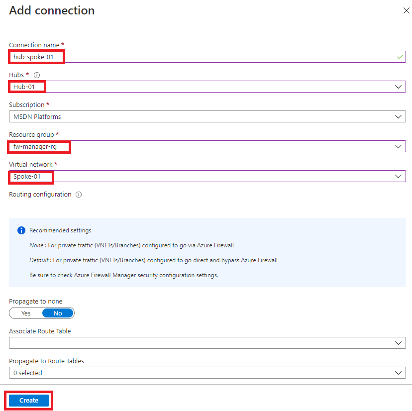
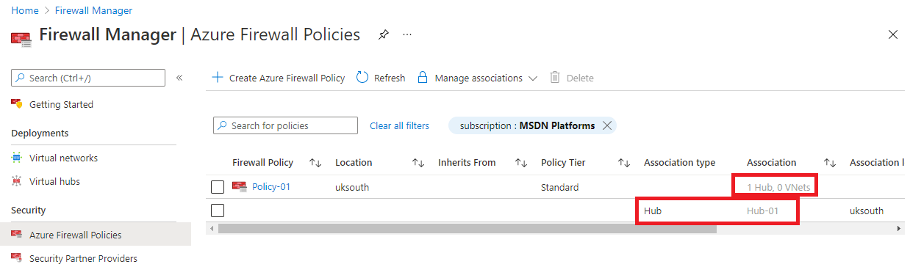

---
Exercise:
    title: 'M06-단원 9 Azure Firewall Manager를 사용하여 가상 허브 보호'
    module: '모듈 - 네트워크 보안 설계 및 구현'
---


# M06-단원 9 Azure Firewall Manager를 사용하여 가상 허브 보호

이 연습에서는 스포크 가상 네트워크와 보안 가상 허브를 만듭니다. 그런 다음 허브 및 스포크 가상 네트워크를 연결하고 허브로 트래픽을 라우팅합니다. 그 후에는 워크로드 서버를 배포하고 방화벽 정책을 만들어 허브를 보호합니다. 그리고 마지막으로 방화벽을 테스트합니다.

## 허브 및 스포크 아키텍처 만들기

연습의 이 부분에서는 워크로드 서버를 배치할 스포크 가상 네트워크와 서브넷을 만듭니다. 그런 다음 보안 가상 허브를 만들고 허브 및 스포크 가상 네트워크를 연결합니다.

이 연습에서는 다음을 수행합니다.

+ 작업 1: 스포크 가상 네트워크 및 서브넷 2개 만들기
+ 작업 2: 보안 가상 허브 만들기
+ 작업 3: 허브 및 스포크 가상 네트워크 연결
+ 작업 4: 서버 배포
+ 작업 5: 방화벽 정책 만들기 및 허브 보안 설정
+ 작업 6: 방화벽 정책 연결
+ 작업 7: 허브로 트래픽 라우팅
+ 작업 8: 애플리케이션 규칙 테스트
+ 작업 9: 네트워크 규칙 테스트
+ 작업 10: 리소스 정리

## 작업 1: 스포크 가상 네트워크 및 서브넷 2개 만들기

이 작업에서는 스포크 가상 네트워크 2개를 만듭니다. 각 가상 네트워크는 워크로드 서버를 호스트할 서브넷을 포함합니다. 

1. Azure Portal 홈 페이지에서 검색 상자에 **가상 네트워크**를 입력한 후 **가상 네트워크**가 표시되면 선택합니다.
2. **만들기**를 클릭합니다.
3. **리소스 그룹**에서 **새로 만들기**를 선택하고 이름으로 **fw-manager-rg**를 입력한 다음 **확인**을 클릭합니다.
4. **이름**에 **Spoke-01**을 입력합니다.
5. **지역**에서 사용자의 지역을 선택합니다.
6. **다음: IP 주소**를 클릭합니다.
7. **IP 주소 공간**에 **10.0.0.0/16**을 입력합니다. 
8. **10.1.0.0/16** 등 여기에 나와 있는 기타 주소 공간은 모두 **삭제**합니다.
9. **서브넷 이름** 아래에서 **기본값**이라는 단어를 클릭합니다.
10. **서브넷 편집** 대화 상자에서 이름을 **Workload-01-SN**으로 변경합니다.
11. **서브넷 주소 범위**를 **10.0.1.0/24**으로 변경합니다.
12. **저장**을 클릭합니다.
13. **검토 + 만들기**를 클릭합니다.
14. **만들기**를 클릭합니다.

위의 1-14단계를 반복하여 이 가상 네트워크와 비슷한 다른 가상 네트워크를 만듭니다. 단, 이번에는 아래 정보를 사용합니다.

- 리소스 그룹: **fw-manager-rg**(기존 항목 선택)
- 이름: **Spoke-02**
- 주소 공간: **10.1.0.0/16** - (나열되어 있는 기타 주소 공간은 모두 삭제)
- 서브넷 이름: **Workload-02-SN**
- 서브넷 주소 범위: **10.1.1.0/24**

## 작업 2: 보안 가상 허브 만들기

이 작업에서는 Firewall Manager를 사용하여 보안 가상 허브를 만듭니다.

1. Azure Portal 홈 페이지에서 **모든 서비스**를 클릭합니다.

2. 검색 상자에 **firewall manager**를 입력하고 **Firewall Manager**가 표시되면 선택합니다.

3. 개요 페이지의 **Firewall Manager** 페이지에서 **보안 가상 허브 보기**를 클릭합니다.

4. **가상 허브** 페이지에서 **새 보안 가상 허브 만들기**를 클릭합니다.

5. **리소스 그룹**으로 **fw-manager-rg**를 선택합니다.

6. **지역**으로는 사용자의 지역을 선택합니다.

7. **보안 가상 허브 이름**으로 **Hub-01**을 입력합니다.

8. **허브 주소 공간**으로 **10.2.0.0/16**을 입력합니다.

9. **새 vWAN**을 선택합니다.

10. **Virtual WAN 이름**에 **Vwan-01**을 입력합니다.

11. **다음: Azure Firewall**을 클릭합니다.
    

12. **다음: 보안 파트너 공급자**를 클릭합니다.

13. **다음: 검토 + 만들기를 클릭합니다.**

14. **만들기**를 클릭합니다.

    > **[!참고]** 
    >
    > 허브를 배포하려면 최대 30분이 걸릴 수 있습니다.

    ​

    

15. 배포가 완료되면 Azure Portal 홈 페이지에서 **모든 서비스**를 클릭합니다.

16. 검색 상자에 **firewall manager**를 입력하고 **Firewall Manager**가 표시되면 선택합니다.

17. **Firewall Manager** 페이지에서 **가상 허브**를 클릭합니다.

18. **Hub-01**을 클릭합니다.

19. **공용 IP 구성**을 클릭합니다.

20. 나중에 사용할 수 있도록 공용 IP 주소(예: **51.143.226.18**)를 적어 둡니다.

## 작업 3: 허브 및 스포크 가상 네트워크 연결

이 작업에서는 허브 및 스포크 가상 네트워크를 연결합니다. 이 연결을 일반적으로 피어링이라고 합니다.

1. Azure Portal 홈 페이지에서 **리소스 그룹**을 클릭합니다.
2. **fw-manager-rg** 리소스 그룹을 선택한 다음 **Vwan-01** Virtual WAN을 선택합니다.
3. **연결**에서 **가상 네트워크 연결**을 클릭합니다.
4. **연결 추가**를 클릭합니다.
5. **연결 이름**으로 **hub-spoke-01**을 입력합니다.
6. **허브**로는 **Hub-01**을 선택합니다.
7. **리소스 그룹**으로 **fw-manager-rg**를 선택합니다.
8. **가상 네트워크**로는 **Spoke-01**을 선택합니다.
9. **만들기**를 클릭합니다.
   
10. 위의 4-9단계를 반복하여 이 연결과 비슷한 다른 연결을 만듭니다. 단, 이번에는 연결 이름으로 **hub-spoke-02**를 사용하여 **Spoke-02** 가상 네트워크를 연결합니다.


 

## 작업 4: 서버 배포

이 작업에서는 워크로드 서버 2개를 배포합니다.

1. Azure 홈 페이지에서 전역 검색을 사용하여 **가상 네트워크**를 입력하고 서비스에서 가상 머신을 선택합니다.

2. 가상 머신에서 **+ 만들기, + 가상 머신**을 선택합니다.

3. **가상 머신 만들기** 페이지의 **기본 사항** 탭에서 다음 표의 정보를 사용하여 새 VM을 만듭니다.

   | **설정**          | **값**                |
   | -------------------- | ------------------------ |
   | 구독         | 보유한 구독 선택 |
   | 리소스 그룹       | **fw-manager-rg**        |
   | 가상 머신 이름 | **Srv-workload-01**      |
   | 지역               | 사용자의 지역              |
   | 가용성 옵션 | 인프라 중복 필요 없음|
   | 이미지                | Windows Server 2022 Datacenter - Gen2 |
   | Azure Spot 인스턴스  | 선택되지 않음             |
   | 사용자 이름             | **MyAdmin**              |
   | 암호             | **TestPa$$w0rd!**        |
   | 암호 확인     | **TestPa$$w0rd!**        |
   | 공용 인바운드 포트 | **없음**                 |

4. **다음: 디스크**를 클릭합니다.

5. **다음: 네트워킹**을 클릭합니다.

6. **가상 네트워크**에서 **Spoke-01**이 선택되어 있는지 확인합니다.

7. **서브넷**에서 **Workload-01-SN**이 선택되어 있는지 확인합니다. 

8. **공용 IP**에서는 **없음**을 선택합니다.

9. **다음: 관리**를 클릭합니다.

10. **모니터링** 아래 **부팅 진단**에서 **사용 안 함**을 클릭합니다.

11. **검토 + 만들기**를 클릭합니다.

12. **만들기**를 클릭합니다.

13. 배포가 완료되면 **다른 VM 만들기**를 클릭합니다.

14. 위의 **3-12**단계를 반복하여 이번에는 다음 정보를 사용해 다른 가상 머신을 만듭니다.

    - 가상 머신 이름: **Srv-workload-02**
    - 가상 네트워크: **Spoke-02**
    - 서브넷: **Workload-02-SN**
    - 공용 IP: **없음**

15. 두 번째 VM 배포가 완료되면 **리소스로 이동**을 클릭합니다.

16. **Srv-workload-02**의 **개요** 페이지 오른쪽 창 **네트워킹**섹션 아래에 표시되어 있는 **개인 IP 주소**(예: **10.1.1.4**)를 적어 둡니다.

17. **홈**을 클릭합니다.

18. Azure Portal 홈 페이지에서 **모든 리소스**를 클릭합니다.

19. **Srv-workload-01** 가상 머신을 클릭합니다.

20. **Srv-workload-01**의 **개요** 페이지 오른쪽 창 **네트워킹**섹션 아래에 표시되어 있는 **개인 IP 주소**(예: **10.0.1.4**)를 적어 둡니다.


## 작업 5: 방화벽 정책 만들기 및 허브 보안 설정

이 작업에서는 먼저 방화벽 정책을 만든 후에 허브를 보호합니다. 방화벽 정책은 하나 이상의 보안 가상 허브에서 트래픽을 전달하는 규칙 컬렉션을 정의합니다.

1. Azure Portal 홈 페이지에서 **Firewall Manager**를 클릭합니다.
   - 홈 페이지에 Firewall Manager 아이콘이 표시되지 않으면 **모든 서비스**를 클릭합니다. 그런 다음 검색 상자에 **firewall manager**를 입력하고 **Firewall Manager**가 표시되면 선택합니다.

2. 개요 페이지의 **Firewall Manager**에서 **Azure Firewall 정책 보기**를 클릭합니다.

3. **Azure Firewall 정책 만들기**를 클릭합니다.

4. **리소스 그룹**에서 **fw-manager-rg**를 선택합니다.

5. **정책 세부 정보** 아래에서 **이름**으로 **Policy-01**을 입력합니다.

6. **지역**에서 사용자의 지역을 선택합니다.

7. **다음: DNS 설정**을 클릭합니다.

8. **다음: TLS 검사(미리 보기)** 를 클릭합니다.

9. **다음: 규칙**을 클릭합니다.

10. **규칙** 탭에서**규칙 컬렉션 추가**를 클릭합니다.

11. **규칙 컬렉션 추가** 페이지의 **이름**에 **App-RC-01**을 입력합니다.

12. **규칙 컬렉션 유형**으로 **애플리케이션**을 선택합니다.

13. **우선 순위**로는 **100**을 입력합니다.

14. **규칙 컬렉션 작업**이 **허용**인지 확인합니다.

15. **규칙** 아래 **이름**에 **Allow-msft**를 입력합니다.

16. **원본 유형**으로는 **IP 주소**를 선택합니다.

17. **원본**에는 *****를 입력합니다.

18. **프로토콜**로는 **http,https**를 입력합니다.

19. **대상 유형**이 **FQDN**인지 확인합니다.

20. **대상**으로는 ***.microsoft.com**을 입력합니다.

21. **추가**를 클릭합니다.

    

22. 원격 데스크톱을 Srv-workload-01 VM에 연결할 수 있도록 DNAT 규칙을 추가하려면 **규칙 컬렉션 추가**를 클릭합니다.

23. **이름**으로 **dnat-rdp**를 입력합니다.

24. **규칙 컬렉션 형식**에서 **DNAT**를 선택합니다.

25. **우선 순위**로는 **100**을 입력합니다.

26. **규칙** 아래 **이름**에 **Allow-rdp**를 입력합니다.

27. **원본 유형**으로는 **IP 주소**를 선택합니다.

28. **원본**에는 *****를 입력합니다.

29. **프로토콜**로 **TCP**를 선택합니다.

30. **대상 포트**로는 **3389**를 입력합니다.

31. **대상 유형**으로는 **IP 주소**를 선택합니다.

32. **대상**으로는 앞에서 적어 두었던 방화벽 가상 허브 공용 IP 주소(예: **51.143.226.18**)를 입력합니다.

33. **번역된 주소**로는 앞에서 적어 두었던 **Srv-workload-01**의 개인 IP 주소(예: **10.0.1.4**)를 입력합니다.

34. **번역된 포트**로는 **3389**를 입력합니다.

35. **추가**를 클릭합니다.

36. Srv-workload-01 VM에서 Srv-workload-02 VM으로의 원격 데스크톱을 연결할 수 있도록 네트워크 규칙을 추가하려면 **규칙 컬렉션 추가**를 클릭합니다.

37. **이름**으로 **vnet-rdp**를 입력합니다.

38. **규칙 컬렉션 형식**에서 **네트워크**를 선택합니다.

39. **우선 순위**로는 **100**을 입력합니다.

40. **규칙 컬렉션 작업**에서 **허용**을 선택합니다.

41. **규칙** 아래 **이름**에 **Allow-vnet**을 입력합니다.

42. **원본 유형**으로는 **IP 주소**를 선택합니다.

43. **원본**에는 *****를 입력합니다.

44. **프로토콜**로 **TCP**를 선택합니다.

45. **대상 포트**로는 **3389**를 입력합니다.

46. **대상 유형**으로는 **IP 주소**를 선택합니다.

47. **대상**으로는 앞에서 적어 두었던 **Srv-workload-02**의 개인 IP 주소(예: **10.1.1.4**)를 입력합니다.

48. **추가**를 클릭합니다.

    

49. 이제 규칙 컬렉션 3개가 표시됩니다.

50. **검토 + 만들기**를 클릭합니다.

51. **만들기**를 클릭합니다.

## 작업 6: 방화벽 정책 연결

이 작업에서는 방화벽 정책을 가상 허브와 연결합니다.

1. Azure Portal 홈 페이지에서 **Firewall Manager**를 클릭합니다.
   - 홈 페이지에 Firewall Manager 아이콘이 표시되지 않으면 **모든 서비스**를 클릭합니다. 그런 다음 검색 상자에 **firewall manager**를 입력하고 **Firewall Manager**가 표시되면 선택합니다.
2. **Firewall Manager**의 **보안** 아래에서 **Azure Firewall 정책**을 클릭합니다.
3. **Policy-01**의 체크박스를 선택합니다.
4. **연결 관리&gt;허브 연결**을 선택합니다.
5. **Hub-01**의 체크박스를 선택합니다.
6. **추가**를 클릭합니다.
7. 정책이 연결되면 **새로 고침**을 클릭합니다. 연결이 표시됩니다.



 

## 작업 7: 허브로 트래픽 라우팅

이 작업에서는 네트워크 트래픽이 방화벽을 통해 라우팅되는지 확인합니다.

1. **Firewall Manager**에서 **가상 허브**를 클릭합니다.
2. **Hub-01**을 클릭합니다.
3. **설정** 아래에서 **보안 구성**을 클릭합니다.
4. **인터넷 트래픽**에서 **Azure Firewall**을 선택합니다.
5. **프라이빗 트래픽**에서 **Azure Firewall을 통해 전송**을 선택합니다.
6. **저장**을 클릭합니다. 
7. 구성을 완료하는 데 몇 분 정도 걸립니다.
8. 구성이 완료되면 두 허브-스포크 연결에서 모두 **인터넷 트래픽** 및 **프라이빗 트래픽** 아래에 **Azure Firewall을 통해 보호됨**이 표시되는지 확인합니다.


## 작업 8: 애플리케이션 규칙 테스트

연습의 이 부분에서는 방화벽 공용 IP 주소(Srv-Workload-01에 NAT로 연결됨)에 원격 데스크톱을 연결합니다. 그런 다음 웹 브라우저를 사용하여 애플리케이션 규칙을 테스트하고 원격 데스크톱을 Srv-Workload-02에 연결하여 네트워크 규칙을 테스트합니다.

이 작업에서는 애플리케이션을 테스트하여 애플리케이션이 정상적으로 작동하는지를 확인합니다.

1. PC에서 **원격 데스크톱 연결**을 엽니다.

2. **컴퓨터**상자에 **방화벽의 공용 IP 주소**(예: **51.143.226.18**)를 입력합니다.

3. **옵션 표시**를 클릭합니다.

4. **사용자 이름** 상자에 **MyAdmin**을 입력합니다.

5. **연결**을 클릭합니다.

   

6. **자격 증명 입력** 대화 상자에서 암호로 **TestPa$$w0rd!** 를 사용하여 **Srv-workload-01** 서버 가상 머신에 로그인합니다.

7. **확인**을 클릭합니다.

8. 인증서 메시지에서 **예**를 클릭합니다.

9. Internet Explorer를 열고 **Internet Explorer 11 설정** 대화 상자에서 **확인**을 클릭합니다.

10. **https://** **www.microsoft.com** 으로 이동합니다.

11. **보안 경고** 대화 상자에서 **확인**을 클릭합니다.

12. Internet Explorer 보안 경고 팝업이 표시될 수 있습니다. 그러면 **닫기**를 클릭합니다.

13. Microsoft 홈 페이지가 표시됩니다.

    

14. **https://** **www.google.com** 으로 이동합니다.

15. 페이지 액세스가 방화벽에 의해 차단됩니다.

    

16. 허용되는 FQDN에는 연결할 수 있지만 기타 모든 주소에 대한 연결은 차단됨을 확인했습니다.

## 작업 9: 네트워크 규칙 테스트

이 작업에서는 네트워크 규칙을 테스트하여 규칙이 정상적으로 작동하는지를 확인합니다.

1. **Srv-workload-01** RDP 세션에 계속 로그인한 상태로 이 원격 컴퓨터에서 **원격 데스크톱 연결**을 엽니다.

2. **컴퓨터**상자에 **Srv-workload-02**의 **개인 IP 주소**(예: **10.1.1.4**)를 입력합니다.

3. **자격 증명 입력** 대화 상자에서 사용자 이름 **MyAdmin**과 암호 **TestPa$$w0rd!** 를 사용하여 **Srv-workload-02** 서버에 로그인합니다.

4. **확인**을 클릭합니다.

5. 인증서 메시지에서 **예**를 클릭합니다.

   

6. 방화벽 네트워크 규칙이 작동함을 확인했습니다. 특정 서버의 원격 데스크톱에서 다른 가상 네트워크에 있는 다른 서버에 연결할 수 있었기 때문입니다.

7. 두 RDP 세션을 모두 닫아 연결을 끊습니다.


## 작업 10: 리소스 정리 

>**참고**: 더 이상 사용하지 않는 새로 만든 Azure 리소스를 제거해야 합니다. 사용하지 않는 리소스를 제거하면 예기치 않은 비용이 발생하지 않습니다.

1. Azure Portal에서 **Cloud Shell** 창 내의 **PowerShell** 세션을 엽니다.

1. 다음 명령을 실행하여 이 모듈의 전체 랩에서 만든 모든 리소스 그룹을 삭제합니다.

   ```powershell
   Remove-AzResourceGroup -Name 'fw-manager-rg' -Force -AsJob
   ```

    >**참고**: 명령은 비동기적으로 실행되므로(-AsJob 매개 변수에 의해 결정됨) 동일한 PowerShell 세션 내에서 즉시 다른 PowerShell 명령을 실행할 수 있지만 리소스 그룹이 실제로 제거되기까지 몇 분 정도 걸릴 것입니다.
