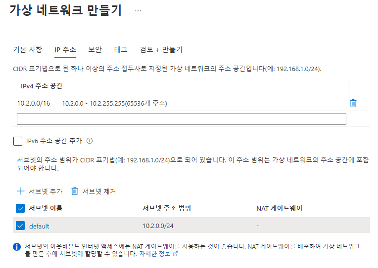
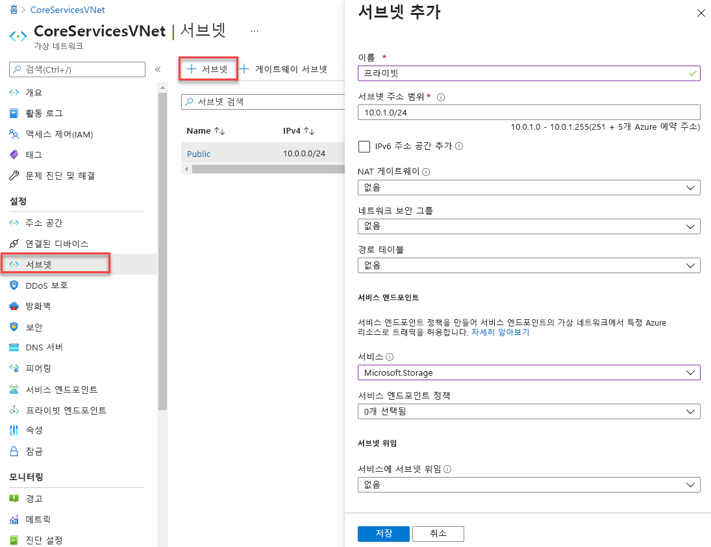
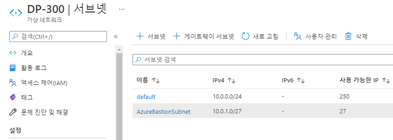
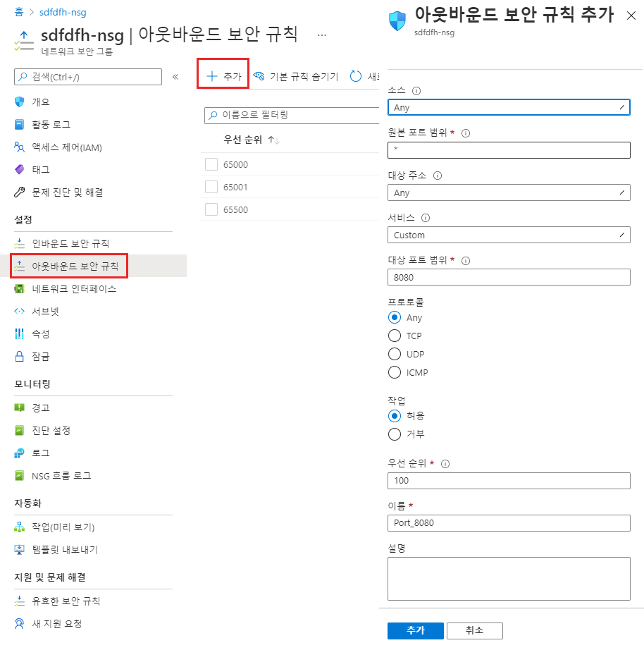
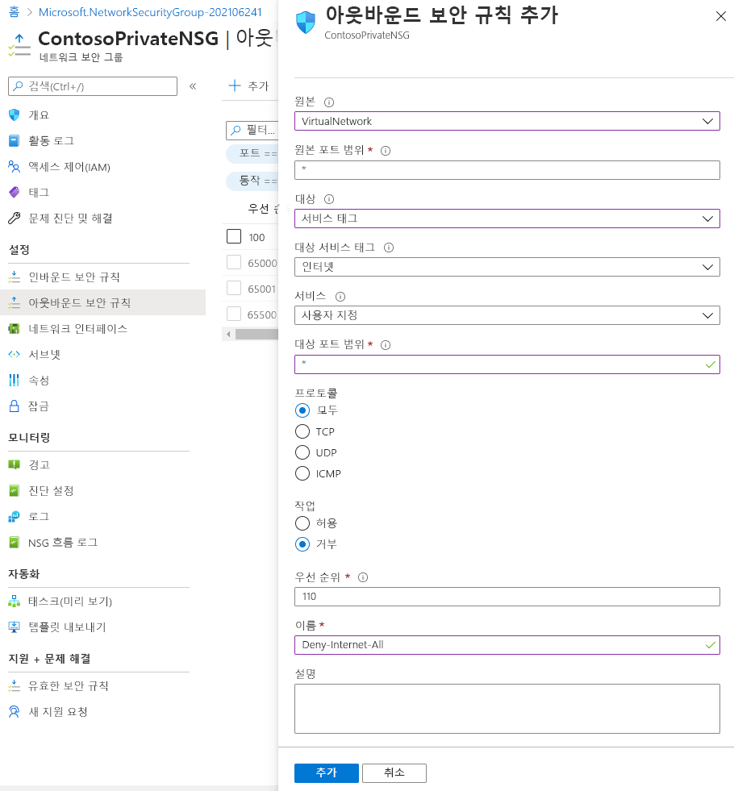
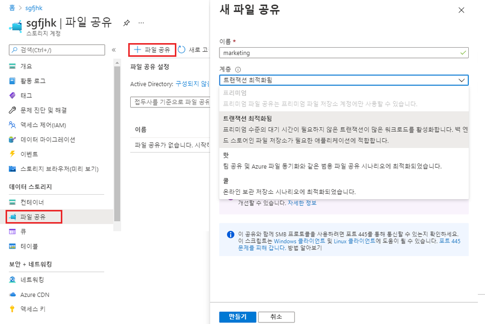
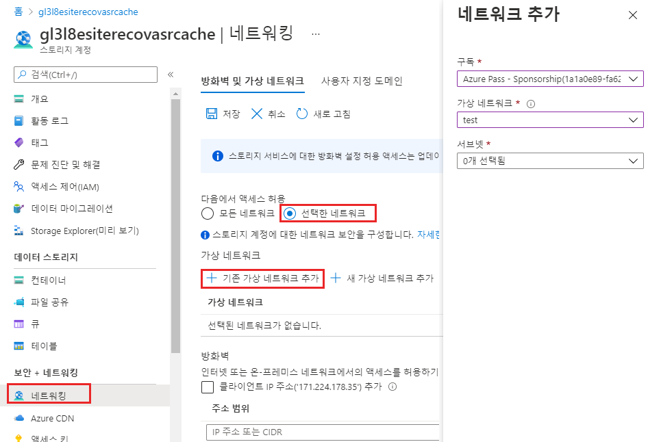
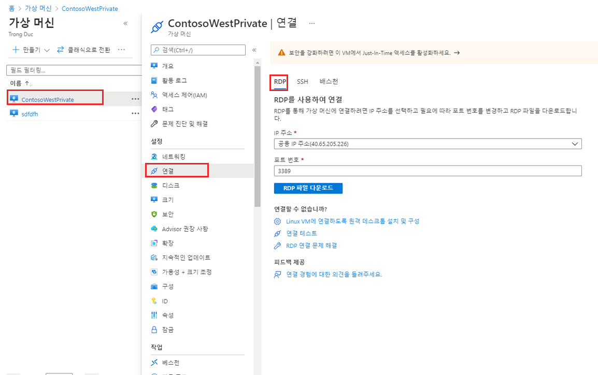
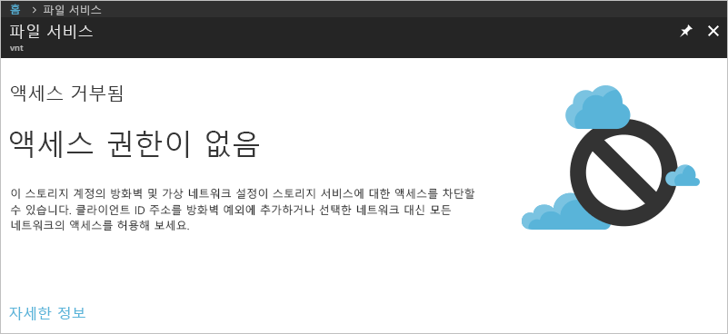

---
Exercise:
  title: M07-단원 5 가상 네트워크 서비스 엔드포인트로 PaaS 리소스에 대한 네트워크 액세스 제한
  module: Module - Design and implement private access to Azure Services
ms.openlocfilehash: 8c2767e40bf09e4df79012f8944720f53af729ee
ms.sourcegitcommit: df554624b7c12a0aaa6b55f343b42c46ecfbc88c
ms.translationtype: HT
ms.contentlocale: ko-KR
ms.lasthandoff: 02/09/2022
ms.locfileid: "138132285"
---
# <a name="m07-unit-5-restrict-network-access-to-paas-resources-with-virtual-network-service-endpoints"></a>M07-단원 5 가상 네트워크 서비스 엔드포인트로 PaaS 리소스에 대한 네트워크 액세스 제한


가상 네트워크 서비스 엔드포인트를 사용하면 일부 Azure 서비스 리소스에 대한 네트워크 액세스를 가상 네트워크 서브넷으로 제한할 수 있습니다. 리소스에 대한 인터넷 액세스를 제거할 수도 있습니다. 서비스 엔드포인트는 가상 네트워크에서 지원되는 Azure 서비스로의 직접 연결을 제공하므로 가상 네트워크의 프라이빗 주소 공간을 사용하여 Azure 서비스에 액세스할 수 있습니다. 서비스 엔드포인트를 통해 Azure 리소스에 도달하는 트래픽은 항상 Microsoft Azure 백본 네트워크에 유지됩니다.

이 연습에서 다음을 수행합니다.

+ 작업 1: 가상 네트워크 만들기
+ 작업 2: 서비스 엔드포인트 사용
+ 작업 3: 서브넷에 대한 네트워크 액세스 제한
+ 작업 4: 다른 아웃바운드 규칙 추가 
+ 작업 5: RDP 연결에 대한 액세스 허용
+ 작업 6: 리소스에 대한 네트워크 액세스 제한
+ 작업 7: 스토리지 계정에 파일 공유 만들기
+ 작업 8: 서브넷에 대한 네트워크 액세스 제한
+ 작업 9: 가상 머신 만들기
+ 작업 10: 스토리지 계정에 대한 액세스 확인
+ 작업 11: 리소스 정리

## <a name="task-1-create-a-virtual-network"></a>작업 1: 가상 네트워크 만들기

1. Azure Portal에 로그인합니다.

2. Azure Portal 홈페이지에서 가상 네트워크를 검색한 다음, 결과에서 **가상 네트워크** 를 선택합니다.

3. **+** **만들기** 를 선택합니다.

4. 다음 정보를 입력하거나 선택합니다. 

   | **설정**    | **값**                                     |
   | -------------- | --------------------------------------------- |
   | Subscription   | 구독 선택                      |
   | 리소스 그룹 | (신규) myResourceGroup                         |
   | 이름           | CoreServicesVNet                              |
   | 위치       | **미국 동부** 를 선택합니다.                            |

5. **IP 주소** 탭을 선택하고 다음 값을 입력합니다(서브넷 이름을 변경하려면 **기본값** 선택). 

   | **설정**          | **값**   |
   | -------------------- | ----------- |
   | 주소 공간        | 10.0.0.0/16 |
   | 서브넷 이름          | 공용      |
   | 서브넷 주소 범위 | 10.0.0.0/24 |

6. **보안** 탭을 선택하고 다음 값을 입력합니다. 

   | **설정**     | **값** |
   | --------------- | --------- |
   | BastionHost     | 사용 안 함  |
   | DDoS 보호 | 사용 안 함  |
   | 방화벽        | 사용 안 함  |

7. **검토 + 만들기** 를 클릭합니다. 리소스의 유효성을 검사한후 **만들기** 를 선택합니다. 

## <a name="task-2-enable-a-service-endpoint"></a>작업 2: 서비스 엔드포인트 사용

서비스 엔드포인트는 서비스 단위, 서브넷 단위로 활성화됩니다. 서브넷을 만들고 서브넷에 서비스 엔드포인트를 사용하도록 설정합니다.

1. 포털 상단의 **리소스, 서비스 및 문서 검색** 상자에 CoreServicesVNet을 입력합니다. 검색 결과에 CoreServicesVNet이 나타나면 이를 선택합니다.

2. 가상 네트워크에 서브넷을 추가합니다. 다음 그림과 같이 **설정** 에서 **서브넷** 을 선택한 후 **+ 서브넷** 을 선택합니다. 

3. **서브넷 추가** 에서 다음 정보를 선택하거나 입력합니다.

   | **설정**                 | **값**                    |
   | --------------------------- | ---------------------------- |
   | 속성                        | 프라이빗                      |
   | 주소 범위               | 10.0.1.0/24                  |
   | 서비스 엔드포인트: 서비스 | **Microsoft.Storage** 를 선택합니다. |

4. **저장** 을 선택합니다.

이제 두 개의 서브넷이 구성되어 있어야 합니다.



 

## <a name="task-3-restrict-network-access-for-a-subnet"></a>작업 3: 서브넷에 대한 네트워크 액세스 제한

기본적으로 모든 VM은 서브넷에 있는 모든 리소스와 통신할 수 있습니다. 네트워크 보안 그룹을 만들고 서브넷에 연결하여 서브넷에 있는 모든 리소스 간에 통신을 제한할 수 있습니다.

1. 포털 상단의 **리소스, 서비스 및 문서 검색** 상자에 **보안 그룹** 을 입력합니다. **네트워크 보안 그룹** 이 검색 결과에 표시되면 선택합니다.

2. 네트워크 보안 그룹에서 **+ 만들기** 를 선택합니다. 

3. 다음 정보를 입력하거나 선택합니다. 


   | **설정**    | **값**                                                    |
   | -------------- | ------------------------------------------------------------ |
   | Subscription   | 구독 선택                                     |
   | Resource group | myResourceGroup                                              |
   | 이름           | ContosoPrivateNSG                                            |
   | 위치       | **미국 동부** 를 선택합니다.                                           |

4. **검토 + 만들기** 를 선택한 후 **만들기** 를 클릭합니다.

5. ContosoPrivateNSG 네트워크 보안 그룹을 만든 후 **리소스로 이동** 을 선택합니다.

6. **설정** 에서 **아웃바운드 보안 규칙** 을 선택합니다.

7. **+추가** 를 선택합니다.

8. Azure Storage 서비스에 대해 아웃바운드 통신을 허용하는 규칙을 만듭니다. 다음 정보를 입력하거나 선택합니다. 

   | **설정**             | **값**                 |
   | ----------------------- | ------------------------- |
   | 원본                  | **VirtualNetwork** 를 선택합니다. |
   | 원본 포트 범위      | *                         |
   | 대상             | **서비스 태그** 를 선택합니다.    |
   | 대상 서비스 태그 | **스토리지** 를 선택합니다.        |
   | 서비스                 | 사용자 지정                    |
   | 대상 포트 범위 | *                         |
   | 프로토콜                | 모두                       |
   | 작업                  | 허용                     |
   | 우선 순위                | 100                       |
   | 속성                    | Allow-Storage-All         |

9. **추가** 를 선택합니다.


## <a name="task-4-add-additional-outbound-rules"></a>작업 4: 다른 아웃바운드 규칙 추가 

인터넷에 대한 통신을 거부하는 다른 아웃바운드 보안 규칙을 만듭니다. 이 규칙은 아웃바운드 인터넷 통신을 허용하는 모든 네트워크 보안 그룹의 기본 규칙을 재정의합니다. 

1. **아웃바운드 보안 규칙** 에서 **+추가** 를 선택합니다.

2. 다음 정보를 입력하거나 선택합니다. 

   | **설정**             | **값**                 |
   | ----------------------- | ------------------------- |
   | 원본                  | **VirtualNetwork** 를 선택합니다. |
   | 원본 포트 범위      | *                         |
   | 대상             | **서비스 태그** 를 선택합니다.    |
   | 대상 서비스 태그 | **인터넷** 을 선택합니다.       |
   | 서비스                 | 사용자 지정                    |
   | 대상 포트 범위 | *                         |
   | 프로토콜                | 모두                       |
   | 작업                  | 거부                      |
   | 우선 순위                | 110                       |
   | 속성                    | Deny-Internet-All(모든 인터넷 거부)         |

3. **추가** 를 선택합니다.

## <a name="task-5-allow-access-for-rdp-connections"></a>작업 5: RDP 연결에 대한 액세스 허용

어디에서든 서브넷에 대한 RDP(원격 데스크톱 프로토콜) 트래픽을 허용하는 인바운드 보안 규칙을 만듭니다. 이 규칙은 인터넷의 모든 인바운드 트래픽을 거부하는 기본 보안 규칙을 재정의합니다. 이후 단계에서 연결을 테스트할 수 있도록 서브넷에대 한 원격 데스크톱 연결이 허용됩니다.

1. ContosoPrivateNSG | 아웃바운드 보안 규칙의 **설정** 에서 **인바운드 보안 규칙** 을 선택합니다.

2. **+추가** 를 선택합니다.

3. 인바운드 보안 규칙 추가에서 다음 값을 입력합니다. 

   | **설정**             | **값**                 |
   | ----------------------- | ------------------------- |
   | 원본                  | 모두                       |
   | 원본 포트 범위      | *                         |
   | 대상             | **VirtualNetwork** 를 선택합니다. |
   | 서비스                 | 사용자 지정                    |
   | 대상 포트 범위 | 3389                      |
   | 프로토콜                | 모두                       |
   | 작업                  | 허용                     |
   | 우선 순위                | 120                       |
   | 속성                    | Allow-RDP-All             |

4. 그런 후 **추가** 를 선택합니다.

> **경고**: 3389 RDP 포트는 인터넷에 공개되어 있습니다. 이는 테스트용으로만 추천됩니다. 프로덕션 환경의 경우 VPN 또는 프라이빗 연결을 사용하는 것이 좋습니다.

5. **설정** 에서 **서브넷** 을 선택합니다.

6. **+ 연결** 을 선택합니다.

7. **서브넷 연결** 에서 **가상 네트워크** 를 선택한 후 **가상 네트워크 선택** 에서 **CoreServicesVNet** 을 선택합니다.

8. **서브넷 선택** 에서 **프라이빗** 을 선택한 다음, **확인** 을 선택합니다.

## <a name="task-6-restrict-network-access-to-a-resource"></a>작업 6: 리소스에 대한 네트워크 액세스 제한

서비스 엔드포인트에 사용할 수 있는 Azure 서비스를 통해 만든 리소스에 대한 네트워크 액세스를 제한하는 데 필요한 단계는 서비스에 따라 다릅니다. 각 서비스에 대한 특정 단계는 개별 서비스의 설명서를 참조하세요. 이 연습의 나머지 부분에는 Azure Storage 계정에 대한 네트워크 액세스를 제한하는 단계가 예제로 포함되어 있습니다.

1. Azure Portal에서 스토리지 계정을 선택합니다.

2. +만들기를 선택합니다.

3. 다음 정보를 입력하거나 선택하고, 나머지 기본값을 그대로 적용합니다.


   | **설정**    | **값**                                                    |
   | -------------- | ------------------------------------------------------------ |
   | Subscription   | 구독 선택                                     |
   | Resource group | myResourceGroup                                              |
   | 이름           | contosostoragexx를 입력합니다(xx는 이름을 고유하게 만들어 주는 사용자 이니셜). |
   | 성능    | Standard StorageV2(범용 v2)                      |
   | 위치       | 미국 동부를 선택합니다.                                               |
   | 복제    | LRS(로컬 중복 스토리지)                              |

4. **검토 + 만들기** 를 선택한 후 **만들기** 를 클릭합니다.

## <a name="task-7-create-a-file-share-in-the-storage-account"></a>작업 7: 스토리지 계정에 파일 공유 만들기

1. 스토리지 계정이 만들어진 후에 포털 맨 위에 있는 **리소스, 서비스 및 문서 검색** 상자에 스토리지 계정의 이름을 입력합니다. 스토리지 계정의 이름이 검색 결과에 표시되면 선택합니다.
2. 다음 그림과 같이 **파일 공유** 를 선택합니다. 
3. **+ 파일 공유** 를 선택합니다.
4. **이름** 에 marketing을 입력한 후 **만들기** 를 선택합니다.

## <a name="task-8-restrict-network-access-to-a-subnet"></a>작업 8: 서브넷에 대한 네트워크 액세스 제한

기본적으로 스토리지 계정은 인터넷을 비롯하여 네트워크에 있는 클라이언트의 네트워크 연결을 허용합니다. CoreServicesVNet 가상 네트워크에 있는 프라이빗 서브넷을 제외하고, 인터넷 및 가상 네트워크의 다른 모든 서브넷에서 네트워크 액세스를 거부합니다.

1. 스토리지 계정에 대한 **보안 + 네트워킹** 에서 **네트워킹** 을 선택합니다.

2. **선택한 네트워크** 를 선택합니다.

3. **+ 기존 가상 네트워크 추가** 를 선택합니다.

4. **네트워크 추가** 에서 다음 값을 선택합니다. 

   | **설정**      | **값**                    |
   | ---------------- | ---------------------------- |
   | Subscription     | 구독을 선택합니다.    |
   | 가상 네트워크 | CoreServicesVNet **을 선택합니다.** |
   | 서브넷          | **프라이빗** 을 선택합니다.          |

5. **추가** 를 선택합니다.

6. **저장** 을 선택합니다.

7. 스토리지 계정에 대한 **보안 및 네트워킹** 에서 **액세스 키** 를 선택합니다.

8. **키 표시** 를 선택합니다. 이후 단계에서 파일 공유를 VM의 드라이브 문자에 매핑할 때도 수동으로 입력해야 하므로 **키** 값을 적어둡니다.

## <a name="task-9-create-virtual-machines"></a>작업 9: 가상 머신 만들기

스토리지 계정에 대한 네트워크 액세스를 테스트하려면 각 서브넷에 VM을 배포합니다.

1. Azure Portal의 **Cloud Shell** 창에서 **PowerShell** 세션을 엽니다.

2. Cloud Shell 창의 도구 모음에서 파일 업로드/다운로드 아이콘을 선택하고, 드롭다운 메뉴에서 업로드를 선택한 다음, **VMs.json** 및 **VMs.parameters.json** 파일을 소스 폴더 **F:\Allfiles\Exercises\M07** 의 Cloud Shell 홈 디렉터리에 업로드합니다.

3. 다음 ARM 템플릿을 배포하여 이 연습에 필요한 VM을 만듭니다.

   ```powershell
   $RGName = "myResourceGroup"
   
   New-AzResourceGroupDeployment -ResourceGroupName $RGName -TemplateFile VMs.json -TemplateParameterFile VMs.parameters.json
   ```
  
4. 배포가 완료되면 Azure Portal 홈페이지로 이동한 다음 **가상 머신** 을 선택합니다.


## <a name="task-10-confirm-access-to-storage-account"></a>작업 10: 스토리지 계정에 대한 액세스 확인

1. ContosoPrivate VM에서 만들기가 완료되면 리소스로 이동을 선택하여 VM 블레이드를 엽니다. 연결 단추를 선택한 후 RDP를 선택합니다.
   
2. 연결 단추 및 RDP를 선택한 후 RDP 파일 다운로드 단추를 선택합니다. 원격 데스크톱 프로토콜(.rdp) 파일이 만들어지고 컴퓨터에 다운로드됩니다.
3. 다운로드한 rdp 파일을 엽니다. 메시지가 표시되면 연결을 선택합니다. VM을 만들 때 지정한 사용자 이름과 암호를 입력합니다. 추가 선택 사항, 다른 계정 사용을 차례로 선택하여 VM을 만들 때 입력한 자격 증명을 지정해야 할 수도 있습니다.
4. **확인** 을 선택합니다.
5. 로그인 프로세스 중에 인증서 경고가 나타날 수 있습니다. 경고 메시지가 표시되면 예 또는 계속을 선택하여 연결을 계속합니다.
6. ContosoPrivate VM에서 PowerShell을 사용하여 Azure 파일 공유를 Z 드라이브에 매핑합니다. 다음 명령을 실행하기 전에 <storage-account-key>, <storage-account-name>(즉, contosostoragexx), my-file-share(즉, 스토리지 계정 만들기 작업에서 입력했거나 가져온 값으로 바꿉니다.

```Azure CLI
$acctKey = ConvertTo-SecureString -String "<storage-account-key>" -AsPlainText -Force

$credential = New-Object System.Management.Automation.PSCredential -ArgumentList "Azure\<storage-account-name>", $acctKey

New-PSDrive -Name Z -PSProvider FileSystem -Root "\\<storage-account-name>.file.core.windows.net\marketing" -Credential $credential
```

Azure 파일 공유가 Z 드라이브에 매핑되었습니다.

7. VM에 인터넷에 대한 아웃바운드 연결이 없는지 명령 프롬프트에서 확인합니다.

 ping bing.com

프라이빗 서브넷에 연결된 네트워크 보안 그룹이 인터넷에 대한 아웃바운드 액세스를 허용하지 않아 응답이 수신되지 않습니다.

8. ContosoPrivate VM에 대한 원격 데스크톱 세션을 닫습니다.

### <a name="confirm-access-is-denied-to-storage-account"></a>스토리지 계정에 대한 액세스가 거부되는지 확인

1. 포털 상단의 **리소스, 서비스, 문서 검색** 상자에 ContosoPublic을 입력합니다.

2. 검색 결과에 **ContosoPublic** 이 표시되면 선택합니다.

3. ContosoPublic VM용 스토리지 계정 작업에 대한 액세스 확인에서 1~6단계를 완료합니다.  
     
   잠시 기다리면 New-PSDrive: 액세스가 거부되었습니다. 오류가 발생합니다. ContosoPublic VM이 퍼블릭 서브넷에 배포되어 액세스가 거부되었습니다. 공용 서브넷에는 Azure Storage에 사용하도록 설정된 서비스 엔드포인트가 없습니다. 스토리지 계정은 공용 서브넷이 아닌 프라이빗 서브넷으로부터의 네트워크 액세스만을 허용합니다.

4. 퍼블릭 VM이 명령 프롬프트에서 인터넷에 아웃바운드 연결되었는지 확인합니다.

 ping bing.com    
    
5. ContosoPublic VM에 대한 원격 데스크톱 세션을 닫습니다.

6. 컴퓨터에서 Azure Portal로 이동합니다.

7. **리소스, 서비스 및 문서 검색** 상자에 만든 스토리지 계정의 이름을 입력합니다. 스토리지 계정의 이름이 검색 결과에 표시되면 선택합니다.

8. **파일 공유** 를 선택한 다음, **마케팅** 파일 공유를 선택합니다.

9. 다음 스크린샷에 표시된 오류가 발생합니다.

    

 컴퓨터가 CoreServicesVNet 가상 네트워크의 프라이빗 서브넷에 없어 액세스가 거부되었습니다.

> **경고**: 계속하기 전에 이 랩에서 사용되는 모든 리소스를 제거해야 합니다. 리소스를 제거하려면 Azure Portal에서 리소스 그룹을 클릭합니다. 만든 리소스 그룹을 선택합니다. 리소스 그룹 블레이드에서 리소스 그룹 삭제를 클릭하고 리소스 그룹 이름을 입력한 후 삭제를 클릭합니다. 만들었을 수 있는 추가 리소스 그룹에 대해 이 프로세스를 반복합니다. 이렇게 하지 않으면 다른 랩에서 문제가 발생할 수 있습니다.

결과: 이제 이 연습을 완료했습니다.

## <a name="task-11-clean-up-resources"></a>작업 11: 리소스 정리

   >**참고**: 더 이상 사용하지 않는 새로 만든 Azure 리소스는 모두 제거하세요. 사용되지 않는 리소스를 제거하면 예기치 않은 요금이 발생하지 않습니다.

1. Azure Portal의 **Cloud Shell** 창에서 **PowerShell** 세션을 엽니다.

1. 다음 명령을 실행하여 이 모듈의 랩 전체에서 만든 모든 리소스 그룹을 삭제합니다.

   ```powershell
   Remove-AzResourceGroup -Name 'myResourceGroup' -Force -AsJob
   ```

    >**참고**: 이 명령은 -AsJob 매개 변수에 의해 결정되어 비동기로 실행되므로, 동일한 PowerShell 세션 내에서 이 명령을 실행한 직후 다른 PowerShell 명령을 실행할 수 있지만 리소스 그룹이 실제로 제거되기까지는 몇 분 정도 걸립니다.
