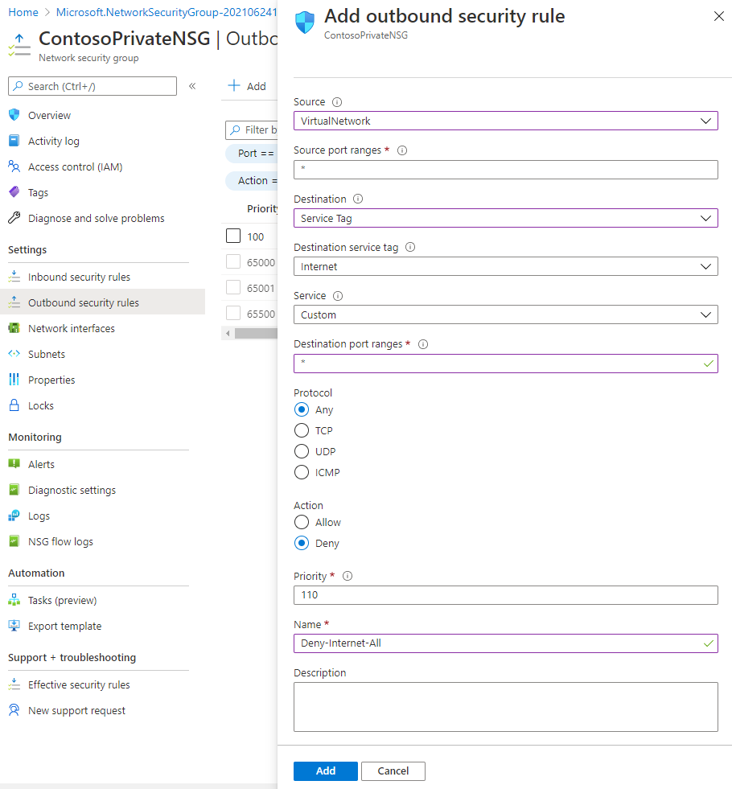
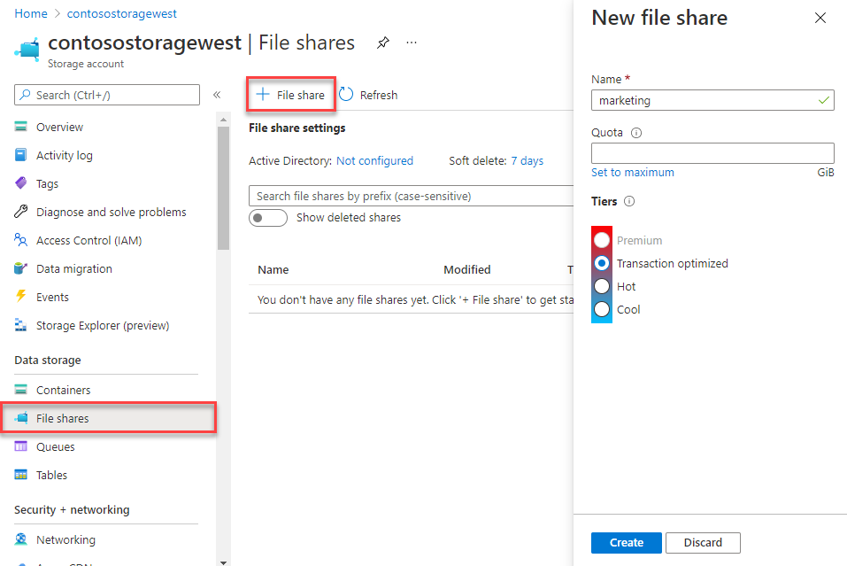

---
Exercise:
    title: 'M07-단원 5 가상 네트워크 서비스 엔드포인트로 PaaS 리소스에 대한 네트워크 액세스 제한'
    module: '모듈 - Azure 서비스에 대한 프라이빗 액세스 설계 및 구현'
---

# M07-단원 5 가상 네트워크 서비스 엔드포인트로 PaaS 리소스에 대한 네트워크 액세스 제한


가상 네트워크 서비스 엔드포인트를 사용하면 일부 Azure 서비스 리소스만 가상 네트워크 서브넷에 액세스하도록 네트워크 액세스 범위를 제한할 수 있습니다. 인터넷을 통한 리소스 액세스 권한을 제거할 수도 있습니다. 서비스 엔드포인트는 가상 네트워크에서 지원되는 Azure 서비스로 직접 연결하는 기능 제공하므로 가상 네트워크의 개인 주소 공간을 사용하여 Azure 서비스에 액세스할 수 있습니다. 서비스 엔드포인트를 통해 Azure 리소스로 전송되는 트래픽은 항상 Microsoft Azure 백본 네트워크에 유지됩니다.

이 연습에서는 다음을 수행합니다.

+ 작업 1: 가상 네트워크 만들기
+ 작업 2: 서비스 엔드포인트를 사용하도록 설정
+ 작업 3: 서브넷에 대한 네트워크 액세스 제한
+ 작업 4: 아웃바운드 규칙 더 추가 
+ 작업 5: RDP 연결을 위한 액세스 허용
+ 작업 6: 리소스로의 네트워크 액세스 제한
+ 작업 7: 스토리지 계정에서 파일 공유 만들기
+ 작업 8: 서브넷으로의 네트워크 액세스 제한
+ 작업 9: 가상 머신 만들기
+ 작업 10: 스토리지 계정 액세스 확인
+ 작업 11: 리소스 정리

## 작업 1: 가상 네트워크 만들기

1. Azure Portal에 로그인합니다.

2. Azure Portal 홈 페이지에서 가상 네트워크를 검색한 후 결과에서 **가상 네트워크**를 선택합니다.

3. **+ 만들기**를 선택합니다.

4. 다음 정보를 입력하거나 선택합니다.
   

   | **설정**    | **값**                                     |
   | -------------- | --------------------------------------------- |
   | 구독   | 보유한 구독 선택                      |
   | 리소스 그룹 | (신규) myResourceGroup                         |
   | 이름           | CoreServicesVNet                              |
   | 위치       | **미국 동부**를 선택합니다.                            |

5. **IP 주소** 탭을 선택하고 다음 값을 입력합니다(**기본값**을 선택하여 서브넷 이름 변경).
   

   | **설정**          | **값**   |
   | -------------------- | ----------- |
   | 주소 공간        | 10.0.0.0/16 |
   | 서브넷 이름          | Public      |
   | 서브넷 주소 범위 | 10.0.0.0/24 |

6. **보안** 탭을 선택하고 다음 값을 입력합니다.
   

   | **설정**     | **값** |
   | --------------- | --------- |
   | BastionHost     | 사용 안 함  |
   | DDoS 방지 | 사용 안 함  |
   | 방화벽        | 사용 안 함  |

7. **검토 + 만들기**를 클릭합니다. 리소스 유효성 검사가 완료되면 **만들기**를 선택합니다. 

## 작업 2: 서비스 엔드포인트를 사용하도록 설정

서비스/서브넷별로 서비스 엔드포인트를 사용하도록 설정합니다. 여기서는 서브넷을 만들고 해당 서브넷에 서비스 엔드포인트를 사용하도록 설정합니다.

1. 포털 맨 위에 있는 **리소스, 서비스 및 문서 검색** 상자에 CoreServicesVNet을 입력합니다. 검색 결과에 CoreServicesVNet이 표시되면 선택합니다.

2. 가상 네트워크에 서브넷을 추가합니다. 다음 그림과 같이 **설정**에서 **서브넷**을 선택한 다음 **+ 서브넷**을 선택합니다. 
   

3. **서브넷 추가**에서 다음 정보를 선택하거나 입력합니다.

   | **설정**                 | **값**                    |
   | --------------------------- | ---------------------------- |
   | 이름                        | Private                      |
   | 주소 범위               | 10.0.1.0/24                  |
   | 서비스 엔드포인트: 서비스 | **Microsoft.Storage**를 선택합니다. |

4. **저장**을 선택합니다.

이제 서브넷 2개가 구성되었습니다.


 

## 작업 3: 서브넷에 대한 네트워크 액세스 제한

기본적으로 서브넷의 모든 VM은 모든 리소스와 통신할 수 있습니다. 네트워크 보안 그룹을 만들어 서브넷에 연결하면 서브넷의 모든 리소스 간 통신을 제한할 수 있습니다.

1. 포털 맨 위에 있는 **리소스, 서비스 및 문서 검색** 상자에 **보안 그룹**을 입력합니다. 검색 결과에 **네트워크 보안 그룹**이 표시되면 선택합니다.

2. 네트워크 보안 그룹에서 **+ 만들기**를 선택합니다. 

3. 다음 정보를 입력하거나 선택합니다. 
   

   | **설정**    | **값**                                                    |
   | -------------- | ------------------------------------------------------------ |
   | 구독   | 보유한 구독 선택                                     |
   | 리소스 그룹 | myResourceGroup                                              |
   | 이름           | ContosoPrivateNSG                                            |
   | 위치       | **미국 동부**를 선택합니다.                                           |

4. **검토 + 만들기**를 선택하고 **만들기**를 클릭합니다.

5. ContosoPrivateNSG 네트워크 보안 그룹이 작성되고 나면 **리소스로 이동**을 선택합니다.
   

6. **설정** 아래에서 **아웃바운드 보안 규칙**을 선택합니다.

7. **+ 추가**를 선택합니다.

8. Azure Storage 서비스와의 아웃바운드 통신을 허용하는 규칙을 만듭니다. 다음 정보를 입력하거나 선택합니다.
   

   | **설정**             | **값**                 |
   | ----------------------- | ------------------------- |
   | 원본                  | **VirtualNetwork**를 선택합니다. |
   | 원본 포트 범위      | *                         |
   | 대상             | **서비스 태그**를 선택합니다.    |
   | 대상 서비스 태그 | **스토리지**를 선택합니다.        |
   | 서비스                 | 사용자 지정                    |
   | 대상 포트 범위 | *                         |
   | 프로토콜                | 모두                       |
   | 작업                  | 허용                     |
   | 우선 순위                | 100                       |
   | 이름                    | Allow-Storage-All         |

9. **추가**를 선택합니다.


## 작업 4: 아웃바운드 규칙 더 추가 

인터넷 통신을 거부하는 다른 아웃바운드 보안 규칙을 만듭니다. 이 규칙은 모든 네트워크 보안 그룹에서 아웃바운드 인터넷 통신을 허용하는 기본 규칙을 재정의합니다. 

1. **아웃바운드 보안 규칙** 아래에서 **+추가**를 선택합니다.

2. 다음 정보를 입력하거나 선택합니다.
   

   | **설정**             | **값**                 |
   | ----------------------- | ------------------------- |
   | 원본                  | **VirtualNetwork**를 선택합니다. |
   | 원본 포트 범위      | *                         |
   | 대상             | **서비스 태그**를 선택합니다.    |
   | 대상 서비스 태그 | **인터넷**을 선택합니다.       |
   | 서비스                 | 사용자 지정                    |
   | 대상 포트 범위 | *                         |
   | 프로토콜                | 모두                       |
   | 작업                  | 거부                      |
   | 우선 순위                | 110                       |
   | 이름                    | Deny-Internet-All         |

3. **추가**를 선택합니다.

## 작업 5: RDP 연결을 위한 액세스 허용

모든 위치에서 서브넷으로 전송되는 RDP(원격 데스크톱 프로토콜) 트래픽을 허용하는 인바운드 보안 규칙을 만듭니다. 이 규칙은 인터넷의 모든 인바운드 트래픽을 거부하는 기본 보안 규칙을 재정의합니다. 서브넷에 대한 원격 데스크톱 연결이 허용되므로 이후 단계에서 연결을 테스트할 수 있습니다.

1. ContosoPrivateNSG | 아웃바운드 보안 규칙의 **설정** 아래에서 **인바운드 보안 규칙**을 선택합니다.

2. **+ 추가**를 선택합니다.

3. 인바운드 보안 규칙 추가에서 다음 값을 입력합니다.
   

   | **설정**             | **값**                 |
   | ----------------------- | ------------------------- |
   | 원본                  | 모두                       |
   | 원본 포트 범위      | *                         |
   | 대상             | **VirtualNetwork**를 선택합니다. |
   | 서비스                 | 사용자 지정                    |
   | 대상 포트 범위 | 3389                      |
   | 프로토콜                | 모두                       |
   | 작업                  | 허용                     |
   | 우선 순위                | 120                       |
   | 이름                    | Allow-RDP-All             |

4. 그런 다음 **추가**를 선택합니다.

> **경고**: 3389 RDP 포트는 인터넷에 공개되어 있습니다. 이 옵션은 테스트 용도로만 사용하는 것이 좋습니다. 프로덕션 환경의 경우 VPN 또는 프라이빗 연결을 사용하는 것이 좋습니다.

5. **설정**에서 **서브넷**을 선택합니다.

6. **+ 연결**을 선택합니다.

7. **서브넷 연결**에서 **가상 네트워크**를 선택하고 **가상 네트워크 선택**에서 **CoreServicesVNet**을 선택합니다.

8. **서브넷 선택**에서 **Private**을 선택한 다음 **확인**을 선택합니다.

## 작업 6: 리소스로의 네트워크 액세스 제한

서비스 엔드포인트를 사용하도록 설정된 Azure 서비스를 통해 생성한 리소스로의 네트워크 액세스를 제한하기 위해 수행해야 하는 단계는 서비스별로 다릅니다. 각 서비스의 구체적인 단계는 개별 서비스의 설명서를 참조하세요. 이 연습의 나머지 부분에는 Azure Storage 계정에 대한 네트워크 액세스를 제한하는 단계가 예제로 포함되어 있습니다.

1. Azure Portal에서 스토리지 계정을 선택합니다.

2. +만들기를 선택합니다.

3. 다음 정보를 입력하거나 선택하고 나머지 항목은 기본값을 그대로 적용합니다.
   

   | **설정**    | **값**                                                    |
   | -------------- | ------------------------------------------------------------ |
   | 구독   | 보유한 구독 선택                                     |
   | 리소스 그룹 | myResourceGroup                                              |
   | 이름           | contosostoragewestxx 입력(여기서 xx는 이름을 고유하게 만드는 귀하의 이니셜) |
   | 성능    | 표준 StorageV2(범용 v2)                      |
   | 위치       | 미국 동부를 선택합니다.                                               |
   | 복제    | LRS(로컬 중복 스토리지)                              |

4. **검토 + 만들기**를 선택하고 **만들기**를 클릭합니다.

## 작업 7: 스토리지 계정에서 파일 공유 만들기

1. 스토리지 계정이 작성되고 나면 Portal 위쪽의 **리소스, 서비스 및 문서 검색** 상자에 스토리지 계정의 이름을 입력합니다. 검색 결과에 스토리지 계정의 이름이 표시되면 선택합니다.
2. 다음 그림과 같이 **파일 공유**를 선택합니다. 
   
3. **+ 파일 공유**를 선택합니다.
4. **이름** 아래에 marketing을 입력하고 **만들기**를 선택합니다.

## 작업 8: 서브넷으로의 네트워크 액세스 제한

기본적으로 스토리지 계정은 인터넷을 비롯한 모든 네트워크에서 클라이언트의 네트워크 연결을 수락합니다. CoreServicesVNet 가상 네트워크에 있는 프라이빗 서브넷을 제외하고 인터넷 및 다른 모든 서브넷과 모든 가상 네트워크로부터의 네트워크 액세스를 거부합니다.

1. 스토리지 계정의 **보안 + 네트워킹** 아래에서 **네트워킹**을 선택합니다.

2. **선택한 네트워크**를 선택합니다.

3. **+기존 가상 네트워크 추가**를 선택합니다.

4. **네트워크 추가** 아래에서 다음 값을 선택합니다.
   

   | **설정**      | **값**                    |
   | ---------------- | ---------------------------- |
   | 구독     | 구독을 선택합니다.    |
   | 가상 네트워크 | **CoreServicesVNet**을 선택합니다. |
   | 서브넷          | **프라이빗**을 선택합니다.          |

5. **추가**를 선택합니다.

6. **저장**을 선택합니다.

7. 스토리지 계정의 **보안 및 네트워킹** 아래에서 **액세스 키**를 선택합니다.

8. **키 표시**를 선택합니다. **키** 값을 적어 둡니다. 이후 단계에서 VM의 드라이브 문자에 파일 공유를 매핑할 때 이 값을 수동으로 입력해야 합니다.

## 작업 9: 가상 머신 만들기

스토리지 계정으로의 네트워크 액세스를 테스트하려면 각 서브넷에 VM을 배포합니다.

1. Azure Portal 홈 페이지에서 가상 머신을 선택하고 **+ 만들기**, **+가상 머신**을 차례로 선택합니다.

2. 기본 사항 탭에서 다음 정보를 입력하거나 선택합니다. 
   

   | **설정**           | **값**                                                    |
   | --------------------- | ------------------------------------------------------------ |
   | 프로젝트 세부 정보       |                                                              |
   | 구독          | 구독을 선택합니다.                                    |
   | 리소스 그룹        | myResourceGroup                                              |
   | 인스턴스 세부 정보      |                                                              |
   | 가상 머신 이름  | ContosoWestPublic                                            |
   | 지역                | (미국) 미국 동부                                                 |
   | 가용성 옵션  | 인프라 중복이 필요하지 않습니다.                        |
   | 이미지                 | **Windows Server 2019 Datacenter**를 선택합니다.                   |
   | 크기                  | Standard_D2s                                                 |
   | 관리자 계정 |                                                              |
   | 사용자 이름              | 선택한 사용자 이름을 입력합니다.                          |
   | 암호              | 선택한 암호를 입력합니다.                           |
   | 암호 확인      | 암호를 다시 입력합니다.                                       |
   | 인바운드 포트 규칙    |                                                              |
   | 공용 인바운드 포트  | 선택한 포트 허용                                         |
   | 인바운드 포트 선택  | RDP(3389)                                                   |

3. 그런 다음 **네트워킹** 탭을 선택합니다. 다음 정보를 입력하거나 선택합니다.
   

   | **설정**                | **값**                  |
   | -------------------------- | -------------------------- |
   | 가상 네트워크            | CoreServicesVNet           |
   | 서브넷                     | 공용(10.0.0.0/24)       |
   | 공용 IP                  | (신규) ContosoWestPublic-ip |
   | NIC 네트워크 보안 그룹 | 기본                      |
   | 공용 인바운드 포트       | 선택한 포트 허용       |
   | 인바운드 포트 선택       | RDP(3389)                 |

4. **검토 + 만들기**를 클릭합니다.

5. **만들기**를 선택하여 가상 머신 배포를 시작합니다. VM을 배포하려면 몇 분 정도 걸립니다. 하지만 VM이 생성되는 동안 다음 단계를 계속 진행해도 됩니다.

6. 2-5단계를 다시 진행하여 다른 가상 머신을 만듭니다. 단, 이번에는 가상 머신 이름을 ContosoWestPrivate로 지정하고 **프라이빗** 서브넷을 선택합니다.

VM을 배포하려면 몇 분 정도 걸립니다. VM 생성이 완료되고 VM 설정이 Portal에서 열릴 때까지는 다음 단계를 계속 진행하지 마세요.

 

## 작업 10: 스토리지 계정 액세스 확인

1. ContosoWestPrivate VM 작성이 완료되면 리소스로 이동을 선택하여 해당 VM의 블레이드를 엽니다. 연결 단추를 선택한 다음 RDP를 선택합니다.
   
2. 연결 단추와 RDP를 선택한 후에 RDP 파일 다운로드 단추를 선택합니다. 원격 데스크톱 프로토콜(.rdp) 파일이 만들어지고 컴퓨터에 다운로드됩니다.
3. 다운로드된 rdp 파일을 엽니다. 메시지가 표시되면 연결을 선택합니다. VM을 만들 때 지정한 사용자 이름과 암호를 입력합니다. 추가 선택 사항, 다른 계정 사용을 차례로 선택하여 VM을 만들 때 입력한 자격 증명을 지정해야 할 수도 있습니다.
4. **확인**을 선택합니다.
5. 로그인 프로세스 중에 인증서 경고가 표시될 수 있습니다. 경고 메시지가 표시되면 예 또는 계속을 선택하여 연결을 계속합니다.
6. ContosoWestPrivate VM에서 PowerShell을 사용하여 Azure 파일 공유를 Z 드라이브에 매핑합니다. 뒤에 나오는 명령을 실행하기 전에 <storage-account-key> , <storage-account-name>(contosostoragewestxx) 및 my-file-share(marketing)을 스토리지 계정 만들기 작업에서 입력 및 검색한 값으로 바꿉니다.

```Azure CLI
$acctKey = ConvertTo-SecureString -String "<storage-account-key>" -AsPlainText -Force

$credential = New-Object System.Management.Automation.PSCredential -ArgumentList "Azure\<storage-account-name>", $acctKey

New-PSDrive -Name Z -PSProvider FileSystem -Root "\\<storage-account-name>.file.core.windows.net\my-file-share" -Credential $credential
```

Azure 파일 공유가 Z 드라이브에 매핑됩니다.

7. 명령 프롬프트에서 VM에 인터넷으로의 아웃바운드 연결이 설정되어 있지 않음을 확인합니다.

 ping bing.com

Private 서브넷에 연결된 네트워크 보안 그룹이 인터넷에 대한 아웃바운드 액세스를 허용하지 않기 때문에 응답이 수신되지 않습니다.

8. ContosoWestPrivate VM에 대한 원격 데스크톱 세션을 닫습니다.

### 스토리지 계정 액세스가 거부되는지 확인

1. 포털 맨 위에 있는 **리소스, 서비스 및 문서 검색** 상자에 ContosoWestPublic을 입력합니다.

2. 검색 결과에 **ContosoWestPublic**이 표시되면 선택합니다.

3. ContosoWestPublic VM에서 스토리지 계정 액세스 확인 작업의 1-6단계를 완료합니다.  
     
   ‎잠시 기다리면 New-PSDrive : Access is denied 오류가 표시됩니다. ContosoWestPublic VM이 Public 서브넷에 배포되었으므로 액세스가 거부되었습니다. Public 서브넷에는 Azure Storage에 사용하도록 설정된 서비스 엔드포인트가 없습니다. 스토리지 계정은 Public 서브넷이 아닌 Private 서브넷으로부터의 네트워크 액세스만을 허용합니다.

4. 명령 프롬프트에서 공용 VM에 인터넷으로의 아웃바운드 연결이 설정되어 있지 않음을 확인합니다.

 ping bing.com    
    
5. ContosoWestPublic VM에 대한 원격 데스크톱 세션을 닫습니다.

6. 컴퓨터에서 Azure Portal로 이동합니다.

7. 앞에서 만든 스토리지 계정의 이름을 **리소스, 서비스 및 문서 검색** 상자에 입력합니다. 검색 결과에 스토리지 계정의 이름이 표시되면 선택합니다.

8. **파일 공유**를 선택하고 **marketing** 파일 공유를 선택합니다.

9. 다음 스크린샷에 나와 있는 오류가 발생합니다.

    

 컴퓨터가 CoreServicesVNet 가상 네트워크의 Private 서브넷에 없기 때문에 액세스가 거부되었습니다.

> **경고**: 계속 진행하기 전에 이 랩에서 사용한 모든 리소스를 제거해야 합니다. 리소스를 제거하려면 Azure Portal에서 리소스 그룹을 클릭합니다. 랩에서 만든 리소스 그룹을 모두 선택합니다. 리소스 그룹 블레이드에서 리소스 그룹 삭제를 클릭하고 리소스 그룹 이름을 입력한 후에 삭제를 클릭합니다. 추가로 만든 리소스 그룹이 있으면 이 프로세스를 반복합니다. 이렇게 하지 않으면 다른 랩에서 문제가 발생할 수 있습니다.

결과: 이 랩이 완료되었습니다.

## 작업 11: 리소스 정리

   >**참고**: 더 이상 사용하지 않는 새로 만든 Azure 리소스를 제거해야 합니다. 사용하지 않는 리소스를 제거하면 예기치 않은 비용이 발생하지 않습니다.

1. Azure Portal에서 **Cloud Shell** 창 내의 **PowerShell** 세션을 엽니다.

1. 다음 명령을 실행하여 이 모듈의 전체 랩에서 만든 모든 리소스 그룹을 삭제합니다.

   ```powershell
   Remove-AzResourceGroup -Name 'myResourceGroup' -Force -AsJob
   ```

    >**참고**: 명령은 비동기적으로 실행되므로(-AsJob 매개 변수에 의해 결정됨) 동일한 PowerShell 세션 내에서 즉시 다른 PowerShell 명령을 실행할 수 있지만 리소스 그룹이 실제로 제거되기까지 몇 분 정도 걸릴 것입니다.
