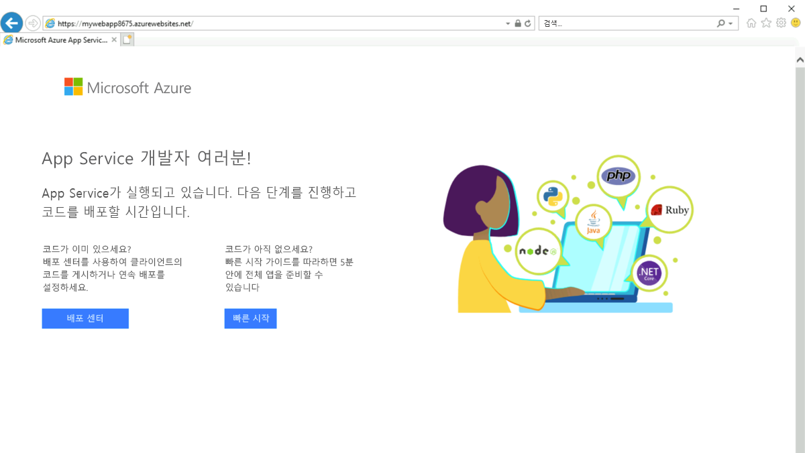

---
Exercise:
  title: M07 - 단원 6 Azure PowerShell을 사용하여 Azure 프라이빗 엔드포인트 만들기
  module: Module 07 - Design and implement private access to Azure Services
---

# M07-단원 6 Azure PowerShell을 사용하여 Azure 프라이빗 엔드포인트 만들기

Private Endpoint를 통해 Azure 웹앱에 안전하게 연결하여 Azure Private Link를 시작합니다. Portal, CLI, PowerShell 등의 다양한 방법을 사용하여 엔드포인트를 만들 수 있습니다. 

                **참고:** **[대화형 랩 시뮬레이션](https://mslabs.cloudguides.com/guides/AZ-700%20Lab%20Simulation%20-%20Create%20an%20Azure%20private%20endpoint%20using%20Azure%20PowerShell)** 을 사용하여 이 랩을 원하는 속도로 클릭할 수 있습니다. 대화형 시뮬레이션과 호스트된 랩 간에 약간의 차이가 있을 수 있지만 보여주는 핵심 개념과 아이디어는 동일합니다.

#### 예상 시간: 45분

Azure 웹앱용 프라이빗 엔드포인트를 만들고, 가상 머신을 배포하여 프라이빗 연결을 테스트합니다.

Azure SQL과 Azure Storage 같은 다양한 종류의 Azure 서비스에 대한 프라이빗 엔드포인트를 만들 수 있습니다.

**필수 구성 요소**

- PremiumV2 계층 이상의 App Service 요금제가 Azure 구독에 배포된 Azure 웹앱

- 아래 단계에서는 필요한 리소스 그룹과 웹앱을 만드는 방법을 살펴봅니다.

1. M07 폴더에서 **parameters.json**을 찾아서 엽니다. 메모장에서 열어 “value” 줄을 찾습니다. "GEN-UNIQUE". 자리 표시자 GEN-UNIQUE 문자열을 웹앱 이름의 고유 값으로 바꿉니다. 이 변경 사항을 저장합니다.

1. Azure Portal **Cloud Shell** 창에서 **PowerShell** 세션을 엽니다.

1. Cloud Shell 창의 도구 모음에서 **파일 업로드/다운로드** 아이콘을 선택하고 드롭다운 메뉴에서 **업로드**를 선택하고 **template.json 및 parameters.json** 파일을 Cloud Shell 홈 디렉터리에 하나씩 업로드합니다.****

PowerShell을 로컬로 설치하고 사용하도록 선택하는 경우, 이 예에서는 Azure PowerShell 모듈 버전 5.4.1 이상이 필요합니다. 설치되어 있는 버전을 확인하려면 ```Get-Module -ListAvailable Az```을 실행합니다. 업그레이드해야 하는 경우 [Azure PowerShell 모듈 설치](https://docs.microsoft.com/en-us/powershell/azure/install-az-ps)를 참조하세요. 또한 PowerShell을 로컬로 실행하는 경우 ```Connect-AzAccount```를 실행하여 Azure와 연결해야 합니다.

이 연습에서 다음을 수행합니다.

+ 작업 1: 리소스 그룹 만들기
+ 작업 2: 가상 네트워크 및 베스천 호스트 만들기
+ 작업 3: 테스트 가상 머신 만들기
+ 작업 4: 프라이빗 엔드포인트 만들기
+ 작업 5: 프라이빗 DNS 영역 구성
+ 작업 6: 프라이빗 엔드포인트에 대한 연결 테스트
+ 작업 7: 리소스 정리

## 작업 1: 리소스 그룹 만들기 및 필수 요건 웹앱 배포

Azure 리소스 그룹은 Azure 리소스가 배포 및 관리되는 논리적 컨테이너입니다.

[New-AzResourceGroup](https://docs.microsoft.com/en-us/powershell/module/az.resources/new-azresourcegroup)을 사용하여 다음 리소스 그룹을 만듭니다.

```PowerShell
New-AzResourceGroup -Name 'CreatePrivateEndpointQS-rg' -Location 'eastus'
```
다음 ARM 템플릿을 배포하여 이 연습에 필요한 PremiumV2-tier Azure 웹앱을 만듭니다.

   ```powershell
   $RGName = "CreatePrivateEndpointQS-rg"
   
   New-AzResourceGroupDeployment -ResourceGroupName $RGName -TemplateFile template.json -TemplateParameterFile parameters.json
   ```
(예를 들어 포털에서 배포 상태를 조사하는 동안) “이름이 GEN-UNIQUE인 웹 사이트가 이미 있음”과 같은 오류가 표시되는 경우 템플릿 편집과 관련하여 위에서 언급한 필수 구성 요소로 이동하세요.

## 작업 2: 가상 네트워크 및 베스천 호스트 만들기

가상 네트워크, 서브넷 및 베스천 호스트를 만듭니다.

베스천 호스트는 가상 머신에 안전하게 연결하여 프라이빗 엔드포인트를 테스트하는 데 사용됩니다.

가상 네트워크 및 베스천 호스트 만들기

- New-AzVirtualNetwork

- New-AzPublicIpAddress

- New-AzBastion

 

```PowerShell
## Create backend subnet config. ##

$subnetConfig = New-AzVirtualNetworkSubnetConfig -Name myBackendSubnet -AddressPrefix 10.0.0.0/24

## Create Azure Bastion subnet. ##

$bastsubnetConfig = New-AzVirtualNetworkSubnetConfig -Name AzureBastionSubnet -AddressPrefix 10.0.1.0/24

## Create the virtual network. ##

$parameters1 = @{

 Name = 'MyVNet'

 ResourceGroupName = 'CreatePrivateEndpointQS-rg'

 Location = 'eastus'

 AddressPrefix = '10.0.0.0/16'

 Subnet = $subnetConfig, $bastsubnetConfig

}

$vnet = New-AzVirtualNetwork @parameters1

## Create public IP address for bastion host. ##

$parameters2 = @{

 Name = 'myBastionIP'

 ResourceGroupName = 'CreatePrivateEndpointQS-rg'

 Location = 'eastus'

 Sku = 'Standard'

 AllocationMethod = 'Static'

}

$publicip = New-AzPublicIpAddress @parameters2

## Create bastion host ##

$parameters3 = @{

 ResourceGroupName = 'CreatePrivateEndpointQS-rg'

 Name = 'myBastion'

 PublicIpAddress = $publicip

 VirtualNetwork = $vnet

}

New-AzBastion @parameters3
```


## 작업 3: 테스트 가상 머신 만들기

이 섹션에서는 프라이빗 엔드포인트를 테스트하는 데 사용될 가상 머신을 만듭니다.

다음 명령을 사용하여 가상 머신을 만듭니다.

- Get-Credential(참고: 관리 암호를 입력하라는 메시지가 표시됩니다.)

- New-AzNetworkInterface

- New-AzVM

- New-AzVMConfig

- Set-AzVMOperatingSystem

- Set-AzVMSourceImage

- Add-AzVMNetworkInterface

```PowerShell
## Set credentials for server admin and password. ##

$cred = Get-Credential

## Command to get virtual network configuration. ##

$vnet = Get-AzVirtualNetwork -Name myVNet -ResourceGroupName CreatePrivateEndpointQS-rg

## Command to create network interface for VM ##

$parameters1 = @{

 Name = 'myNicVM'

 ResourceGroupName = 'CreatePrivateEndpointQS-rg'

 Location = 'eastus'

 Subnet = $vnet.Subnets[0]

}

$nicVM = New-AzNetworkInterface @parameters1

## Create a virtual machine configuration.##

$parameters2 = @{

 VMName = 'myVM'

 VMSize = 'Standard_DS1_v2'

}

$parameters3 = @{

 ComputerName = 'myVM'

 Credential = $cred

}

$parameters4 = @{

 PublisherName = 'MicrosoftWindowsServer'

 Offer = 'WindowsServer'

 Skus = '2019-Datacenter'

 Version = 'latest'

}

$vmConfig = New-AzVMConfig @parameters2 | Set-AzVMOperatingSystem -Windows @parameters3 | Set-AzVMSourceImage @parameters4 | Add-AzVMNetworkInterface -Id $nicVM.Id

## Create the virtual machine ##

New-AzVM -ResourceGroupName 'CreatePrivateEndpointQS-rg' -Location 'eastus' -VM $vmConfig 


```


Azure는 공용 IP 주소가 할당되지 않았거나 내부 기본 Azure Load Balancer의 백 엔드 풀에 있는 Azure Virtual Machines에 대한 임시 IP를 제공합니다. 임시 IP 메커니즘은 구성할 수 없는 아웃바운드 IP 주소를 제공합니다.

공용 IP 주소가 가상 머신에 할당되거나 아웃바운드 규칙이 있거나 없는 표준 Load Balancer의 백 엔드 풀에 가상 머신이 배치되면 임시 IP가 비활성화됩니다. Azure Virtual Network NAT 게이트웨이 리소스가 가상 머신의 서브넷에 할당되면 임시 IP가 비활성화됩니다.

Azure의 아웃바운드 연결에 대한 자세한 내용은 아웃바운드 연결에 SNAT(원본 네트워크 주소 변환) 사용을 참조하세요.

## 작업 4: 프라이빗 엔드포인트 만들기

이 섹션에서는 다음을 사용하여 프라이빗 엔드포인트와 연결을 만듭니다.

- New-AzPrivateLinkServiceConnection

- New-AzPrivateEndpoint

 

```PowerShell
## Place web app into variable. This assumes that only one web app exists in the resource group. ##

$webapp = Get-AzWebApp -ResourceGroupName CreatePrivateEndpointQS-rg

## Create Private Endpoint connection. ##

$parameters1 = @{

 Name = 'myConnection'

 PrivateLinkServiceId = $webapp.ID

 GroupID = 'sites'

}

$privateEndpointConnection = New-AzPrivateLinkServiceConnection @parameters1

## Place virtual network into variable. ##

$vnet = Get-AzVirtualNetwork -ResourceGroupName 'CreatePrivateEndpointQS-rg' -Name 'myVNet'

## Disable private endpoint network policy ##

$vnet.Subnets[0].PrivateEndpointNetworkPolicies = "Disabled"

$vnet | Set-AzVirtualNetwork

## Create private endpoint

$parameters2 = @{

 ResourceGroupName = 'CreatePrivateEndpointQS-rg'

 Name = 'myPrivateEndpoint'

 Location = 'eastus'

 Subnet = $vnet.Subnets[0]

 PrivateLinkServiceConnection = $privateEndpointConnection

}

New-AzPrivateEndpoint @parameters2 
```


## 작업 5: 프라이빗 DNS 영역 구성

이 섹션에서는 다음을 사용하여 프라이빗 DNS 영역을 만들어 구성합니다.

- New-AzPrivateDnsZone

- New-AzPrivateDnsVirtualNetworkLink

- New-AzPrivateDnsZoneConfig

- New-AzPrivateDnsZoneGroup

```PowerShell
## Place virtual network into variable. ##

$vnet = Get-AzVirtualNetwork -ResourceGroupName 'CreatePrivateEndpointQS-rg' -Name 'myVNet'

## Create private dns zone. ##

$parameters1 = @{

 ResourceGroupName = 'CreatePrivateEndpointQS-rg'

 Name = 'privatelink.azurewebsites.net'

}

$zone = New-AzPrivateDnsZone @parameters1

## Create dns network link. ##

$parameters2 = @{

 ResourceGroupName = 'CreatePrivateEndpointQS-rg'

 ZoneName = 'privatelink.azurewebsites.net'

 Name = 'myLink'

 VirtualNetworkId = $vnet.Id

}

$link = New-AzPrivateDnsVirtualNetworkLink @parameters2

## Create DNS configuration ##

$parameters3 = @{

 Name = 'privatelink.azurewebsites.net'

 PrivateDnsZoneId = $zone.ResourceId

}

$config = New-AzPrivateDnsZoneConfig @parameters3

## Create DNS zone group. ##

$parameters4 = @{

 ResourceGroupName = 'CreatePrivateEndpointQS-rg'

 PrivateEndpointName = 'myPrivateEndpoint'

 Name = 'myZoneGroup'

 PrivateDnsZoneConfig = $config

}

New-AzPrivateDnsZoneGroup @parameters4 
```


## 작업 6: 프라이빗 엔드포인트에 대한 연결 테스트

이 섹션에서는 이전 단계에서 만든 가상 머신을 사용하여 프라이빗 엔드포인트에서 웹앱에 연결합니다.

1. [Azure 포털](https://portal.azure.com/)

1. 왼쪽 탐색 창에서 **리소스 그룹**을 선택합니다.

1. **CreatePrivateEndpointQS-rg**를 선택합니다.

1. **myVM**을 선택합니다.

1. **myVM**에 대한 개요 페이지에서 **연결**을 선택한 다음, **Bastion**을 선택합니다.

1. 파란색 **Bastion 사용** 단추를 선택합니다.

1. 가상 머신 만들기에서 입력한 사용자 이름과 암호를 입력합니다.

1. 연결한 후 서버에서 Windows PowerShell을 엽니다.

1. nslookup &lt;your- webapp-name&gt;.azurewebsites.net을 입력합니다. &lt;your-webapp-name&gt;은 이전 단계에서 만든 웹앱의 이름으로 바꿉니다. 아래 표시된 것과 유사한 메시지가 표시됩니다.

  ```
  Server: UnKnown
  
  Address: 168.63.129.16
  
  Non-authoritative answer:
  
  Name: mywebapp8675.privatelink.azurewebsites.net
  
  Address: 10.0.0.5
  
  Aliases: mywebapp8675.azurewebsites.net 
  ```  


웹앱 이름에 대해 **10.0.0.5**의 개인 IP 주소가 반환됩니다. 이 주소는 이전에 만든 가상 네트워크의 서브넷에 있습니다.

1. **myVM**에 대한 베스천 연결에서 Internet Explorer를 엽니다.
1. 웹앱의 URL, **https://&lt;your-webapp-name&gt;.azurewebsites.net**을 입력합니다.
1. 애플리케이션이 배포되지 않은 경우 기본 웹앱 페이지를 받게 됩니다. 
1. **myVM**에 대한 연결을 닫습니다. 

## 작업 7: 리소스 정리

프라이빗 엔드포인트 및 VM 사용을 마쳤으면 [Remove-AzResourceGroup](https://docs.microsoft.com/en-us/powershell/module/az.resources/remove-azresourcegroup)을 사용하여 리소스 그룹과 리소스 그룹에 포함된 모든 리소스를 제거합니다.

```PowerShell
Remove-AzResourceGroup -Name CreatePrivateEndpointQS-rg -Force -AsJob
```


