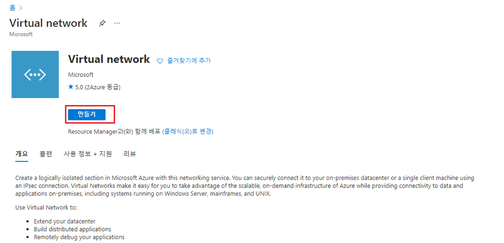
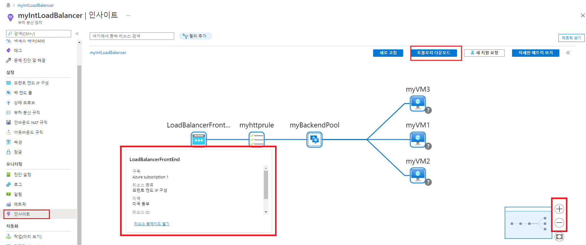

---
Exercise:
    title: 'M08-단원 3 Azure Monitor를 사용하여 부하 분산 장치 리소스 모니터링'
    module: '모듈 - 네트워크 모니터링 설계 및 구현'
---

# M08-단원 3 Azure Monitor를 사용하여 부하 분산 장치 리소스 모니터링


이 연습에서는 가상의 조직인 Contoso Ltd.용 내부 부하 분산 장치를 만듭니다. 그런 다음 Log Analytics 작업 영역을 만들고, Azure Monitor Insights를 사용해 내부 부하 분산 장치 관련 정보를 확인합니다. 또한 함수 종속성 뷰, 부하 분산 장치 리소스의 세부 메트릭, 그리고 부하 분산 장치 관련 리소스 상태 정보를 확인합니다. 그런 후에 마지막으로 직접 만든 Log Analytics 작업 영역으로 메트릭을 보내도록 부하 분산 장치의 진단 설정을 구성합니다. 

이 연습에서 배포할 환경이 아래 다이어그램에 나와 있습니다.


 이 연습에서는 다음을 수행합니다.

+ 작업 1: 가상 네트워크 만들기
+ 작업 2: 부하 분산 장치 만들기
+ 작업 3: 백 엔드 풀 만들기
+ 작업 4: 상태 프로브 만들기
+ 작업 5: 부하 분산 장치 규칙 만들기
+ 작업 6: 백 엔드 서버 만들기
+ 작업 7: Add VMs to the backend pool
+ 작업 8: VM에 IIS 설치
+ 작업 9: 부하 분산 장치 테스트
+ 작업 10: Log Analytics 작업 영역 만들기
+ 작업 11: 함수 종속성 뷰 사용
+ 작업 12: 자세한 메트릭 보기
+ 작업 13: 리소스 상태 보기
+ 작업 14: 진단 설정 구성
+ 작업 15: 리소스 정리


## 작업 1: 가상 네트워크 만들기

이 섹션에서는 가상 네트워크와 서브넷을 만듭니다.

1. Azure Portal에 로그인합니다.

2. Azure Portal 홈 페이지에서 **가상 네트워크**를 검색한 후 서비스에서 가상 네트워크를 선택합니다.

3. **+ 만들기**를 클릭합니다.

   

4. **기본 사항** 탭에서 다음 표의 정보를 사용하여 가상 네트워크를 만듭니다.

   | **설정**    | **값**                                           |
   | -------------- | --------------------------------------------------- |
   | 구독   | 보유한 구독 선택                            |
   | 리소스 그룹 | **새로 만들기**를 선택합니다.<br /><br />이름: **IntLB-RG** |
   | 이름           | **IntLB-VNet**                                      |
   | 지역         | **(미국) 미국 서부**                                    |

5. **다음: IP 주소**를 클릭합니다.

6. **IP 주소** 탭의 **IPv4 주소 공간** 상자에 **10.1.0.0/16**을 입력합니다.

7. 위 **서브넷 이름**에서 **+ 서브넷 추가**를 선택합니다.

8. **서브넷 추가** 창에서 서브넷 이름으로는 **myBackendSubnet**을, 서브넷 주소 범위로는 **10.1.0.0/24**를 입력합니다.

9. **추가**를 클릭합니다.

10. **다음: 보안**을 클릭합니다.

11. **BastionHost** 아래에서 **사용**을 선택하고 다음 표의 정보를 입력합니다.

    | **설정**                       | **값**                                              |
    | --------------------------------- | ------------------------------------------------------ |
    | Bastion 이름                      | **myBastionHost**                                      |
    | AzureBastionSubnet 주소 공간  | **10.1.1.0/24**                                        |
    | 공용 IP 주소                 | **새로 만들기**를 선택합니다.<br /><br />이름: **myBastionIP** |

12. **검토 + 만들기**를 클릭합니다.

13. **만들기**를 클릭합니다.

## 작업 2: 부하 분산 장치 만들기

이 섹션에서는 내부 표준 SKU 부하 분산 장치를 만듭니다. 이 연습에서 기본 SKU 부하 분산 장치가 아닌 표준 SKU 부하 분산 장치를 만드는 이유는, 부하 분산 장치의 표준 SKU 버전이 필요한 이후 연습에서 사용하기 위해서입니다.

1. Azure Portal 홈 페이지에서 페이지 위쪽의 검색 상자에 **부하 분산 장치**를 입력하고 서비스에서 부하 분산 장치를 선택합니다.

2. **만들기**를 클릭합니다.

   

3. **기본 사항** 탭에서 다음 표의 정보를 사용하여 부하 분산 장치를 만듭니다.

   | **설정**           | **값**                |
   | --------------------- | ------------------------ |
   | 기본 사항 탭            |                          | 
   | 구독          | 보유한 구독 선택 |
   | 리소스 그룹        | **IntLB-RG**             |
   | 이름                  | **myIntLoadBalancer**    |
   | 지역                | **(미국) 미국 서부**         |
   | SKU                   | **표준**             |
   | 유형                  | **내부**             |
   | 프런트 엔드 IP 구성 탭 | + 프런트 엔드 IP 구성 추가 |
   | 가상 네트워크       | **IntLB-VNet**           |
   | 서브넷                | **myBackendSubnet**      |
   | IP 주소 할당 | **동적**              |


4. **검토 + 만들기**를 클릭합니다.


5. **만들기**를 클릭합니다.


## 작업 3: 백 엔드 풀 만들기

백 엔드 주소 풀에는 부하 분산 장치에 연결된 가상 NIC의 IP 주소가 포함됩니다.

1. Azure Portal 홈 페이지에서 **모든 리소스**를 클릭한 다음 리소스 목록에서 **myIntLoadBalancer**를 클릭합니다.

2. **설정** 아래에서 **백 엔드 풀**을 선택하고 **추가**를 클릭합니다.

3. **백 엔드 풀 추가** 페이지에서 다음 표의 정보를 입력합니다.

   | **설정**     | **값**            |
   | --------------- | -------------------- |
   | 이름            | **myBackendPool**    |
   | 가상 네트워크 | **IntLB-VNet**       |
   | 연결된   | **가상 머신** |

4. **추가**를 클릭합니다.

   

   

## 작업 4: 상태 프로브 만들기

부하 분산 장치는 상태 프로브를 사용하여 앱의 상태를 모니터링합니다. 상태 프로브는 상태 검사의 응답에 따라 부하 분산 장치에서 VM을 추가하거나 제거합니다. 여기서는 VM 상태를 모니터링하는 상태 프로브를 만듭니다.

1. 부하 분산 장치의 **백 엔드 풀** 페이지 **설정** 아래에서 **상태 프로브**, **추가**를 차례로 클릭합니다.

2. **상태 프로브 추가** 페이지에서 다음 표의 정보를 입력합니다.

   | **설정**         | **값**         |
   | ------------------- | ------------------ |
   | 이름                | **myHealthProbe** |
   | 프로토콜            | **HTTP**          |
   | 포트                | **80**            |
   | 경로                | **/**             |
   | 간격            | **15**            |
   | 비정상 임계값 | **2**             |

3. **추가**를 클릭합니다.

   


## 작업 5: 부하 분산 장치 규칙 만들기

부하 분산 장치 규칙은 트래픽이 VM에 분산되는 방식을 정의하는 데 사용됩니다. 들어오는 트래픽에 대한 프런트 엔드 IP 구성 및 트래픽을 받는 백 엔드 IP 풀을 정의합니다. 원본 및 대상 포트는 규칙에 정의됩니다. 여기서는 부하 분산 장치 규칙을 만듭니다.

1. 부하 분산 장치의 **백 엔드 풀** 페이지 **설정** 아래에서 **부하 분산 장치 규칙**, **추가**를 차례로 클릭합니다.

2. **부하 분산 규칙 추가** 페이지에서 다음 표의 정보를 입력합니다.

   | **설정**            | **값**                |
   | ---------------------- | ------------------------ |
   | 이름                   | **myHTTPRule**           |
   | IP 버전             | **IPv4**                 |
   | 프런트 엔드 IP 주소    | **LoadBalancerFrontEnd** |
   | 프로토콜               | **TCP**                  |
   | 포트                   | **80**                   |
   | 백 엔드 포트           | **80**                   |
   | 백 엔드 풀           | **myBackendPool**        |
   | 상태 프로브           | **myHealthProbe**        |
   | 세션 지속성    | **없음**                 |
   | 유휴 시간 초과(분) | **15**                   |
   | 부동 IP            | **사용 안 함**             |

3. **추가**를 클릭합니다.

   

## 작업 6: 백 엔드 서버 만들기


이 섹션에서는 부하 분산 장치의 백 엔드 풀용으로 VM 3개를 만들어 같은 가용성 집합에 추가합니다. 그리고 백 엔드 풀에 VM을 추가한 다음 3개 VM에 IIS를 설치하여 부하 분산 장치를 테스트합니다.

1. Azure Portal에서 **Cloud Shell** 창 내의 **PowerShell** 세션을 엽니다.

2. Cloud Shell 창 도구 모음에서 파일 업로드/다운로드 아이콘을 선택하고 드롭다운 메뉴에서 업로드를 클릭합니다. 그런 다음 원본 폴더 **F:\Allfiles\Exercises\M08**의 Cloud Shell 홈 디렉터리에 **azuredeploy.json**, **azuredeploy.parameters.vm1.json**, **azuredeploy.parameters.vm2.json** 및 **azuredeploy.parameters.vm3.json** 파일을 업로드합니다.

3. 다음 ARM 템플릿을 배포하여 이 연습에 필요한 가상 네트워크, 서브넷 및 VM을 만듭니다.

   ```powershell
   $RGName = "IntLB-RG"
   
   New-AzResourceGroupDeployment -ResourceGroupName $RGName -TemplateFile azuredeploy.json -TemplateParameterFile azuredeploy.parameters.vm1.json
   New-AzResourceGroupDeployment -ResourceGroupName $RGName -TemplateFile azuredeploy.json -TemplateParameterFile azuredeploy.parameters.vm2.json
   New-AzResourceGroupDeployment -ResourceGroupName $RGName -TemplateFile azuredeploy.json -TemplateParameterFile azuredeploy.parameters.vm3.json
   ```
  
    > **참고:** 배포를 완료하는 데는 몇 분 정도 걸립니다. 

## 작업 7: Add VMs to the backend pool

1. Azure Portal 홈 페이지에서 **모든 리소스**를 클릭한 다음 리소스 목록에서 **myIntLoadBalancer**를 클릭합니다.

2. **설정** 아래에서 **백 엔드 풀**을 선택하고 **myBackendPool**을 선택합니다.

3. **다음에 연결됨** 상자에서 **가상 머신**을 선택합니다.

4. **가상 머신** 아래에서 **추가**를 클릭합니다.

5. 3개 VM(**myVM1**, **myVM2**, **myVM3**)의 체크박스를 모두 선택하고 **추가**를 클릭합니다.

6. **myBackendPool** 페이지에서 **저장**을 클릭합니다.

   

 

## 작업 8: VM에 IIS 설치

1. Azure Portal 홈 페이지에서 **모든 리소스**를 클릭한 다음 리소스 목록에서 **myVM1**을 클릭합니다.
2. **개요** 페이지에서 **연결**을 선택한 다음 **Bastion**을 선택합니다.
3. **Bastion 사용**을 클릭합니다.
4. **사용자 이름** 상자에는 **TestUser**를, **암호** 상자에는 **TestPa$$w0rd!** 를 입력한 후에 **연결**을 클릭합니다.
5. 그러면 다른 브라우저 탭에서 **myVM1** 창이 열립니다.
6. **네트워크** 창이 나타나면 **예**를 클릭합니다.
7. 창 왼쪽 아래에 있는 **Windows 시작 아이콘**을 클릭하고 **Windows PowerShell** 타일을 클릭합니다.
8. IIS를 설치하려면 PowerShell에서 다음 명령을 실행합니다. Install-WindowsFeature -name Web-Server -IncludeManagementTools
9. 기존 기본 웹 홈 페이지를 제거하려면 PowerShell에서 다음 명령을 실행합니다. Remove-Item C:\inetpub\wwwroot\iisstart.htm
10. 새 기본 웹 홈 페이지를 추가하고 해당 페이지에 콘텐츠를 추가하려면 PowerShell에서 다음 명령을 실행합니다. Add-Content -Path "C:\inetpub\wwwroot\iisstart.htm" -Value $("Hello World from " + $env:computername)
11. 브라우저 탭을 닫아 **myVM1**에 연결된 Bastion 세션을 닫습니다.
12. 위의 1-11단계를 두 번 더 반복하여 **myVM2** 및 **myVM3** 가상 머신에서 IIS 및 업데이트된 기본 홈 페이지를 설치합니다.

 

## 작업 9: 부하 분산 장치 테스트

이 섹션에서는 테스트 VM을 만든 다음 부하 분산 장치를 테스트합니다.

### 테스트 VM 만들기

1. Azure 홈 페이지에서 전역 검색을 사용하여 **가상 네트워크**를 입력하고 서비스에서 가상 머신을 선택합니다. 

2. **기본 사항** 탭에서 **+ 만들기, + 가상 머신**을 선택하고 다음 표의 정보를 사용하여 첫 번째 VM을 만듭니다.

   | **설정**          | **값**                                    |
   | -------------------- | -------------------------------------------- |
   | 구독         | 보유한 구독 선택                     |
   | 리소스 그룹       | **IntLB-RG**                                 |
   | 가상 머신 이름 | **myTestVM**                                 |
   | 지역               | **(미국) 미국 서부**                             |
   | 가용성 옵션 | **인프라 중복이 필요하지 않습니다.**    |
   | 이미지                | **Windows Server 2019 Datacenter - Gen 1**   |
   | 크기                 | **Standard_DS1_v2 - vCPU 1개, 3.5GiB 메모리** |
   | 사용자 이름             | **TestUser**                                 |
   | 암호             | **TestPa$$w0rd!**                            |
   | 암호 확인     | **TestPa$$w0rd!**                            |

3. **다음: 디스크**를 클릭하고 **다음: 네트워킹**을 클릭합니다. 

4. **네트워킹** 탭에서 다음 표의 정보를 사용하여 네트워킹 설정을 구성합니다.

   | **설정**                                                  | **값**                     |
   | ------------------------------------------------------------ | ----------------------------- |
   | 가상 네트워크                                              | **IntLB-VNet**                |
   | 서브넷                                                       | **myBackendSubnet**           |
   | 공용 IP                                                    | **없음**으로 변경합니다.            |
   | NIC 네트워크 보안 그룹                                   | **고급**                  |
   | 네트워크 보안 그룹 구성                             | 기존 **myNSG**를 선택합니다. |
   | 기존 부하 분산 솔루션 뒤에 이 가상 머신을 배치합니까? | **끄기**(선택 해제)로 설정합니다.           |

5. **검토 + 만들기**를 클릭합니다.

6. **만들기**를 클릭합니다.

7. 이 마지막 VM이 배포될 때까지 기다렸다가 다음 작업을 진행합니다.

### 테스트 VM에 연결하여 부하 분산 장치 테스트

1. Azure Portal 홈 페이지에서 **모든 리소스**를 클릭한 다음 리소스 목록에서 **myIntLoadBalancer**를 클릭합니다.

2. **개요** 페이지에서 **개인 IP 주소**를 적어 두거나 클립보드에 복사합니다. 참고: **개인 IP 주소** 필드를 표시하려면 **자세히 보기**를 선택해야 할 수도 있습니다.

3. **홈**을 클릭하고 Azure Portal 홈 페이지에서 **모든 리소스**를 클릭한 후에 방금 만든 **myTestVM** 가상 머신을 클릭합니다.

4. **개요** 페이지에서 **연결**을 선택한 다음 **Bastion**을 선택합니다.

5. **Bastion 사용**을 클릭합니다.

6. **사용자 이름** 상자에는 **TestUser**를, **암호** 상자에는 **TestPa$$w0rd!** 를 입력한 후에 **연결**을 클릭합니다.

7. 그러면 다른 브라우저 탭에서 **myTestVM** 창이 열립니다.

8. **네트워크** 창이 나타나면 **예**를 클릭합니다.

9. 작업 표시줄에서 **Internet Explorer** 아이콘을 클릭하여 웹 브라우저를 엽니다.

10. **Internet Explorer 11 설정** 대화 상자에서 **확인**을 클릭합니다.

11. 이전 단계에서 확인한 **개인 IP 주소**(예: 10.1.0.4)를 브라우저 주소 표시줄에 입력하고(또는 붙여넣고) Enter 키를 누릅니다.

12. IIS 웹 서버의 기본 웹 홈 페이지가 브라우저 창에 표시됩니다. 그리고 백 엔드 풀에 있는 가상 머신 3개 중 하나가 응답합니다.
    

13. 브라우저의 새로 고침 단추를 몇 번 클릭해 보면 내부 부하 분산 장치의 백 엔드 풀에 있는 여러 VM이 응답을 무작위로 전송함을 확인할 수 있습니다.

    

## 작업 10: Log Analytics 작업 영역 만들기

1. Azure Portal 홈 페이지에서 **모든 서비스**를 클릭하고 페이지 위쪽의 검색 상자에 **Log Analytics**를 입력한 후 필터링된 목록에서 **Log Analytics 작업 영역**을 선택합니다.

   

2. **만들기**를 클릭합니다. 

3. **Log Analytics 작업 영역 만들기** 페이지의 **기본 사항** 탭에서 다음 표의 정보를 사용하여 작업 영역을 만듭니다.

   | **설정**    | **값**                |
   | -------------- | ------------------------ |
   | 구독   | 보유한 구독 선택 |
   | 리소스 그룹 | **IntLB-RG**             |
   | 이름           | **myLAworkspace**        |
   | 지역         | **미국 서부**              |

4. **검토 + 만들기**, **만들기**를 차례로 클릭합니다.

   


## 작업 11: 함수 종속성 뷰 사용

1. Azure Portal 홈 페이지에서 **모든 리소스**를 클릭한 다음 리소스 목록에서 **myIntLoadBalancer**를 선택합니다.

   

2. **모니터링** 아래에서 **인사이트**를 선택합니다.

3. 페이지 오른쪽 위에서 **X**를 선택하여 **메트릭** 창을 일단 닫습니다. 잠시 후에 이 창을 다시 열 것입니다.

4. 이 페이지 뷰의 이름은 함수 종속성 뷰입니다. 이 뷰에서는 선택한 네트워크 리소스(여기서는 부하 분산 장치)의 토폴로지를 보여 주는 유용한 대화형 다이어그램을 확인할 수 있습니다. 표준 부하 분산 장치의 경우 백 엔드 풀 리소스는 상태 프로브 상태에 해당하는 색으로 구분되어 있습니다. 이러한 색은 백 엔드 풀이 현재 트래픽을 처리할 수 있는지 여부를 나타냅니다.

5. 페이지 오른쪽 아래의 **확대(+)** 및 **축소(-)** 단추를 사용하면 토폴로지 다이어그램을 확대 및 축소할 수 있습니다(마우스에 휠이 있으면 휠로 다이어그램을 확대 및 축소할 수도 있음). 페이지에서 토폴로지 다이어그램을 끌어서 이동할 수도 있습니다.

6. 다이어그램의 **LoadBalancerFrontEnd** 구성 요소와 **myBackendPool** 구성 요소 위에 차례로 커서를 올려 봅니다. 

7. 그러면 표시되는 팝업 창의 링크를 사용해 이러한 부하 분산 장치 구성 요소 관련 정보를 확인할 수 있으며 각 구성 요소에 해당하는 Azure Portal 블레이드를 열 수 있습니다.

8. **myVM3** 가상 머신 구성 요소 위에 커서를 올립니다. 그러면 해당 가상 머신의 리소스 블레이드를 열 수 있습니다. 또한 **VM 인사이트** 페이지를 열거나 Network Watcher에서 **연결 문제 해결** 도구를 실행할 수도 있습니다. 이러한 모든 작업을 토폴로지 다이어그램의 이 부분에서 실행할 수 있는 것입니다.
   

9. 토폴로지 다이어그램의 .SVG 파일 복사본을 다운로드하려면 **토폴로지 다운로드**를 클릭하고 **Downloads** 폴더에 파일을 저장합니다. 

10. 오른쪽 위에 있는 **메트릭 보기**를 클릭하면 화면 오른?에 메트릭 창이 다시 열립니다.
    

11. 메트릭 창에서는 이 부하 분산 장치 리소스의 몇 가지 주요 메트릭을 막대형 차트와 꺾은선형 차트 형식으로 빠르게 확인할 수 있습니다.

    

 

## 작업 12: 자세한 메트릭 보기

1. 이 네트워크 리소스의 더욱 포괄적인 메트릭을 확인하려면 **자세한 메트릭 보기**를 클릭합니다.
   

2. 그러면 Azure Network Insights 플랫폼에서 큰 **메트릭** 페이지가 전체 화면 모드로 열립니다. 가장 먼저 표시되는 **개요** 탭에는 부하 분산 장치의 사용 가능 상태와 전반적인 데이터 처리량, 그리고 부하 분산 장치에 연결된 각 프런트 엔드 IP의 프런트 엔드 및 백 엔드 사용 가능성이 표시됩니다. 이러한 메트릭은 프런트 엔드 IP의 응답 여부, 그리고 백 엔드 풀 내 개별 컴퓨팅 인스턴스의 인바운드 연결에 대한 응답 여부를 나타냅니다.
   

3. **프런트 엔드 및 백 엔드 가용성** 탭을 클릭하고 페이지 아래쪽으로 스크롤하여 상태 프로브 상태 차트를 표시합니다. 이러한 항목에서 **100보다 작은 값**이 있으면 해당 리소스에서 일종의 중단이 발생한 것입니다.
   

4. **데이터 처리량** 탭을 클릭하고 페이지 아래쪽으로 스크롤하여 기타 데이터 처리량 차트를 표시합니다.

5. 차트의 데이터 포인트 몇 개 위에 커서를 올려 보면 값이 변경되어 해당 시점의 정확한 값이 표시됩니다.
   

6. **흐름 분포** 탭을 클릭하고 페이지 아래쪽으로 스크롤하여 **VM 흐름 만들기 및 네트워크 트래픽** 아래의 차트를 표시합니다. 

   

 

## 작업 13: 리소스 상태 보기

1. 부하 분산 장치 리소스의 상태를 확인하려면 Azure Portal 홈 페이지에서 **모든 서비스**를 클릭하고 **모니터**를 선택합니다.

2. **모니터&gt;개요** 페이지 왼쪽 메뉴에서 **서비스 상태**를 클릭합니다.

3. **서비스 상태&gt;서비스 문제** 페이지 왼쪽 메뉴에서 **리소스 상태**를 클릭합니다.

4. **서비스 상태&gt;리소스 상태** 페이지의 **리소스 종류** 드롭다운 목록에서 아래쪽으로 스크롤하여 **부하 분산 장치**를 선택합니다.

   

5. 그런 다음 목록에서 부하 분산 장치 이름을 선택합니다.

6. **리소스 상태** 페이지에 부하 분산 장치 리소스의 주요 가용성 문제가 표시됩니다. **상태 기록** 섹션 아래에 이벤트가 있으면 상태 이벤트를 확장하여 이벤트 관련 세부 정보를 확인할 수 있습니다. 나중에 검토 및 보고용으로 사용 가능하도록 이벤트 관련 세부 정보를 PDF 파일로 저장할 수도 있습니다.

   

 

## 작업 14: 진단 설정 구성

1. Azure Portal 홈 페이지에서 **리소스 그룹**을 클릭한 다음 목록에서 **IntLB-RG** 리소스 그룹을 선택합니다.

2. **IntLB-RG** 페이지의 리소스 목록에서 **myIntLoadBalancer** 부하 분산 장치 리소스의 이름을 클릭합니다.

3. **모니터링** 아래에서 **진단 설정**을 선택하고 **진단 설정 추가**를 클릭합니다.

   

4. **진단 설정** 페이지의 이름 상자에 **myLBDiagnostics**를 입력합니다.

5. **AllMetrics** 체크박스를 선택하고 **Log Analytics 작업 영역으로 전송** 체크박스를 선택합니다.

6. 목록에서 구독을 선택하고 작업 영역 드롭다운 목록에서 **myLAworkspace(westus)** 를 선택합니다.

7. **저장**을 클릭합니다.

   

 

 

## 작업 15: 리소스 정리

   >**참고**: 더 이상 사용하지 않는 새로 만든 Azure 리소스를 제거해야 합니다. 사용하지 않는 리소스를 제거하면 예기치 않은 비용이 발생하지 않습니다.

1. Azure Portal에서 **Cloud Shell** 창 내의 **PowerShell** 세션을 엽니다.

1. 다음 명령을 실행하여 이 모듈의 전체 랩에서 만든 모든 리소스 그룹을 삭제합니다.

   ```powershell
   Remove-AzResourceGroup -Name 'IntLB-RG' -Force -AsJob
   ```

    >**참고**: 명령은 비동기적으로 실행되므로(-AsJob 매개 변수에 의해 결정됨) 동일한 PowerShell 세션 내에서 즉시 다른 PowerShell 명령을 실행할 수 있지만 리소스 그룹이 실제로 제거되기까지 몇 분 정도 걸릴 것입니다.
