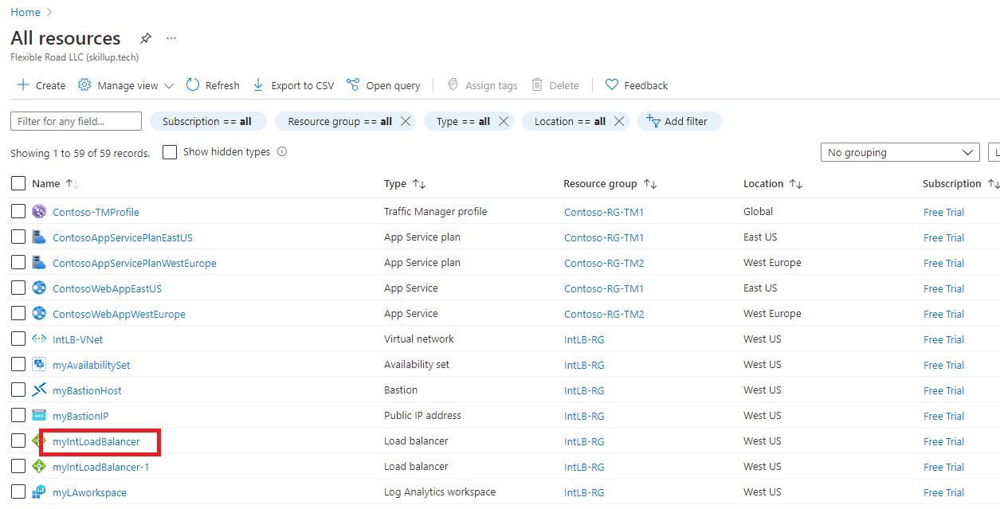

---
Exercise:
  title: M08 - 단원 3 Azure Monitor를 사용하여 부하 분산 장치 리소스 모니터링
  module: Module 08 - Design and implement network monitoring
---

# M08-단원 3 Azure Monitor를 사용하여 부하 분산 장치 리소스 모니터링

## 연습 시나리오

이 연습에서는 가상의 Contoso Ltd 조직에 대한 내부 부하 분산 장치를 만듭니다. 그런 다음 Log Analytics 작업 영역을 만들고 Azure Monitor Insights를 사용하여 내부 부하 분산 장치에 대한 정보를 확인합니다. 함수 종속성 보기를 확인한 후 부하 분산 장치 리소스에 대한 자세한 메트릭을 보고 부하 분산 장치에 대한 리소스 상태 정보를 확인합니다. 마지막으로 생성된 Log Analytics 작업 영역에 메트릭을 보내도록 부하 분산 장치의 진단 설정을 구성합니다.

아래 다이어그램은 이 연습에서 배포하는 환경을 보여 줍니다.


 이 연습에서 다음을 수행합니다.

+ 작업 1: 가상 네트워크 만들기
+ 작업 2: 부하 분산 장치 만들기
+ 작업 3: 백 엔드 풀 만들기
+ 작업 4: 상태 프로브 만들기
+ 작업 5: 부하 분산 장치 규칙 만들기
+ 작업 6: 백 엔드 서버 만들기
+ 작업 7: 백 엔드 풀에 VM 추가
+ 작업 8: 부하 분산 장치 테스트
+ 작업 9: Log Analytics 작업 영역 만들기
+ 작업 10: 함수 종속성 뷰 사용
+ 작업 11: 자세한 메트릭 보기
+ 작업 12: 리소스 상태 보기
+ 작업 13: 진단 설정 구성


   >**참고:** **[대화형 랩 시뮬레이션](https://mslabs.cloudguides.com/guides/AZ-700%20Lab%20Simulation%20-%20Monitor%20a%20load%20balancer%20resource%20using%20Azure%20Monitor)** 을 사용하여 이 랩을 원하는 속도로 클릭할 수 있습니다. 대화형 시뮬레이션과 호스트된 랩 간에 약간의 차이가 있을 수 있지만 보여주는 핵심 개념과 아이디어는 동일합니다.

> [!Note]  
> 지침과 Azure Portal 인터페이스 간에 약간의 차이가 있을 수 있지만 핵심 개념은 동일합니다.

### 예상 시간: 55분

## 작업 1: 가상 네트워크 만들기

이 섹션에서는 가상 네트워크와 서브넷을 만듭니다.

1. Azure 포털에 로그인합니다.

1. Azure Portal 홈페이지에서 **Virtual Network**를 검색하고 서비스에서 가상 네트워크를 선택합니다.

1. **+ 만들기**를 선택합니다.

   

1. **기본** 탭에서 아래 표의 정보를 사용하여 가상 네트워크를 만듭니다.

   | **설정**    | **값**                                           |
   | -------------- | --------------------------------------------------- |
   | Subscription   | 구독 선택                            |
   | Resource group | **새로 만들기**를 선택합니다.<br /><br />이름: **IntLB-RG** |
   | 속성           | **IntLB-VNet**                                      |
   | 지역         | **(미국) 미국 서부**                                    |

1. **다음 : IP 주소**를 선택합니다.

1. **IP 주소** 탭의 **IPv4 주소 공간** 상자에 **10.1.0.0/16**을 입력합니다.

1. **서브넷 이름** 위에서 **+ 서브넷 추가**를 선택합니다.

1. **서브넷 추가** 창에 **myBackendSubnet**의 서브넷 이름과 **10.1.0.0/24** 서브넷 주소 범위를 입력합니다.

1. **추가**를 선택합니다.

1. **다음: 보안**을 선택합니다.

1. **BastionHost**에서 **사용**을 선택한 후 아래 표의 정보를 입력합니다.

    | **설정**                       | **값**                                              |
    | --------------------------------- | ------------------------------------------------------ |
    | Bastion 이름                      | **myBastionHost**                                      |
    | AzureBastionSubnet 주소 공간  | **10.1.1.0/24**                                        |
    | 공용 IP 주소                 | **새로 만들기**를 선택합니다.<br /><br />이름: **myBastionIP** |

1. **검토 + 만들기**를 선택합니다.

1. **만들기**를 선택합니다.

## 작업 2: 부하 분산 장치 만들기

이 섹션에서는 내부 표준 SKU 부하 분산 장치를 만듭니다. 이 연습에서 기본 SKU 부하 분산 장치 대신 표준 SKU 부하 분산 장치를 만드는 이유는, 표준 SKU 버전의 부하 분산 장치가 필요한 이후 연습을 위한 것입니다.

1. Azure 홈페이지의 검색 표시줄에 **부하 분산 장치**를 입력합니다.

1. **부하 분산 장치 만들기**를 선택합니다.

1. **기본** 탭에서 아래 표의 정보를 사용하여 부하 분산 장치를 만듭니다.

   | **설정**           | **값**                |
   | --------------------- | ------------------------ |
   | 기본 사항 탭            |                          |
   | Subscription          | 구독 선택 |
   | Resource group        | **IntLB-RG**             |
   | 속성                  | **myIntLoadBalancer**    |
   | 지역                | **(미국) 미국 서부**         |
   | SKU                   | **표준**             |
   | 형식                  | **내부**             |
   | 프런트 엔드 IP 구성 탭 | + 프런트 엔드 IP 구성 추가 |
   | Name                  | **LoadBalancerFrontEnd** |
   | 가상 네트워크       | **IntLB-VNet**           |
   | 서브넷                | **myBackendSubnet**      |
   | IP 주소 할당 | **동적**              |

1. **검토 + 만들기**를 선택합니다.

1. **만들기**를 선택합니다.

## 작업 3: 백 엔드 풀 만들기

백 엔드 주소 풀에는 부하 분산 장치에 연결된 가상 NIC의 IP 주소가 포함됩니다.

1. Azure Portal 홈페이지에서 **모든 리소스**를 선택한 다음 리소스 목록에서 **myIntLoadBalancer**를 선택합니다.

1. **설정**에서 **백 엔드 풀**을 선택한 다음, **추가**를 선택합니다.

1. **백 엔드 풀 추가** 페이지에 아래 표의 정보를 입력합니다.

   | **설정**     | **값**            |
   | --------------- | -------------------- |
   | 속성            | **myBackendPool**    |
   | 가상 네트워크 | **IntLB-VNet**       |
   | 백 엔드 풀 구성   | **NIC** |

1. **추가**를 선택합니다.

   

## 작업 4: 상태 프로브 만들기

부하 분산 장치는 상태 프로브를 사용하여 앱의 상태를 모니터링합니다. 상태 프로브는 상태 검사의 응답에 따라 부하 분산 장치에서 VM을 추가하거나 제거합니다. 여기서는 VM 상태를 모니터링하는 상태 프로브를 만듭니다.

1. 부하 분산 장치의 **백 엔드 풀** 페이지에 있는 **설정**에서 **상태 프로브**를 선택한 다음 **추가**를 선택합니다.

1. **상태 프로브 추가** 페이지에서 아래 표의 정보를 입력합니다.

   | **설정**         | **값**         |
   | ------------------- | ----------------- |
   | 속성                | **myHealthProbe** |
   | 프로토콜            | **HTTP**          |
   | 포트                | **80**            |
   | 경로                | **/**             |
   | 간격            | **15**            |

1. **추가**를 선택합니다.

   

## 작업 5: 부하 분산 장치 규칙 만들기

부하 분산 장치 규칙은 VM으로 트래픽이 분산되는 방법을 정의하는 데 사용됩니다. 들어오는 트래픽에 대한 프런트 엔드 IP 구성 및 트래픽을 받는 백 엔드 IP 풀을 정의합니다. 원본 및 대상 포트는 규칙에 정의됩니다. 여기서는 부하 분산 장치 규칙을 만듭니다.

1. 부하 분산 장치의 **백 엔드 풀** 페이지에 있는 **설정**에서 **부하 분산 규칙**을 선택한 다음 **추가**를 선택합니다.

1. **부하 분산 규칙 추가** 페이지에 아래 표의 정보를 입력합니다.

   | **설정**            | **값**                |
   | ---------------------- | ------------------------ |
   | 속성                   | **myHTTPRule**           |
   | IP 버전             | **IPv4**                 |
   | 프런트 엔드 IP 주소    | **LoadBalancerFrontEnd** |
   | 프로토콜               | **TCP**                  |
   | 포트                   | **80**                   |
   | 백 엔드 포트           | **80**                   |
   | 백 엔드 풀           | **myBackendPool**        |
   | 상태 프로브           | **myHealthProbe**        |
   | 세션 지속성    | **없음**                 |
   | 유휴 제한 시간(분) | **15**                   |
   | 부동 IP            | **사용 안 함**             |

1. **추가**를 선택합니다.

   

## 작업 6: 백 엔드 서버 만들기

이 섹션에서는 부하 분산 장치의 백 엔드 풀에 대해 VM을 세 개 만들고, VM을 백 엔드 풀에 추가한 다음, 세 VM에 IIS를 설치하여 부하 분산 장치를 테스트합니다.

1. Azure Portal 오른쪽 상단에 있는 Cloud Shell 아이콘을 선택합니다. 필요한 경우 셸을 구성합니다.  
    + **PowerShell**을 선택합니다.
    + **스토리지 계정이 필요하지 않음**과 **구독**을 선택한 다음 **적용**을 선택합니다.
    + 터미널이 생성되고 프롬프트가 표시될 때까지 기다립니다. 

1. Cloud Shell 창의 도구 모음에서 **파일 관리** 아이콘을 선택하고 드롭다운 메뉴에서 **업로드**를 선택한 후 **azuredeploy.json** 및 **azuredeploy.parameters.json** 파일을 소스 폴더 **F:\Allfiles\Exercises\M08**에서 Cloud Shell 홈 디렉토리로 하나씩 업로드합니다.

1. 다음 ARM 템플릿을 배포하여 이 연습에 필요한 가상 네트워크, 서브넷 및 VM을 만듭니다.

   >**참고**: 관리 암호를 입력하라는 메시지가 표시됩니다.

   ```powershell
   $RGName = "IntLB-RG"

   New-AzResourceGroupDeployment -ResourceGroupName $RGName -TemplateFile azuredeploy.json -TemplateParameterFile azuredeploy.parameters.json
   ```
  
    > **참고:** 이를 배포하는 데는 몇 분 정도 걸립니다.

## 작업 7: 백 엔드 풀에 VM 추가

1. Azure Portal 홈페이지에서 **모든 리소스**를 선택한 다음 리소스 목록에서 **myIntLoadBalancer**를 선택합니다.

1. **설정**에서 **백 엔드 풀**과 **myBackendPool**을 차례로 선택합니다.

1. **연결 대상** 상자에서 **가상 머신**을 선택합니다.

1. **Virtual Machines**에서 **추가**를 선택합니다.

1. VM 3개(**myVM1**, **myVM2** 및 **myVM3**) 모두에 대한 확인란을 선택한 다음 **추가**를 선택합니다.

1. **myBackendPool** 페이지에서 **저장**을 선택합니다.

   

## 작업 8: 부하 분산 장치 테스트

이 섹션에서는 테스트 VM을 만들어서 부하 분산 장치를 테스트합니다.

### 테스트 VM 만들기

   >**참고**: 지침과 Azure Portal 인터페이스 간에 약간의 차이가 있을 수 있지만 핵심 개념은 동일합니다.

1. Azure 홈페이지에서 전역 검색 유형 **Virtual Machines**를 사용하고 서비스 아래에서 가상 머신을 선택합니다.

1. **기본** 탭에서 **+ 가상 머신 + 만들기**를 선택하고 아래 표의 정보를 사용하여 첫 번째 VM을 만듭니다.

   | **설정**          | **값**                                    |
   | -------------------- | -------------------------------------------- |
   | Subscription         | 구독 선택                     |
   | Resource group       | **IntLB-RG**                                 |
   | 가상 머신 이름 | **myTestVM**                                 |
   | 지역               | **(미국) 미국 서부**                             |
   | 가용성 옵션 | **인프라 중복 필요 없음**    |
   | 보안 유형        | **Standard**                                 |
   | 이미지                | **모든 이미지 보기** --> **Windows Server 2019용 데이터 센터**  |
   | 크기                 | **Standard_DS2_v3 - 2 vcpu, 메모리 8GiB** |
   | 사용자 이름             | **TestUser**                                 |
   | 암호             | **보안 암호 제공**                |
   | 암호 확인     | **보안 암호 제공**                |

1. **다음: 디스크**를 선택하고 **다음: 네트워킹**을 선택합니다.

1. **네트워킹** 탭에서 아래 표의 정보를 사용하여 네트워킹 설정을 구성합니다.

   | **설정**                                                  | **값**                     |
   | ------------------------------------------------------------ | ----------------------------- |
   | 가상 네트워크                                              | **IntLB-VNet**                |
   | 서브넷                                                       | **myBackendSubnet**           |
   | 공용 IP                                                    | **없음**으로 변경            |
   | NIC 네트워크 보안 그룹 추가                                   | **고급**                  |
   | 네트워크 보안 그룹 구성                             | 기존 **myNSG**를 선택합니다. |
   | 부하 분산                                               | **없음**(또는 선택 해제)       |

1. **검토 + 만들기**를 선택합니다.

1. **만들기**를 선택합니다.

1. 다음 작업을 진행하기 전에 이 마지막 VM이 배포될 때까지 기다립니다.

### 테스트 VM에 연결하여 부하 분산 장치 테스트

1. Azure Portal 홈페이지에서 **모든 리소스**를 선택한 다음 리소스 목록에서 **myIntLoadBalancer**를 선택합니다.

1. **개요** 페이지에 있는 **개인 IP 주소**를 기록하거나 클립보드에 복사합니다. 참고: **개인 IP 주소**를 보려면 **자세히 보기**를 선택해야 할 수 있습니다.

1. **홈**을 선택한 다음 Azure Portal 홈페이지에서 **모든 리소스**를 선택한 다음 방금 만든 **myTestVM** 가상 머신을 선택합니다.

1. **개요** 페이지에서 **연결**을 선택한 다음, **Bastion**을 선택합니다.

1. **Bastion 사용**을 선택합니다.

1. **사용자 이름** 상자에 **TestUser**를 입력하고 **암호** 상자에 배포 중에 제공한 암호를 입력한 다음 **연결**을 선택합니다.

1. **myTestVM** 창이 다른 브라우저 탭에서 열립니다.

1. **네트워크** 창이 나타나면 **예**를 선택합니다.

1. 작업 표시줄에서 **Internet Explorer** 아이콘을 선택하여 웹 브라우저를 엽니다.

1. **Internet Explorer 11 설정** 대화 상자에서 **확인**을 선택합니다.

1. 이전 단계에서 **개인 IP 주소**(예: 10.1.0.4)를 브라우저의 주소 표시줄에 입력하거나 붙여넣고 Enter 키를 누릅니다.

1. IIS 웹 서버의 기본 웹 홈페이지가 브라우저 창에 표시됩니다. 백 엔드 풀에 있는 세 가상 머신 중 하나가 응답합니다.
    

1. 브라우저에서 새로 고침 단추를 몇 번 선택하면 응답이 내부 부하 분산 장치의 백 엔드 풀에 있는 다른 VM에서 무작위로 표시됩니다.

    

## 작업 9:: Log Analytics 작업 영역 만들기

1. Azure Portal 홈페이지에서 **전체 서비스**를 선택한 다음 페이지 상단의 검색 상자에 **Log Analytics**를 입력하고 필터링된 목록에서 **Log Analytics 작업 영역**을 선택합니다.

   

1. **만들기**를 실행합니다.

1. **Log Analytics 작업 영역 만들기** 페이지의 **기본** 탭에서 아래 표의 정보를 사용하여 작업 영역을 만듭니다.

   | **설정**    | **값**                |
   | -------------- | ------------------------ |
   | Subscription   | 구독 선택 |
   | Resource group | **IntLB-RG**             |
   | 속성           | **myLAworkspace**        |
   | 지역         | **미국 서부**              |

1. **검토 + 만들기**, **만들기**를 차례로 선택합니다.

   

## 작업 10: 함수 종속성 뷰 사용

1. Azure Portal 홈페이지에서 **모든 리소스**를 선택한 다음 리소스 목록에서 **myIntLoadBalancer**를 선택합니다.

   

1. **모니터링**에서 **인사이트**를 선택합니다.

1. 페이지 오른쪽 상단에서 **X**를 선택하여 **메트릭** 창을 닫습니다. 잠시 후 창을 다시 열 것입니다.

1. 이 페이지 보기를 함수 종속성 보기라고 하며, 이 보기에는 선택한 네트워크 리소스의 토폴로지(이 경우 부하 분산 장치)를 보여 주는 유용한 대화형 다이어그램이 표시됩니다. 표준 Load Balancer의 경우 백 엔드 풀 리소스는 트래픽을 처리할 수 있는 백 엔드 풀의 현재 가용성을 나타내는 상태 프로브의 상태를 사용하여 색으로 구분됩니다.

1. 페이지의 오른쪽 아래 모서리에 있는 **확대(+)** 및 **축소(-)** 단추 또는 마우스 휠(있는 경우)을 사용하여 토폴로지 다이어그램을 확대 및 축소할 수 있습니다. 토폴로지 다이어그램을 페이지 주위로 끌어서 이동할 수도 있습니다.

1. 다이어그램에서 **LoadBalancerFrontEnd** 구성 요소를 마우스로 가리킨 다음 **myBackendPool** 구성 요소를 가리킵니다.

1. 팝업 창의 링크를 사용하여 부하 분산 장치 구성 요소에 대한 정보를 보고 해당 Azure Portal 블레이드를 열 수 있습니다.

1. 토폴로지 다이어그램의 .SVG 파일을 다운로드하려면 **토폴로지 다운로드**를 선택하고 **다운로드** 폴더에 파일을 저장합니다.

1. 오른쪽 상단에서 **통계 보기**를 선택하여 화면 오른쪽에 있는 메트릭 창을 다시 엽니다.
    

1. 메트릭 창에서는 막대형 차트와 꺽은선형 차트 형식으로 이 부하 분산 장치 리소스에 대한 일부 주요 메트릭을 빠르게 볼 수 있습니다.

    

## 작업 11: 자세한 메트릭 보기

1. 이 네트워크 리소스에 대한 보다 포괄적인 메트릭을 보려면 **자세한 메트릭 보기**를 선택합니다.
   

1. 그러면 Azure Network Insights 플랫폼에서 큰 전체 **메트릭** 페이지가 열립니다. 표시되는 첫 번째 탭은 부하 분산 장치의 가용성 상태와 부하 분산 장치에 연결된 각 프런트 엔드 IP에 대한 전체 데이터 처리량과 프런트 엔드 및 백 엔드 가용성을 보여 주는 **개요** 탭입니다. 이러한 메트릭은 프런트 엔드 IP가 응답하고 백 엔드 풀의 컴퓨팅 인스턴스가 인바운드 연결에 개별적으로 반응하는지 여부를 나타냅니다.
   

1. **프런트 엔드 &amp; 백 엔드 가용성** 탭을 선택하고 페이지 아래로 스크롤하여 상태 프로브 상태 차트를 확인합니다. 항목에 대해 **100보다 작은 값**이 표시되면 해당 리소스에 대한 일종의 중단을 나타냅니다.
   

1. **데이터 처리량** 탭을 선택하고 페이지 아래로 스크롤하여 다른 데이터 처리량 차트를 확인합니다.

1. 차트의 데이터 요소 중 일부를 마우스로 가리키면 값이 변경되어 해당 시점의 정확한 값이 표시됩니다.
   

1. **흐름 분포** 탭을 선택하고 페이지를 아래로 스크롤하여 **VM 흐름 만들기 및 네트워크 트래픽** 섹션 아래의 차트를 확인합니다.

   

## 작업 12: 리소스 상태 보기

1. Load Balancer 리소스의 상태를 보려면 Azure Portal 홈페이지에서 **모든 서비스**를 선택한 다음 **모니터**를 선택합니다.

1. **모니터&gt;개요** 페이지의 왼쪽 메뉴에서 **Service Health**를 선택합니다.

1. **Service Health&gt;서비스 문제** 페이지의 왼쪽 메뉴에서 **Resource Health**를 선택합니다.

1. **Service Health&gt;Resource Health** 페이지의 **리소스 종류** 드롭다운 목록에서 아래로 스크롤하여 **부하 분산 장치**를 선택합니다.

   

1. 그런 다음 목록에서 부하 분산 장치의 이름을 선택합니다.

1. **Resource Health** 페이지에서는 부하 분산 장치 리소스의 주요 가용성 문제를 식별합니다. **상태 기록** 섹션에 이벤트가 있는 경우 상태 이벤트를 확장하여 이벤트에 대한 자세한 내용을 볼 수 있습니다. 나중에 검토하고 보고할 수 있도록 이벤트에 대한 세부 정보를 PDF 파일로 저장할 수 있습니다.

   

## 작업 13: 진단 설정 구성

1. Azure Portal 홈페이지에서 **리소스 그룹**을 선택한 다음 목록에서 **IntLB-RG** 리소스 그룹을 선택합니다.

1. **IntLB-RG** 페이지의 리소스 목록에서 **myIntLoadBalancer** 부하 분산 장치 리소스 이름을 선택합니다.

1. **모니터링**에서 **진단 설정**을 선택한 다음 **진단 설정 추가**를 선택합니다.

   

1. **진단 설정** 페이지의 이름 상자에 **myLBDiagnostics**를 입력합니다.

1. **AllMetrics** 확인란을 선택한 다음 **Log Analytics 작업 영역에 보내기** 확인란을 선택합니다.

1. 목록에서 구독을 선택한 후 작업 영역 드롭다운 목록에서 **myLAworkspace(westus)** 를 선택합니다.

1. **저장**을 선택합니다.

   

## 리소스 정리

>**참고**: 더 이상 사용하지 않는 새로 만든 Azure 리소스는 모두 제거하세요. 사용되지 않는 리소스를 제거하면 예기치 않은 요금이 발생하지 않습니다.

1. Azure Portal의 **Cloud Shell** 창에서 **PowerShell** 세션을 엽니다.

1. 다음 명령을 실행하여 이 모듈의 랩 전체에서 만든 모든 리소스 그룹을 삭제합니다.

   ```powershell
   Remove-AzResourceGroup -Name 'IntLB-RG' -Force -AsJob
   ```

>**참고**: 이 명령은 -AsJob 매개 변수에 의해 결정되어 비동기로 실행되므로, 동일한 PowerShell 세션 내에서 이 명령을 실행한 직후 다른 PowerShell 명령을 실행할 수 있지만 리소스 그룹이 실제로 제거되기까지는 몇 분 정도 걸립니다.
    
## Copilot을 사용하여 학습 확장

Copilot은 Azure 스크립팅 도구를 사용하는 방법을 익히는 데 도움을 줍니다. 또한 Copilot은 랩에서 다루지 않는 영역이나 추가 정보가 필요한 영역을 지원할 수 있습니다. Edge 브라우저를 열고 Copilot(오른쪽 위)을 선택하거나 *copilot.microsoft.com*으로 이동하세요. 몇 분 정도 시간을 내어 이러한 프롬프트를 사용해 보세요.
+ 가상 네트워크를 모니터링하는 데 사용할 수 있는 Azure 도구를 요약합니다.
+ 사용할 수 있는 Azure Network Watcher 모니터링 도구로는 무엇이 있나요?

## 자기 주도적 학습을 통해 자세히 알아보기

+ [Azure Monitor 소개](https://learn.microsoft.com/training/modules/intro-to-azure-monitor/). 이 모듈에서는 Azure Monitor를 사용하여 Azure 리소스 성능 및 작업에 대한 인사이트를 얻는 방법을 알아봅니다.
+ [네트워크 모니터링 도구를 사용하여 엔드투엔드 Azure 네트워크 인프라 모니터링 및 문제 해결](https://learn.microsoft.com/training/modules/troubleshoot-azure-network-infrastructure/). 이 모듈에서는 Azure 인프라에서 네트워킹 문제를 찾아 해결하는 데 도움이 되는 Azure Network Watcher 도구, 진단, 로그를 사용하는 방법을 알아봅니다.

## 핵심 내용

축하합니다. 랩을 완료했습니다. 이 랩의 주요 내용은 다음과 같습니다. 

+ Azure Monitor는 모든 Azure, 다른 클라우드 및 온-프레미스 리소스에서 IT 데이터를 수집, 관리 및 분석하기 위한 기능과 도구를 제공합니다.
+ 메트릭은 애플리케이션 또는 리소스 성능의 스냅샷을 보여 주는 정량적 측정값입니다. 메트릭은 일반적으로 시간이 지남에 따라 측정할 수 있는 숫자 값입니다.
+ 로그는 리소스나 애플리케이션에서 발생하는 이벤트, 작업 및 메시지에 대한 텍스트 기록입니다. 
+ Azure Monitor Insights, 시각화, 대시보드는 애플리케이션에 대한 모니터링 정보를 사용하고 전송할 수 있습니다.
+ 경고는 위험 상황을 알리고 정정 작업을 수행할 수 있습니다. 경고 규칙은 메트릭 또는 로그 데이터를 기반으로 할 수 있습니다.+ 
    
